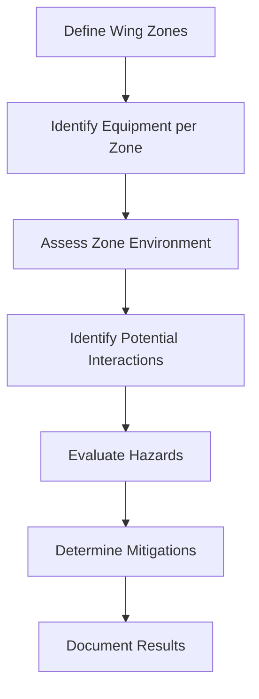

# 57-00-02-50 — ZSA Overview

**ATA Chapter**: 57 — Wings  
**Folder**: 57-00-02_Safety / 57-00-02-50_ZSA  
**Status**: DRAFT  
**Owner**: Airframe & Structures Domain (ATA 57)

---

## 1. Purpose

This document defines the **Zonal Safety Analysis (ZSA) methodology** for the ATA 57 Wing domain.

ZSA identifies hazards arising from the physical installation and proximity of equipment within defined zones.

---

## 2. ZSA Objectives

The ZSA shall:

1. Define physical zones within the wing structure.  
2. Identify equipment and systems installed in each zone.  
3. Assess potential hazards from:  
   - Equipment proximity  
   - Environmental factors (heat, fluids, vibration)  
   - Common failures affecting co-located systems  
4. Ensure adequate segregation and protection.  

---

## 3. ZSA Methodology

### 3.1 Process

### 3.2 Zone Definition Criteria

Zones are defined based on:

- Physical boundaries (structural divisions)  
- Access provisions  
- Environmental conditions  
- Functional groupings  

---

## 4. Wing Zone Structure

The wing is divided into the following zones for ZSA purposes:

| Zone ID | Zone Name | Location | Description |
| :-- | :-- | :-- | :-- |
| Z-57-100 | Wing Root | Inboard section | Wing-fuselage attachment area |
| Z-57-200 | Inner Wing Box | Station XX to YY | Primary structure, integral fuel tanks |
| Z-57-300 | Mid Wing Box | Station YY to ZZ | Primary structure, integral fuel tanks |
| Z-57-400 | Outer Wing Box | Station ZZ to tip | Primary structure |
| Z-57-500 | Leading Edge | Full span | Slats, ice protection |
| Z-57-600 | Trailing Edge | Full span | Flaps, ailerons, spoilers |
| Z-57-700 | Wing Tip | Outboard extremity | Winglet/tip structure |

---

## 5. Environmental Factors

| Factor | Zones Affected | Consideration |
| :-- | :-- | :-- |
| Fuel vapor | Z-57-200, Z-57-300, Z-57-400 | Ignition sources, ventilation |
| Heat sources | Z-57-500 (ice protection) | Thermal damage, fire |
| Hydraulic fluid | Z-57-500, Z-57-600 | Leakage, fire, contamination |
| Electrical wiring | All zones | Short circuit, fire |
| Vibration | All zones | Fatigue, chafing |

---

## 6. ZSA Activities

### 6.1 Zone Survey

- Physical inspection of zone layout  
- Equipment identification  
- Routing verification  

### 6.2 Interaction Assessment

- Equipment-to-equipment effects  
- Environmental effects on equipment  
- Common mode failure potential  

### 6.3 Mitigation Review

- Segregation adequacy  
- Protection provisions  
- Installation practices  

---

## 7. Integration with Other Analyses

| Analysis | Interface |
| :-- | :-- |
| FHA | ZSA may identify new hazards for FHA |
| CCA | ZSA feeds into common cause assessment |
| SSA | ZSA results used in SSA verification |
| Particular Risks | Fire, HIRF, lightning addressed |

---

## 8. References

- [ARP4761](https://www.sae.org/standards/content/arp4761/) — ZSA guidelines  
- [57-00-02-50_Zone_Definitions.md](./57-00-02-50_Zone_Definitions.md)  
- [ZONE_ANALYSIS/57-00-02-50_ZSA_Results_Index.md](./ZONE_ANALYSIS/57-00-02-50_ZSA_Results_Index.md)  

---

## Document Control

- Generated with the assistance of AI (GitHub Copilot), prompted by **Amedeo Pelliccia**.  
- Status: **DRAFT** — Subject to human review and approval.  
- Human approver: _[to be completed]_.  
- Repository: `AMPEL360-BWB-H2-Hy-E`  
- Last AI update: 2025-11-29
