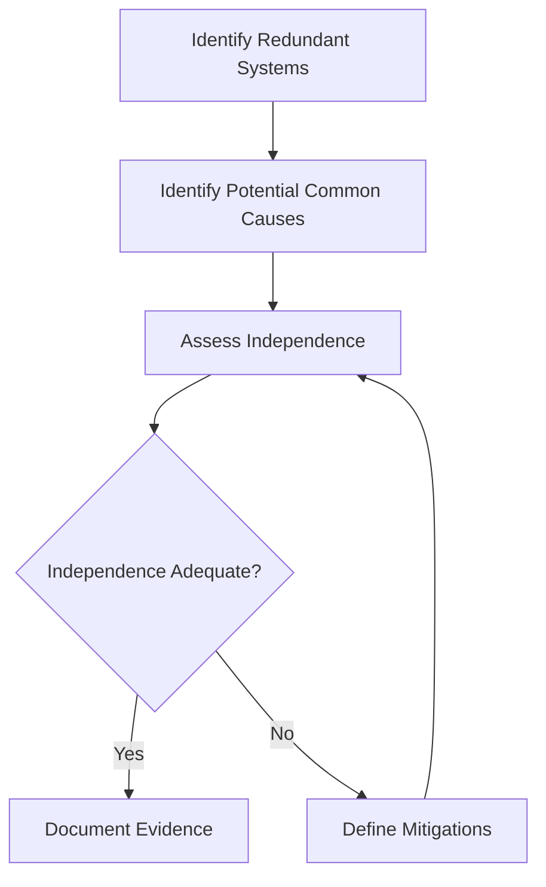

# 57-00-02-60 — Common Cause Analysis

**ATA Chapter**: 57 — Wings  
**Folder**: 57-00-02_Safety / 57-00-02-60_COMMON_CAUSES  
**Status**: DRAFT  
**Owner**: Airframe & Structures Domain (ATA 57)

---

## 1. Purpose

This document defines the **Common Cause Analysis (CCA)** approach and key results for the ATA 57 Wing domain.

CCA identifies failures that could affect multiple systems simultaneously, defeating designed-in redundancy.

---

## 2. CCA Objectives

The CCA shall:

1. Identify common causes that could affect multiple wing systems.  
2. Assess the effectiveness of independence claims.  
3. Verify that single failures do not defeat safety-critical redundancy.  
4. Support compliance with [CS-25.1309](https://www.easa.europa.eu/en/document-library/certification-specifications/cs-25-large-aeroplanes).  

---

## 3. CCA Methodology

### 3.1 CCA Types

| Analysis Type | Description | Application |
| :-- | :-- | :-- |
| **PRA** | Particular Risk Analysis | External events (fire, HIRF, lightning) |
| **CMF** | Common Mode Failure | Design/manufacturing errors |
| **ZSA** | Zonal Safety Analysis | Installation/proximity effects |

### 3.2 CCA Process

---

## 4. Common Cause Categories

### 4.1 Design Common Causes

| Common Cause | Systems Affected | Mitigation |
| :-- | :-- | :-- |
| Common software | All software-controlled systems | Dissimilar software, diverse algorithms |
| Common hardware | Redundant actuators | Diverse hardware sources |
| Common design error | All structure | Independent design checks, reviews |

### 4.2 Manufacturing Common Causes

| Common Cause | Systems Affected | Mitigation |
| :-- | :-- | :-- |
| Manufacturing defects | All production items | Quality control, NDT inspection |
| Material batch defects | Multiple components | Material traceability, batch control |
| Process errors | Similar components | Process controls, inspections |

### 4.3 Maintenance Common Causes

| Common Cause | Systems Affected | Mitigation |
| :-- | :-- | :-- |
| Maintenance errors | Multiple systems | Procedures, training, inspections |
| Incorrect parts | Redundant items | Part number verification, QA |
| Tool damage | Adjacent systems | Tool control, inspections |

### 4.4 Environmental Common Causes

| Common Cause | Systems Affected | Mitigation |
| :-- | :-- | :-- |
| Fire | All zone equipment | Fire detection, suppression, segregation |
| Lightning | Electrical/electronic systems | Lightning protection |
| HIRF | Electronic systems | Shielding, hardening |
| Icing | All aerodynamic surfaces | Ice protection systems |
| Bird strike | Leading edge systems | Design for impact |

---

## 5. Key CCA Results

### 5.1 Fire Particular Risk

| Zone | Risk Assessment | Mitigation |
| :-- | :-- | :-- |
| Wing fuel tanks | High consequence | Fuel tank inerting, fire detection |
| Leading edge | Heat source exposure | Thermal barriers |
| Trailing edge | Hydraulic fluid | Leak detection, fire-resistant fluid |

### 5.2 Lightning Particular Risk

| System | Exposure | Mitigation |
| :-- | :-- | :-- |
| Wing structure | Direct attachment | Lightning protection network |
| Fuel system | Ignition risk | Grounding, bonding |
| Electronics | EMI | Shielding, surge protection |

### 5.3 HIRF Particular Risk

| System | Exposure | Mitigation |
| :-- | :-- | :-- |
| Flight control electronics | Susceptible | Shielding, filtering |
| SHM systems | Susceptible | Hardened design |

---

## 6. Independence Assessment Summary

| Redundancy | Independence Basis | Status |
| :-- | :-- | :-- |
| Dual load paths | Physical separation | TBD |
| Redundant actuation | Diverse sources | TBD |
| Inspection + SHM | Diverse methods | TBD |

---

## 7. Open Items

| Item | Description | Action |
| :-- | :-- | :-- |
| CCA-OI-001 | Complete fire particular risk analysis | Safety team |
| CCA-OI-002 | Document HIRF compliance | EMC team |
| CCA-OI-003 | Verify maintenance common cause mitigations | Maintenance team |

---

## 8. References

- [ARP4761](https://www.sae.org/standards/content/arp4761/) — CCA guidelines  
- [57-00-02-60_Shared_Resources_Map.md](./57-00-02-60_Shared_Resources_Map.md)  
- [57-00-02-50_ZSA](../57-00-02-50_ZSA/) — Zonal analysis inputs  

---

## Document Control

- Generated with the assistance of AI (GitHub Copilot), prompted by **Amedeo Pelliccia**.  
- Status: **DRAFT** — Subject to human review and approval.  
- Human approver: _[to be completed]_.  
- Repository: `AMPEL360-BWB-H2-Hy-E`  
- Last AI update: 2025-11-29
