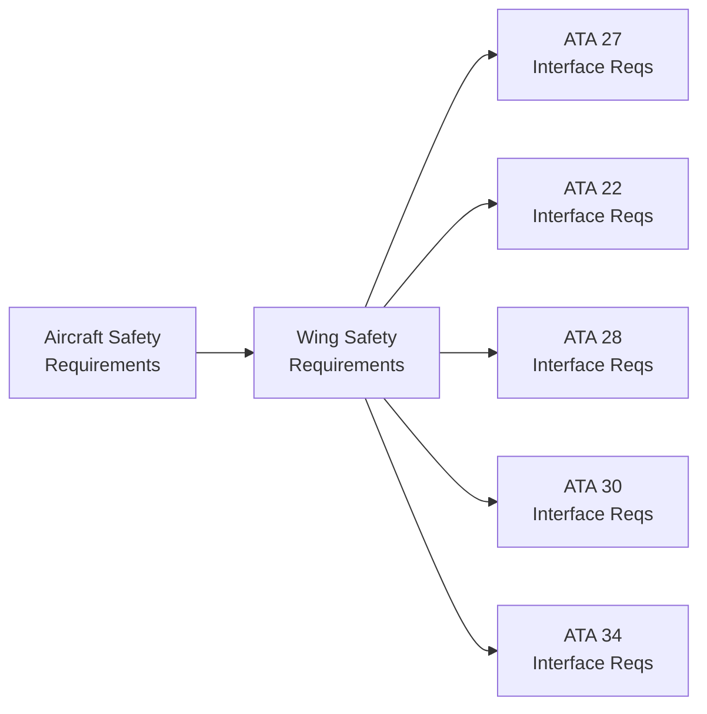

# 57-00-02-70 — Safety Interfaces Overview

**ATA Chapter**: 57 — Wings  
**Folder**: 57-00-02_Safety / 57-00-02-70_INTERFACES_SAFETY  
**Status**: DRAFT  
**Owner**: Airframe & Structures Domain (ATA 57)

---

## 1. Purpose

This document provides an **overview of cross-ATA safety dependencies** affecting the wing domain.

---

## 2. Interface Categories

### 2.1 Control System Interfaces

| ATA | System | Interface Type | Safety Relevance |
| :-- | :-- | :-- | :-- |
| ATA 22 | Auto Flight | Commands, protections | Flight envelope protection |
| ATA 27 | Flight Controls | Surface actuation | Primary flight control |

### 2.2 Propulsion Interfaces

| ATA | System | Interface Type | Safety Relevance |
| :-- | :-- | :-- | :-- |
| ATA 71 | Powerplant | Pylon attachment | Structural loads |
| ATA 28 | Fuel | Fuel storage/transfer | Structural integrity, fire |

### 2.3 Environmental Interfaces

| ATA | System | Interface Type | Safety Relevance |
| :-- | :-- | :-- | :-- |
| ATA 30 | Ice Protection | Leading edge | Ice accumulation prevention |
| ATA 26 | Fire Protection | Detection/suppression | Fire safety |

### 2.4 Sensor Interfaces

| ATA | System | Interface Type | Safety Relevance |
| :-- | :-- | :-- | :-- |
| ATA 34 | Navigation | Sensor mounting | Structural support |
| ATA 95 | Neural Networks | SHM data | Structural monitoring |

---

## 3. Interface Document Index

| Document | ATA Interface | Purpose |
| :-- | :-- | :-- |
| [57-00-02-70_ATA22_Impact.md](./57-00-02-70_ATA22_Impact.md) | ATA 22 Auto Flight | Auto flight safety interactions |
| [57-00-02-70_ATA27_Impact.md](./57-00-02-70_ATA27_Impact.md) | ATA 27 Flight Controls | Control surface safety |
| [57-00-02-70_ATA34_Impact.md](./57-00-02-70_ATA34_Impact.md) | ATA 34 Navigation | Sensor mounting safety |
| [57-00-02-70_ATA28_Impact.md](./57-00-02-70_ATA28_Impact.md) | ATA 28 Fuel | Fuel system structural safety |
| [57-00-02-70_ATA30_Impact.md](./57-00-02-70_ATA30_Impact.md) | ATA 30 Ice Protection | Ice protection safety |

---

## 4. Interface Safety Requirements Flow

---

## 5. Key Interface Safety Issues

| Issue | ATAs Involved | Status | Reference |
| :-- | :-- | :-- | :-- |
| Control surface flutter | 57, 27 | Open | [57-00-02-70_ATA27_Impact.md](./57-00-02-70_ATA27_Impact.md) |
| Fuel tank crashworthiness | 57, 28 | Open | [57-00-02-70_ATA28_Impact.md](./57-00-02-70_ATA28_Impact.md) |
| Ice accretion loads | 57, 30 | Open | [57-00-02-70_ATA30_Impact.md](./57-00-02-70_ATA30_Impact.md) |
| Envelope protection | 57, 22 | Open | [57-00-02-70_ATA22_Impact.md](./57-00-02-70_ATA22_Impact.md) |

---

## 6. Interface Coordination Process

1. Identify interface safety requirements  
2. Coordinate with responsible ATA chapter owner  
3. Document interface agreement  
4. Track interface verification  
5. Update traceability matrices  

---

## 7. References

- [57-00-05_Interfaces](../../57-00-05_Interfaces/) — Interface Control Documents  
- [57-00-02-80_REQUIREMENTS_LINKS](../57-00-02-80_REQUIREMENTS_LINKS/) — Requirements traceability  

---

## Document Control

- Generated with the assistance of AI (GitHub Copilot), prompted by **Amedeo Pelliccia**.  
- Status: **DRAFT** — Subject to human review and approval.  
- Human approver: _[to be completed]_.  
- Repository: `AMPEL360-BWB-H2-Hy-E`  
- Last AI update: 2025-11-29
