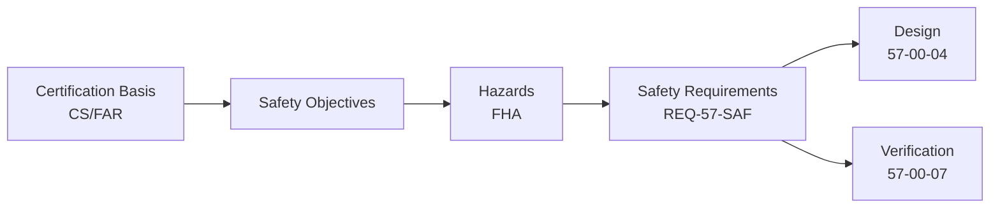

# 57-00-02-80 — Traceability Matrix

**ATA Chapter**: 57 — Wings  
**Folder**: 57-00-02_Safety / 57-00-02-80_REQUIREMENTS_LINKS  
**Status**: DRAFT  
**Owner**: Airframe & Structures Domain (ATA 57)

---

## 1. Purpose

This document provides the **safety-to-requirements traceability matrix** for ATA 57 Wings.

---

## 2. Traceability Structure

---

## 3. Hazard to Requirement Traceability

| Hazard ID | Hazard Title | Severity | Derived Requirements |
| :-- | :-- | :-- | :-- |
| H-57-STR-01 | Loss of wing structural integrity | Catastrophic | REQ-57-SAF-001 |
| H-57-STR-02 | Failure of wing-fuselage attachment | Catastrophic | REQ-57-SAF-002 |
| H-57-STR-03 | Failure of pylon attachment | Catastrophic | REQ-57-SAF-003 |
| H-57-STR-04 | Undetected fatigue damage | Catastrophic | REQ-57-SAF-004 |
| H-57-AER-01 | Wing flutter | Catastrophic | REQ-57-SAF-005 |
| H-57-AER-02 | Aileron control reversal | Hazardous | REQ-57-SAF-006 |
| H-57-CTL-01 | Loss of aileron function | Hazardous | REQ-57-SAF-007 |
| H-57-CTL-02 | Asymmetric flap deployment | Hazardous | REQ-57-SAF-008 |
| H-57-FUE-01 | Fuel tank structural failure | Catastrophic | REQ-57-SAF-009 |
| H-57-ICE-01 | Loss of ice protection | Hazardous | REQ-57-SAF-010 |

---

## 4. Requirement to Certification Basis Traceability

| Requirement ID | CS-25 Reference | Compliance Method |
| :-- | :-- | :-- |
| REQ-57-SAF-001 | CS-25.301, 25.305, 25.571 | Analysis, Test |
| REQ-57-SAF-002 | CS-25.305, 25.571 | Analysis, Test |
| REQ-57-SAF-003 | CS-25.305, 25.571 | Analysis, Test |
| REQ-57-SAF-004 | CS-25.571 | Analysis, Test |
| REQ-57-SAF-005 | CS-25.629 | Analysis, Flight Test |
| REQ-57-SAF-006 | CS-25.629 | Analysis |
| REQ-57-SAF-007 | CS-25.1309 | Analysis |
| REQ-57-SAF-008 | CS-25.1309 | Analysis |
| REQ-57-SAF-009 | CS-25.963 | Analysis, Test |
| REQ-57-SAF-010 | CS-25.1419 | Analysis, Test |

---

## 5. Requirement to Verification Traceability

| Requirement ID | Verification Method | Verification Reference |
| :-- | :-- | :-- |
| REQ-57-SAF-001 | Static test, fatigue test | 57-00-07_V_AND_V |
| REQ-57-SAF-002 | Static test, fatigue test | 57-00-07_V_AND_V |
| REQ-57-SAF-003 | Static test, fatigue test | 57-00-07_V_AND_V |
| REQ-57-SAF-004 | Fatigue test, inspection | 57-00-07_V_AND_V |
| REQ-57-SAF-005 | GVT, flight flutter test | 57-00-07_V_AND_V |
| REQ-57-SAF-006 | Analysis | 57-00-06_Engineering |
| REQ-57-SAF-007 | FMEA, test | ATA 27 |
| REQ-57-SAF-008 | FMEA, test | ATA 27 |
| REQ-57-SAF-009 | Analysis, test | 57-00-07_V_AND_V |
| REQ-57-SAF-010 | Analysis, icing test | ATA 30 |

---

## 6. Requirement to Design Traceability

| Requirement ID | Design Feature | Design Reference |
| :-- | :-- | :-- |
| REQ-57-SAF-001 | Damage tolerant structure | 57-00-04_Design |
| REQ-57-SAF-002 | Redundant attachments | 57-00-04_Design |
| REQ-57-SAF-003 | Fail-safe pylon design | 57-00-04_Design |
| REQ-57-SAF-004 | Inspection program, SHM | 57-00-04_Design, ATA 95 |
| REQ-57-SAF-005 | Mass balance, stiffness | 57-00-04_Design |
| REQ-57-SAF-006 | Torsional stiffness | 57-00-04_Design |

---

## 7. Open Traceability Items

| Item | Description | Action |
| :-- | :-- | :-- |
| TRACE-001 | Complete requirement text in 57-00-03 | Requirements team |
| TRACE-002 | Link requirements to design features | Design team |
| TRACE-003 | Define verification procedures | V&V team |

---

## 8. Traceability Matrix Maintenance

- Matrix shall be updated when:  
  - New hazards identified  
  - Requirements changed  
  - Design features updated  
  - Verification methods changed  

- Configuration control per project standards  

---

## Document Control

- Generated with the assistance of AI (GitHub Copilot), prompted by **Amedeo Pelliccia**.  
- Status: **DRAFT** — Subject to human review and approval.  
- Human approver: _[to be completed]_.  
- Repository: `AMPEL360-BWB-H2-Hy-E`  
- Last AI update: 2025-11-29
