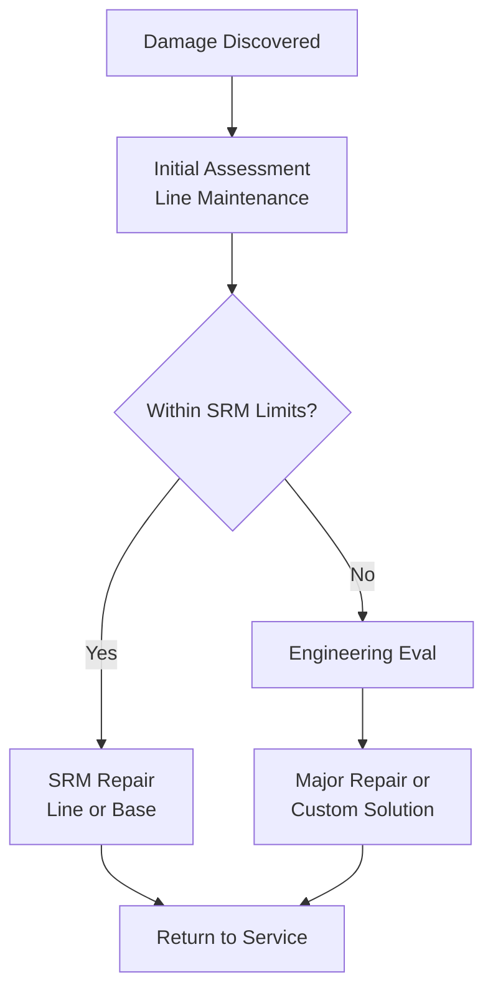

# 57-10-30-03 — Permanent Repairs Interface

## Purpose

Define the interface between operational procedures and the permanent repair
process, including handoff to MRO and engineering evaluation workflows.

## Repair Decision Flow

## Engineering Evaluation Interface

### Data Required from Operations

| Data Item | Source | Format |
|-----------|--------|--------|
| Damage photos | Inspector | Digital images |
| Damage measurements | Inspector | Standard form |
| Flight history | SHM/FDR | JSON export |
| Usage indices | Analytics | JSON export |
| Previous repairs | Logbook | Standard format |

### Engineering Deliverables

| Deliverable | Content | Timeline |
|-------------|---------|----------|
| Disposition | Repair/Replace decision | TBD hours |
| Repair instruction | Step-by-step procedure | As required |
| Substantiation | Engineering analysis | For non-SRM repairs |
| Return-to-service criteria | Acceptance limits | Per repair |

## MRO Handoff

### Line to Base Handoff

| Item | Responsibility |
|------|----------------|
| Damage documentation | Line maintenance |
| Part ordering | Planning |
| Scheduling | MRO provider |
| Execution | Base maintenance |
| QA acceptance | QA |

### Return-to-Service

| Step | Owner |
|------|-------|
| Repair completion | MRO technician |
| Inspection | QA inspector |
| Documentation update | Technical records |
| SHM reset (if applicable) | Engineering |
| Release to service | Authorized signatory |

## References

- SRM Chapter 57
- AMM Chapter 57
- [57-10-20_INSPECTION_POLICY](../57-10-20_INSPECTION_POLICY/)

---

## Document Control

- Generated with the assistance of AI (GitHub Copilot), prompted by **Amedeo Pelliccia**.
- Status: **DRAFT** – Subject to human review and approval.
- Human approver: _[to be completed]_.
- Repository: `AMPEL360-BWB-H2-Hy-E`
- Last AI update: _2025-11-28_.

---
