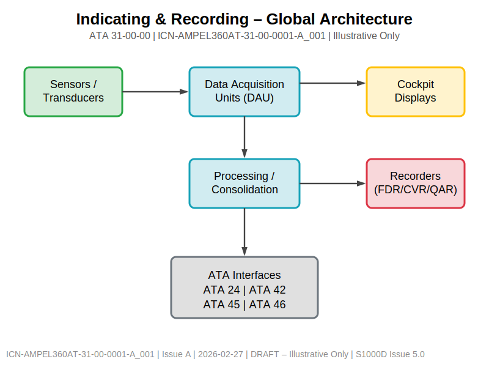
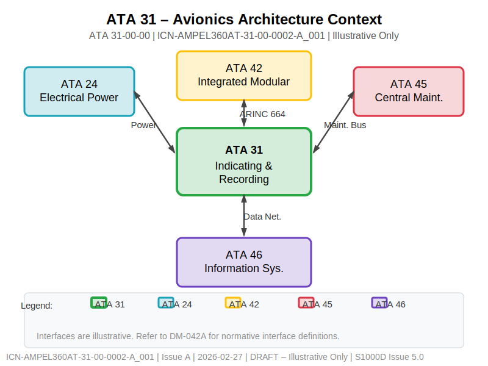
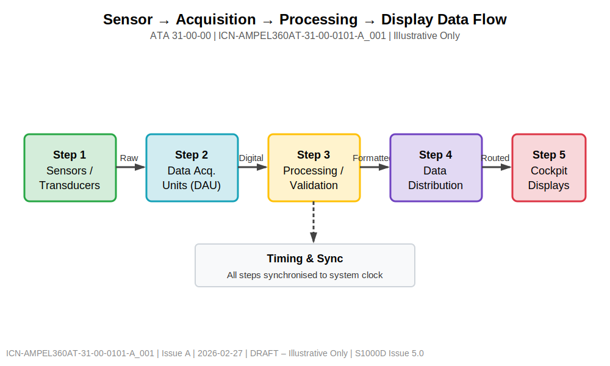
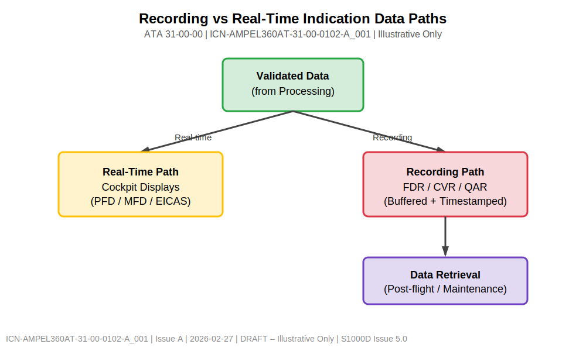
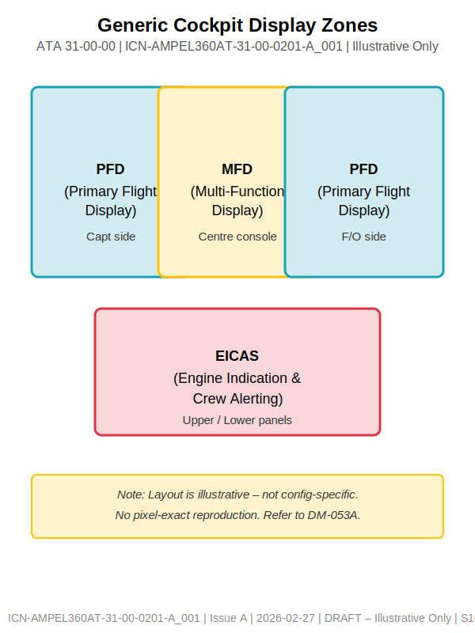
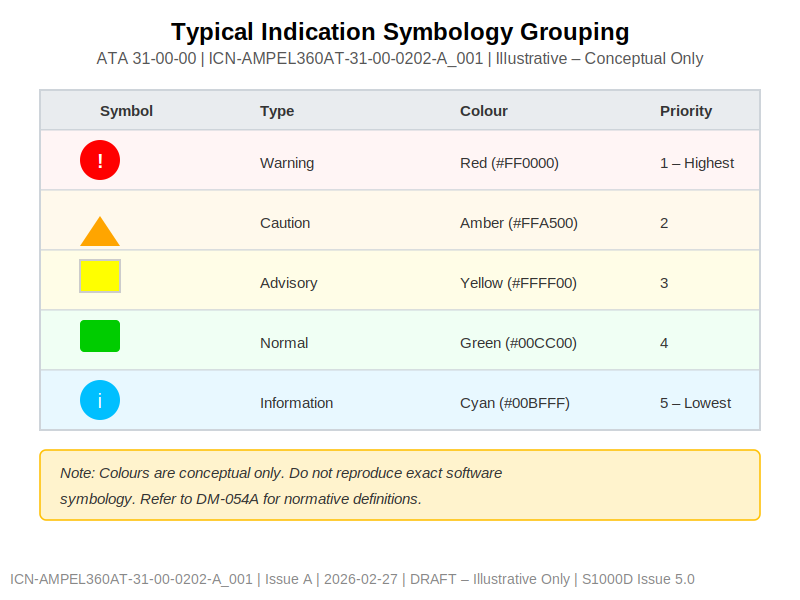
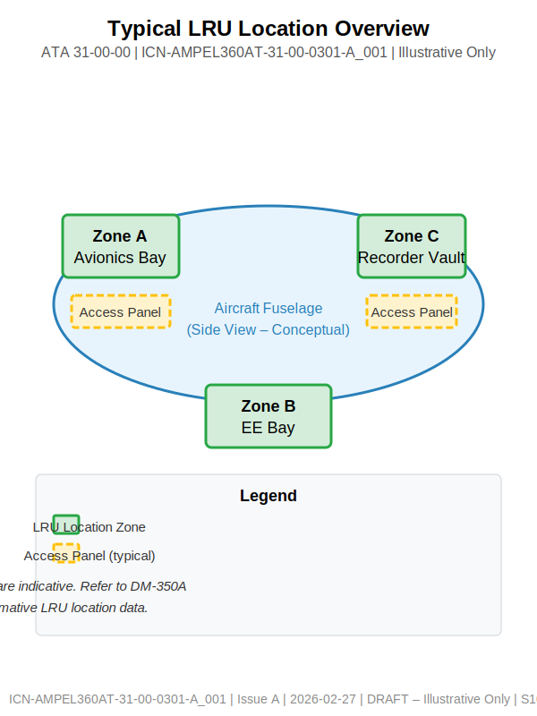
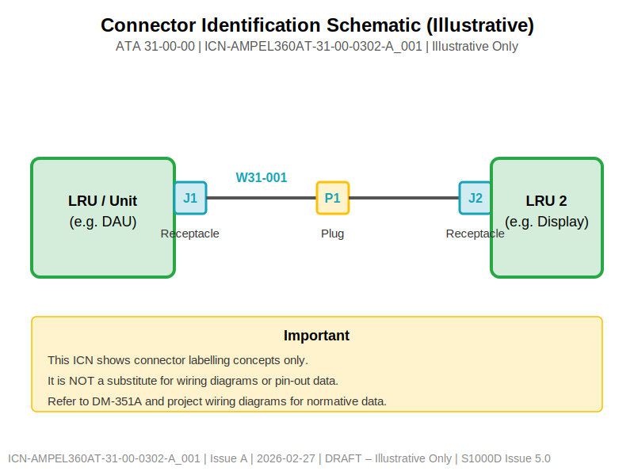
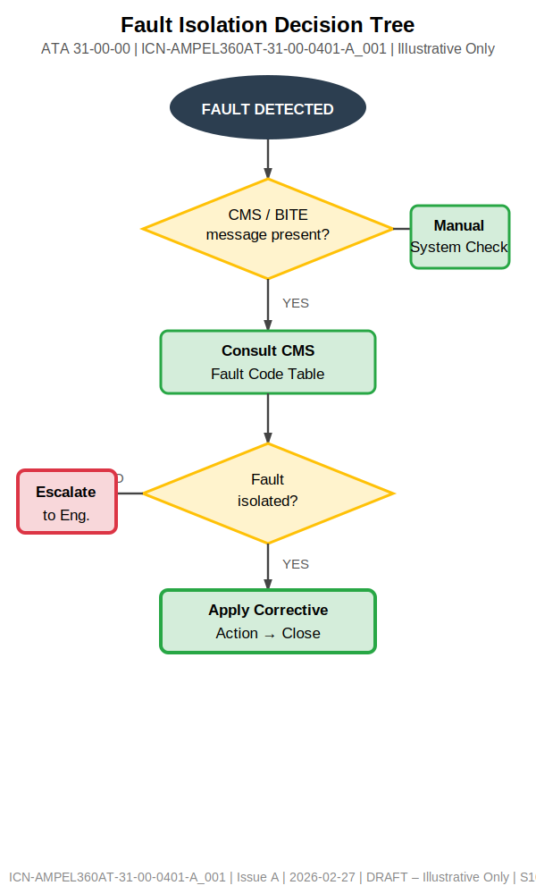
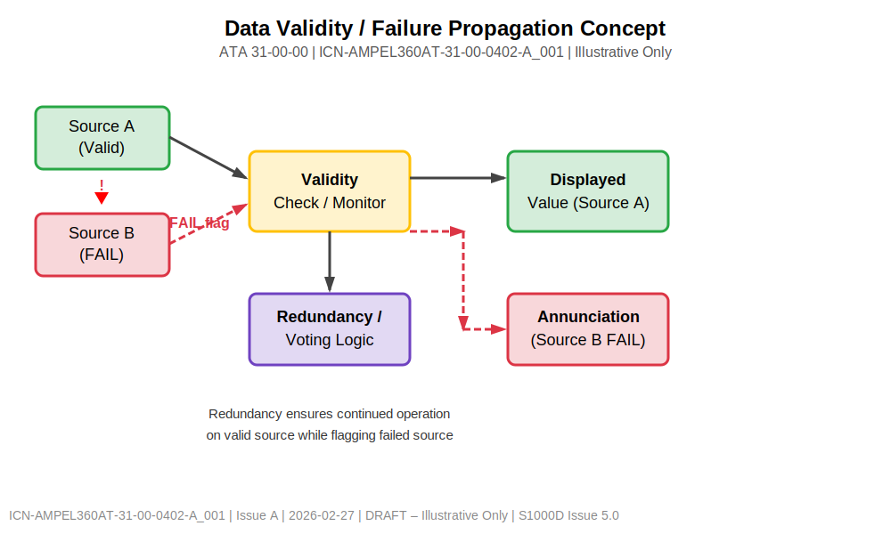

# ATA 31-00-00 ICN Visual Preview Gallery

> **Note**: GitHub renders PNG images inline but cannot render SVG files stored in CSDB folders.
> This companion file provides raster previews of all 10 ICN assets defined in
> [`ICN_SCAFFOLD.md`](./ICN_SCAFFOLD.md).  
> The authoritative source files are the `.SVG` files in each sub-folder; the PNGs in `PREVIEWS/`
> are derived, read-only exports.

---

## 1. System Overview

### ICN-AMPEL360AT-31-00-0001-A_001 — Global Architecture

**Purpose**: Overall block diagram of the Indicating & Recording system, showing major subsystems
(sensors, DAU, processing, displays, recorders) and high-level data flow.  
**Referenced by**: DM-040A, DM-010A  
**Source**: [`SYSTEM_OVERVIEW/ICN-AMPEL360AT-31-00-0001-A_001.SVG`](SYSTEM_OVERVIEW/ICN-AMPEL360AT-31-00-0001-A_001.SVG)

---

### ICN-AMPEL360AT-31-00-0002-A_001 — Avionics Architecture Context

**Purpose**: ATA 31 position within the wider avionics architecture; interface boundaries with
ATA 24 (Electrical Power), ATA 42 (IMA), ATA 45 (CMS), and ATA 46 (Information Systems).  
**Referenced by**: DM-040A, DM-042A  
**Source**: [`SYSTEM_OVERVIEW/ICN-AMPEL360AT-31-00-0002-A_001.SVG`](SYSTEM_OVERVIEW/ICN-AMPEL360AT-31-00-0002-A_001.SVG)

---

## 2. Signal & Data Flow

### ICN-AMPEL360AT-31-00-0101-A_001 — Sensor to Display Data Flow

**Purpose**: Five-step chain from sensor/transducer acquisition through DAU, processing,
distribution, to cockpit display; includes timing/sync sub-block.  
**Referenced by**: DM-040A, DM-730A, DM-051A  
**Source**: [`SIGNAL_FLOW/ICN-AMPEL360AT-31-00-0101-A_001.SVG`](SIGNAL_FLOW/ICN-AMPEL360AT-31-00-0101-A_001.SVG)

---

### ICN-AMPEL360AT-31-00-0102-A_001 — Recording vs Real-Time Data Paths

**Purpose**: Bifurcation of validated data into (a) real-time cockpit display path and
(b) buffered/timestamped recorder path (FDR/CVR/QAR) with post-flight retrieval.  
**Referenced by**: DM-040A, DM-730A, DM-052A  
**Source**: [`SIGNAL_FLOW/ICN-AMPEL360AT-31-00-0102-A_001.SVG`](SIGNAL_FLOW/ICN-AMPEL360AT-31-00-0102-A_001.SVG)

---

## 3. Display & HMI Layouts

### ICN-AMPEL360AT-31-00-0201-A_001 — Generic Cockpit Display Zones

**Purpose**: Illustrative cockpit display zone layout (PFD captain side, MFD centre, PFD F/O side,
EICAS upper/lower). No pixel-exact or software-version-specific content.  
**Referenced by**: DM-040A, DM-053A  
**Source**: [`DISPLAY_LAYOUTS/ICN-AMPEL360AT-31-00-0201-A_001.SVG`](DISPLAY_LAYOUTS/ICN-AMPEL360AT-31-00-0201-A_001.SVG)

---

### ICN-AMPEL360AT-31-00-0202-A_001 — Typical Indication Symbology Grouping

**Purpose**: Colour-coded symbol table (Warning=Red, Caution=Amber, Advisory=Yellow,
Normal=Green, Information=Cyan) with priority levels. Conceptual only.  
**Referenced by**: DM-040A, DM-054A  
**Source**: [`DISPLAY_LAYOUTS/ICN-AMPEL360AT-31-00-0202-A_001.SVG`](DISPLAY_LAYOUTS/ICN-AMPEL360AT-31-00-0202-A_001.SVG)

---

## 4. Maintenance Support

### ICN-AMPEL360AT-31-00-0301-A_001 — LRU Location Overview

**Purpose**: Aircraft zones (avionics bay, EE bay, recorder vault) where indicating/recording
LRUs are typically located; indicative access panels shown.  
**Referenced by**: DM-520x, DM-350A  
**Source**: [`MAINTENANCE_SUPPORT/ICN-AMPEL360AT-31-00-0301-A_001.SVG`](MAINTENANCE_SUPPORT/ICN-AMPEL360AT-31-00-0301-A_001.SVG)

---

### ICN-AMPEL360AT-31-00-0302-A_001 — Connector Identification Schematic

**Purpose**: Illustrative connector labelling concept (receptacle J1 → cable W31-001 → plug P1
→ receptacle J2). Not a substitute for wiring diagrams.  
**Referenced by**: DM-520x, DM-72x, DM-351A  
**Source**: [`MAINTENANCE_SUPPORT/ICN-AMPEL360AT-31-00-0302-A_001.SVG`](MAINTENANCE_SUPPORT/ICN-AMPEL360AT-31-00-0302-A_001.SVG)

---

## 5. Fault Isolation

### ICN-AMPEL360AT-31-00-0401-A_001 — Fault Isolation Decision Tree

**Purpose**: High-level troubleshooting flow: detect fault → check CMS/BITE → consult fault code
table → verify isolation → apply corrective action or escalate.  
**Referenced by**: DM-730A, DM-731A  
**Source**: [`FAULT_ISOLATION/ICN-AMPEL360AT-31-00-0401-A_001.SVG`](FAULT_ISOLATION/ICN-AMPEL360AT-31-00-0401-A_001.SVG)

---

### ICN-AMPEL360AT-31-00-0402-A_001 — Data Validity / Failure Propagation

**Purpose**: Concept showing how a failed source (B) is detected by the validity monitor,
failure flag propagated, redundancy/voting logic routes output from valid source (A),
and annunciation is triggered.  
**Referenced by**: DM-730A, DM-055A  
**Source**: [`FAULT_ISOLATION/ICN-AMPEL360AT-31-00-0402-A_001.SVG`](FAULT_ISOLATION/ICN-AMPEL360AT-31-00-0402-A_001.SVG)

---

## Quick Reference Table

| ICN Number | Category | Title | DMs Referenced |
|---|---|---|---|
| [0001](SYSTEM_OVERVIEW/ICN-AMPEL360AT-31-00-0001-A_001.SVG) | System Overview | Global Architecture | DM-040A, DM-010A |
| [0002](SYSTEM_OVERVIEW/ICN-AMPEL360AT-31-00-0002-A_001.SVG) | System Overview | Avionics Context | DM-040A, DM-042A |
| [0101](SIGNAL_FLOW/ICN-AMPEL360AT-31-00-0101-A_001.SVG) | Signal Flow | Sensor → Display Flow | DM-040A, DM-730A, DM-051A |
| [0102](SIGNAL_FLOW/ICN-AMPEL360AT-31-00-0102-A_001.SVG) | Signal Flow | Recording vs Real-Time | DM-040A, DM-730A, DM-052A |
| [0201](DISPLAY_LAYOUTS/ICN-AMPEL360AT-31-00-0201-A_001.SVG) | Display Layouts | Cockpit Display Zones | DM-040A, DM-053A |
| [0202](DISPLAY_LAYOUTS/ICN-AMPEL360AT-31-00-0202-A_001.SVG) | Display Layouts | Symbology Grouping | DM-040A, DM-054A |
| [0301](MAINTENANCE_SUPPORT/ICN-AMPEL360AT-31-00-0301-A_001.SVG) | Maintenance | LRU Locations | DM-520x, DM-350A |
| [0302](MAINTENANCE_SUPPORT/ICN-AMPEL360AT-31-00-0302-A_001.SVG) | Maintenance | Connector Schematic | DM-520x, DM-72x, DM-351A |
| [0401](FAULT_ISOLATION/ICN-AMPEL360AT-31-00-0401-A_001.SVG) | Fault Isolation | Decision Tree | DM-730A, DM-731A |
| [0402](FAULT_ISOLATION/ICN-AMPEL360AT-31-00-0402-A_001.SVG) | Fault Isolation | Data Validity | DM-730A, DM-055A |

---

## Document Control

- Generated with the assistance of AI (GitHub Copilot), prompted by **Amedeo Pelliccia**.
- Status: **DRAFT** – Subject to human review and approval.
- Human approver: _[to be completed]_.
- Repository: `AMPEL360-AIR-T`
- Last AI update: 2026-02-27.
