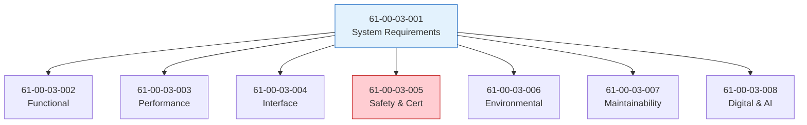

# 61-00-03 Requirements — Index

**ATA Chapter:** 61 — Propellers and Propulsors  
**Lifecycle Folder:** 61-00-03_Requirements  
**OPT-IN Axis:** T — Technology (P-Propulsion)  
**LC Channels:** [[LC_01_Design_Engineering_Home]] · [[LC_02_Certification_Home]]

---

## Purpose

This folder contains all **requirements documentation** for the Q100 Propulsor System (ATA 61), including system-level, functional, performance, interface, safety, environmental, maintainability, and digital/AI requirements.

---

## Document Index

| ID | Document | Status | Version |
|----|----------|--------|---------|
| 61-00-03-001 | [[61-00-03-001_System_Requirements]] | DRAFT | 0.1 |
| 61-00-03-002 | [[61-00-03-002_Functional_Requirements]] | DRAFT | 0.1 |
| 61-00-03-003 | [[61-00-03-003_Performance_Requirements]] | DRAFT | 0.1 |
| 61-00-03-004 | [[61-00-03-004_Interface_Requirements]] | DRAFT | 0.1 |
| 61-00-03-005 | [[61-00-03-005_Safety_and_Certification_Requirements]] | DRAFT | 0.1 |
| 61-00-03-006 | [[61-00-03-006_Environmental_and_Noise_Requirements]] | DRAFT | 0.1 |
| 61-00-03-007 | [[61-00-03-007_Maintainability_and_Reliability_Requirements]] | DRAFT | 0.1 |
| 61-00-03-008 | [[61-00-03-008_Digital_and_AI_Requirements]] | DRAFT | 0.1 |

---

## Requirements Hierarchy



---

## Requirements Summary

### 61-00-03-001 System Requirements

Top-level system requirements defining the propulsor system scope, boundaries, and key performance parameters.

| Req ID | Requirement | Source |
|--------|-------------|--------|
| SYS-61-001 | Propulsor shall provide 4 MW continuous thrust power | TLARS |
| SYS-61-002 | System shall integrate with H₂ fuel cell power | ARC-24 |
| SYS-61-003 | System shall support DEP configuration (4 units) | ARC-71 |

### 61-00-03-002 Functional Requirements

Functional decomposition of propulsor capabilities.

| Req ID | Function | Allocation |
|--------|----------|------------|
| FUNC-61-001 | Generate thrust from electrical power | Motor, Fan |
| FUNC-61-002 | Modulate thrust per flight control commands | Controller |
| FUNC-61-003 | Provide thrust reversal capability | Reverser |

### 61-00-03-003 Performance Requirements

Quantitative performance specifications.

| Req ID | Parameter | Value | Condition |
|--------|-----------|-------|-----------|
| PERF-61-001 | Max continuous power | 4 MW | ISA, SL (International Standard Atmosphere, Sea Level) |
| PERF-61-002 | Efficiency | ≥ 95% | Cruise |
| PERF-61-003 | Response time | < 100 ms | Thrust 0-100% |

### 61-00-03-004 Interface Requirements

Interfaces with other systems and structure.

| Req ID | Interface | Type |
|--------|-----------|------|
| IFC-61-001 | Electrical power (ATA 24) | 800 VDC |
| IFC-61-002 | Flight controls (ATA 27) | AFDX |
| IFC-61-003 | Nacelle structure (ATA 54) | Mechanical |

### 61-00-03-005 Safety and Certification Requirements

Safety-derived requirements from FHA/PSSA.

| Req ID | Requirement | DAL | Source |
|--------|-------------|-----|--------|
| SAFE-61-001 | Uncontained failure probability < 10⁻⁹ | A | FHA |
| SAFE-61-002 | Dual-channel motor control | A | PSSA |
| SAFE-61-003 | Fire detection and suppression | B | [CS-25.1181/CS-25.1195](https://www.easa.europa.eu/en/document-library/certification-specifications/group/cs-25-large-aeroplanes) |

### 61-00-03-006 Environmental and Noise Requirements

Environmental qualification and noise limits.

| Req ID | Parameter | Limit | Standard |
|--------|-----------|-------|----------|
| ENV-61-001 | Operating temperature | -55°C to +70°C | DO-160G |
| ENV-61-002 | Noise at source | < 85 dB(A) | ICAO Ch.14 |
| ENV-61-003 | Vibration | Per DO-160G Cat S | DO-160G |

### 61-00-03-007 Maintainability and Reliability Requirements

Maintenance and reliability targets.

| Req ID | Parameter | Target |
|--------|-----------|--------|
| MNT-61-001 | MTBF | > 10,000 FH |
| MNT-61-002 | MTTR (LRU) | < 2 hours |
| MNT-61-003 | On-condition maintenance | MSG-3 compliant |

### 61-00-03-008 Digital and AI Requirements

Neural network and digital twin requirements.

| Req ID | Requirement | DAL |
|--------|-------------|-----|
| DIG-61-001 | Predictive maintenance NN integration | D |
| DIG-61-002 | Digital twin synchronization | E |
| DIG-61-003 | DPP traceability for all LRUs | — |

---

## Traceability

### Upstream (Source)

| Source | Document |
|--------|----------|
| TLARS | Top Level Aircraft Requirements |
| ARC | Aircraft Requirements Cascade |
| FHA | Functional Hazard Assessment |
| PSSA | Preliminary System Safety Assessment |
| [CS-25](https://www.easa.europa.eu/en/document-library/certification-specifications/group/cs-25-large-aeroplanes) | EASA Certification Specification |

### Downstream (Allocation)

| Target | Document |
|--------|----------|
| 61-00-04 | Design specifications |
| 61-00-05 | Interface control documents |
| 61-00-07 | Verification & Validation plans |
| 61-00-10 | Certification compliance matrix |

---

## Requirement ID Convention

```
<TYPE>-<ATA>-<NNN>

TYPE:
  SYS   = System requirement
  FUNC  = Functional requirement
  PERF  = Performance requirement
  IFC   = Interface requirement
  SAFE  = Safety requirement
  ENV   = Environmental requirement
  MNT   = Maintainability requirement
  DIG   = Digital/AI requirement

ATA: 61 (Propellers and Propulsors)
NNN: Sequential number (001-999)
```

---

## Related Documents

### Within ATA 61

| Folder | Content |
|--------|---------|
| [[61-00-01_Overview]] | System overview |
| [[61-00-02_Safety]] | FHA, PSSA, SSA |
| [[61-00-04_Design]] | Design specifications |
| [[61-00-05_Interfaces]] | ICDs |
| [[61-00-07_V_AND_V]] | Verification plans |
| [[61-00-10_Certification]] | Compliance matrix |

### Related ATA Chapters

| ATA | Interface |
|-----|-----------|
| [[ATA_24_Electrical_Power]] | Power supply |
| [[ATA_27_Flight_Controls]] | Thrust commands |
| [[ATA_54_Nacelles_and_Pylons]] | Structural mounting |
| [[ATA_71_Power_Plant]] | Propulsion integration |
| [[ATA_77_Engine_Indicating]] | Monitoring |

---

## Revision History

| Version | Date | Author | Changes |
|---------|------|--------|---------|
| 0.1 | 2025-Q1 | TBD | Initial draft |

---

← [[ATA_61_Propellers_and_Propulsors]] · [[61-00_GENERAL]]

---

**AMPEL360 Q100 — OPT-IN Framework Documentation**  
ATA 61 — Propellers and Propulsors — Requirements  

© AMPEL360 Program — All rights reserved.

---

## Document Control

- Generated with the assistance of AI (GitHub Copilot), prompted by **Amedeo Pelliccia**.
- Status: **DRAFT** – Subject to human review and approval.
- Human approver: _[to be completed]_.
- Repository: `AMPEL360-BWB-H2-Hy-E`
- Last AI update: _2025-12-04_.

---
