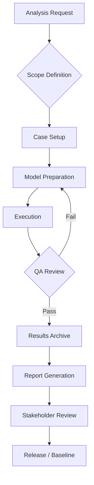

# 61-00-06-010-001A — Methodology Overview

| **Document ID**    | 61-00-06-010-001A                                          |
| ------------------ | ---------------------------------------------------------- |
| **Revision**       | A                                                          |
| **Status**         | DRAFT                                                      |
| **Effective Date** | 2025-12-11                                                 |
| **ATA Chapter**    | 61 — Propellers / Propulsors                               |
| **Aircraft**       | AMPEL360 BWB H₂ Hy-E Q100                                  |
| **Node Path**      | `61-00_GENERAL/61-00-06_Engineering/61-00-06-010_Analysis` |

---

## 1. Purpose & Scope

This document establishes the **methodology framework** for all engineering analyses conducted under ATA 61-00-06-010. It defines:

* Standardized analysis workflows and toolchains
* Quality gates and verification requirements
* Data management and traceability protocols
* Interfaces with Design (61-00-05) and other engineering disciplines

### 1.1 Applicability

| Analysis Domain       | Covered | Reference Document          |
| --------------------- | :-----: | --------------------------- |
| Thrust & Performance  |    ✓    | 61-00-06-010-002A           |
| CFD / BLI Interaction |    ✓    | 61-00-06-010-003A           |
| Structural / FEM      |    ✓    | 61-00-06-010-004A           |
| Acoustic Signature    |    ✓    | 61-00-06-010-005A           |
| Thermal / Icing       |    ✓    | (Future: 61-00-06-010-006A) |
| Reliability / FMEA    |    ✓    | (Future: 61-00-06-010-007A) |

---

## 2. Governing Principles

### 2.1 Separation of Concerns

```
┌─────────────────────────────────────────────────────────────────────┐
│                        61-00-05_Design                              │
│   • Geometry definitions (CAD, STEP, parametric)                    │
│   • Interface Control Documents (ICDs)                              │
│   • Configuration baselines                                         │
└─────────────────────────────────────────────────────────────────────┘
                                │
                                ▼ Geometry & Requirements
┌─────────────────────────────────────────────────────────────────────┐
│                    61-00-06_Engineering                             │
│   ┌─────────────────────────────────────────────────────────────┐   │
│   │              61-00-06-010_Analysis                          │   │
│   │   • CFD, FEM, MBD simulations                               │   │
│   │   • Performance models & trade studies                      │   │
│   │   • Verification & validation datasets                      │   │
│   └─────────────────────────────────────────────────────────────┘   │
└─────────────────────────────────────────────────────────────────────┘
                                │
                                ▼ Analysis Results & Recommendations
┌─────────────────────────────────────────────────────────────────────┐
│                    Integration & Verification                       │
│   • Test correlation                                                │
│   • Certification evidence                                          │
└─────────────────────────────────────────────────────────────────────┘
```

> **Key Rule:** CFD, FEM, MBD, and all simulation-based analyses reside in **Engineering (61-00-06)**, not in Design.

### 2.2 Traceability Chain

Every analysis artifact must trace to:

1. **Requirement** → DOORS / Requirements DB reference
2. **Configuration** → Design baseline (commit hash, CAD version)
3. **Method** → This document + domain-specific methodology
4. **Tool** → Qualified tool version (see §4)
5. **Result** → Unique result ID in `ASSETS/RESULTS/`

---

## 3. Analysis Workflow

### 3.1 Standard Process Flow



### 3.2 Phase Descriptions

| Phase                 | Description                                                         | Key Outputs                  |
| --------------------- | ------------------------------------------------------------------- | ---------------------------- |
| **Scope Definition**  | Define objectives, success criteria, boundary conditions            | Analysis Plan (YAML)         |
| **Case Setup**        | Configure run matrix, parameter sweeps, load cases                  | `ASSETS/CASES/*.yaml`        |
| **Model Preparation** | Mesh generation, FEM discretization, boundary setup                 | `ASSETS/MODELS/*`            |
| **Execution**         | Run simulations (local / HPC cluster)                               | Raw outputs                  |
| **QA Review**         | Convergence check, mesh independence, validation against benchmarks | QA checklist                 |
| **Results Archive**   | Post-process, store in standardized formats                         | `ASSETS/RESULTS/*`           |
| **Report Generation** | Generate human-readable report with key findings                    | `61-00-06-010-XXX_*.md`, PDF |
| **Release**           | Formal sign-off, version control tag                                | Baselined revision           |

---

## 4. Toolchain & Qualification

### 4.1 Approved Analysis Tools

| Domain           | Primary Tool            | Version (Baseline) | Qualification Status |
| ---------------- | ----------------------- | ------------------ | -------------------- |
| CFD              | OpenFOAM                | v2312              | Qualified (Q-001)    |
| CFD (commercial) | ANSYS Fluent            | 2024 R2            | Qualified (Q-002)    |
| FEM              | Abaqus                  | 2024               | Qualified (Q-003)    |
| FEM (open)       | CalculiX                | 2.21               | Qualified (Q-004)    |
| Acoustics        | Actran                  | 2024               | Qualified (Q-005)    |
| Pre/Post         | ParaView                | 5.12               | N/A (visualization)  |
| Scripting        | Python                  | 3.11+              | N/A                  |
| Data Pipeline    | Pandas / NumPy / Xarray | Latest stable      | N/A                  |

### 4.2 Tool Qualification Requirements

New tools require:

1. **Verification** — Benchmark against known analytical solutions
2. **Validation** — Correlation with experimental data (wind tunnel, flight test)
3. **Documentation** — User manual, limitations, known issues
4. **Version Control** — Locked version for project baseline

---

## 5. Data Management

### 5.1 Directory Structure

```text
ASSETS/
├── CASES/          # Analysis case definitions
│   ├── thrust_sweep_case_001.yaml
│   └── bli_parametric_study.yaml
├── MODELS/         # Simulation models (meshes, FEM decks)
│   ├── propulsor_cfd_mesh_v3.msh
│   └── mount_fem_model_v2.inp
├── RESULTS/        # Output data (post-processed)
│   ├── thrust_envelope_q100_v1.parquet
│   └── acoustic_spl_map_v1.csv
├── REPORTS/        # Exported static reports
│   └── 61-00-06-010-002A_v1.pdf
├── SCRIPTS/        # Automation scripts
│   ├── run_cfd_sweep.py
│   └── post_process_fem.py
└── TEMPLATES/      # Reusable templates
    ├── case_template.yaml
    └── report_template.md
```

### 5.2 Naming Conventions

| Asset Type   | Pattern                                 | Example                           |
| ------------ | --------------------------------------- | --------------------------------- |
| Case file    | `{study_name}_case_{NNN}.yaml`          | `bli_study_case_012.yaml`         |
| Model file   | `{component}_{method}_model_v{N}.{ext}` | `nacelle_cfd_mesh_v3.msh`         |
| Results file | `{metric}_{aircraft}_v{N}.{ext}`        | `thrust_envelope_q100_v2.parquet` |
| Script       | `{action}_{domain}.py`                  | `run_cfd_sweep.py`                |

### 5.3 Version Control

* All analysis artifacts tracked in **Git LFS** for large binaries
* Tag releases: `analysis/61-00-06-010/{doc-id}/v{N}`
* Archive superseded versions in `ARCHIVES/` with clear deprecation notice

---

## 6. Quality Assurance

### 6.1 Verification Checklist

| Check                         | Criteria                                           | Evidence Required    |
| ----------------------------- | -------------------------------------------------- | -------------------- |
| Mesh independence             | <2% variation with 1.5× refinement                 | Convergence plot     |
| Residual convergence          | Residuals < 1e-5 (CFD) or equilibrium < 0.1% (FEM) | Solver log           |
| Boundary condition validation | Match ICD / Design specifications                  | Setup review sheet   |
| Physical plausibility         | Results within expected engineering bounds         | Peer review sign-off |

### 6.2 Validation Requirements

| Analysis Type      | Validation Source                   | Acceptance Criterion    |
| ------------------ | ----------------------------------- | ----------------------- |
| Thrust models      | Engine manufacturer data, rig tests | ±3% at rated conditions |
| CFD pressure dist. | Wind tunnel data                    | Cp ±0.05                |
| FEM stress/strain  | Strain gauge / DIC measurements     | ±10% peak stress        |
| Acoustic SPL       | Anechoic chamber measurements       | ±3 dB                   |

---

## 7. Interfaces

### 7.1 Upstream (Inputs)

| Source            | Data Provided                               | Format          |
| ----------------- | ------------------------------------------- | --------------- |
| 61-00-05_Design   | Geometry, CAD, parametric definitions       | STEP, Parasolid |
| 70-00_Power Plant | Engine performance maps, H₂ fuel properties | CSV, JSON       |
| Requirements DB   | Performance requirements, load cases        | DOORS export    |
| Aero (ATA 27)     | Flight envelope, atmospheric conditions     | YAML            |

### 7.2 Downstream (Outputs)

| Consumer                | Data Provided                          | Format             |
| ----------------------- | -------------------------------------- | ------------------ |
| 61-00-05_Design         | Analysis-driven design recommendations | Markdown, PDF      |
| Certification           | Compliance evidence, V&V reports       | PDF, data packages |
| Flight Test             | Predicted envelopes for correlation    | Parquet, CSV       |
| Maintenance (ATA 61-XX) | Fatigue life, inspection intervals     | Reports            |

---

## 8. Document Control

### 8.1 Revision History

| Rev | Date       | Author           | Description     |
| --- | ---------- | ---------------- | --------------- |
| A   | 2025-12-11 | Engineering Team | Initial release |

### 8.2 Approval

| Role     | Name  | Signature | Date |
| -------- | ----- | --------- | ---- |
| Author   | [TBD] |           |      |
| Checker  | [TBD] |           |      |
| Approver | [TBD] |           |      |

---

## 9. References

1. AMPEL360 BWB H₂ Hy-E Q100 — System Requirements Document (SRD)
2. ATA iSpec 2200 — Chapter 61 Information Standards
3. SAE ARP4754A — Guidelines for Development of Civil Aircraft and Systems
4. SAE ARP4761 — Safety Assessment Process
5. DO-178C / DO-331 — Software/Model-Based Development Considerations
6. Project Tool Qualification Plan (TQP) — Document Q-000

---

## 10. Appendices

### Appendix A — Analysis Request Template

```yaml
# Analysis Request Template
request_id: AR-61-00-06-010-XXXX
title: "[Descriptive Title]"
requester: "[Name]"
date_requested: YYYY-MM-DD
priority: [Critical | High | Medium | Low]

objective: |
  [Clear statement of what the analysis should determine]

scope:
  aircraft: AMPEL360 BWB H₂ Hy-E Q100
  ata_chapter: 61
  subsystem: "[Propulsor / Mount / Nacelle / etc.]"
  conditions:
    - "[Flight condition 1]"
    - "[Flight condition 2]"

requirements_traced:
  - REQ-61-XXX
  - REQ-61-YYY

inputs:
  geometry: "[Reference to Design baseline]"
  loads: "[Reference to loads document]"

deliverables:
  - "[Report]"
  - "[Data package]"

due_date: YYYY-MM-DD
```

### Appendix B — QA Checklist Template

```markdown
## QA Checklist — [Analysis ID]

- [ ] Requirements traced and documented
- [ ] Geometry/configuration baseline recorded (commit: ______)
- [ ] Mesh/model independence study completed
- [ ] Boundary conditions verified against ICD
- [ ] Solver convergence confirmed (residuals < ______)
- [ ] Results within physical plausibility bounds
- [ ] Peer review completed (reviewer: ______)
- [ ] Data archived in `ASSETS/RESULTS/` with proper naming
- [ ] Report generated and checked
```

---

*End of Document*
