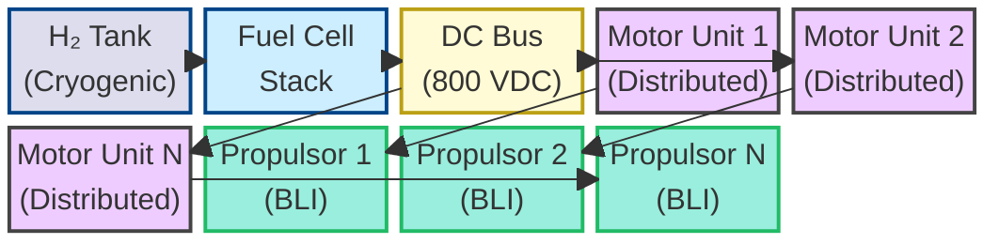
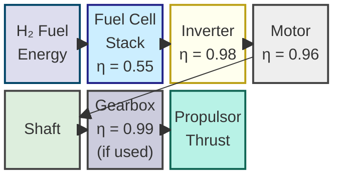
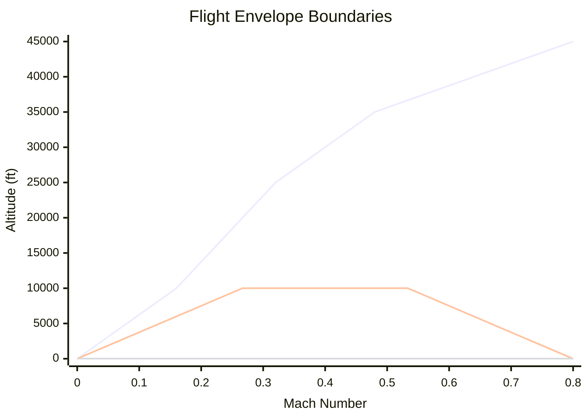
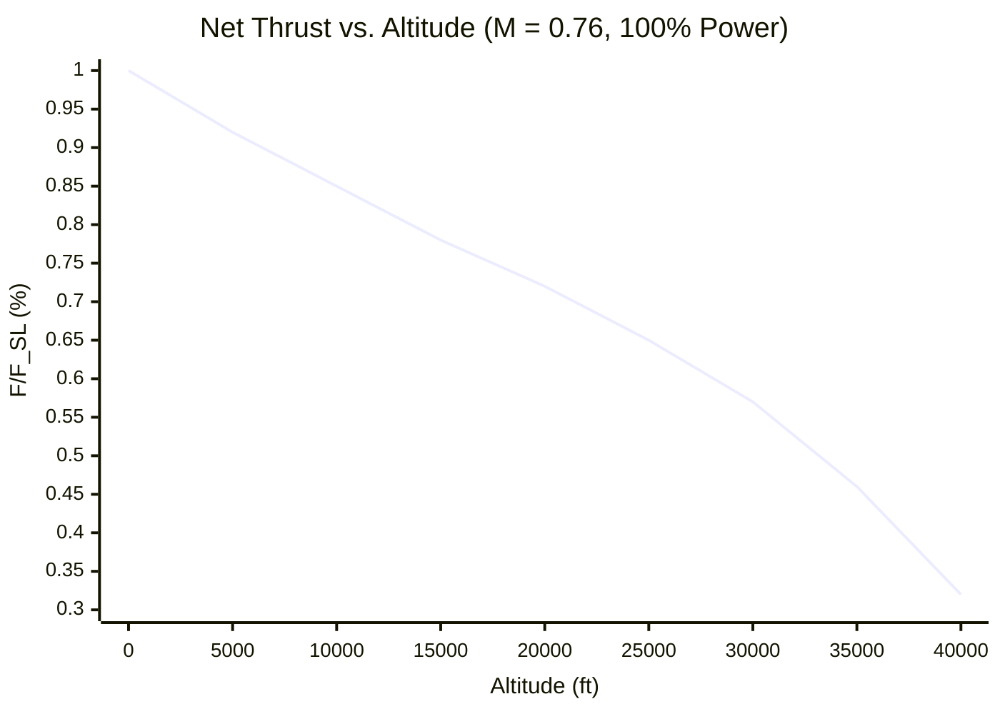

# 61-00-06-010-002A — Thrust & Altitude Performance Models

| **Document ID**    | 61-00-06-010-002A                                          |
| ------------------ | ---------------------------------------------------------- |
| **Revision**       | A                                                          |
| **Status**         | DRAFT                                                      |
| **Effective Date** | 2025-12-11                                                 |
| **ATA Chapter**    | 61 — Propellers / Propulsors                               |
| **Aircraft**       | AMPEL360 BWB H₂ Hy-E Q100                                  |
| **Node Path**      | `61-00_GENERAL/61-00-06_Engineering/61-00-06-010_Analysis` |
| **Parent Doc**     | 61-00-06-010-001A_Methodology_Overview.md                  |

---

## 1. Purpose & Scope

This document defines the **thrust and altitude performance modeling methodology** for the Q100 distributed hydrogen-electric hybrid propulsion system. It establishes:

* Mathematical models for thrust generation across the flight envelope
* Altitude and atmospheric correction methodologies
* Hydrogen fuel cell and electric motor performance integration
* Model validation requirements and acceptance criteria

### 1.1 Propulsion Architecture Overview



### 1.2 Applicability

| Flight Phase      | Altitude Range     | Mach Range  | Covered |
| ----------------- | ------------------ | ----------- | :-----: |
| Takeoff / Climb   | 0 – 10,000 ft      | 0.00 – 0.45 |    ✓    |
| Cruise            | 25,000 – 35,000 ft | 0.70 – 0.78 |    ✓    |
| Descent           | 35,000 – 0 ft      | 0.78 – 0.25 |    ✓    |
| Go-Around         | 0 – 5,000 ft       | 0.20 – 0.35 |    ✓    |
| Emergency Descent | 35,000 – 10,000 ft | 0.78 – 0.50 |    ✓    |

---

## 2. Reference Conditions

### 2.1 Standard Atmosphere (ISA)

| Parameter                | Symbol | Sea Level Value | Units         |
| ------------------------ | ------ | --------------- | ------------- |
| Temperature              | T₀     | 288.15          | K             |
| Pressure                 | P₀     | 101,325         | Pa            |
| Density                  | ρ₀     | 1.225           | kg/m³         |
| Speed of Sound           | a₀     | 340.29          | m/s           |
| Lapse Rate (troposphere) | L      | -0.0065         | K/m           |
| Tropopause Altitude      | h_trop | 11,000          | m (36,089 ft) |

### 2.2 Design Reference Point (DRP)

| Parameter              | Value       | Notes                           |
| ---------------------- | ----------- | ------------------------------- |
| Cruise Altitude        | 35,000 ft   | FL350                           |
| Cruise Mach            | 0.76        | Design cruise speed             |
| ISA Deviation          | ISA +10°C   | Hot day sizing                  |
| Total Installed Thrust | [TBD] kN    | All propulsors combined         |
| Number of Propulsors   | [TBD]       | Distributed configuration       |
| BLI Inlet Recovery     | 0.92 – 0.96 | Boundary layer ingestion factor |

---

## 3. Thrust Model Formulation

### 3.1 Net Thrust Equation

The net thrust produced by each propulsor is defined as:

$$
F_{net} = \dot{m}*{air} \cdot (V*{exit} - V_{\infty}) + (P_{exit} - P_{\infty}) \cdot A_{exit}
$$

Where:

* ( F_{net} ) = Net thrust [N]
* ( \dot{m}_{air} ) = Air mass flow rate [kg/s]
* ( V_{exit} ) = Exit velocity [m/s]
* ( V_{\infty} ) = Freestream velocity [m/s]
* ( P_{exit} ) = Exit static pressure [Pa]
* ( P_{\infty} ) = Ambient static pressure [Pa]
* ( A_{exit} ) = Propulsor exit area [m²]

### 3.2 Propulsive Efficiency

$$
\eta_{prop} = \frac{F_{net} \cdot V_{\infty}}{P_{shaft}}
$$

For BLI-integrated propulsors, the effective propulsive efficiency includes wake recovery:

$$
\eta_{prop,BLI} = \eta_{prop} \cdot (1 + \Delta\eta_{BLI})
$$

Where ( \Delta\eta_{BLI} ) accounts for the momentum deficit recovery (typically 3–8% improvement).

### 3.3 Altitude Correction — Thrust Lapse

Thrust varies with altitude due to changes in air density:

$$
\frac{F(h)}{F_{SL}} = \sigma^n \cdot f(M)
$$

Where:

* ( \sigma = \rho(h) / \rho_0 ) = Density ratio
* ( n ) = Lapse exponent (model-dependent, typically 0.7–1.0 for electric propulsors)
* ( f(M) ) = Mach correction function

#### 3.3.1 Density Ratio (Troposphere: ( h \leq 11{,}000 ) m)

$$
\sigma = \left(1 + \frac{L \cdot h}{T_0}\right)^{-\left(\frac{g}{R \cdot L} + 1\right)}
$$

#### 3.3.2 Density Ratio (Stratosphere: ( h > 11{,}000 ) m)

$$
\sigma = \sigma_{trop} \cdot \exp\left(-\frac{g \cdot (h - h_{trop})}{R \cdot T_{trop}}\right)
$$

### 3.4 Thrust Model Parameters

| Parameter               | Symbol  | Nominal Value | Range       | Units |
| ----------------------- | ------- | ------------- | ----------- | ----- |
| Sea Level Static Thrust | F_SL    | [TBD]         | —           | kN    |
| Lapse Exponent          | n       | 0.85          | 0.70 – 1.00 | —     |
| BLI Efficiency Gain     | Δη_BLI  | 0.05          | 0.03 – 0.08 | —     |
| Inlet Recovery (BLI)    | η_inlet | 0.94          | 0.92 – 0.96 | —     |
| Fan Pressure Ratio      | FPR     | 1.35          | 1.25 – 1.45 | —     |
| Fan Polytropic Eff.     | η_fan   | 0.92          | 0.88 – 0.94 | —     |

---

## 4. Electric Powertrain Model

### 4.1 Power Flow Diagram



### 4.2 Overall Powertrain Efficiency

$$
\eta_{powertrain} = \eta_{FC} \cdot \eta_{inv} \cdot \eta_{motor} \cdot \eta_{gearbox} \cdot \eta_{prop}
$$

| Component         | Symbol    | Efficiency   | Notes                        |
| ----------------- | --------- | ------------ | ---------------------------- |
| Fuel Cell Stack   | η_FC      | 0.50 – 0.60  | PEM, varies with load        |
| Power Electronics | η_inv     | 0.97 – 0.99  | Inverter + DC-DC converters  |
| Electric Motor    | η_motor   | 0.94 – 0.97  | Permanent magnet synchronous |
| Gearbox           | η_gearbox | 0.98 – 0.995 | If direct drive, η = 1.0     |
| Propulsor         | η_prop    | 0.85 – 0.92  | Fan/propeller efficiency     |

### 4.3 Fuel Cell Performance Map

The fuel cell stack power output varies with altitude and temperature:

$$
P_{FC}(h, T) = P_{FC,ref} \cdot \left(\frac{P_{amb}(h)}{P_{ref}}\right)^{\alpha} \cdot f_{temp}(T)
$$

Where:

* ( \alpha \approx 0.5 ) for air-breathing PEM fuel cells
* ( f_{temp}(T) ) = Temperature correction factor

#### 4.3.1 Altitude Derating

| Altitude (ft) | Pressure Ratio | FC Power Factor | Notes           |
| ------------- | -------------- | --------------- | --------------- |
| 0             | 1.000          | 1.00            | Sea level       |
| 10,000        | 0.688          | 0.83            | —               |
| 20,000        | 0.459          | 0.68            | —               |
| 30,000        | 0.297          | 0.55            | —               |
| 35,000        | 0.235          | 0.48            | Design cruise   |
| 40,000        | 0.185          | 0.43            | Service ceiling |

> **Note:** Turbomachinery-assisted oxygen delivery may be required for high-altitude operations.

---

## 5. Thrust Envelope Definition

### 5.1 Flight Envelope Boundaries



### 5.2 Thrust Required vs. Available

| Flight Condition       | Altitude (ft) | Mach | Thrust Req'd (kN) | Thrust Avail. (kN) | Margin |
| ---------------------- | ------------- | ---- | ----------------- | ------------------ | :----: |
| Takeoff (MTOW, ISA+15) | 0             | 0.20 | [TBD]             | [TBD]              |  >15%  |
| Max Rate of Climb      | 10,000        | 0.45 | [TBD]             | [TBD]              |  >10%  |
| Cruise (LRC)           | 35,000        | 0.76 | [TBD]             | [TBD]              |   >5%  |
| Cruise (MRC)           | 35,000        | 0.78 | [TBD]             | [TBD]              |   >3%  |
| One Engine Inoperative | 10,000        | 0.35 | [TBD]             | [TBD]              |   >0%  |
| Go-Around (MLW)        | 0             | 0.25 | [TBD]             | [TBD]              |  >20%  |

### 5.3 Thrust Lapse Curves

The following parametric curves shall be generated and validated:

1. **F/F_SL vs. Altitude** at constant Mach (M = 0.0, 0.3, 0.5, 0.7, 0.78)
2. **F/F_SL vs. Mach** at constant altitude (h = 0, 10k, 25k, 35k ft)
3. **Specific Fuel Consumption (SFC) vs. Thrust** at cruise conditions
4. **Overall Efficiency (η_overall) vs. Power Setting** at multiple altitudes

---

## 6. Analysis Cases

### 6.1 Case Matrix

| Case ID | Description                 | Altitude  | Mach | ISA Dev | Power |
| ------- | --------------------------- | --------- | ---- | ------- | ----- |
| THR-001 | Sea Level Static, Max Power | 0 ft      | 0.00 | ISA     | 100%  |
| THR-002 | Sea Level Static, Hot Day   | 0 ft      | 0.00 | +15°C   | 100%  |
| THR-003 | Takeoff Roll, MTOW          | 0 ft      | 0.20 | +15°C   | 100%  |
| THR-004 | Initial Climb               | 1,500 ft  | 0.30 | ISA     | 95%   |
| THR-005 | Max Climb Rate              | 10,000 ft | 0.45 | ISA     | 100%  |
| THR-006 | Cruise Entry                | 25,000 ft | 0.70 | ISA     | 85%   |
| THR-007 | Design Cruise Point         | 35,000 ft | 0.76 | ISA     | 75%   |
| THR-008 | Max Cruise Mach             | 35,000 ft | 0.78 | ISA     | 80%   |
| THR-009 | Hot & High Cruise           | 35,000 ft | 0.76 | +10°C   | 80%   |
| THR-010 | Service Ceiling             | 41,000 ft | 0.70 | ISA     | 100%  |
| THR-011 | OEI Climb                   | 10,000 ft | 0.35 | ISA     | 100%  |
| THR-012 | Go-Around, MLW              | 0 ft      | 0.25 | +15°C   | 100%  |

### 6.2 Case Definition Template

```yaml
# Case Definition: ASSETS/CASES/thr_case_007.yaml
case_id: THR-007
title: "Design Cruise Point Performance"
revision: A
date: 2025-12-11

conditions:
  altitude_ft: 35000
  mach: 0.76
  isa_deviation_c: 0
  power_setting_pct: 75
  weight_kg: [TBD]  # Mid-cruise weight
  cg_position: [TBD]

atmosphere:
  model: ISA
  humidity_pct: 0  # Dry air assumption

propulsion:
  n_propulsors: [TBD]
  thrust_split: equal  # or asymmetric for OEI
  bli_enabled: true
  inlet_recovery: 0.94

fuel_cell:
  stack_power_kw: [TBD]
  operating_temp_c: 80
  altitude_derate: auto  # Calculate from model

outputs_required:
  - net_thrust_per_propulsor_kn
  - total_net_thrust_kn
  - fuel_flow_kg_hr
  - sfc_kg_kn_hr
  - propulsive_efficiency
  - overall_efficiency
  - power_margin_pct

validation:
  reference: [TBD]  # Engine or stack manufacturer data
  acceptance_criteria:
    thrust_tolerance_pct: 3
    sfc_tolerance_pct: 5
```

---

## 7. Computational Methods

### 7.1 Thrust Deck Generation

```python
# ASSETS/SCRIPTS/generate_thrust_deck.py (conceptual)

import numpy as np
import pandas as pd

def compute_thrust(altitude_ft, mach, power_setting, config):
    """
    Compute net thrust for given flight conditions.

    Parameters
    ----------
    altitude_ft : float
        Pressure altitude [ft]
    mach : float
        Flight Mach number
    power_setting : float
        Power setting [0.0 - 1.0]
    config : dict
        Propulsion system configuration

    Returns
    -------
    dict
        Thrust and performance parameters
    """
    # Atmospheric model
    atm = compute_atmosphere(altitude_ft, isa_dev=config['isa_dev'])

    # Fuel cell derating with altitude
    fc_power = compute_fc_power(
        config['fc_power_sl'],
        atm['pressure_ratio'],
        atm['temperature']
    )

    # Electric powertrain losses
    shaft_power = fc_power * config['eta_powertrain']

    # Propulsor thrust
    thrust = compute_propulsor_thrust(
        shaft_power * power_setting,
        mach,
        atm['density'],
        config['propulsor']
    )

    # BLI correction
    if config['bli_enabled']:
        thrust *= (1 + config['delta_eta_bli'])

    return {
        'net_thrust_kn': thrust / 1000.0,
        'shaft_power_kw': shaft_power,
        'propulsive_eff': compute_prop_efficiency(thrust, mach, shaft_power),
        'sfc': compute_sfc(config['h2_flow'], thrust),
    }
```

### 7.2 Altitude Sweep Procedure

1. Define altitude vector:
   `h = [0, 5000, 10000, 15000, 20000, 25000, 30000, 35000, 40000]` ft
2. Define Mach vector:
   `M = [0.0, 0.2, 0.4, 0.6, 0.7, 0.76, 0.78]`
3. For each (h, M) pair:

   * Compute atmospheric properties
   * Apply fuel cell altitude derating
   * Calculate available thrust at multiple power settings
   * Store in thrust deck array
4. Interpolate off-grid conditions using bilinear or spline methods
5. Export to `ASSETS/RESULTS/thrust_deck_q100_v{N}.parquet`

### 7.3 Output Data Format

```
# ASSETS/RESULTS/thrust_deck_q100_v1.parquet

Columns:
- altitude_ft: int
- mach: float
- power_setting: float       # 0.0 - 1.0
- isa_deviation_c: float
- net_thrust_kn: float       # per propulsor
- total_thrust_kn: float     # all propulsors
- shaft_power_kw: float
- fuel_flow_kg_hr: float
- sfc_kg_kn_hr: float
- propulsive_efficiency: float
- overall_efficiency: float
- fc_power_kw: float
- inlet_recovery: float
```

---

## 8. Validation & Verification

### 8.1 Verification Methods

| Verification Type  | Method                                   | Criterion                    |
| ------------------ | ---------------------------------------- | ---------------------------- |
| Mathematical Check | Hand calculation at 5 discrete points    | <0.5% deviation from model   |
| Grid Independence  | Double resolution in (h, M) space        | <1% change in interpolated F |
| Consistency Check  | F monotonically decreasing with altitude | No non-physical reversals    |
| Limiting Cases     | F → 0 as h → ceiling; F max at SL        | Physical plausibility        |

### 8.2 Validation Sources

| Source                  | Data Available                             | Usage                       |
| ----------------------- | ------------------------------------------ | --------------------------- |
| Fuel Cell Manufacturer  | FC power vs. altitude, temperature maps    | FC model calibration        |
| Motor Manufacturer      | Efficiency maps, thermal limits            | Powertrain model validation |
| Wind Tunnel Tests       | Propulsor performance at scaled conditions | Thrust model correlation    |
| Ground Test (Iron Bird) | Full-scale static thrust measurements      | SL thrust validation        |
| Flight Test Data        | In-flight thrust estimation                | Full envelope validation    |

### 8.3 Acceptance Criteria

| Parameter                 | Tolerance | Flight Phase  |
| ------------------------- | --------- | ------------- |
| Net Thrust                | ±3%       | All phases    |
| Specific Fuel Consumption | ±5%       | Cruise        |
| Propulsive Efficiency     | ±2%       | Cruise        |
| Altitude Lapse Rate       | ±5%       | Full envelope |
| OEI Thrust Asymmetry      | ±3%       | Climb, cruise |

---

## 9. Results & Deliverables

### 9.1 Required Outputs

| Deliverable                      | Format        | Location                                       |
| -------------------------------- | ------------- | ---------------------------------------------- |
| Thrust Deck (full envelope)      | Parquet       | `ASSETS/RESULTS/thrust_deck_q100_v{N}.parquet` |
| Thrust Lapse Curves              | PNG, SVG      | `ASSETS/RESULTS/plots/thrust_lapse_*.svg`      |
| SFC Maps                         | CSV           | `ASSETS/RESULTS/sfc_map_q100_v{N}.csv`         |
| Efficiency Contours              | PNG           | `ASSETS/RESULTS/plots/efficiency_*.png`        |
| Validation Report                | Markdown, PDF | `ASSETS/REPORTS/thrust_validation_v{N}.pdf`    |
| Analysis Summary (this document) | Markdown      | This file                                      |

### 9.2 Thrust Deck Visualization (Example)



---

## 10. Interfaces

### 10.1 Upstream Dependencies

| Source            | Data Required                               | Reference    |
| ----------------- | ------------------------------------------- | ------------ |
| 61-00-05_Design   | Propulsor geometry, fan diameter, exit area | ICD-61-005   |
| 70-00_Power Plant | FC stack specs, motor efficiency maps       | 70-00-02-XXX |
| 28-00_Fuel (H₂)   | H₂ fuel properties, tank pressure schedule  | 28-10-XX     |
| Flight Sciences   | Flight envelope, weight breakdown           | Perf. Spec   |

### 10.2 Downstream Consumers

| Consumer                | Data Provided                     | Format          |
| ----------------------- | --------------------------------- | --------------- |
| Performance Engineering | Thrust deck for mission analysis  | Parquet, CSV    |
| Flight Simulator        | Real-time thrust model            | Lookup tables   |
| Certification           | Thrust substantiation data        | PDF report      |
| 61-00-06-010-003A (CFD) | Operating points for detailed CFD | YAML case files |

---

## 11. Document Control

### 11.1 Revision History

| Rev | Date       | Author           | Description     |
| --- | ---------- | ---------------- | --------------- |
| A   | 2025-12-11 | Engineering Team | Initial release |

### 11.2 Approval

| Role     | Name  | Signature | Date |
| -------- | ----- | --------- | ---- |
| Author   | [TBD] |           |      |
| Checker  | [TBD] |           |      |
| Approver | [TBD] |           |      |

---

## 12. References

1. 61-00-06-010-001A — Methodology Overview
2. SAE AIR1168/8 — Jet Propulsion System Thrust and Drag Bookkeeping
3. AIAA S-151-2018 — Recommended Practice for Fuel Cell System Characterization
4. SAE ARP4754A — Guidelines for Development of Civil Aircraft and Systems
5. SAE ARP4761 — Guidelines and Methods for Conducting the Safety Assessment Process
6. Project Tool Qualification Plan (TQP) — Document Q-000

---

*End of Document*
