# 61-00-06-010-003A — CFD & BLI Envelope Analysis

| **Document ID**    | 61-00-06-010-003A                                          |
| ------------------ | ---------------------------------------------------------- |
| **Revision**       | A                                                          |
| **Status**         | DRAFT                                                      |
| **Effective Date** | 2025-12-11                                                 |
| **ATA Chapter**    | 61 — Propellers / Propulsors                               |
| **Aircraft**       | AMPEL360 BWB H₂ Hy-E Q100                                  |
| **Node Path**      | `61-00_GENERAL/61-00-06_Engineering/61-00-06-010_Analysis` |
| **Parent Doc**     | 61-00-06-010-001A_Methodology_Overview.md                  |

---

## 1. Purpose & Scope

This document defines the **Computational Fluid Dynamics (CFD) methodology** for analyzing the Boundary Layer Ingestion (BLI) propulsion system on the Q100 Blended Wing Body (BWB) aircraft. It establishes:

* CFD modeling strategies for BLI-integrated distributed propulsors
* Mesh generation standards and quality criteria
* Turbulence modeling and solver configuration requirements
* Validation protocols against experimental and flight test data
* Post-processing and data extraction procedures

### 1.1 BLI Concept Overview

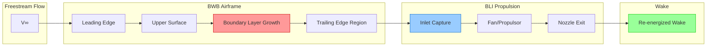

**Key Physics:**

* Boundary layer ingestion captures low-momentum flow from airframe surface
* Propulsor re-energizes the wake, reducing overall drag
* Net propulsive efficiency improvement of 3–10% compared to podded engines

### 1.2 Applicability

| Analysis Type                  | Covered | Reference Section |
| ------------------------------ | :-----: | ----------------- |
| Isolated Propulsor Performance |    ✓    | §5.1              |
| BLI Inlet Distortion           |    ✓    | §5.2              |
| Airframe-Propulsor Interaction |    ✓    | §5.3              |
| Multi-Propulsor Interference   |    ✓    | §5.4              |
| Off-Design / Asymmetric Ops    |    ✓    | §5.5              |
| Unsteady / Transient Effects   |    ✓    | §5.6              |

---

## 2. Reference Geometry & Conditions

### 2.1 BWB Configuration

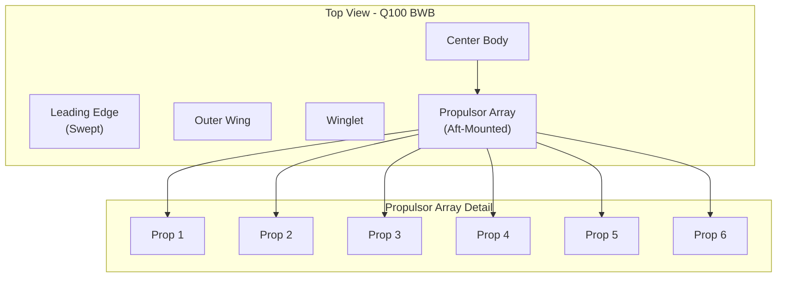

| Geometric Parameter      | Symbol  | Value | Units | Source          |
| ------------------------ | ------- | ----- | ----- | --------------- |
| Reference Wing Area      | S_ref   | [TBD] | m²    | 61-00-05 Design |
| Mean Aerodynamic Chord   | MAC     | [TBD] | m     | 61-00-05 Design |
| Wingspan                 | b       | [TBD] | m     | 61-00-05 Design |
| Number of BLI Propulsors | N_prop  | [TBD] | —     | 61-00-05 Design |
| Propulsor Fan Diameter   | D_fan   | [TBD] | m     | 61-00-05 Design |
| Propulsor Spacing        | Δy_prop | [TBD] | m     | 61-00-05 Design |
| Inlet Capture Height     | h_inlet | [TBD] | m     | 61-00-05 Design |
| BLI Coverage (% span)    | —       | [TBD] | %     | 61-00-05 Design |

### 2.2 Reference Flight Conditions

| Condition ID | Description           | Altitude (ft) | Mach | α (deg) | β (deg) | Re (MAC) |
| ------------ | --------------------- | ------------- | ---- | ------- | ------- | -------- |
| FC-01        | Design Cruise         | 35,000        | 0.76 | 2.5     | 0.0     | [TBD]    |
| FC-02        | High-Speed Cruise     | 35,000        | 0.78 | 2.0     | 0.0     | [TBD]    |
| FC-03        | Low-Speed Cruise      | 35,000        | 0.70 | 3.5     | 0.0     | [TBD]    |
| FC-04        | Climb                 | 25,000        | 0.65 | 4.0     | 0.0     | [TBD]    |
| FC-05        | Takeoff/Initial Climb | 5,000         | 0.30 | 8.0     | 0.0     | [TBD]    |
| FC-06        | Crosswind Landing     | 0             | 0.20 | 6.0     | 8.0     | [TBD]    |
| FC-07        | OEI Asymmetric        | 10,000        | 0.45 | 3.0     | 3.0     | [TBD]    |

---

## 3. CFD Methodology

### 3.1 Analysis Hierarchy

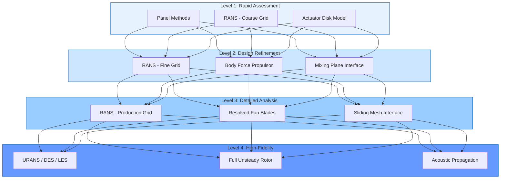

| Level | Application                    | Turnaround | Accuracy Target |
| ----- | ------------------------------ | ---------- | --------------- |
| 1     | Initial sizing, trade studies  | Hours      | ±10–15%         |
| 2     | Design iteration, optimization | 1–2 days   | ±5–8%           |
| 3     | Final design verification      | 3–5 days   | ±3–5%           |
| 4     | Certification, special studies | 1–2 weeks  | ±2–3%           |

### 3.2 Governing Equations

**Reynolds-Averaged Navier-Stokes (RANS):**

$$
\frac{\partial \bar{\rho}}{\partial t} + \frac{\partial}{\partial x_j}(\bar{\rho} \tilde{u}_j) = 0
$$

$$
\frac{\partial}{\partial t}(\bar{\rho} \tilde{u}_i) + \frac{\partial}{\partial x_j}(\bar{\rho} \tilde{u}_i \tilde{u}*j) = -\frac{\partial \bar{p}}{\partial x_i} + \frac{\partial}{\partial x_j}\left(\bar{\tau}*{ij} - \bar{\rho} \widetilde{u_i'' u_j''}\right) + S_i
$$

Where ( S_i ) represents body force terms for actuator disk / body force propulsor models.

### 3.3 Turbulence Modeling

| Model                 | Type            | Application                         | Recommended For       |
| --------------------- | --------------- | ----------------------------------- | --------------------- |
| Spalart-Allmaras (SA) | 1-equation      | Attached flow, cruise conditions    | Level 1–2             |
| k-ω SST               | 2-equation      | Separated flow, off-design          | Level 2–3 (baseline)  |
| k-ω SST with γ-Reθ    | Transition      | Laminar-turbulent transition        | Level 3 (if required) |
| DDES / IDDES          | Hybrid          | Unsteady separation, buffet         | Level 4               |
| Wall-Modeled LES      | Scale-resolving | Acoustic sources, detailed unsteady | Level 4 (special)     |

**Baseline Choice:** k-ω SST for all production analyses unless otherwise justified.

### 3.4 Propulsor Modeling Approaches

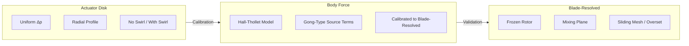

| Approach       | Fidelity | Computational Cost | Use Case                             |
| -------------- | -------- | ------------------ | ------------------------------------ |
| Actuator Disk  | Low      | ~1× baseline       | Trade studies, initial sizing        |
| Body Force     | Medium   | ~2–5× baseline     | Design iteration, distortion studies |
| Blade-Resolved | High     | ~50–200× baseline  | Final validation, unsteady/acoustic  |

---

## 4. Mesh Generation

### 4.1 Mesh Strategy Overview

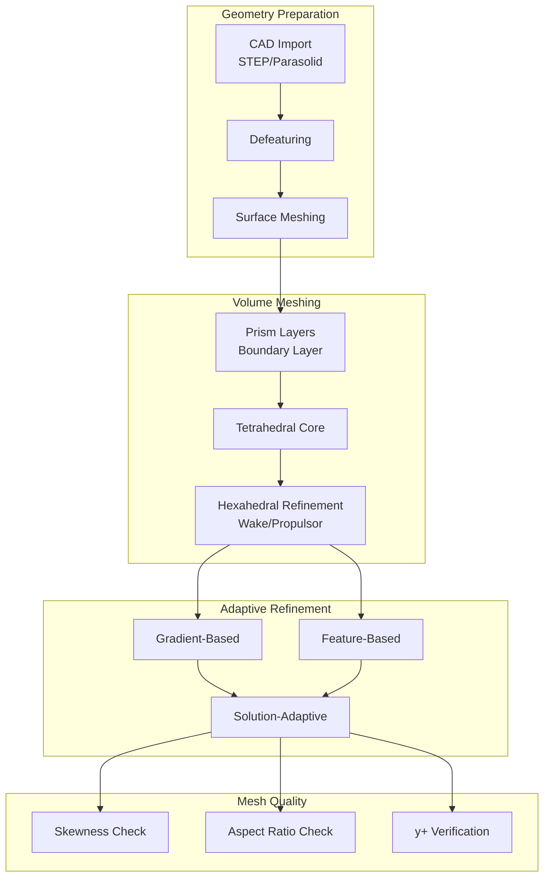

### 4.2 Mesh Sizing Requirements

| Region               | Target Cell Size  | y+ Target | Growth Rate | Notes                          |
| -------------------- | ----------------- | --------- | ----------- | ------------------------------ |
| Farfield             | 5–10% MAC         | N/A       | 1.3         | >20 MAC radius                 |
| Airframe Surface     | 0.5–1.0% MAC      | <1.0      | 1.2         | Prism layers required          |
| Propulsor Inlet      | 0.2–0.5% D_fan    | <1.0      | 1.15        | High resolution for distortion |
| Fan Face / Disk      | 0.1–0.2% D_fan    | <1.0      | 1.1         | Capture radial gradients       |
| Propulsor Exit / Jet | 0.3–0.5% D_fan    | <1.0      | 1.2         | Downstream 3–5 D_fan           |
| Wake Region          | 0.5–1.0% MAC      | N/A       | 1.2         | Downstream 10–20 MAC           |
| Wing Leading Edge    | 0.1–0.2% local c  | <1.0      | 1.1         | Stagnation region              |
| Wing Trailing Edge   | 0.05–0.1% local c | <1.0      | 1.1         | Kutta condition                |

### 4.3 Prism Layer Specification

**First Layer Height Calculation:**

$$
y_1 = \frac{y^+ \cdot \mu}{\rho \cdot u_\tau}
$$

Where:

$$
u_\tau = \sqrt{\frac{\tau_w}{\rho}} \approx 0.037 \cdot V_\infty \cdot Re_x^{-0.2}
$$

| Condition      | Re (MAC) | y+ = 1.0 → y₁ (mm) | Layers | Total δ (mm) |
| -------------- | -------- | ------------------ | ------ | ------------ |
| Cruise (FL350) | ~40×10⁶  | ~0.005             | 35–45  | 25–35        |
| Takeoff (SL)   | ~80×10⁶  | ~0.003             | 40–50  | 20–30        |

### 4.4 Mesh Quality Criteria

| Metric             | Acceptable  | Target | Unacceptable |
| ------------------ | ----------- | ------ | ------------ |
| Orthogonal Quality | >0.15       | >0.30  | <0.10        |
| Skewness           | <0.90       | <0.80  | >0.95        |
| Aspect Ratio       | <100 (vol.) | <50    | >200         |
| Volume Ratio       | <20         | <10    | >50          |
| y+ (wall-resolved) | 0.5–2.0     | ~1.0   | >5.0         |

### 4.5 Mesh Convergence Study

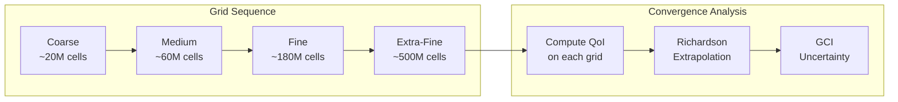

**Grid Convergence Index (GCI):**

$$
GCI_{fine} = \frac{F_s \cdot |e_a|}{r^p - 1}
$$

Where:

* ( F_s ) = Safety factor (1.25 for 3+ grids)
* ( e_a ) = Approximate relative error
* ( r ) = Refinement ratio (~1.3–1.5)
* ( p ) = Order of convergence

**Acceptance:** GCI < 2% for lift, drag, and propulsive efficiency.

---

## 5. Analysis Cases

### 5.1 Isolated Propulsor Performance

**Objective:** Characterize standalone propulsor performance for model calibration.

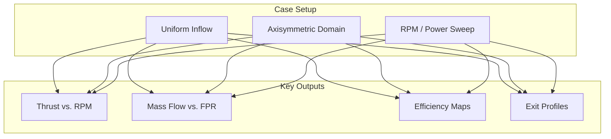

| Case ID | Description              | Inflow Mach | RPM Setting | Outputs              |
| ------- | ------------------------ | ----------- | ----------- | -------------------- |
| ISO-001 | Static thrust, max power | 0.0         | 100%        | F, η, mass flow      |
| ISO-002 | Static thrust sweep      | 0.0         | 50–100%     | F(RPM), η(RPM)       |
| ISO-003 | Cruise inflow            | 0.76        | 75%         | F, η, pressure ratio |
| ISO-004 | Cruise RPM sweep         | 0.76        | 50–100%     | Full perf. map       |
| ISO-005 | Off-design high Mach     | 0.82        | 80%         | Efficiency penalty   |

### 5.2 BLI Inlet Distortion

**Objective:** Quantify inlet flow non-uniformity and its impact on propulsor performance.

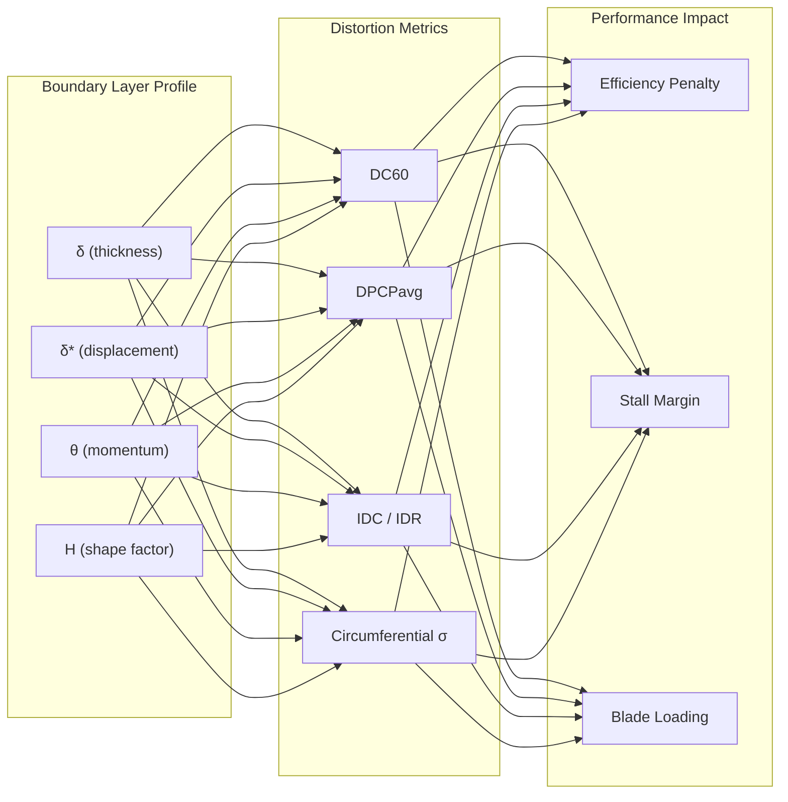

**Distortion Descriptors:**

| Metric  | Definition                             | Limit (Typical) |
| ------- | -------------------------------------- | --------------- |
| DC60    | ((P_{t,avg} - P_{t,60°min}) / q_{avg}) | < 0.30          |
| DPCPavg | Circumferential distortion intensity   | < 0.05          |
| IDC     | Integrated circumferential distortion  | < 0.10          |
| IDR     | Integrated radial distortion           | < 0.05          |

| Case ID  | Description               | α (deg) | Propulsor Pos. | Key Output            |
| -------- | ------------------------- | ------- | -------------- | --------------------- |
| DIST-001 | Cruise, inboard propulsor | 2.5     | y/b = 0.15     | DC60, Pt profiles     |
| DIST-002 | Cruise, mid-span          | 2.5     | y/b = 0.35     | DC60, Pt profiles     |
| DIST-003 | Cruise, outboard          | 2.5     | y/b = 0.55     | DC60, Pt profiles     |
| DIST-004 | High α, inboard           | 6.0     | y/b = 0.15     | Distortion at limit   |
| DIST-005 | Crosswind, all propulsors | 3.0     | All            | Asymmetric distortion |

### 5.3 Airframe-Propulsor Interaction

**Objective:** Evaluate coupled aerodynamic performance of integrated BLI system.

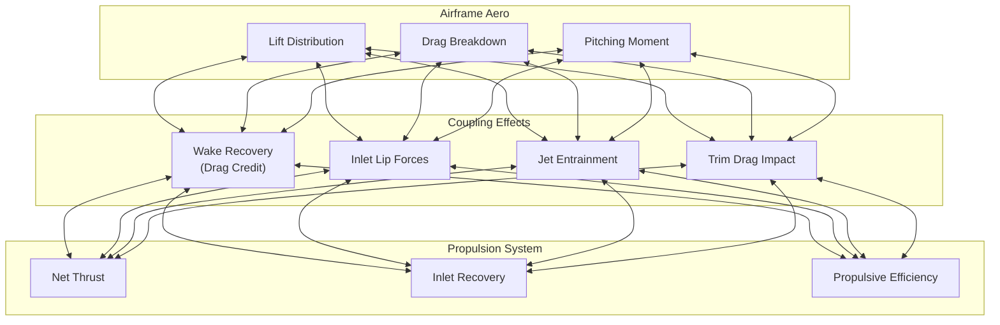

**Power-Drag Bookkeeping:**

The standard thrust-drag accounting for BLI systems follows a SAE AIR1168/8-style modified approach:

$$
D_{net} = D_{airframe} + D_{nacelle} - F_{gross} + \Phi_{BLI}
$$

Where ( \Phi_{BLI} ) is the BLI interaction term (typically negative, representing benefit).

| Case ID | Description                  | Power Setting | Outputs                       |
| ------- | ---------------------------- | ------------- | ----------------------------- |
| INT-001 | Cruise, power-on             | 75%           | L/D, thrust-drag split        |
| INT-002 | Cruise, power-off (windmill) | 0%            | Drag increment, flow spillage |
| INT-003 | Cruise, power sweep          | 0–100%        | η_prop vs. throttle           |
| INT-004 | High-lift config             | 90%           | CLmax impact, trim            |
| INT-005 | Power-on vs. power-off delta | Comparison    | ΔCD, ΔCM                      |

### 5.4 Multi-Propulsor Interference

**Objective:** Assess aerodynamic interaction between adjacent propulsors.

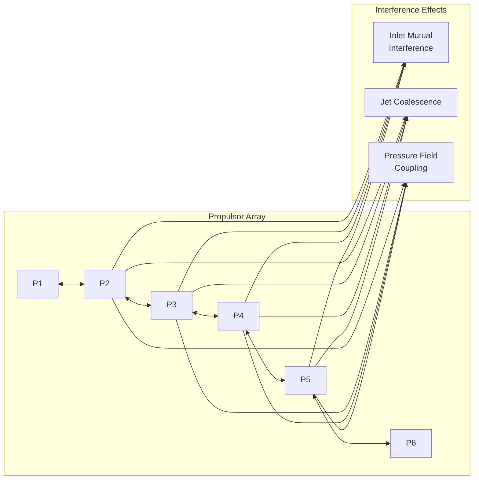

| Case ID | Description            | Active Propulsors | Key Output                   |
| ------- | ---------------------- | ----------------- | ---------------------------- |
| MPI-001 | All operating, uniform | All               | Total thrust, interference Δ |
| MPI-002 | Inboard pair only      | P3, P4            | Isolated vs. paired perf.    |
| MPI-003 | Alternating shutdown   | P1, P3, P5        | Spacing effects              |
| MPI-004 | Differential thrust    | Asymmetric        | Yaw moment, local loads      |

### 5.5 Off-Design / Asymmetric Operations

**Objective:** Analyze performance and stability in degraded or emergency conditions.

| Case ID | Description             | Condition              | Key Output                        |
| ------- | ----------------------- | ---------------------- | --------------------------------- |
| OEI-001 | One Engine Inoperative  | P1 shutdown            | Yaw moment, remaining thrust      |
| OEI-002 | Two Engines Inoperative | P1, P2 shutdown        | Thrust asymmetry, controllability |
| OEI-003 | Critical engine failure | Most adverse propulsor | Min control speed estimation      |
| OFF-001 | High angle of attack    | α = 12°, cruise power  | Inlet separation onset            |
| OFF-002 | Sideslip                | β = 10°                | Asymmetric inlet distortion       |
| OFF-003 | Combined α + β          | α = 8°, β = 5°         | Worst-case distortion             |

### 5.6 Unsteady / Transient Effects

**Objective:** Capture time-dependent phenomena for loads, acoustics, and stability.

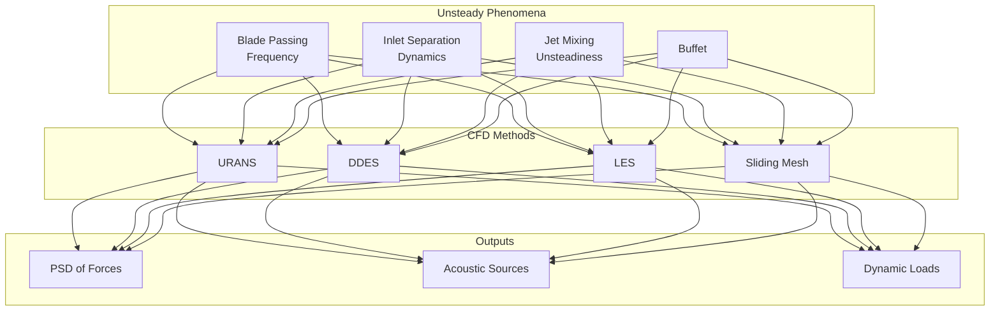

| Case ID | Description                | Method | Time Step    | Duration            |
| ------- | -------------------------- | ------ | ------------ | ------------------- |
| UNS-001 | BPF capture (cruise)       | URANS  | 1° rotation  | 10 revolutions      |
| UNS-002 | Inlet separation onset     | DDES   | CFL-based    | 50 convective times |
| UNS-003 | Acoustic source extraction | LES    | Δt for f_max | Statistical steady  |
| UNS-004 | Thrust transient (accel)   | URANS  | 0.001 s      | 5 seconds           |

---

## 6. Solver Configuration

### 6.1 Solver Selection

| Solver       | Version | Application                          | Qualification |
| ------------ | ------- | ------------------------------------ | ------------- |
| OpenFOAM     | v2312   | Baseline RANS, research applications | Q-001         |
| ANSYS Fluent | 2024 R2 | Production analyses, complex setups  | Q-002         |
| STAR-CCM+    | 2024.1  | Alternative, overset mesh capability | Q-006         |

### 6.2 Numerical Schemes

| Term                    | Scheme (Fluent)       | Scheme (OpenFOAM)      | Order |
| ----------------------- | --------------------- | ---------------------- | ----- |
| Convection (momentum)   | Bounded Central Diff. | linearUpwindV          | 2nd   |
| Convection (turbulence) | Second Order Upwind   | linearUpwind           | 2nd   |
| Diffusion               | Central               | Gauss linear corrected | 2nd   |
| Pressure-Velocity       | Coupled               | SIMPLE / PIMPLE        | —     |
| Gradient                | Least Squares         | Gauss linear           | 2nd   |
| Time (unsteady)         | 2nd Order Implicit    | backward               | 2nd   |

### 6.3 Boundary Conditions

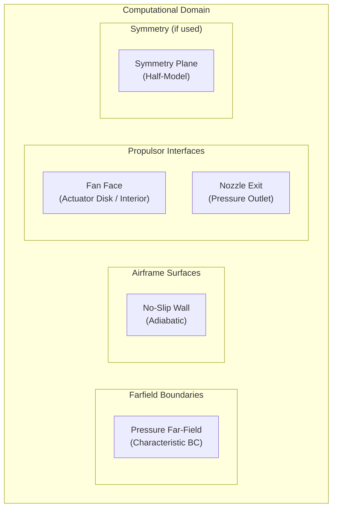

| Boundary        | Type                     | Specification                         |
| --------------- | ------------------------ | ------------------------------------- |
| Farfield        | Pressure far-field       | M, P_static, T_static, flow direction |
| Airframe walls  | No-slip, adiabatic       | Wall functions or resolved            |
| Propulsor inlet | Interior / Actuator disk | Δp or body force distribution         |
| Propulsor exit  | Pressure outlet          | P_static (from thrust matching)       |
| Symmetry plane  | Symmetry                 | Zero normal gradient (if half-model)  |
| Periodic        | Periodic / Translational | For isolated propulsor sectors        |

### 6.4 Convergence Criteria

| Criterion                | Target   | Hard Limit |
| ------------------------ | -------- | ---------- |
| Continuity residual      | < 1e-5   | < 1e-4     |
| Momentum residuals       | < 1e-6   | < 1e-5     |
| Turbulence residuals     | < 1e-5   | < 1e-4     |
| Force coefficient change | < 0.0001 | < 0.0005   |
| Mass flow imbalance      | < 0.01%  | < 0.1%     |

---

## 7. Post-Processing

### 7.1 Standard Outputs

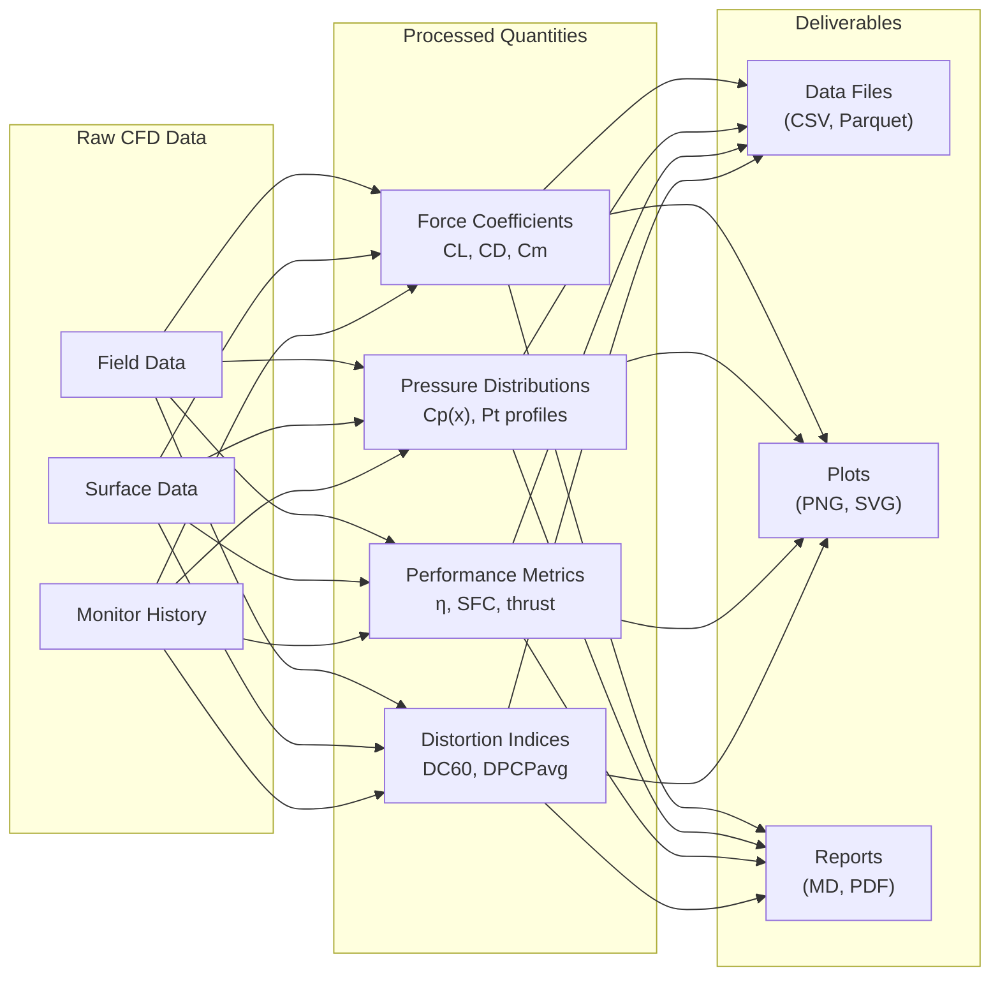

### 7.2 Data Extraction Stations

| Station ID | Location                  | Extracted Data                         |
| ---------- | ------------------------- | -------------------------------------- |
| STA-100    | Freestream (upstream)     | Reference P, T, V                      |
| STA-200    | Inlet capture plane (AIP) | Pt, Ps, V profiles, distortion metrics |
| STA-300    | Fan face (pre-rotor)      | Pt, Ps, flow angle, mass flow          |
| STA-400    | Fan exit (post-stator)    | Pt, Ps, swirl, temperature             |
| STA-500    | Nozzle exit               | Pt, Ps, V, thrust flux                 |
| STA-600    | Wake plane (x/c = 1.5)    | Momentum deficit, wake recovery        |
| STA-700    | Wake plane (x/c = 5.0)    | Far-wake mixing                        |

### 7.3 BLI Benefit Quantification

**Wake Recovery Factor:**

$$
\text{WRF} = 1 - \frac{\Phi_{wake,out}}{\Phi_{wake,in}}
$$

Where ( \Phi_{wake} ) is the wake momentum deficit.

**Propulsive Efficiency with BLI:**

$$
\eta_{p,BLI} = \frac{F_{net} \cdot V_\infty}{P_{shaft}} = \eta_{p,pod} \cdot (1 + \Delta\eta_{BLI})
$$

| Metric                      | Definition                               | Target    |
| --------------------------- | ---------------------------------------- | --------- |
| BLI Efficiency Benefit (Δη) | ( \eta_{p,BLI} / \eta_{p,isolated} - 1 ) | 3–8%      |
| Wake Recovery Factor        | Momentum deficit reduction               | 40–60%    |
| Inlet Recovery (η_inlet)    | ( P_{t,AIP} / P_{t,\infty} )             | 0.92–0.96 |
| Ram Drag Reduction          | Relative to podded configuration         | 5–10%     |

### 7.4 Visualization Standards

| Plot Type           | Format   | Resolution       | Naming Convention                 |
| ------------------- | -------- | ---------------- | --------------------------------- |
| Pressure contours   | PNG, SVG | 300 DPI / vector | `Cp_{case_id}_{view}.svg`         |
| Streamlines         | PNG      | 300 DPI          | `streamlines_{case_id}.png`       |
| Cp distributions    | SVG      | Vector           | `Cp_dist_{case_id}_{station}.svg` |
| Distortion maps     | PNG      | 300 DPI          | `distortion_{case_id}_AIP.png`    |
| Convergence history | SVG      | Vector           | `convergence_{case_id}.svg`       |

---

## 8. Validation & Verification

### 8.1 Code Verification

| Test Case                | Reference        | Metric       | Acceptance |
| ------------------------ | ---------------- | ------------ | ---------- |
| Flat plate BL            | Blasius / White  | Cf           | <2% error  |
| NACA 0012 airfoil        | NASA TMR data    | CL, CD, Cp   | <3% error  |
| Axisymmetric jet         | Experimental/DNS | Centerline V | <5% error  |
| Actuator disk validation | Momentum theory  | Thrust       | <1% error  |

### 8.2 Validation Sources

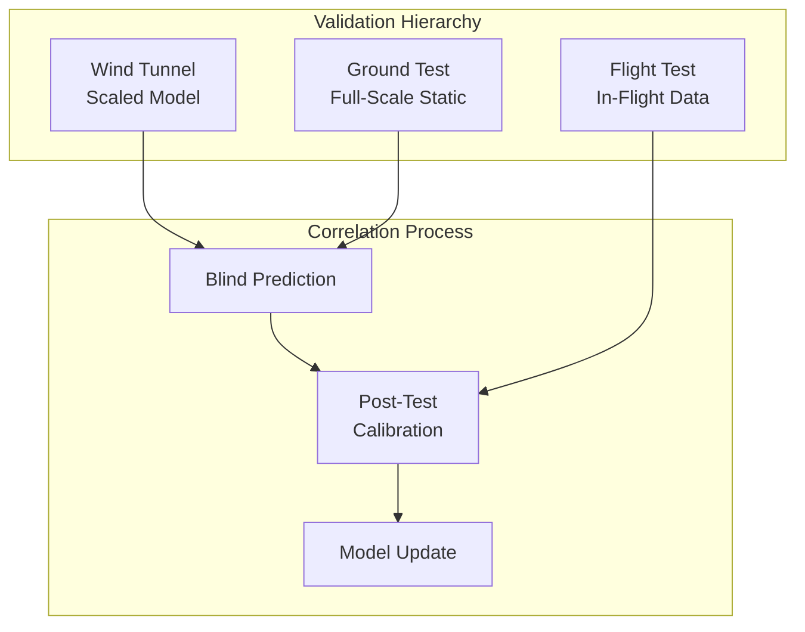

| Data Source                 | Availability | Parameters                   | Accuracy  |
| --------------------------- | ------------ | ---------------------------- | --------- |
| NASA / DLR BLI experiments  | Public       | Inlet distortion, thrust     | Reference |
| AMPEL360 WT Campaign (TBD)  | Project      | Pressure, forces, distortion | Primary   |
| Ground rig test (Iron Bird) | Project      | Static thrust, mass flow     | Primary   |
| Flight test (future)        | Project      | Full envelope correlation    | Ultimate  |

### 8.3 Acceptance Criteria

| Parameter                 | Tolerance vs. Test Data | Notes                    |
| ------------------------- | ----------------------- | ------------------------ |
| Net Thrust                | ±3%                     | At matched power setting |
| Propulsive Efficiency     | ±2%                     | Cruise conditions        |
| Inlet Pressure Recovery   | ±1%                     | At AIP                   |
| Distortion Indices (DC60) | ±15%                    | Index value (relative)   |
| Lift Coefficient          | ±3%                     | Integrated               |
| Drag Coefficient          | ±5% (or ±5 counts)      | Whichever is larger      |
| Pitching Moment           | ±0.005 Cm               | Absolute                 |

---

## 9. Deliverables & Outputs

### 9.1 File Deliverables

| Deliverable              | Format        | Location                               |
| ------------------------ | ------------- | -------------------------------------- |
| Case definition files    | YAML          | `ASSETS/CASES/cfd_bli_*.yaml`          |
| Mesh files               | MSH, CGNS     | `ASSETS/MODELS/cfd_mesh_*.msh`         |
| Solution files           | CAS/DAT, FOAM | `ASSETS/RESULTS/cfd_solution_*`        |
| Post-processed data      | Parquet, CSV  | `ASSETS/RESULTS/cfd_data_*.parquet`    |
| Plots and visualizations | SVG, PNG      | `ASSETS/RESULTS/plots/cfd_*.svg`       |
| Validation report        | Markdown, PDF | `ASSETS/REPORTS/cfd_validation_v*.pdf` |

### 9.2 Case Definition Template

```yaml
# ASSETS/CASES/cfd_bli_int_001.yaml
case_id: INT-001
title: "Cruise Power-On, Airframe-Propulsor Interaction"
revision: A
date: 2025-12-11
analyst: [TBD]

geometry:
  baseline: "Q100_OML_v3.2"
  commit: "[git-hash]"
  propulsor_config: "6x distributed BLI"

flight_condition:
  altitude_ft: 35000
  mach: 0.76
  alpha_deg: 2.5
  beta_deg: 0.0
  isa_deviation_c: 0

propulsion:
  power_setting_pct: 75
  propulsor_model: "body_force"
  target_thrust_per_prop_kn: [TBD]

cfd_setup:
  solver: "ANSYS Fluent 2024 R2"
  turbulence_model: "k-omega SST"
  mesh_level: 3
  mesh_cells_M: 180
  y_plus_target: 1.0

convergence:
  residual_target: 1.0e-5
  force_stability_counts: 5
  iterations_max: 15000

outputs:
  - force_coefficients
  - pressure_distributions
  - distortion_indices
  - propulsive_efficiency
  - wake_profiles

validation:
  reference: "[TBD - WT data]"
  acceptance:
    thrust_pct: 3
    eta_pct: 2
    cl_pct: 3
    cd_counts: 5
```

---

## 10. Workflow Integration

### 10.1 Process Flow

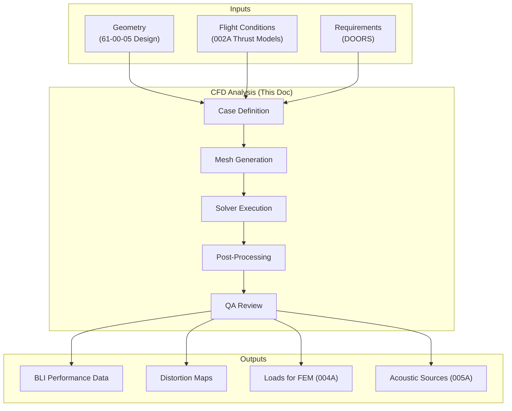

### 10.2 Interfaces

| Interface               | Direction | Data Exchanged                       | Format       |
| ----------------------- | --------- | ------------------------------------ | ------------ |
| 61-00-05 Design         | Input     | OML geometry, propulsor CAD          | STEP         |
| 61-00-06-010-002A       | Input     | Operating points, thrust targets     | YAML         |
| 61-00-06-010-004A FEM   | Output    | Pressure loads, inlet forces         | CSV, Parquet |
| 61-00-06-010-005A Acou. | Output    | Unsteady pressure, acoustic sources  | CGNS, HDF5   |
| Performance Engineering | Output    | Efficiency maps, drag polars         | Parquet      |
| Flight Test             | I/O       | Validation data, correlation results | Reports      |

---

## 11. Document Control

### 11.1 Revision History

| Rev | Date       | Author           | Description     |
| --- | ---------- | ---------------- | --------------- |
| A   | 2025-12-11 | Engineering Team | Initial release |

### 11.2 Approval

| Role     | Name  | Signature | Date |
| -------- | ----- | --------- | ---- |
| Author   | [TBD] |           |      |
| Checker  | [TBD] |           |      |
| Approver | [TBD] |           |      |

---

## 12. References

1. 61-00-06-010-001A — Methodology Overview
2. 61-00-06-010-002A — Thrust & Altitude Performance Models
3. SAE AIR1168/8 — Jet Propulsion System Thrust and Drag Bookkeeping
4. AIAA-2017-3413 — “CFD Best Practices for Propulsion-Airframe Integration”
5. NASA/CR-2015-218719 — Boundary Layer Ingestion Propulsion Benefit
6. ANSYS Fluent Theory Guide — Release 2024 R2
7. OpenFOAM User Guide — Version 2312
8. Greitzer, E.M. et al. — “N+3 Aircraft Concept Designs and Trade Studies” (NASA/CR-2010-216794)

---

## 13. Appendices

### Appendix A — Distortion Descriptor Definitions

**DC60 (SAE ARP1420):**

$$
DC_{60} = \frac{P_{t,avg} - P_{t,60°,min}}{q_{avg}}
$$

Where:

* ( P_{t,avg} ) = Area-averaged total pressure at AIP
* ( P_{t,60°,min} ) = Minimum 60° sector average total pressure
* ( q_{avg} ) = Average dynamic pressure

**Circumferential Distortion Intensity (DPCPavg):**

$$
DPCP_{avg} = \frac{1}{N_{rings}} \sum_{i=1}^{N_{rings}} \frac{P_{t,avg,i} - P_{t,min,i}}{P_{t,avg,i}}
$$

### Appendix B — Mesh Quality Checklist

```markdown
## CFD Mesh QA Checklist — [Case ID]

### Geometry
- [ ] CAD baseline documented (version: ______)
- [ ] Defeaturing log reviewed
- [ ] Watertight geometry confirmed

### Surface Mesh
- [ ] Surface mesh resolution per spec (§4.2)
- [ ] Feature edge capture verified
- [ ] No inverted/degenerate faces

### Volume Mesh
- [ ] Cell count within target (______ M cells)
- [ ] Prism layers generated successfully
- [ ] y+ verified at design conditions
- [ ] Transition ratio ≤ 1.2 at prism/tet interface

### Quality Metrics
- [ ] Min orthogonal quality > 0.15 (actual: ______)
- [ ] Max skewness < 0.90 (actual: ______)
- [ ] Max aspect ratio < 100 (actual: ______)

### Refinement Zones
- [ ] Inlet capture zone refined
- [ ] Fan face zone refined
- [ ] Wake region refined (to x/c = ______)

### Sign-off
- Prepared by: _____________  Date: _______
- Reviewed by: _____________  Date: _______
```

### Appendix C — Solver Setup Checklist

```markdown
## CFD Solver Setup Checklist — [Case ID]

### General
- [ ] Solver version documented (______)
- [ ] Double precision enabled
- [ ] Parallel decomposition verified

### Physics Models
- [ ] Turbulence model: ______
- [ ] Compressibility treatment: ______
- [ ] Wall treatment: ______

### Boundary Conditions
- [ ] Farfield: M = ____, P = ______ Pa, T = ______ K
- [ ] Walls: No-slip, adiabatic
- [ ] Propulsor model: ______ (thrust target: ______ kN)

### Numerical Schemes
- [ ] Spatial discretization: 2nd order
- [ ] Gradient method: ______
- [ ] Pressure-velocity coupling: ______

### Convergence Settings
- [ ] Residual targets set per §6.4
- [ ] Force monitors configured
- [ ] Mass flow monitors configured

### Execution
- [ ] Initial conditions set
- [ ] CFL / relaxation factors appropriate
- [ ] Output frequency configured

### Sign-off
- Prepared by: _____________  Date: _______
- Reviewed by: _____________  Date: _______
```

---

*End of Document*
