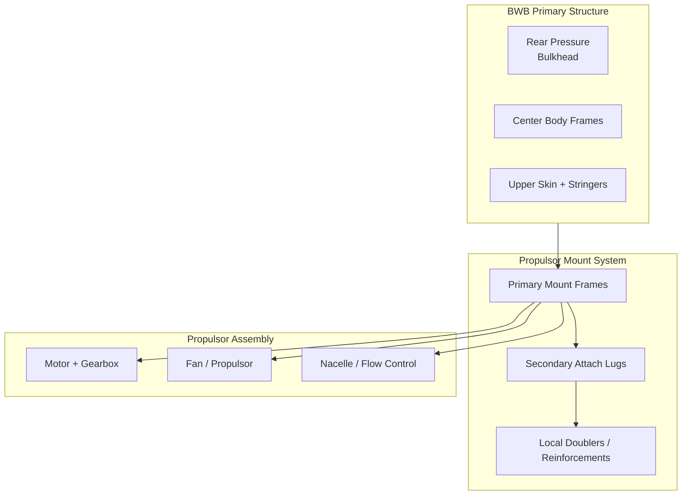
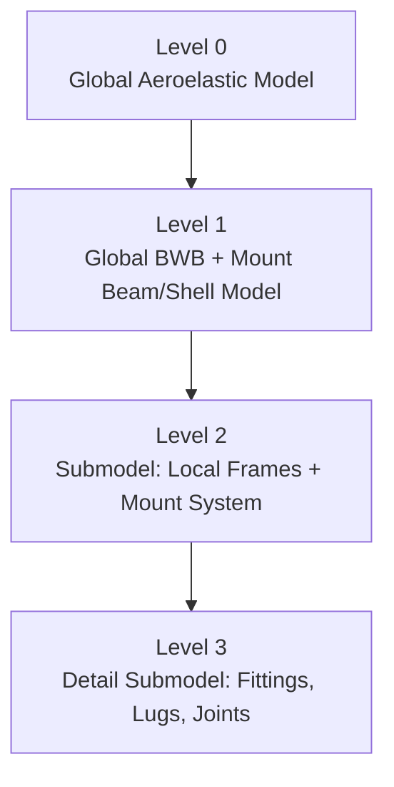
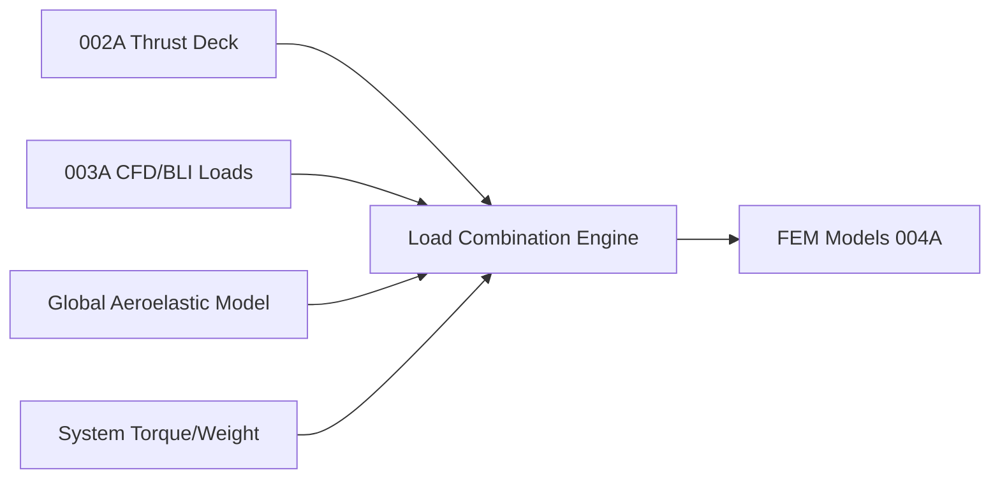

# 61-00-06-010-004A — Structural Mounts FEM Methodology (Q100)

| **Document ID**    | 61-00-06-010-004A                                          |
| ------------------ | ---------------------------------------------------------- |
| **Revision**       | A                                                          |
| **Status**         | DRAFT                                                      |
| **Effective Date** | 2025-12-11                                                 |
| **ATA Chapter**    | 61 — Propellers / Propulsors                               |
| **Aircraft**       | AMPEL360 BWB H₂ Hy-E Q100                                  |
| **Node Path**      | `61-00_GENERAL/61-00-06_Engineering/61-00-06-010_Analysis` |
| **Parent Doc**     | 61-00-06-010-001A_Methodology_Overview.md                  |

---

## 1. Purpose & Scope

This document defines the **Finite Element Method (FEM) methodology** for the **structural mounts and integration structure** of the Q100 distributed, BLI-powered propulsion system under ATA 61. It covers:

* Structural mount architecture and load paths
* FEM modeling strategy (global, submodel, local detail)
* Loads and boundary conditions from propulsion and airframe
* Material models and allowables usage
* Analysis types (limit/ultimate, fatigue/DT, stiffness, dynamics)
* Verification, validation, and documentation requirements

The methodology applies to all structural components whose **primary function** is to transmit propulsor loads into the BWB airframe, including:

* Mount frames and ribs
* Local reinforcements and doublers
* Fittings, lugs, and load introduction features
* Transition zones into primary fuselage/center body structure

### 1.1 Applicability

| Structural Domain                                  | Covered | Reference Document                   |
| -------------------------------------------------- | :-----: | ------------------------------------ |
| Global BWB–Propulsor Integration (stiffness loads) |    ✓    | §3.1, §4                             |
| Mount Frames, Ribs, and Bulkheads                  |    ✓    | §3.2, §5                             |
| Local Fittings, Lugs, and Joints                   |    ✓    | §3.3, §6                             |
| Fastening Systems (bolted, bonded, hybrid)         |    ✓    | §5.4, Appendix B                     |
| Fatigue & Damage Tolerance of Mounts               |    ✓    | §7.4                                 |
| Dynamic / Modal / Vibration of Mount Assemblies    |    ✓    | §7.3                                 |
| Crash / Emergency Landing Loads                    |    ✓    | Future extension (61-00-06-010-008x) |

---

## 2. Structural Context & Design Assumptions

### 2.1 Mounting Architecture

The Q100 propulsion system consists of **distributed BLI propulsors** mounted along the aft upper surface of the BWB center body and transition wing. The mounts provide:

* Primary load paths for **thrust, side, and vertical loads**
* Reaction paths for **torque, gyroscopic, and vibratory loads**
* Local stiffness to maintain **propulsor alignment and clearances**
* Compatibility with **pressurized structure, systems routing, and maintainability**



### 2.2 Design Load Categories

Structural mounts shall be capable of sustaining the following **load categories**:

* **Steady loads**: thrust, drag, side, vertical loads at limit and ultimate
* **Manoeuvre loads**: normal load factor and lateral manoeuvres per CS-25 / Part 25
* **Gust and turbulence loads**: per flight envelope and load alleviation strategy
* **Ground loads**: taxi, braking, uneven ground, towing effects on mounts (where applicable)
* **OEI / abnormal loads**: one-engine inoperative, asymmetric thrust, blade loss scenarios (if applicable)
* **Thermal and differential expansion**: between composite airframe and metallic/other components
* **Vibration and acoustic loads**: BPF, broadband excitation, transmitted from propulsor

### 2.3 Structural Assumptions (Baseline)

* BWB center body primary structure sized to **LC-01 and LC-02** requirements
* Propulsor mounts assumed **fail-safe** or **damage tolerant**, as per safety assessment (ARP4761, FHA/PSSA)
* Loads from **Thrust & Altitude Models (002A)** and **CFD/BLI (003A)** are treated as **authoritative aerodynamic and propulsion inputs** for FEM loads generation
* Standard safety factors, load factors, and material knockdowns per **EASA CS-25/FAA Part 25** and internal material allowables documentation

---

## 3. FEM Modeling Methodology

### 3.1 Analysis Levels



| Level | Scope                                         | Representation            | Purpose                             |
| ----- | --------------------------------------------- | ------------------------- | ----------------------------------- |
| L0    | Whole aircraft                                | Beam/shell, aeroelastic   | Global stiffness, load distribution |
| L1    | BWB center body + mount regions               | Shell + beam elements     | Envelope loads into mount regions   |
| L2    | Individual mount frame + local reinforcements | Shell + solid transition  | Stress and margin assessment        |
| L3    | Local joints, fittings, lugs, bolts, inserts  | 3D solid & contact models | Local stress/strain, DT, detail     |

### 3.2 Element Types

| Component                      | Element Type         | Notes                                        |
| ------------------------------ | -------------------- | -------------------------------------------- |
| Skins, webs, ribs, frames      | 2D shell elements    | Composite or metallic, layered where needed  |
| Stringers, stiffeners          | 1D beam elements     | Offsets and cross-section properties defined |
| Fittings, lugs, machined parts | 3D solid elements    | Hex-dominant preferred, tet as needed        |
| Fasteners (idealised)          | Beam/spring elements | Nonlinear springs for bearing and slip       |
| Joints and interfaces          | Contact elements     | Surface-to-surface, friction as needed       |

### 3.3 Coordinate Systems & Naming

* Global aircraft axes: **X fwd, Y right, Z down** (per AMPEL360 convention)
* Local mount coordinate systems aligned with **propulsor thrust axis** for load decomposition
* Model naming convention:

```text
ASSETS/MODELS_FEM/
  ├── 61-00-06-010-004A_GBL_Q100_Mounts_v1.inp      # Level 1 global mounts
  ├── 61-00-06-010-004A_SUB_P3_Frame_v1.inp         # Level 2 submodel (Propulsor 3)
  ├── 61-00-06-010-004A_DET_P3_Upper_Lug_v1.inp     # Level 3 detailed lug
  └── 61-00-06-010-004A_MAT_DB_LINK.yaml            # Material mapping file
```

---

## 4. Loads & Boundary Conditions

### 4.1 Load Sources

Loads shall be derived from:

* **Thrust models (002A)**: thrust vs. altitude/Mach, OEI conditions
* **CFD/BLI (003A)**: pressure distributions, inlet lip loads, wake recovery effects
* **Global aero/flight dynamics models**: manoeuvre and gust load factors
* **System loads**: motor torque, gyroscopic moments, gearbox reactions
* **Ground and operational loads**: maintenance operations, installation/removal loads



### 4.2 Load Components at Mount Interface

At each mount interface, load components are defined in a **local mount CSYS**:

* ( F_x ): Thrust direction (propulsor axis)
* ( F_y ): Lateral load (spanwise)
* ( F_z ): Vertical load (normal to local surface)
* ( M_x ): Torque about propulsor axis
* ( M_y ): Overturning moment (roll)
* ( M_z ): Overturning moment (pitch)

| Condition ID | Description                     | Fx | Fy | Fz | Mx | My | Mz | Source    |
| ------------ | ------------------------------- | -- | -- | -- | -- | -- | -- | --------- |
| LC-THR-001   | Takeoff, MTOW, all engines      | ✓  | ✓  | ✓  | ✓  | ✓  | ✓  | 002A      |
| LC-CRZ-007   | Design cruise, symmetric        | ✓  |    |    | ✓  |    |    | 002A/003A |
| LC-OEI-011   | OEI, asymmetric thrust          | ✓  | ✓  | ✓  | ✓  | ✓  | ✓  | 002A      |
| LC-GUST-021  | Positive gust, mid-cruise       | ✓  |    | ✓  |    |    |    | Global    |
| LC-MX-031    | Maintenance / installation load |    | ✓  | ✓  | ✓  | ✓  |    | Ops       |

### 4.3 Load Case Definition Template

```yaml
# ASSETS/CASES_FEM/61-00-06-010-004A_LC_OEI_011.yaml
load_case_id: LC-OEI-011
title: "OEI Mount Loads – 10,000 ft, M 0.35"
revision: A
date: 2025-12-11

flight_condition:
  altitude_ft: 10000
  mach: 0.35
  weight_kg: [TBD]
  n_z: 1.0
  isa_deviation_c: 0

propulsor_config:
  n_total: [TBD]
  failed_units:
    - P3
  thrust_distribution: "automatic_from_002A"
  loads_source:
    thrust_model: "thrust_deck_q100_v1.parquet"
    cfd_pressures: "cfd_data_INT-0xx.parquet"

mount_loads:
  coordinate_system: "local_mount"
  Fx_kn: [TBD per mount]
  Fy_kn: [TBD per mount]
  Fz_kn: [TBD per mount]
  Mx_knm: [TBD per mount]
  My_knm: [TBD per mount]
  Mz_knm: [TBD per mount]

safety_factors:
  limit_to_ultimate: 1.5
  dynamic_amplification: 1.2
```

### 4.4 Boundary Conditions

* **Primary attachments**: constrained at intersection with **global fuselage/center body frames** using appropriate stiffness (no over-constraining)
* **Symmetry**: half-models allowed for symmetric load cases; full models required for asymmetric/OEI
* **Rigid bodies / MPCs**: used to distribute loads to attachment points while avoiding artificial stiffness
* **Compatibility** with surrounding structure: displacements at mount boundaries coordinated with global model (L1) via submodeling process

---

## 5. Materials & Allowables

### 5.1 Material Families

| Material Family           | Typical Use                     | Reference Allowables Doc |
| ------------------------- | ------------------------------- | ------------------------ |
| CFRP laminates            | Skins, webs, ribs, local panels | MAT-COMP-Q100-DB         |
| Aluminium alloys          | Fittings, lugs, frames          | MAT-AL-Q100-DB           |
| Titanium alloys           | High-load fittings, bolts       | MAT-TI-Q100-DB           |
| Steel (Hi-Strength)       | Fasteners, pins, shafts         | MAT-STEEL-Q100-DB        |
| Hybrid joints (bond+bolt) | Interfaces, load transitions    | JOINT-METHOD-Q100-DB     |

### 5.2 Composite Modeling

* Layered shell modeling with **ply-by-ply definition** where critical
* Use **equivalent laminate** only for non-critical regions; critical zones require explicit stacking sequence
* Failure criteria: **Hashin** or **Puck** for ply stresses, **Tsai–Wu** for envelope checks

### 5.3 Metallic Components

* Elastic–plastic material models where required for ultimate load and crash scenarios
* Fatigue properties represented via **S–N curves** and **strain-life** methods for critical lugs and fittings

### 5.4 Knockdowns & Factors

| Factor Type              | Symbol | Typical Value | Notes                          |
| ------------------------ | ------ | ------------- | ------------------------------ |
| Environmental            | K_env  | 0.85–0.95     | Moisture, temperature          |
| Manufacturing            | K_man  | 0.95–0.98     | Tolerance, process variability |
| Damage Tolerance         | K_DT   | 0.7–0.9       | Open/embedded defects          |
| Load Factor (Limit→Ult.) | n_ult  | 1.5           | Static ultimate factor         |

All knockdowns must be captured in the **material mapping file**:

```yaml
# ASSETS/MODELS_FEM/61-00-06-010-004A_MAT_DB_LINK.yaml
materials:
  CFRP_Q100_01:
    source: "MAT-COMP-Q100-DB"
    base_allowables: "A-basis"
    knockdowns:
      env: 0.9
      man: 0.97
      dt: 0.8
  AL_Q100_7075T6:
    source: "MAT-AL-Q100-DB"
    base_allowables: "A-basis"
    knockdowns:
      env: 0.95
      man: 0.98
```

---

## 6. Mesh Strategy & Quality

### 6.1 Mesh Densities

| Region                          | Element Type | Target Size | Notes                         |
| ------------------------------- | ------------ | ----------- | ----------------------------- |
| Global mount region (L1)        | Shell/beam   | 50–150 mm   | Stiffness representation      |
| Mount frame webs & flanges      | Shell        | 15–30 mm    | Stress gradients captured     |
| Local doublers & reinforcements | Shell        | 10–20 mm    | Thickness transitions         |
| Fittings & lugs (3D)            | Solid        | 3–8 mm      | Fillets, Kt locations         |
| Bolt holes & fastener vicinity  | Solid        | 1–3 mm      | Bearing, shear, bypass stress |

### 6.2 Quality Criteria

| Metric                  | Target          | Limit        |
| ----------------------- | --------------- | ------------ |
| Jacobian (solids)       | > 0.6           | > 0.4        |
| Aspect ratio (solids)   | < 10 (critical) | < 20 overall |
| Skewness (shells)       | < 0.6           | < 0.8        |
| Warping (shells)        | < 10°           | < 15°        |
| Transition ratio (size) | < 1:3           | < 1:4        |

Mesh QA results must be recorded in **mesh QA forms** (Appendix B).

---

## 7. Analysis Types & Criteria

### 7.1 Static Limit & Ultimate

* **Limit load** analyses: verify **no permanent deformation** expected
* **Ultimate load** analyses: verify **positive margin of safety** with all knockdowns applied

**Margins of Safety:**

For a given stress component:

$$
MS = \frac{F_{allow}}{F_{applied}} - 1
$$

Acceptance: **MS ≥ 0.0** for all critical locations in ultimate load cases.

### 7.2 Stiffness & Deflection

* Control **relative deflections** between propulsor and BWB airframe to maintain:

  * Clearance with airframe surfaces
  * Acceptable alignment (thrust vectoring, BLI interaction)

Typical constraints (to be refined):

| Parameter                                   | Limit                      |
| ------------------------------------------- | -------------------------- |
| Thrust axis misalignment                    | ≤ 0.5°                     |
| Max propulsor vertical defl.                | ≤ [TBD] mm at OEI ultimate |
| Relative deflection between adjacent mounts | ≤ [TBD] mm                 |

### 7.3 Modal & Dynamic

* Extract **local modes** of mount assemblies up to at least **1.5× highest excitation frequency** (e.g. BPF)
* Avoid **resonances** near 1×, 2× BPF and major structural modes (global wing/body modes)

| Analysis Type      | Output                           | Acceptance                      |
| ------------------ | -------------------------------- | ------------------------------- |
| Modal (fixed base) | Natural frequencies, mode shapes | f_n not coincident with BPF ±5% |
| Harmonic response  | Dynamic amplification            | DA factors used in load scaling |

### 7.4 Fatigue & Damage Tolerance (DT)

* Use spectrum loading derived from **mission profiles** and **Thrust Deck (002A)**
* For composite regions: ensure **residual strength** after damage meets **limit load capability**
* For metallic fittings/lugs: evaluate fatigue life and DT per **CS-25 Subpart C** and internal DT procedures

---

## 8. Post-Processing & Reporting

### 8.1 Standard Output Sets

| Output Type                | Description                          | Level |
| -------------------------- | ------------------------------------ | ----- |
| Stress distributions       | σ, τ for shells/solids, ply stresses | L2/L3 |
| Strain & displacement maps | ε, δ fields                          | L2/L3 |
| Interface loads            | Load per attachment, per bolt        | L2/L3 |
| Margins of safety tables   | Per component, per load case         | All   |
| Modal results              | Frequencies, mode shapes             | L2/L3 |

### 8.2 Results Storage Structure

```text
ASSETS/
  ├── MODELS_FEM/
  │   └── ...                                      # FEM input decks
  ├── RESULTS_FEM/
  │   ├── 004A_LC-THR-001_Q100_v1.odb              # Native solver result
  │   ├── 004A_LC-THR-001_Q100_post.parquet        # Post-processed data
  │   ├── 004A_Margins_Table_v1.csv                # Margin summary
  │   └── 004A_Modal_Summary_v1.csv               # Modal summary
  ├── REPORTS/
  │   └── 61-00-06-010-004A_FEM_Report_v1.pdf
  └── PLOTS/
      ├── 004A_Stress_Map_LC-THR-001_P3.svg
      ├── 004A_Deflection_LC-OEI-011_P3.svg
      └── 004A_Modal_BarChart_v1.svg
```

### 8.3 Reporting Requirements

The **FEM report** shall include:

* Scope and applicable configuration (Q100 baseline, configuration ID)
* Model description (elements, DOFs, constraints, mesh quality)
* Load case summary and load derivation references (002A, 003A)
* Stress, deflection, and frequency results
* Margin of safety tables for all critical details
* Discussion of sensitivity, limitations, and open points

---

## 9. Verification & Validation

### 9.1 Model Verification

| Activity                  | Description                                | Evidence                      |
| ------------------------- | ------------------------------------------ | ----------------------------- |
| Free–free model check     | Rigid body modes only, no spurious modes   | Modal summary                 |
| Single-load sanity check  | Unit load on mount → reaction path check   | Reaction forces, sanity plots |
| Mesh sensitivity study    | Coarse/medium/fine comparison              | Convergence of peak stress    |
| Element formulation check | Comparison of shell vs solid in local zone | Local benchmark results       |

### 9.2 Validation

* Correlation with:

  * **Ground tests** (static pull tests of mounts)
  * **Component tests** (fittings, lugs, joints)
  * **Flight test data**, where mount deflections and vibration are measurable

Validation results shall be captured in:

* `61-00-06-010-004A_Validation_Report_v{N}.md` / `.pdf`

---

## 10. Interfaces

### 10.1 Upstream Inputs

| Source                      | Data Provided                           | Format         |
| --------------------------- | --------------------------------------- | -------------- |
| 61-00-05_Design             | Geometry, CAD, ICDs for mounts          | STEP, ICD PDFs |
| 61-00-06-010-002A           | Thrust and power loads, OEI conditions  | Parquet, CSV   |
| 61-00-06-010-003A CFD/BLI   | Pressure loads, inlet lip forces        | Parquet, CSV   |
| Material DB (Q100)          | Allowables, knockdowns                  | DB, CSV, PDF   |
| Safety Assessment (ARP4761) | Criticality, fail-safe/damage tolerance | FHA, PSSA docs |

### 10.2 Downstream Consumers

| Consumer                              | Data Provided                                    | Format          |
| ------------------------------------- | ------------------------------------------------ | --------------- |
| 61-00-05 Design                       | Stiffness, design feedback, geometry updates     | Reports, CSV    |
| 61-00-06-010-005A (Acoustics)         | Mount dynamic characteristics, mode shapes       | Modal summaries |
| LC-02 Certification                   | Evidence for CS-25 compliance                    | Reports, data   |
| Maintenance & Inspections (ATA 61-XX) | Fatigue-critical locations, inspection intervals | Tables, reports |

---

## 11. Document Control

### 11.1 Revision History

| Rev | Date       | Author           | Description            |
| --- | ---------- | ---------------- | ---------------------- |
| A   | 2025-12-11 | Engineering Team | Initial release (Q100) |

### 11.2 Approval

| Role     | Name  | Signature | Date |
| -------- | ----- | --------- | ---- |
| Author   | [TBD] |           |      |
| Checker  | [TBD] |           |      |
| Approver | [TBD] |           |      |

---

## 12. References

1. 61-00-06-010-001A — Methodology Overview
2. 61-00-06-010-002A — Thrust & Altitude Performance Models
3. 61-00-06-010-003A — CFD & BLI Envelope Analysis
4. EASA CS-25 / FAA 14 CFR Part 25 — Airworthiness Standards: Transport Category Airplanes
5. SAE ARP4754A — Guidelines for Development of Civil Aircraft and Systems
6. SAE ARP4761 — Guidelines and Methods for Conducting the Safety Assessment Process
7. Internal Material Allowables Database — Q100 (MAT-COMP-Q100-DB, MAT-AL-Q100-DB, MAT-TI-Q100-DB)

---

## 13. Appendices

### Appendix A — Example FEM Case Definition

```yaml
# ASSETS/CASES_FEM/61-00-06-010-004A_LC_THR_001.yaml
case_id: LC-THR-001
title: "Takeoff Mount Loads – MTOW, All Engines"
revision: A
date: 2025-12-11

configuration:
  aircraft: "Q100"
  variant: "Baseline"
  propulsor_array: "6x BLI"
  geometry_model: "Q100_OML_v3.2"

loads_source:
  thrust_deck_file: "thrust_deck_q100_v1.parquet"
  cfd_loads_file: "cfd_data_TKOFF_INT-xxx.parquet"
  scaling_factors:
    limit_to_ultimate: 1.5
    dynamic_amplification: 1.0

mounts:
  - id: "MNT-P1"
    location: "y/b = 0.15"
    Fx_kn: [TBD]
    Fy_kn: [TBD]
    Fz_kn: [TBD]
    Mx_knm: [TBD]
    My_knm: [TBD]
    Mz_knm: [TBD]
  - id: "MNT-P2"
    location: "y/b = 0.25"
    Fx_kn: [TBD]
    ...

solver:
  code: "Abaqus"
  version: "2024"
  analysis_type: "Static, linear"
  model_file: "61-00-06-010-004A_GBL_Q100_Mounts_v1.inp"

outputs:
  - "stress_fields"
  - "displacement_fields"
  - "interface_loads"
  - "margins_summary"
```

### Appendix B — FEM QA Checklist

```markdown
## 61-00-06-010-004A — FEM QA Checklist — [Case ID]

### 1. Model Definition
- [ ] Geometry baseline identified and traced (CAD: ______, commit: ______)
- [ ] Element types per §3.2
- [ ] Materials mapped via MAT_DB_LINK.yaml
- [ ] Boundary conditions consistent with global model

### 2. Mesh Quality
- [ ] Mesh densities per §6.1
- [ ] Quality metrics within limits (§6.2)
- [ ] Local refinement at attachments and Kt regions
- [ ] Mesh sensitivity study documented (if required)

### 3. Loads & Constraints
- [ ] Load case defined in CASES_FEM (ID: ______)
- [ ] Loads referenced to 002A/003A where applicable
- [ ] No double-counting of loads
- [ ] Constraints do not over-restrain structure

### 4. Solution & Convergence
- [ ] Solver run completed without errors
- [ ] Reaction forces consistent with applied loads (≤ 2% imbalance)
- [ ] Key DOF convergence verified (if nonlinear)
- [ ] Modal checks completed (where applicable)

### 5. Results & Margins
- [ ] Critical hot spots identified and reported
- [ ] Margins of safety ≥ 0 for all ultimate load cases
- [ ] Deflections within functional limits (§7.2)
- [ ] Modal frequencies vs. BPF checked (§7.3)

### Sign-off
- Analyst: __________   Date: ________
- Checker: __________   Date: ________
```

---

*End of Document*
