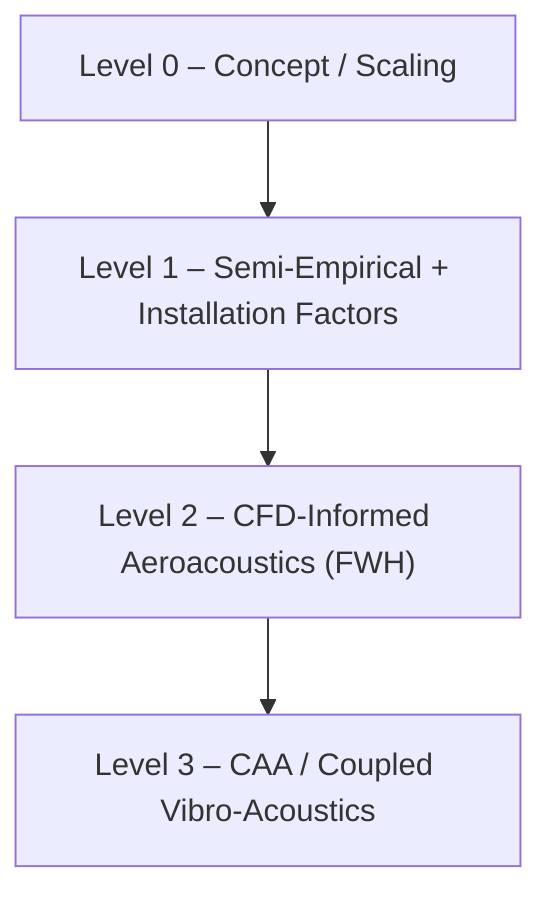

# 61-00-06-010-005A — Acoustic Signature Analysis (Q100)

| **Document ID**    | 61-00-06-010-005A                                      |
|--------------------|--------------------------------------------------------|
| **Revision**       | A                                                      |
| **Status**         | DRAFT                                                  |
| **Effective Date** | 2025-12-12                                             |
| **ATA Chapter**    | 61 — Propellers / Propulsors                           |
| **Aircraft**       | AMPEL360 BWB H₂ Hy-E Q100                              |
| **Node Path**      | `61-00_GENERAL/61-00-06_Engineering/61-00-06-010_Analysis` |
| **Parent Doc**     | 61-00-06-010-001A_Methodology_Overview.md              |

---

## 1. Purpose & Scope

This document defines the **acoustic signature analysis methodology** for the **Q100 distributed hydrogen-electric BLI propulsion system** under ATA 61-00-06-010. It establishes:

- The acoustic analysis framework (external community noise and interior/cabin noise)
- Source decomposition, metrics, observers, and reporting conventions
- Analysis levels (L0–L3) and associated toolchains
- Case matrix, inputs, and interfaces to other disciplines (Thrust, CFD/BLI, Structures)
- Data management, verification & validation (V&V), and acceptance-tracking mechanisms

The methodology applies to both:

- **External acoustic environment** (community / airport / on-ground observers)
- **Internal acoustic environment** (cabin & structural-borne transmission)

### 1.1 Applicability

| Acoustic Domain                          | Covered | Notes                                         |
|-----------------------------------------|:-------:|-----------------------------------------------|
| External community/airport noise        | ✓       | Takeoff, sideline, approach, flyover         |
| Ground/maintenance noise                | ✓       | Idle, ramp, taxi, ground operations          |
| Interior/cabin noise                    | ✓       | Cruise, climb, descent, approach             |
| Component-/rig-level acoustic tests     | ✓       | Isolated propulsor, duct/liner rigs          |
| Structural-borne noise via mounts       | ✓       | Interface with 004A FEM methodology          |
| Certification-specific metrics          | ✓       | As defined in program noise basis (TBD)      |

---

## 2. Acoustic Framework & Source Decomposition

### 2.1 Acoustic Objectives

The acoustic analysis supports the following program objectives:

- Demonstrate that the Q100 **meets or exceeds acoustic targets**, including any future certification basis.
- Provide **engineering guidance** for propulsor design, placement, RPM schedules, and BLI integration from an acoustic standpoint.
- Quantify **trade-offs** between aerodynamic/propulsive efficiency, structural constraints, and noise.
- Enable **traceable, reproducible datasets** and metrics usable by Performance, Structures, and Certification.

### 2.2 Primary Noise Source Categories

The analysis decomposes noise into the following **source categories**, reported both separately and in aggregate:

| Category                     | Description                                                                      | Key Interfaces                |
|------------------------------|----------------------------------------------------------------------------------|-------------------------------|
| Tonal (rotation-related)     | Blade Passing Frequency (BPF) tones and harmonics; rotor–stator interaction     | 002A (RPM), 003A (flow)       |
| Broadband aerodynamic       | Turbulent inflow, BLI distortion, boundary-layer interaction, trailing-edge     | 003A (BLI statistics)         |
| Mechanical/electromagnetic  | Motor electrical tonal components, gearbox mesh tones, bearing noise (broadband)| Propulsion/Systems            |
| Installation / scattering   | Reflection, diffraction, shielding by BWB surfaces; inlet/exhaust–airframe effects | 003A (installation CFD)    |
| Structural-borne            | Transmission through mounts/structure to cabin (vibro-acoustic coupling)        | 004A (FEM mounts)             |

Each category should be traceable in post-processing (source tags or model-level separation where feasible).

### 2.3 Coordinate System & Conventions

- **Global aircraft axes:**  
  - \( X \): forward  
  - \( Y \): right  
  - \( Z \): down  
- **Propulsor local axis:** \( X_p \) aligned with local thrust axis; BPF derived from local rotor speed and blade count.
- **Frequency content:**  
  - **Narrowband spectra** for tonal identification and diagnostics  
  - **1/3-octave bands** for reporting and aggregation  
- **Levels and references:**  
  - Sound Pressure Level (SPL): dB re 20 µPa  
  - Unless otherwise specified, external metrics use **dB(A)** and cabin metrics may use **dB(A)** or **dB(Z)** as defined in the metrics registry.

The authoritative list of metrics and conventions is maintained in:  
`ASSETS/ACOUSTICS/METRICS/61-00-06-010-005A_Metrics_Definitions.csv`

---

## 3. Analysis Levels (Model Fidelity Ladder)

Acoustic analyses are structured in **levels** to support early trades and progressive refinement.



| Level | Purpose                          | Typical Usage                            |
| ----- | -------------------------------- | ---------------------------------------- |
| L0    | Concept / scaling                | Early trades, design-space exploration   |
| L1    | Semi-empirical + installation    | Design iteration, noise-reduction trades |
| L2    | CFD-informed aeroacoustics (FWH) | High-fidelity external noise prediction  |
| L3    | CAA / coupled vibro-acoustics    | Cabin noise, structural-borne pathways   |

### 3.1 Level 0 — Concept / Scaling

**Purpose:**

* Fast ranking of high-level design variables:
  * RPM, fan/propulsor diameter
  * Blade count, spacing, placement relative to BWB body
* Very fast turn-around for **screening design options**.

**Inputs:**

* Operating points from **002A** (thrust / power / RPM assumptions)
* Preliminary geometry and installation factors (e.g. shielding coefficients)

**Outputs:**

* Tonal frequency map (BPF and harmonics vs RPM / flight condition)
* Order-of-magnitude SPL trends for conceptual trades
* Ranking of configuration variables (e.g. "high-RPM small-diameter vs low-RPM large-diameter")

### 3.2 Level 1 — Semi-Empirical + Installation Factors

**Purpose:**

* Design iteration and noise-reduction trade studies with **traceable semi-empirical basis**.

**Typical Methods:**

* **Tonal:** rotor–stator interaction models, loading/thickness noise scalings
* **Broadband:** trailing-edge / turbulent inflow models, BLI-adjusted where justified

**Propagation:**

* Spherical spreading + atmospheric absorption
* Ground reflection / simple impedance models for ground observers
* Installation factors (shielding/scattering) using validated simplified approaches

**Outputs:**

* SPL/OASPL and 1/3-octave spectra per observer
* Sensitivity studies (RPM, blade count, spacing, placement, BLI coverage)
* Inputs for program-level noise targets and design constraints

### 3.3 Level 2 — CFD-Informed Aeroacoustics (FWH)

**Purpose:**

* Higher-fidelity capture of **BLI inflow distortion**, unsteadiness, and installation effects.

**Typical Approach:**

* URANS/LES (as appropriate) using operating points and CFD setups from **003A**
* Extraction surfaces (integration surfaces) for **Ffowcs Williams–Hawkings (FWH)** formulation
* Cross-check against Level 1 for **sanity bounds and trend consistency**

**Outputs:**

* Directional noise maps (directivity patterns)
* Narrowband spectra at key observers
* Breakdown of dominant contributors (inflow vs trailing-edge vs interaction tones)

### 3.4 Level 3 — CAA / Coupled Vibro-Acoustics

**Purpose:**

* Detailed installation and **cabin noise pathways**, structural-borne coupling, and treatment effects.

**Typical Approach:**

* Coupled structural–acoustic simulations where needed:
  * Mount/frame excitations (from **004A**)
  * Cabin acoustic cavity models
* Detailed duct acoustics / liners where applicable

**Outputs:**

* Cabin SPL maps and contour plots
* Transfer functions (source → cabin positions)
* Design recommendations for acoustic treatments, structure decoupling, and damping

---

## 4. Metrics, Observers, and Reporting

### 4.1 Standard Metrics (Authoritative List)

The authoritative list of reportable acoustic metrics is maintained in:

`ASSETS/ACOUSTICS/METRICS/61-00-06-010-005A_Metrics_Definitions.csv`

Minimum reporting per case/observer:

* 1/3-octave band SPL spectrum (level, frequency band, reference)
* OASPL (overall sound pressure level)
* Tonal components at BPF and key harmonics (frequency and level)
* Where applicable, **certification-oriented metrics** once the program noise basis is defined (e.g. EPNL, LA,max).

### 4.2 Observer Definitions

Observers are defined by:

* Location in **aircraft/global frame**: (X, Y, Z) or standard ground-observer geometry (e.g. distance, azimuth, elevation)
* Atmosphere model: ISA deviation, wind, temperature, humidity (if used in propagation)
* Ground model: reflection coefficient / impedance

Observer sets are defined and tracked in the **case matrix** (see §5, Appendix A).

### 4.3 Data Integrity Requirements

For every reported acoustic result, the following must be traceable:

* **Configuration baseline:** geometry/config ID, commit hash
* **Operating point source:** 002A case ID and parameters (altitude, Mach, thrust/power, RPM)
* **CFD data source (if used):** 003A dataset identifier(s)
* **Method level:** L0, L1, L2, or L3
* **Tool versions and key settings:** solver version, models, and any non-default options

---

## 5. Case Definition & Case Matrix

### 5.1 Case Matrix Control

The authoritative case matrix for Q100 acoustics is maintained in:

`ASSETS/ACOUSTICS/CASES/61-00-06-010-005A_Case_Matrix_Q100.csv`

Each case must define at minimum:

* Flight/operating condition (altitude, Mach, thrust/power, RPM/control law)
* Propulsor availability pattern (all units, OEI/asymmetric, degraded)
* Geometry configuration (placement, nozzle/duct options, airframe state)
* Observer set and required metrics
* Analysis level and method/toolchain used

### 5.2 Typical Case Categories (Guidance)

Typical categories to be represented in the case matrix (labels indicative):

* **Takeoff / climb:** high power; tonal + broadband dominant
* **Approach / landing:** lower speed; installation and cabin comfort focus
* **Sideline-type:** lateral observers for installation/directivity assessments
* **Cruise cabin:** interior acoustic comfort and structural-borne emphasis
* **Ground idle / ramp:** airport/maintenance operations and occupational exposure

Concrete case definitions are provided via the CSV and YAML templates (Appendix A).

---

## 6. Inputs & Couplings

### 6.1 Upstream Inputs (Authoritative)

* **002A — Thrust & Altitude Performance Models:**
  * Thrust, power, RPM vs altitude/Mach
  * OEI logic and control assumptions

* **003A — CFD & BLI Envelope Analysis:**
  * Inflow distortion statistics
  * Surface pressures and unsteady fields at relevant conditions

* **61-00-05 Design:**
  * Geometry (propulsor placement, nacelle/ducts, BWB surfaces)
  * ICDs and configuration baselines

### 6.2 Coupling with Structural Methodology (004A)

Where **structural-borne transmission** is significant:

* Use interface loads and vibration characteristics derived from **61-00-06-010-004A** (mount FEM models).
* Define transfer paths explicitly:
  `Propulsor → Mount → Primary Structure → Cabin Acoustic Cavity`
* Document assumptions on:
  * Damping and isolation
  * Treatment/liner presence
  * Boundary conditions for cabin and structure

### 6.3 Downstream Consumers

* **Design (61-00-05 / Performance):**
  Placement guidance, RPM limits, spacing, BLI coverage, and treatment options.
* **Structures (004A):**
  Vibro-acoustic load envelopes, stiffness/damping targets for mounts and surrounding structure.
* **Certification / V&V:**
  Substantiation-ready evidence packages aligned with program noise objectives and future regulatory basis.

---

## 7. Toolchain & Qualification

### 7.1 Toolchain (Baseline Guidance)

Depending on analysis level (see §3):

* **Level 0/1:**
  * Semi-empirical / parametric acoustic tools and in-house scripts
  * Post-processing environments: Python (NumPy/Pandas), Parquet/CSV outputs

* **Level 2:**
  * CFD solvers (per 003A) with URANS/LES capability
  * FWH post-processing to far-field observers

* **Level 3:**
  * CAA / vibro-acoustic solvers (e.g. Actran or equivalent), fed by structural models (004A) and/or CFD sources

Baseline tool versions and qualification status shall be consistent with **61-00-06-010-001A** (toolchain overview).

### 7.2 Qualification Expectations

For any toolchain used for design decisions or certification evidence:

* **Verification:**
  * Benchmarks against canonical sources with known directivity and levels
  * Unit tests for reference levels, scaling, and weighting

* **Validation:**
  * Correlation with rig/anechoic and/or wind tunnel data
  * Correlation with installed tests as they become available
  * Progressive refinement of model parameters

* **Configuration Management:**
  * Version locking of tools and scripts
  * Recording of tool versions and key options within the case definition packages

---

## 8. Post-Processing & Data Management

### 8.1 Standard Output Artifacts

Minimum artifacts per case (per analysis level, as applicable):

* Spectra (1/3-octave and narrowband) in **CSV/Parquet**
* Observer summary tables of key metrics in **CSV**
* Plots (spectra, polar/directivity maps, cabin maps) in **SVG** (and/or PNG)
* Short run note / log capturing:
  * Method and analysis level
  * Toolchain
  * Key assumptions and anomalies

### 8.2 Recommended Storage Structure

```text
ASSETS/
  ACOUSTICS/
    METRICS/
      61-00-06-010-005A_Metrics_Definitions.csv
    CASES/
      61-00-06-010-005A_Case_Matrix_Q100.csv
    ACCEPTANCE/
      61-00-06-010-005A_Acceptance_Criteria.csv

  RESULTS/
    ACOUSTICS/
      SPECTRA/
        005A_spectra_[case_id]_v1.parquet
        005A_spectra_[case_id]_v1.csv
      MAPS/
        005A_directivity_[case_id]_v1.svg
        005A_cabin_map_[case_id]_v1.svg
      REPORTS/
        61-00-06-010-005A_Acoustic_Report_[case_group]_v1.pdf
      LOGS/
        005A_runlog_[case_id]_v1.md
```

File naming should follow AMPEL360 conventions, including case ID, version, and, where required, method level (L0–L3).

---

## 9. Verification & Validation (V&V)

### 9.1 Verification (Model Correctness)

Verification activities include:

* **Unit checks on SPL reference and distance scaling**
  * Confirm 6 dB per distance doubling where appropriate.
* **Consistency checks:**
  * BPF computed from RPM and blade count matches spectral tones.
* **Energy balance sanity:**
  * Aggregation across sources/observers behaves monotonically with power scaling.
* **Mesh / time-step sensitivity (for Level 2/3):**
  * Ensure key levels and directivity patterns are stable under refinement.

### 9.2 Validation (Physical Accuracy)

Validation targets (to be refined with test plans):

* Anechoic/rig data for **isolated propulsor** (tonal + broadband)
* Installed tests for **shielding/scattering** and BWB-specific installation effects
* Cabin noise measurements for **vibro-acoustic transfer function** validation

Acceptance criteria are tracked in:

`ASSETS/ACOUSTICS/ACCEPTANCE/61-00-06-010-005A_Acceptance_Criteria.csv`

Each criterion shall reference:

* Case category or specific case ID
* Metric ID from the metrics registry
* Limit type (target/regulatory/guidance)
* Limit value and units
* Basis/standard (if applicable)

---

## 10. Interfaces

### 10.1 Upstream

| Source Document                | Direction | Role in Acoustics                                    |
| ------------------------------ | --------- | ---------------------------------------------------- |
| 61-00-06-010-002A (Thrust)     | Input     | Operating points, thrust/power/RPM, OEI logic        |
| 61-00-06-010-003A (CFD/BLI)    | Input     | Inflow distortion, pressure fields, installation     |
| 61-00-05 Design                | Input     | Geometry, placement, ICDs, configuration baselines   |
| 61-00-06-010-004A (FEM Mounts) | Input     | Interface loads, dynamics for structural-borne paths |

### 10.2 Downstream

| Consumer                | Direction | Acoustic Outputs Consumed                     |
| ----------------------- | --------- | --------------------------------------------- |
| 61-00-05 Design         | Output    | Placement/RPM limits, treatment requirements  |
| Performance Engineering | Output    | Noise vs performance trade curves             |
| LC-02 Certification     | Output    | Substantiation-ready acoustic evidence        |
| Cabin & Interior Design | Output    | Cabin noise envelopes, local targets          |
| V&V / Test Teams        | Output    | Test matrix, predicted levels for correlation |

---

## 11. Document Control

### 11.1 Revision History

| Rev | Date       | Author           | Description            |
| --- | ---------- | ---------------- | ---------------------- |
| A   | 2025-12-12 | Engineering Team | Initial release (Q100) |

### 11.2 Approval

| Role     | Name  | Signature | Date |
| -------- | ----- | --------- | ---- |
| Author   | [TBD] |           |      |
| Checker  | [TBD] |           |      |
| Approver | [TBD] |           |      |

---

## 12. References

1. 61-00-06-010-001A — Methodology Overview
2. 61-00-06-010-002A — Thrust & Altitude Performance Models
3. 61-00-06-010-003A — CFD & BLI Envelope Analysis
4. 61-00-06-010-004A — Structural Mounts FEM Methodology (Q100)
5. EASA CS-25 / FAA 14 CFR Part 25 — Airworthiness Standards: Transport Category Airplanes
6. ICAO Annex 16 — Environmental Protection, Volume I: Aircraft Noise (program-specific applicability TBD)

---

## 13. Appendices

### Appendix A — Acoustic Case Definition Template (YAML)

```yaml
# ASSETS/ACOUSTICS/CASES/case_[id].yaml
case_id: ACOUSTIC-[ID]
title: "[Descriptive case title]"
revision: A
date: 2025-12-12
analysis_level: [L0 | L1 | L2 | L3]

configuration:
  aircraft: "Q100"
  config_id: "Q100_[baseline]_vX.Y"
  propulsor_array: "6x BLI"   # example
  notes: "[geometry/installation notes]"

flight_condition:
  altitude_ft: [TBD]
  mach: [TBD]
  isa_deviation_c: [TBD]
  weight_kg: [TBD]
  power_setting_pct: [TBD]
  rpm: [TBD]  # if explicitly controlled

propulsors:
  n_total: [TBD]
  availability_pattern: "ALL | OEI | CUSTOM"
  failed_units: []  # e.g. ["P3"]

method:
  level: [L0 | L1 | L2 | L3]
  toolchain: "[tool(s) used]"
  cfd_source_id: "[003A dataset id or N/A]"
  structural_source_id: "[004A case id or N/A]"

observers:
  set_id: "OBS-[ID]"
  description: "[e.g. sideline, approach, cabin row X]"
  definition:
    - observer_id: "OBS-GND-01"
      type: "ground"
      x_m: [TBD]
      y_m: [TBD]
      z_m: [TBD]
    - observer_id: "OBS-CAB-01"
      type: "cabin"
      seat_row: [TBD]
      seat_position: "[aisle/window/center]"

metrics:
  required:
    - "SPL_1_3_OCT"
    - "OASPL"
    - "TONAL_BPF"
    - "[additional metric id(s) from Metrics_Definitions.csv]"

outputs:
  - "spectra_files"
  - "observer_summary_table"
  - "plots"
  - "run_log"

traceability:
  thrust_source_002A: "[case id / file]"
  cfd_source_003A: "[case id / file]"
  geometry_commit: "[git hash]"
  tools:
    - name: "[tool name]"
      version: "[version]"
      settings: "[key settings]"

validation:
  reference_data_id: "[TBD or N/A]"
  acceptance_criteria_ids:
    - "[row id(s) from Acceptance_Criteria.csv]"
```

---

### Appendix B — Acoustic QA Checklist

```markdown
## 61-00-06-010-005A — Acoustic Analysis QA Checklist — [Case ID]

### 1. Case Definition
- [ ] Case defined in Case Matrix CSV (ID: ______)
- [ ] YAML case file created and committed
- [ ] Configuration baseline and geometry commit recorded
- [ ] Operating point traced to 002A (thrust deck entry)
- [ ] CFD/BLI source (003A) referenced (if applicable)

### 2. Method & Toolchain
- [ ] Analysis level (L0–L3) documented
- [ ] Tool versions recorded
- [ ] Key model options / assumptions documented
- [ ] Tool qualification status checked (per 001A/TQP)

### 3. Execution & Convergence
- [ ] For Level 2/3: time step and simulation duration justified
- [ ] Monitors (levels, forces, etc.) checked for steady statistics
- [ ] Mesh/time-step sensitivity checks performed (where applicable)

### 4. Results & Metrics
- [ ] 1/3-octave spectra exported for all required observers
- [ ] OASPL computed and cross-checked
- [ ] BPF frequencies match RPM and blade count
- [ ] Data units and references consistent with Metrics_Definitions.csv

### 5. V&V & Acceptance
- [ ] Verification checks completed (scaling, reference levels)
- [ ] Validation data referenced (if available)
- [ ] Applicable acceptance criteria row(s) from Acceptance_Criteria.csv evaluated
- [ ] Deviations or open points documented

### 6. Archiving
- [ ] Data stored in RESULTS/ACOUSTICS per §8.2
- [ ] Plots and reports generated
- [ ] Run log created (assumptions, anomalies, to-dos)

Sign-off:
- Analyst: _____________   Date: ________
- Checker: _____________   Date: ________
```

---

*End of Document*
