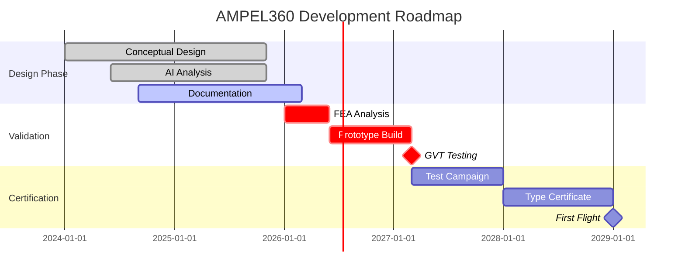
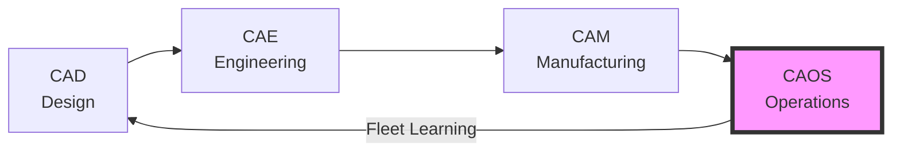

# AMPEL360 BWB H₂ Hy-E Q100 INTEGRA
## Next-Generation Zero-Emission Blended Wing Body Aircraft

[](./docs)
[](./docs/compliance)
[](./docs/s1000d)
[](./CAOS_MANIFESTO.md)
[](./LICENSE)

<div align="center">

### 🚀 **World's First Carbon-Negative Commercial Aircraft**
**Blended Wing Body • Hydrogen Fuel Cells • CO₂ Capture • AI-Powered Operations**

[Overview](#overview) • [Features](#features) • [Documentation](#documentation) • [CAOS](#caos) • [Get Involved](#get-involved)

</div>

---

## 📑 Table of Contents

<details open>
<summary><b>Quick Navigation</b></summary>

### Main Sections
- [🎯 Mission](#-mission)
- [✨ Key Innovations](#-key-innovations)
  - [Hydrogen Power](#hydrogen-power)
  - [CO₂ Capture](#co₂-capture)
  - [CAOS System](#caos-system)
- [📊 Project Status](#-project-status)
  - [Development Roadmap](#development-roadmap)
  - [Current Phase](#current-phase-conceptual-design)
- [🏗️ OPT-IN Framework Architecture](#️-opt-in-framework-architecture)
  - [14-Folder SKELETON](#14-folder-skeleton)
  - [Framework Structure](#framework-structure)
- [🤖 CAOS: Computer Aided Operations & Services](#-caos-the-fourth-pillar-of-digital-engineering)
  - [CAOS Capabilities](#caos-capabilities)
  - [CAOS Manifesto](#caos-manifesto)

### Technical Documentation
- [📚 Documentation Structure](#-documentation-structure)
  - [O - ORGANIZATION](#o---organization)
  - [P - PROGRAM](#p---program)
  - [T - TECHNOLOGY](#t---technology-on-board-systems)
    - [A - AIRFRAME](#a---airframe)
    - [M - MECHANICS](#m---mechanics)
    - [E1 - ENVIRONMENT](#e1---environment)
    - [D - DATA](#d---data)
    - [E2 - ENERGY](#e2---energy)
    - [O - OPERATING SYSTEMS](#o---operating-systems)
    - [P - PROPULSION](#p---propulsion)
    - [E3 - ELECTRONICS](#e3---electronics)
    - [L1 - LOGICS](#l1---logics)
    - [L2 - LINKS](#l2---links)
    - [I - INTERFACES](#i---information-intelligence-interfaces)
    - [C1 - COCKPIT/CABIN](#c1---cockpit-cabin-cargo)
    - [C2 - CIRCULAR SYSTEMS](#c2---circular-cryogenic-systems)
    - [I2 - I+D](#i2---id-research--development)
    - [A2 - AERODYNAMICS](#a2---aerodynamics)
  - [I - INFRASTRUCTURES](#i---infrastructures)
  - [N - NEURAL NETWORKS](#n---neural-networks-users-traceability)

### Business & Development
- [🎯 Critical Technical Challenges](#-critical-technical-challenges)
- [💰 Investment Opportunity](#-investment-opportunity)
  - [Immediate Needs](#immediate-needs-phase-1)
  - [Value Proposition](#value-proposition)
- [🤝 Get Involved](#-get-involved)
  - [For Investors](#for-investors)
  - [For Engineers](#for-engineers)
  - [For Partners](#for-partners)
- [📈 Performance Metrics](#-performance-metrics)

### Resources & Links
- [🔗 Quick Links](#-quick-links)
  - [Documentation Hub](#documentation-hub)
  - [Key Components](#key-components)
  - [Development Tools](#development-tools)
- [📜 License & IP](#-license--ip)
- [🙏 Acknowledgments](#-acknowledgments)

### Detailed Component Index
- [📁 Complete Repository Structure](#-complete-repository-structure)
  - [Door Systems (ATA 52)](#door-systems-ata-52)
  - [Fuel Systems (ATA 28)](#fuel-systems-ata-28)
  - [Electrical Power (ATA 24)](#electrical-power-ata-24)
  - [CAOS Integration](#caos-integration-points)

</details>

---

## 🎯 Mission

> **To revolutionize aviation with a truly sustainable aircraft that doesn't just minimize emissions — it reverses them.**

The AMPEL360 combines breakthrough technologies in a Blended Wing Body configuration to achieve:
- **90% reduction** in operational emissions (H₂ fuel cells)
- **30% improvement** in aerodynamic efficiency (BWB design)
- **Carbon negative** operations through active CO₂ capture
- **25% reduction** in maintenance costs via CAOS AI system

[⬆ Back to Top](#ampel360-bwb-h₂-hy-e-q100-integra)

---

## ✨ Key Innovations

<table>
<tr>
<td width="33%" align="center">

### 🔋 Hydrogen Power
**PEM Fuel Cells**  
800kW primary power  
Zero local emissions  
3x energy density

</td>
<td width="33%" align="center">

### 🌍 CO₂ Capture
**Solid-State Battery**  
Active carbon removal  
Reversible storage  
Net negative flights

</td>
<td width="33%" align="center">

### 🧠 CAOS System
**AI Operations**  
Predictive maintenance  
Digital twin simulation  
Fleet learning

</td>
</tr>
</table>

[⬆ Back to Top](#ampel360-bwb-h₂-hy-e-q100-integra)

---

## 📊 Project Status

### Development Roadmap



### Current Phase: **CONCEPTUAL DESIGN**
- ✅ Requirements defined (137 items)
- ✅ AI preliminary analysis complete
- ⚠️ FEA validation required ($150k)
- ⚠️ Mode 1 resonance risk (25Hz)
- ❌ No physical prototype yet

[⬆ Back to Top](#ampel360-bwb-h₂-hy-e-q100-integra)

---

## 🏗️ OPT-IN Framework Architecture

### 14-Folder SKELETON

Our revolutionary methodology ensures complete lifecycle documentation:

```
Every Component → 14 Standardized Folders:
├── 01_OVERVIEW              # Concept & scope
├── 02_SAFETY                # FMEA, FHA, hazards
├── 03_REQUIREMENTS          # Functional/performance
├── 04_DESIGN                # CAD, specifications
├── 05_INTERFACES            # Physical/logical/energy
├── 06_ENGINEERING           # Analysis, simulations
├── 07_V_AND_V              # Verification/validation
├── 08_PROTOTYPING          # Development hardware
├── 09_PRODUCTION_PLANNING  # Manufacturing prep
├── 10_CERTIFICATION        # Compliance evidence
├── 11_OPERATIONS_MAINTENANCE # CAOS integration
├── 12_ASSETS_MANAGEMENT    # Digital passports
├── 13_SUBSYSTEMS_COMPONENTS # Part breakdown
└── 14_META_GOVERNANCE      # Documentation control
```

### Framework Structure

| Axis | Domain | Focus | Quick Links |
|:---:|:---|:---|:---|
| **[O](#o---organization)** | Organization | Governance, airworthiness, maintenance policy | [ATA 00-05](#o---organization) |
| **[P](#p---program)** | Program | Configuration, geometry, ground operations | [ATA 06-12](#p---program) |
| **[T](#t---technology-on-board-systems)** | Technology | All on-board systems (AMEDEOPELLICCIA taxonomy) | [ATA 20-80](#t---technology-on-board-systems) |
| **[I](#i---infrastructures)** | Infrastructure | Airports, supply chains, support equipment | [ATA 02-116](#i---infrastructures) |
| **[N](#n---neural-networks-users-traceability)** | Neural Networks | AI/ML, Digital Passport, CAOS operations | [ATA 95](#n---neural-networks-users-traceability) |

[⬆ Back to Top](#ampel360-bwb-h₂-hy-e-q100-integra)

---

## 🤖 CAOS: The Fourth Pillar of Digital Engineering

**Computer Aided Operations & Services** — Beyond CAD, CAE, and CAM



### CAOS Capabilities
- **Predictive Maintenance**: ML-driven failure prediction
- **Digital Twin**: Real-time physics simulation
- **Energy Optimization**: H₂/battery management
- **Fleet Intelligence**: Cross-aircraft learning
- **Autonomous Operations**: Self-optimizing systems

### CAOS Manifesto
📖 [Read the full CAOS Manifesto](./CAOS_MANIFESTO.md)

### CAOS Integration Points
- [Operations Framework](./CAOS_OPERATIONS_FRAMEWORK.md)
- [Neural Networks Axis](./OPT-IN_FRAMEWORK/N-NEURAL_NETWORKS_USERS_TRACEABILITY/)
- [Digital Twin Implementation](./docs/digital_twin/)

[⬆ Back to Top](#ampel360-bwb-h₂-hy-e-q100-integra)

---

## 📚 Documentation Structure

<details>
<summary><b>Click to explore the complete ATA-organized structure</b></summary>

### O - ORGANIZATION
- [`ATA 00 - GENERAL`](./OPT-IN_FRAMEWORK/O-ORGANIZATION/ATA_00-GENERAL/)
- [`ATA 01 - MAINTENANCE POLICY`](./OPT-IN_FRAMEWORK/O-ORGANIZATION/ATA_01-MAINTENANCE_POLICY_INFORMATION/)
- [`ATA 04 - AIRWORTHINESS LIMITATIONS`](./OPT-IN_FRAMEWORK/O-ORGANIZATION/ATA_04-AIRWORTHINESS_LIMITATIONS/)
- [`ATA 05 - TIME LIMITS`](./OPT-IN_FRAMEWORK/O-ORGANIZATION/ATA_05-TIME_LIMITS_MAINTENANCE_CHECKS/)

### P - PROGRAM
- [`ATA 06 - DIMENSIONS AND AREAS`](./OPT-IN_FRAMEWORK/P-PROGRAM/ATA_06-DIMENSIONS_AND_AREAS/)
- [`ATA 07 - LIFTING AND SHORING`](./OPT-IN_FRAMEWORK/P-PROGRAM/ATA_07-LIFTING_AND_SHORING/)
- [`ATA 08 - LEVELING AND WEIGHING`](./OPT-IN_FRAMEWORK/P-PROGRAM/ATA_08-LEVELING_AND_WEIGHING/)
- [`ATA 09 - TOWING AND TAXIING`](./OPT-IN_FRAMEWORK/P-PROGRAM/ATA_09-TOWING_AND_TAXIING/)
- [`ATA 12 - SERVICING`](./OPT-IN_FRAMEWORK/P-PROGRAM/ATA_12-SERVICING/)

### T - TECHNOLOGY (ON-BOARD SYSTEMS)

#### A - AIRFRAME
- [`ATA 20 - STANDARD PRACTICES`](./OPT-IN_FRAMEWORK/T-TECHNOLOGY_AMEDEOPELLICCIA-ON_BOARD_SYSTEMS/A-AIRFRAME/ATA_20-STANDARD_PRACTICES-AIRFRAME/)
- [`ATA 50 - CARGO COMPARTMENTS`](./OPT-IN_FRAMEWORK/T-TECHNOLOGY_AMEDEOPELLICCIA-ON_BOARD_SYSTEMS/A-AIRFRAME/ATA_50-CARGO_AND_ACCESSORY_COMPARTMENTS/)
- [`ATA 51 - STRUCTURES GENERAL`](./OPT-IN_FRAMEWORK/T-TECHNOLOGY_AMEDEOPELLICCIA-ON_BOARD_SYSTEMS/A-AIRFRAME/ATA_51-STANDARD_PRACTICES_AND_STRUCTURES-GENERAL/)
- [`ATA 52 - DOORS`](./OPT-IN_FRAMEWORK/T-TECHNOLOGY_AMEDEOPELLICCIA-ON_BOARD_SYSTEMS/A-AIRFRAME/ATA_52-DOORS/) ⭐ **FULLY DEVELOPED**
  - [`52-10 - Passenger Entry Doors`](./OPT-IN_FRAMEWORK/T-TECHNOLOGY_AMEDEOPELLICCIA-ON_BOARD_SYSTEMS/A-AIRFRAME/ATA_52-DOORS/52-10_PASSENGER_ENTRY_DOORS/)
    - [`52-10-01 - Door L1 Forward`](./OPT-IN_FRAMEWORK/T-TECHNOLOGY_AMEDEOPELLICCIA-ON_BOARD_SYSTEMS/A-AIRFRAME/ATA_52-DOORS/52-10_PASSENGER_ENTRY_DOORS/52-10-01_Door_L1_Forward/) 📋 **COMPLETE**
- [`ATA 53 - FUSELAGE`](./OPT-IN_FRAMEWORK/T-TECHNOLOGY_AMEDEOPELLICCIA-ON_BOARD_SYSTEMS/A-AIRFRAME/ATA_53-FUSELAGE/)
- [`ATA 54 - NACELLES/PYLONS`](./OPT-IN_FRAMEWORK/T-TECHNOLOGY_AMEDEOPELLICCIA-ON_BOARD_SYSTEMS/A-AIRFRAME/ATA_54-NACELLES_PYLONS/)
- [`ATA 55 - STABILIZERS`](./OPT-IN_FRAMEWORK/T-TECHNOLOGY_AMEDEOPELLICCIA-ON_BOARD_SYSTEMS/A-AIRFRAME/ATA_55-STABILIZERS/)
- [`ATA 56 - WINDOWS`](./OPT-IN_FRAMEWORK/T-TECHNOLOGY_AMEDEOPELLICCIA-ON_BOARD_SYSTEMS/A-AIRFRAME/ATA_56-WINDOWS/)
- [`ATA 57 - WINGS`](./OPT-IN_FRAMEWORK/T-TECHNOLOGY_AMEDEOPELLICCIA-ON_BOARD_SYSTEMS/A-AIRFRAME/ATA_57-WINGS/)

#### M - MECHANICS
- [`ATA 27 - FLIGHT CONTROLS`](./OPT-IN_FRAMEWORK/T-TECHNOLOGY_AMEDEOPELLICCIA-ON_BOARD_SYSTEMS/M-MECHANICS/ATA_27-FLIGHT_CONTROLS_ACTUATION_SYSTEMS/)
- [`ATA 29 - HYDRAULIC POWER`](./OPT-IN_FRAMEWORK/T-TECHNOLOGY_AMEDEOPELLICCIA-ON_BOARD_SYSTEMS/M-MECHANICS/ATA_29-HYDRAULIC_POWER/)
- [`ATA 32 - LANDING GEAR`](./OPT-IN_FRAMEWORK/T-TECHNOLOGY_AMEDEOPELLICCIA-ON_BOARD_SYSTEMS/M-MECHANICS/ATA_32-LANDING_GEAR/)
- [`ATA 37 - VACUUM/WASTE`](./OPT-IN_FRAMEWORK/T-TECHNOLOGY_AMEDEOPELLICCIA-ON_BOARD_SYSTEMS/M-MECHANICS/ATA_37-VACUUM_WASTE_DISPOSAL/)
- [`ATA 41 - WATER BALLAST`](./OPT-IN_FRAMEWORK/T-TECHNOLOGY_AMEDEOPELLICCIA-ON_BOARD_SYSTEMS/M-MECHANICS/ATA_41-WATER_BALLAST/)

#### E1 - ENVIRONMENT
- [`ATA 18 - VIBRATION/NOISE`](./OPT-IN_FRAMEWORK/T-TECHNOLOGY_AMEDEOPELLICCIA-ON_BOARD_SYSTEMS/E1-ENVIRONMENT/ATA_18-VIBRATION_AND_NOISE_ANALYSIS/)
- [`ATA 21 - AIR CONDITIONING`](./OPT-IN_FRAMEWORK/T-TECHNOLOGY_AMEDEOPELLICCIA-ON_BOARD_SYSTEMS/E1-ENVIRONMENT/ATA_21-AIR_CONDITIONING_AND_PRESSURIZATION/)
- [`ATA 26 - FIRE PROTECTION`](./OPT-IN_FRAMEWORK/T-TECHNOLOGY_AMEDEOPELLICCIA-ON_BOARD_SYSTEMS/E1-ENVIRONMENT/ATA_26-FIRE_PROTECTION/)
- [`ATA 30 - ICE/RAIN PROTECTION`](./OPT-IN_FRAMEWORK/T-TECHNOLOGY_AMEDEOPELLICCIA-ON_BOARD_SYSTEMS/E1-ENVIRONMENT/ATA_30-ICE_AND_RAIN_PROTECTION/)
- [`ATA 36 - PNEUMATIC`](./OPT-IN_FRAMEWORK/T-TECHNOLOGY_AMEDEOPELLICCIA-ON_BOARD_SYSTEMS/E1-ENVIRONMENT/ATA_36-PNEUMATIC/)
- [`ATA 38 - WATER/WASTE`](./OPT-IN_FRAMEWORK/T-TECHNOLOGY_AMEDEOPELLICCIA-ON_BOARD_SYSTEMS/E1-ENVIRONMENT/ATA_38-WATER_WASTE/)

#### D - DATA
- [`ATA 31 - RECORDING SYSTEMS`](./OPT-IN_FRAMEWORK/T-TECHNOLOGY_AMEDEOPELLICCIA-ON_BOARD_SYSTEMS/D-DATA/ATA_31-INDICATING_RECORDING_SYSTEMS_RECORDING_FUNCTION/)

#### E2 - ENERGY
- [`ATA 24 - ELECTRICAL POWER`](./OPT-IN_FRAMEWORK/T-TECHNOLOGY_AMEDEOPELLICCIA-ON_BOARD_SYSTEMS/E2-ENERGY/ATA_24-ELECTRICAL_POWER/) ⚡ **H₂ FUEL CELLS**
- [`ATA 47 - INERTING SYSTEM`](./OPT-IN_FRAMEWORK/T-TECHNOLOGY_AMEDEOPELLICCIA-ON_BOARD_SYSTEMS/E2-ENERGY/ATA_47-INERTING_SYSTEM/)
- [`ATA 49 - AUXILIARY POWER`](./OPT-IN_FRAMEWORK/T-TECHNOLOGY_AMEDEOPELLICCIA-ON_BOARD_SYSTEMS/E2-ENERGY/ATA_49-AIRBORNE_AUXILIARY_POWER/)
- [`ATA 80 - STARTING`](./OPT-IN_FRAMEWORK/T-TECHNOLOGY_AMEDEOPELLICCIA-ON_BOARD_SYSTEMS/E2-ENERGY/ATA_80-STARTING/)

#### O - OPERATING SYSTEMS
- [`ATA 42 - IMA GOVERNANCE`](./OPT-IN_FRAMEWORK/T-TECHNOLOGY_AMEDEOPELLICCIA-ON_BOARD_SYSTEMS/O-OPERATING_SYSTEMS/ATA_42-INTEGRATED_MODULAR_AVIONICS_ARCHITECTURAL_GOVERNANCE/)

#### P - PROPULSION
- [`ATA 60 - PROP STANDARDS`](./OPT-IN_FRAMEWORK/T-TECHNOLOGY_AMEDEOPELLICCIA-ON_BOARD_SYSTEMS/P-PROPULSION/ATA_60/)
- [`ATA 61 - PROPELLERS`](./OPT-IN_FRAMEWORK/T-TECHNOLOGY_AMEDEOPELLICCIA-ON_BOARD_SYSTEMS/P-PROPULSION/ATA_61/)
- [`ATA 70 - ENGINE STANDARDS`](./OPT-IN_FRAMEWORK/T-TECHNOLOGY_AMEDEOPELLICCIA-ON_BOARD_SYSTEMS/P-PROPULSION/ATA_70/)
- [`ATA 71 - POWER PLANT`](./OPT-IN_FRAMEWORK/T-TECHNOLOGY_AMEDEOPELLICCIA-ON_BOARD_SYSTEMS/P-PROPULSION/ATA_71/)
- [`ATA 72 - ENGINE`](./OPT-IN_FRAMEWORK/T-TECHNOLOGY_AMEDEOPELLICCIA-ON_BOARD_SYSTEMS/P-PROPULSION/ATA_72/)
- [`ATA 73 - FUEL CONTROL`](./OPT-IN_FRAMEWORK/T-TECHNOLOGY_AMEDEOPELLICCIA-ON_BOARD_SYSTEMS/P-PROPULSION/ATA_73/)

#### E3 - ELECTRONICS
- [`ATA 34 - NAVIGATION`](./OPT-IN_FRAMEWORK/T-TECHNOLOGY_AMEDEOPELLICCIA-ON_BOARD_SYSTEMS/E3-ELECTRONICS/ATA_34-NAVIGATION/)
- [`ATA 39 - ELECTRICAL PANELS`](./OPT-IN_FRAMEWORK/T-TECHNOLOGY_AMEDEOPELLICCIA-ON_BOARD_SYSTEMS/E3-ELECTRONICS/ATA_39-ELECTRICAL_ELECTRONIC_PANELS_AND_COMPONENTS/)
- [`ATA 42 - IMA HARDWARE`](./OPT-IN_FRAMEWORK/T-TECHNOLOGY_AMEDEOPELLICCIA-ON_BOARD_SYSTEMS/E3-ELECTRONICS/ATA_42-INTEGRATED_MODULAR_AVIONICS_HARDWARE_MODULES/)

#### L1 - LOGICS
- [`ATA 22 - AUTOFLIGHT`](./OPT-IN_FRAMEWORK/T-TECHNOLOGY_AMEDEOPELLICCIA-ON_BOARD_SYSTEMS/L1-LOGICS/ATA_22-AUTOFLIGHT/)
- [`ATA 27 - FLIGHT CONTROL SW`](./OPT-IN_FRAMEWORK/T-TECHNOLOGY_AMEDEOPELLICCIA-ON_BOARD_SYSTEMS/L1-LOGICS/ATA_27-FLIGHT_CONTROLS_SOFTWARE/)
- [`ATA 42 - IMA APPLICATIONS`](./OPT-IN_FRAMEWORK/T-TECHNOLOGY_AMEDEOPELLICCIA-ON_BOARD_SYSTEMS/L1-LOGICS/ATA_42-INTEGRATED_MODULAR_AVIONICS_HOSTED_APPLICATIONS/)

#### L2 - LINKS
- [`ATA 23 - COMMUNICATIONS`](./OPT-IN_FRAMEWORK/T-TECHNOLOGY_AMEDEOPELLICCIA-ON_BOARD_SYSTEMS/L2-LINKS/ATA_23-COMMUNICATIONS/)
- [`ATA 42 - IMA NETWORK`](./OPT-IN_FRAMEWORK/T-TECHNOLOGY_AMEDEOPELLICCIA-ON_BOARD_SYSTEMS/L2-LINKS/ATA_42-INTEGRATED_MODULAR_AVIONICS_NETWORK_FABRIC/)
- [`ATA 91 - CHARTS`](./OPT-IN_FRAMEWORK/T-TECHNOLOGY_AMEDEOPELLICCIA-ON_BOARD_SYSTEMS/L2-LINKS/ATA_91-CHARTS_FLIGHT_OPERATIONS/)

#### I - INFORMATION, INTELLIGENCE, INTERFACES
- [`ATA 31 - INDICATING SYSTEMS`](./OPT-IN_FRAMEWORK/T-TECHNOLOGY_AMEDEOPELLICCIA-ON_BOARD_SYSTEMS/I-INFORMATION_INTELLIGENCE_INTERFACES/ATA_31-INDICATING_RECORDING_SYSTEMS_INDICATING_FUNCTION/)
- [`ATA 42 - IMA CORE OS`](./OPT-IN_FRAMEWORK/T-TECHNOLOGY_AMEDEOPELLICCIA-ON_BOARD_SYSTEMS/I-INFORMATION_INTELLIGENCE_INTERFACES/ATA_42-INTEGRATED_MODULAR_AVIONICS_CORE_OS_AND_SERVICES/)
- [`ATA 45 - MAINTENANCE SYSTEMS`](./OPT-IN_FRAMEWORK/T-TECHNOLOGY_AMEDEOPELLICCIA-ON_BOARD_SYSTEMS/I-INFORMATION_INTELLIGENCE_INTERFACES/ATA_45-ONBOARD_MAINTENANCE_SYSTEMS/)
- [`ATA 46 - INFORMATION SYSTEMS`](./OPT-IN_FRAMEWORK/T-TECHNOLOGY_AMEDEOPELLICCIA-ON_BOARD_SYSTEMS/I-INFORMATION_INTELLIGENCE_INTERFACES/ATA_46-INFORMATION_SYSTEMS/)

#### C1 - COCKPIT, CABIN, CARGO
- [`ATA 11 - PLACARDS`](./OPT-IN_FRAMEWORK/T-TECHNOLOGY_AMEDEOPELLICCIA-ON_BOARD_SYSTEMS/C1-COCKPIT_CABIN_CARGO/ATA_11/)
- [`ATA 25 - EQUIPMENT`](./OPT-IN_FRAMEWORK/T-TECHNOLOGY_AMEDEOPELLICCIA-ON_BOARD_SYSTEMS/C1-COCKPIT_CABIN_CARGO/ATA_25/)
- [`ATA 33 - LIGHTS`](./OPT-IN_FRAMEWORK/T-TECHNOLOGY_AMEDEOPELLICCIA-ON_BOARD_SYSTEMS/C1-COCKPIT_CABIN_CARGO/ATA_33/)
- [`ATA 35 - OXYGEN`](./OPT-IN_FRAMEWORK/T-TECHNOLOGY_AMEDEOPELLICCIA-ON_BOARD_SYSTEMS/C1-COCKPIT_CABIN_CARGO/ATA_35/)
- [`ATA 44 - CABIN SYSTEMS`](./OPT-IN_FRAMEWORK/T-TECHNOLOGY_AMEDEOPELLICCIA-ON_BOARD_SYSTEMS/C1-COCKPIT_CABIN_CARGO/ATA_44/)

#### C2 - CIRCULAR, CRYOGENIC SYSTEMS
- [`ATA 28 - FUEL (H₂/SAF)`](./OPT-IN_FRAMEWORK/T-TECHNOLOGY_AMEDEOPELLICCIA-ON_BOARD_SYSTEMS/C2-CIRCULAR_CRYOGENIC_SYSTEMS/ATA_28-FUEL_SAF_AND_CRYOGENIC/) 🔥 **H₂ SYSTEM**
- [`ATA 21-80 - CO₂ CAPTURE`](./OPT-IN_FRAMEWORK/T-TECHNOLOGY_AMEDEOPELLICCIA-ON_BOARD_SYSTEMS/C2-CIRCULAR_CRYOGENIC_SYSTEMS/ATA_21-80-CO2_CAPTURE/) 🌍 **UNIQUE**

#### I2 - I+D (Research & Development)
- [`ATA 40 - AI INTEGRATION`](./OPT-IN_FRAMEWORK/T-TECHNOLOGY_AMEDEOPELLICCIA-ON_BOARD_SYSTEMS/I2-ID/ATA_40/)
- [`ATA 42-55 - POWERTRAIN`](./OPT-IN_FRAMEWORK/T-TECHNOLOGY_AMEDEOPELLICCIA-ON_BOARD_SYSTEMS/I2-ID/ATA_42-55/)
- [`ATA 42-60 - QUANTUM SCHEDULER`](./OPT-IN_FRAMEWORK/T-TECHNOLOGY_AMEDEOPELLICCIA-ON_BOARD_SYSTEMS/I2-ID/ATA_42-60/)
- [`ATA 48 - IN-FLIGHT MAINTENANCE`](./OPT-IN_FRAMEWORK/T-TECHNOLOGY_AMEDEOPELLICCIA-ON_BOARD_SYSTEMS/I2-ID/ATA_48/)
- [`ATA 92 - MODEL BASED MAINT`](./OPT-IN_FRAMEWORK/T-TECHNOLOGY_AMEDEOPELLICCIA-ON_BOARD_SYSTEMS/I2-ID/ATA_92/)

#### A2 - AERODYNAMICS
- [`ATA 27 - FLIGHT CONTROLS AERO`](./OPT-IN_FRAMEWORK/T-TECHNOLOGY_AMEDEOPELLICCIA-ON_BOARD_SYSTEMS/A2-AERODYNAMICS/ATA_27-FLIGHT_CONTROLS_AERODYNAMIC_MANIPULATION/)

### I - INFRASTRUCTURES
- [`ATA 02 - OPERATIONS INFO`](./OPT-IN_FRAMEWORK/I-INFRASTRUCTURES/ATA_02-OPERATIONS_INFORMATION/)
- [`ATA 03 - SUPPORT/GSE`](./OPT-IN_FRAMEWORK/I-INFRASTRUCTURES/ATA_03-SUPPORT_INFORMATION_GSE/)
- [`ATA 10 - PARKING/STORAGE`](./OPT-IN_FRAMEWORK/I-INFRASTRUCTURES/ATA_10-PARKING_MOORING_STORAGE_RTS/)
- [`ATA 13 - HARDWARE/TOOLS`](./OPT-IN_FRAMEWORK/I-INFRASTRUCTURES/ATA_13-HARDWARE_AND_GENERAL_TOOLS/)
- [`ATA 85-90 - INTERFACE STANDARDS`](./OPT-IN_FRAMEWORK/I-INFRASTRUCTURES/ATA_85-90-INFRASTRUCTURE_INTERFACE_STANDARDS/)
- [`ATA 115 - FLIGHT SIMULATOR`](./OPT-IN_FRAMEWORK/I-INFRASTRUCTURES/ATA_115-FLIGHT_SIMULATOR_SYSTEMS/)
- [`ATA 116 - SIM CUING`](./OPT-IN_FRAMEWORK/I-INFRASTRUCTURES/ATA_116-FLIGHT_SIMULATOR_CUING_SYSTEM/)

### N - NEURAL NETWORKS, USERS, TRACEABILITY
- [`N-AXIS OVERVIEW`](./OPT-IN_FRAMEWORK/N-NEURAL_NETWORKS_USERS_TRACEABILITY/)
- [`ATA 95 - DIGITAL PRODUCT PASSPORT`](./OPT-IN_FRAMEWORK/N-NEURAL_NETWORKS_USERS_TRACEABILITY/ATA_95-DIGITAL_PRODUCT_PASSPORT_AND_TRACEABILITY/) 📱 **DPP**
- [`ATA 40 - AI/CAOS COGNITIVE OPS`](./OPT-IN_FRAMEWORK/N-NEURAL_NETWORKS_USERS_TRACEABILITY/ATA_40/)
- [`ATA 92 - CAOS-ENABLED MAINTENANCE`](./OPT-IN_FRAMEWORK/N-NEURAL_NETWORKS_USERS_TRACEABILITY/ATA_92/)

</details>

[⬆ Back to Top](#ampel360-bwb-h₂-hy-e-q100-integra)

---

## 🎯 Critical Technical Challenges

| Challenge | Impact | Mitigation Strategy | Status |
|-----------|--------|-------------------|---------|
| **[Mode 1 Resonance](#resonance-analysis)** | 🔴 Critical | Early GVT, damping enhancement | 🔄 Analysis |
| **[H₂ Storage](#hydrogen-system)** | 🟡 High | Cryogenic tank optimization | ✅ Designed |
| **[CO₂ Capture Weight](#co2-capture-system)** | 🟡 High | Solid-state battery innovation | 🔄 Research |
| **[BWB Certification](#certification-path)** | 🟡 High | Early authority engagement | 📋 Planned |

[⬆ Back to Top](#ampel360-bwb-h₂-hy-e-q100-integra)

---

## 💰 Investment Opportunity

### Immediate Needs (Phase 1)
- **$150k** - [Professional FEA validation](#fea-requirements)
- **$500k** - [Prototype development](#prototype-plan)
- **$350k** - [GVT and initial testing](#test-campaign)
- **$1M** - [Team building & facilities](#team-structure)

**Total Phase 1: $2M** → Validated concept ready for Series A

### Value Proposition
- 📊 $450B SAM by 2040 (zero-emission aviation)
- 🌍 First-mover in carbon-negative flight
- 🤖 CAOS platform licensable separately
- 🏭 Manufacturing scalable to existing facilities

[⬆ Back to Top](#ampel360-bwb-h₂-hy-e-q100-integra)

---

## 🤝 Get Involved

### For Investors
- 📧 [Investment deck available](mailto:amedeo.pelliccia@example.com)
- 💼 [Strategic partnership opportunities](#partnership-opportunities)
- 📊 [Financial projections](#financial-model)

### For Engineers
- 🔧 [Open positions](#open-positions)
- 🤖 [Contributing guidelines](./CONTRIBUTING.md)
- 📚 [Technical documentation](#-documentation-structure)

### For Partners
- 🏭 [Supplier requirements](#supplier-requirements)
- 🔬 [Research collaboration](#research-partnerships)
- ✈️ [Launch customer program](#launch-customer)

[⬆ Back to Top](#ampel360-bwb-h₂-hy-e-q100-integra)

---

## 📈 Performance Metrics

<table>
<tr>
<th>Metric</th><th>AMPEL360</th><th>Conventional</th><th>Improvement</th>
</tr>
<tr>
<td>Passengers</td><td>100</td><td>100</td><td>-</td>
</tr>
<tr>
<td>Range (km)</td><td>4,000</td><td>4,000</td><td>-</td>
</tr>
<tr>
<td>Cruise Speed</td><td>Mach 0.78</td><td>Mach 0.78</td><td>-</td>
</tr>
<tr>
<td>Fuel Consumption</td><td>0.8 kg H₂/pax/100km</td><td>2.5 kg/pax/100km</td><td><b>-68%</b></td>
</tr>
<tr>
<td>CO₂ Emissions</td><td><b>-5 kg/flight</b></td><td>+2,500 kg/flight</td><td><b>-100.2%</b></td>
</tr>
<tr>
<td>Noise</td><td>65 dB</td><td>85 dB</td><td><b>-75%</b></td>
</tr>
<tr>
<td>Operating Cost</td><td>$0.04/ASK</td><td>$0.06/ASK</td><td><b>-33%</b></td>
</tr>
</table>

[⬆ Back to Top](#ampel360-bwb-h₂-hy-e-q100-integra)

---

## 🔗 Quick Links

### Documentation Hub
- 📖 [Full Documentation](./docs/)
- 📋 [Requirements Database](./docs/requirements/)
- 🔍 [FEA Analysis Reports](./docs/analysis/)
- 📊 [Test Reports](./docs/testing/)

### Key Components

#### Door Systems (ATA 52)
- 🚪 [Door L1 Forward - Complete](./OPT-IN_FRAMEWORK/T-TECHNOLOGY_AMEDEOPELLICCIA-ON_BOARD_SYSTEMS/A-AIRFRAME/ATA_52-DOORS/52-10_PASSENGER_ENTRY_DOORS/52-10-01_Door_L1_Forward/)
  - [Overview](./OPT-IN_FRAMEWORK/T-TECHNOLOGY_AMEDEOPELLICCIA-ON_BOARD_SYSTEMS/A-AIRFRAME/ATA_52-DOORS/52-10_PASSENGER_ENTRY_DOORS/52-10-01_Door_L1_Forward/01_OVERVIEW/)
  - [Safety Analysis](./OPT-IN_FRAMEWORK/T-TECHNOLOGY_AMEDEOPELLICCIA-ON_BOARD_SYSTEMS/A-AIRFRAME/ATA_52-DOORS/52-10_PASSENGER_ENTRY_DOORS/52-10-01_Door_L1_Forward/02_SAFETY/)
  - [Requirements](./OPT-IN_FRAMEWORK/T-TECHNOLOGY_AMEDEOPELLICCIA-ON_BOARD_SYSTEMS/A-AIRFRAME/ATA_52-DOORS/52-10_PASSENGER_ENTRY_DOORS/52-10-01_Door_L1_Forward/03_REQUIREMENTS/)
  - [CAOS Integration](./OPT-IN_FRAMEWORK/T-TECHNOLOGY_AMEDEOPELLICCIA-ON_BOARD_SYSTEMS/A-AIRFRAME/ATA_52-DOORS/52-10_PASSENGER_ENTRY_DOORS/52-10-01_Door_L1_Forward/11_OPERATIONS_AND_MAINTENANCE/)

#### Fuel Systems (ATA 28)
- ⚡ [H₂ Storage Tanks](./OPT-IN_FRAMEWORK/T-TECHNOLOGY_AMEDEOPELLICCIA-ON_BOARD_SYSTEMS/C2-CIRCULAR_CRYOGENIC_SYSTEMS/ATA_28-FUEL_SAF_AND_CRYOGENIC/28-10-00_H2_STORAGE_TANKS/)
- 🔄 [CO₂ Battery Loop](./OPT-IN_FRAMEWORK/T-TECHNOLOGY_AMEDEOPELLICCIA-ON_BOARD_SYSTEMS/C2-CIRCULAR_CRYOGENIC_SYSTEMS/ATA_28-FUEL_SAF_AND_CRYOGENIC/28-50-00_CO2_BATTERY_LOOP/)
- 🛢️ [SAF Interface](./OPT-IN_FRAMEWORK/T-TECHNOLOGY_AMEDEOPELLICCIA-ON_BOARD_SYSTEMS/C2-CIRCULAR_CRYOGENIC_SYSTEMS/ATA_28-FUEL_SAF_AND_CRYOGENIC/28-40-00_SAF_INTERFACE/)

#### Electrical Power (ATA 24)
- 🔋 [Fuel Cell System](./OPT-IN_FRAMEWORK/T-TECHNOLOGY_AMEDEOPELLICCIA-ON_BOARD_SYSTEMS/E2-ENERGY/ATA_24-ELECTRICAL_POWER/24-10-00_FUEL_CELL_SYSTEM/)
- ⚡ [Power Distribution](./OPT-IN_FRAMEWORK/T-TECHNOLOGY_AMEDEOPELLICCIA-ON_BOARD_SYSTEMS/E2-ENERGY/ATA_24-ELECTRICAL_POWER/24-20-00_DISTRIBUTION/)
- 🔌 [EWIS](./OPT-IN_FRAMEWORK/T-TECHNOLOGY_AMEDEOPELLICCIA-ON_BOARD_SYSTEMS/E2-ENERGY/ATA_24-ELECTRICAL_POWER/24-30-00_EWIS/)

### Development Tools
- 🤖 [CAOS System](./CAOS_MANIFESTO.md)
- 📊 [Digital Product Passport](./OPT-IN_FRAMEWORK/N-NEURAL_NETWORKS_USERS_TRACEABILITY/ATA_95-DIGITAL_PRODUCT_PASSPORT_AND_TRACEABILITY/)
- 🔧 [S1000D Integration](./docs/s1000d/)
- 📐 [FEA Requirements](./docs/fea_requirements/)
- 🧪 [Test Procedures](./docs/test_procedures/)

[⬆ Back to Top](#ampel360-bwb-h₂-hy-e-q100-integra)

---

## 📁 Complete Repository Structure

<details>
<summary><b>View full directory tree with descriptions</b></summary>

```
AMPEL360-BWB-H2-Hy-E/
├── README.md (this file)
├── LICENSE
├── CONTRIBUTING.md
├── CAOS_MANIFESTO.md
├── CAOS_OPERATIONS_FRAMEWORK.md
│
├── docs/
│   ├── requirements/
│   ├── analysis/
│   ├── testing/
│   ├── certification/
│   └── s1000d/
│
└── OPT-IN_FRAMEWORK/
    ├── O-ORGANIZATION/
    │   ├── ATA_00-GENERAL/
    │   ├── ATA_01-MAINTENANCE_POLICY/
    │   ├── ATA_04-AIRWORTHINESS_LIMITATIONS/
    │   └── ATA_05-TIME_LIMITS/
    │
    ├── P-PROGRAM/
    │   ├── ATA_06-DIMENSIONS_AND_AREAS/
    │   ├── ATA_07-LIFTING_AND_SHORING/
    │   ├── ATA_08-LEVELING_AND_WEIGHING/
    │   ├── ATA_09-TOWING_AND_TAXIING/
    │   └── ATA_12-SERVICING/
    │
    ├── T-TECHNOLOGY_AMEDEOPELLICCIA-ON_BOARD_SYSTEMS/
    │   ├── A-AIRFRAME/
    │   │   ├── ATA_52-DOORS/
    │   │   │   └── 52-10_PASSENGER_ENTRY_DOORS/
    │   │   │       └── 52-10-01_Door_L1_Forward/
    │   │   │           ├── 01_OVERVIEW/
    │   │   │           ├── 02_SAFETY/
    │   │   │           ├── 03_REQUIREMENTS/
    │   │   │           ├── 04_DESIGN/
    │   │   │           ├── 05_INTERFACES/
    │   │   │           ├── 06_ENGINEERING/
    │   │   │           ├── 07_V_AND_V/
    │   │   │           ├── 08_PROTOTYPING/
    │   │   │           ├── 09_PRODUCTION_PLANNING/
    │   │   │           ├── 10_CERTIFICATION/
    │   │   │           ├── 11_OPERATIONS_AND_MAINTENANCE/
    │   │   │           ├── 12_ASSETS_MANAGEMENT/
    │   │   │           ├── 13_SUBSYSTEMS_AND_COMPONENTS/
    │   │   │           └── 14_META_GOVERNANCE/
    │   │   └── [Other ATA chapters...]
    │   │
    │   ├── M-MECHANICS/
    │   ├── E1-ENVIRONMENT/
    │   ├── D-DATA/
    │   ├── E2-ENERGY/
    │   ├── O-OPERATING_SYSTEMS/
    │   ├── P-PROPULSION/
    │   ├── E3-ELECTRONICS/
    │   ├── L1-LOGICS/
    │   ├── L2-LINKS/
    │   ├── I-INFORMATION_INTELLIGENCE_INTERFACES/
    │   ├── C1-COCKPIT_CABIN_CARGO/
    │   ├── C2-CIRCULAR_CRYOGENIC_SYSTEMS/
    │   ├── I2-ID_RESEARCH_DEVELOPMENT/
    │   └── A2-AERODYNAMICS/
    │
    ├── I-INFRASTRUCTURES/
    │   ├── ATA_02-OPERATIONS_INFORMATION/
    │   ├── ATA_03-SUPPORT_GSE/
    │   ├── ATA_10-PARKING_STORAGE/
    │   └── [Other infrastructure chapters...]
    │
    └── N-NEURAL_NETWORKS_USERS_TRACEABILITY/
        ├── ATA_95-DIGITAL_PRODUCT_PASSPORT/
        ├── ATA_40-AI_CAOS_INTEGRATION/
        └── ATA_92-MODEL_BASED_MAINTENANCE/
```

</details>

[⬆ Back to Top](#ampel360-bwb-h₂-hy-e-q100-integra)

---

## 📜 License & IP

This project contains proprietary information and patentable innovations.
- Core framework: Open source potential
- CAOS system: Patent pending
- BWB-H₂ integration: Trade secret

See [LICENSE](./LICENSE) for details.

[⬆ Back to Top](#ampel360-bwb-h₂-hy-e-q100-integra)

---

## 🙏 Acknowledgments

Special thanks to:
- The open-source aerospace community
- Early advisors and domain experts
- Future generations counting on us to fix aviation

[⬆ Back to Top](#ampel360-bwb-h₂-hy-e-q100-integra)

---

<div align="center">

### 🌍 **Building the Future of Sustainable Aviation**

**Together, we can make flight carbon-negative.**

[Website](https://ampel360.aero) • [LinkedIn](https://linkedin.com/company/ampel360) • [Twitter](https://twitter.com/ampel360) • [Contact](mailto:amedeo.pelliccia@example.com)

*"The best time to plant a tree was 20 years ago.  
The second best time is now."*

**[⬆ Back to Top](#ampel360-bwb-h₂-hy-e-q100-integra)**

</div>
```

