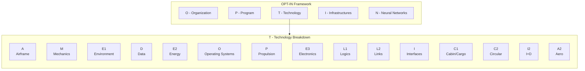

# AMPEL360-BWB-H₂-Hy-E  
**Hybrid Blended-Wing-Body Aircraft Concept**

---

## 1. Concept Description
Hybrid-electric **Blended-Wing-Body** (BWB) aircraft using:
- **Hydrogen PEM fuel-cells** as primary energy source.  
- **Open-fan distributed propulsion** for high propulsive efficiency.  
- **Closed-loop CO₂ battery** for reversible carbon buffering.  
- **SAF compatibility** for hybrid range extension.  
- **Digital twin and DPP integration** for lifecycle traceability.  
- **CAOS (Computer Aided Operations & Services)** for autonomous operations.  

Objective: aerodynamic efficiency, full-cycle sustainability, and certifiable hybrid-hydrogen operation enabled by AI-driven intelligent services.

---

## 2. OPT-IN Framework
| Letter | Domain | Scope |
|:---:|:-------------------|:----------------|
| **O** | **Organization** | Certification, governance, maintenance policy |
| **P** | **Program** | Geometry, mission, configuration management |
| **T** | **Technology** | On-board systems (A-M-E-D-E-O-P-E-L-I-C-C-I-A₂) |
| **I** | **Infrastructures** | Airports, supply chains, operations |
| **N** | **Neural Networks** | Traceability, AI, Digital Product Passport, CAOS |

Each component uses a **six-digit ATA code (XX-YY-ZZ)** and the **standard 14-folder skeleton**:
```

OVERVIEW/
SAFETY/
REQUIREMENTS/
DESIGN/
INTERFACES/
ENGINEERING/
V_AND_V/
PROTOTYPING/
PRODUCTION_PLANNING/
CERTIFICATION/
OPERATIONS_AND_MAINTENANCE/
ASSETS_MANAGEMENT/
SUBSYSTEMS_AND_COMPONENTS/
META_GOVERNANCE/

```
---

# OPT-IN Framework
### Amedeo Pelliccia's Development and Documentation Methodology for the AMPEL360 Program

**OPT-IN** is a structured, certifiable framework for the concurrent development and documentation of complex aerospace systems. It is the single source of truth for the AMPEL360 aircraft, ensuring traceability, audit-readiness, and lifecycle coherence from initial design through in-service operations.

---

## 1. Core Structure
The framework is organized into five principal axes, each decomposed into subdomains that mirror ATA chapter logic for regulatory alignment and industry interoperability.

| Axis | Domain | Scope & Core ATA Chapters |
|:---:|:---|:---|
| **O** | **Organization** | Governance, airworthiness, maintenance policies, and high-level program rules. |
| **P** | **Program** | Aircraft-level configuration, geometry, ground handling, and servicing specifications. |
| **T** | **Technology** | All on-board systems, organized by the `A-M-E-D-E-O-P-E-L-I-C-C-I-A₂` taxonomy. |
| **I** | **Infrastructures** | Ground support, airport interfaces, supply chains, and flight simulators. |
| **N** | **Neural Networks**| Data lineage, traceability, AI/ML models for the Digital Product Passport, and **CAOS (Computer Aided Operations & Services)** for autonomous operations. |

### The 14-Folder Subsystem Skeleton
Every component and system indexed within the OPT-IN framework is developed and documented using a standard, 14-folder lifecycle skeleton. This ensures that every part of the aircraft follows the same rigorous path from concept to in-service management.

1.  `01_OVERVIEW`
2.  `02_SAFETY`
3.  `03_REQUIREMENTS`
4.  `04_DESIGN`
5.  `05_INTERFACES`
6.  `06_ENGINEERING` (Analysis, Models, Simulations)
7.  `07_V_AND_V` (Verification & Validation)
8.  `08_PROTOTYPING`
9.  `09_PRODUCTION_PLANNING`
10. `10_CERTIFICATION`
11. `11_OPERATIONS_AND_MAINTENANCE`
12. `12_ASSETS_MANAGEMENT` (Spares, Tooling, Logistics)
13. `13_SUBSYSTEMS_AND_COMPONENTS` (Recursive decomposition)
14. `14_META_GOVERNANCE` (Sidecars, Schemas, CI rules)

---

## 2. Methodological Principles
1.  **ATA-Anchored Documentation:** Every technical artifact is indexed by ATA chapter to ensure interoperability with iSpec 2200 and S1000D deliverables.
2.  **Cross-Referenced Traceability:** Logical, thermal, and energy interfaces are explicitly documented through secondary ATA references.
3.  **Provisional Subjects:** Emerging technologies live under provisional codes until validated by formal standards review.
4.  **Bidirectional Linking:** Development repositories and technical manuals share identifiers, ensuring commits and documentation remain synchronized.
5.  **Audit Readiness by Design:** Every artifact traces back to a requirement and classification entry, guaranteeing a continuous chain of certification evidence.

---

## 3. CAOS — The Fourth Pillar of Digital Engineering

**CAOS (Computer Aided Operations and Services)** completes the digital engineering lifecycle alongside CAD, CAE, and CAM. While traditional tools focus on design, validation, and manufacturing, CAOS digitizes **cognition and decision-making** in real-time operations.

### The Evolution: CAD → CAE → CAM → CAOS

| Pillar | Focus | Outcome |
|--------|-------|---------|
| **CAD** | Design (Geometry) | 3D models as authoritative product definition |
| **CAE** | Engineering (Physics) | Digital validation via FEA, CFD, multi-physics |
| **CAM** | Manufacturing (Production) | Direct link from digital to physical via CNC, robotics |
| **CAOS** | Operations (Cognition) | Autonomous optimization and lifecycle management |

### CAOS in AMPEL360

For the hybrid hydrogen aircraft, CAOS enables:

- **Predictive Maintenance:** AI-driven health monitoring and failure prediction
- **Energy Optimization:** Real-time fuel cell and battery management
- **Fleet Intelligence:** Federated learning across operational aircraft
- **Service Twins:** Operational simulation before decision deployment
- **PaaSI (Product-as-Intelligent-Service):** Guaranteed outcomes, not just hardware
- **Circular Economy:** Data-driven end-of-life and remanufacturing decisions

### Key Documents

- [**CAOS Manifesto**](./CAOS_MANIFESTO.md) — Strategic vision and principles
- [**CAOS Operations Framework**](./CAOS_OPERATIONS_FRAMEWORK.md) — Implementation architecture
- [**N-Axis: Neural Networks & CAOS**](./OPT-IN_FRAMEWORK/N-NEURAL_NETWORKS_USERS_TRACEABILITY/) — Integration with OPT-IN

---

## 4. Framework Overview



---

## 5. Master Directory Structure & Hyperlinked Index

### O - ORGANIZATION
-   [`ATA_00-GENERAL`](./OPT-IN_FRAMEWORK/O-ORGANIZATION/ATA_00-GENERAL/) — General information, aircraft identification, and administrative data
-   [`ATA_01-MAINTENANCE_POLICY_INFORMATION`](./OPT-IN_FRAMEWORK/O-ORGANIZATION/ATA_01-MAINTENANCE_POLICY_INFORMATION/) — Maintenance program policies, planning, and organizational requirements
-   [`ATA_04-AIRWORTHINESS_LIMITATIONS`](./OPT-IN_FRAMEWORK/O-ORGANIZATION/ATA_04-AIRWORTHINESS_LIMITATIONS/) — Mandatory operational limits and safe-life component restrictions
-   [`ATA_05-TIME_LIMITS_MAINTENANCE_CHECKS`](./OPT-IN_FRAMEWORK/O-ORGANIZATION/ATA_05-TIME_LIMITS_MAINTENANCE_CHECKS/) — Scheduled maintenance intervals and inspection requirements

### P - PROGRAM
-   [`ATA_06-DIMENSIONS_AND_AREAS`](./OPT-IN_FRAMEWORK/P-PROGRAM/ATA_06-DIMENSIONS_AND_AREAS/) — Aircraft physical dimensions, surfaces, and access areas
-   [`ATA_07-LIFTING_AND_SHORING`](./OPT-IN_FRAMEWORK/P-PROGRAM/ATA_07-LIFTING_AND_SHORING/) — Jacking, hoisting, and support procedures for maintenance
-   [`ATA_08-LEVELING_AND_WEIGHING`](./OPT-IN_FRAMEWORK/P-PROGRAM/ATA_08-LEVELING_AND_WEIGHING/) — Aircraft leveling procedures and weight & balance measurement
-   [`ATA_09-TOWING_AND_TAXIING`](./OPT-IN_FRAMEWORK/P-PROGRAM/ATA_09-TOWING_AND_TAXIING/) — Ground movement procedures and equipment requirements
-   [`ATA_12-SERVICING`](./OPT-IN_FRAMEWORK/P-PROGRAM/ATA_12-SERVICING/) — Routine servicing points for fluids, gases, and consumables

### T - TECHNOLOGY (ON-BOARD SYSTEMS)

#### A - AIRFRAME
-   [`ATA_20-STANDARD_PRACTICES-AIRFRAME`](./OPT-IN_FRAMEWORK/T-TECHNOLOGY_AMPEDEOPELLICCIA-ON_BOARD_SYSTEMS/A-AIRFRAME/ATA_20-STANDARD_PRACTICES-AIRFRAME/) — General airframe maintenance standards and repair procedures
-   [`ATA_50-CARGO_AND_ACCESSORY_COMPARTMENTS`](./OPT-IN_FRAMEWORK/T-TECHNOLOGY_AMPEDEOPELLICCIA-ON_BOARD_SYSTEMS/A-AIRFRAME/ATA_50-CARGO_AND_ACCESSORY_COMPARTMENTS/) — Cargo holds, loading systems, and accessory bays
-   [`ATA_51-STANDARD_PRACTICES_AND_STRUCTURES-GENERAL`](./OPT-IN_FRAMEWORK/T-TECHNOLOGY_AMPEDEOPELLICCIA-ON_BOARD_SYSTEMS/A-AIRFRAME/ATA_51-STANDARD_PRACTICES_AND_STRUCTURES-GENERAL/) — General structural inspection and repair practices
-   [`ATA_52-DOORS`](./OPT-IN_FRAMEWORK/T-TECHNOLOGY_AMPEDEOPELLICCIA-ON_BOARD_SYSTEMS/A-AIRFRAME/ATA_52-DOORS/) — Passenger, cargo, and service door systems
-   [`ATA_53-FUSELAGE`](./OPT-IN_FRAMEWORK/T-TECHNOLOGY_AMPEDEOPELLICCIA-ON_BOARD_SYSTEMS/A-AIRFRAME/ATA_53-FUSELAGE/) — Blended-wing-body primary structure and skin panels
-   [`ATA_54-NACELLES_PYLONS`](./OPT-IN_FRAMEWORK/T-TECHNOLOGY_AMPEDEOPELLICCIA-ON_BOARD_SYSTEMS/A-AIRFRAME/ATA_54-NACELLES_PYLONS/) — Propulsion system mounting structures and cowlings
-   [`ATA_55-STABILIZERS`](./OPT-IN_FRAMEWORK/T-TECHNOLOGY_AMPEDEOPELLICCIA-ON_BOARD_SYSTEMS/A-AIRFRAME/ATA_55-STABILIZERS/) — Horizontal and vertical stabilizer structures
-   [`ATA_56-WINDOWS`](./OPT-IN_FRAMEWORK/T-TECHNOLOGY_AMPEDEOPELLICCIA-ON_BOARD_SYSTEMS/A-AIRFRAME/ATA_56-WINDOWS/) — Cockpit, cabin, and inspection window systems
-   [`ATA_57-WINGS`](./OPT-IN_FRAMEWORK/T-TECHNOLOGY_AMPEDEOPELLICCIA-ON_BOARD_SYSTEMS/A-AIRFRAME/ATA_57-WINGS/) — Wing structure, spars, ribs, and aerodynamic surfaces

#### M - MECHANICS
-   [`ATA_27-FLIGHT_CONTROLS_ACTUATION_SYSTEMS`](./OPT-IN_FRAMEWORK/T-TECHNOLOGY_AMPEDEOPELLICCIA-ON_BOARD_SYSTEMS/M-MECHANICS/ATA_27-FLIGHT_CONTROLS_ACTUATION_SYSTEMS/) — Flight control actuation mechanisms and servo systems
-   [`ATA_29-HYDRAULIC_POWER`](./OPT-IN_FRAMEWORK/T-TECHNOLOGY_AMPEDEOPELLICCIA-ON_BOARD_SYSTEMS/M-MECHANICS/ATA_29-HYDRAULIC_POWER/) — Hydraulic generation, distribution, and reservoir systems
-   [`ATA_32-LANDING_GEAR`](./OPT-IN_FRAMEWORK/T-TECHNOLOGY_AMPEDEOPELLICCIA-ON_BOARD_SYSTEMS/M-MECHANICS/ATA_32-LANDING_GEAR/) — Main and nose landing gear, brakes, and steering
-   [`ATA_37-VACUUM_WASTE_DISPOSAL`](./OPT-IN_FRAMEWORK/T-TECHNOLOGY_AMPEDEOPELLICCIA-ON_BOARD_SYSTEMS/M-MECHANICS/ATA_37-VACUUM_WASTE_DISPOSAL/) — Vacuum toilet and waste management systems
-   [`ATA_41-WATER_BALLAST`](./OPT-IN_FRAMEWORK/T-TECHNOLOGY_AMPEDEOPELLICCIA-ON_BOARD_SYSTEMS/M-MECHANICS/ATA_41-WATER_BALLAST/) — Ballast water systems for weight and balance adjustment

#### E1 - ENVIRONMENT
-   [`ATA_18-VIBRATION_AND_NOISE_ANALYSIS`](./OPT-IN_FRAMEWORK/T-TECHNOLOGY_AMPEDEOPELLICCIA-ON_BOARD_SYSTEMS/E1-ENVIRONMENT/ATA_18-VIBRATION_AND_NOISE_ANALYSIS/) — Structural vibration monitoring, acoustic analysis, and noise certification _(Cross-ref: E2-ENERGY)_
-   [`ATA_21-AIR_CONDITIONING_AND_PRESSURIZATION`](./OPT-IN_FRAMEWORK/T-TECHNOLOGY_AMPEDEOPELLICCIA-ON_BOARD_SYSTEMS/E1-ENVIRONMENT/ATA_21-AIR_CONDITIONING_AND_PRESSURIZATION/) — Cabin pressurization, temperature control, and air distribution
-   [`ATA_26-FIRE_PROTECTION`](./OPT-IN_FRAMEWORK/T-TECHNOLOGY_AMPEDEOPELLICCIA-ON_BOARD_SYSTEMS/E1-ENVIRONMENT/ATA_26-FIRE_PROTECTION/) — Fire detection, suppression, and smoke detection systems
-   [`ATA_30-ICE_AND_RAIN_PROTECTION`](./OPT-IN_FRAMEWORK/T-TECHNOLOGY_AMPEDEOPELLICCIA-ON_BOARD_SYSTEMS/E1-ENVIRONMENT/ATA_30-ICE_AND_RAIN_PROTECTION/) — Anti-ice, de-ice, and windshield rain removal systems
-   [`ATA_36-PNEUMATIC`](./OPT-IN_FRAMEWORK/T-TECHNOLOGY_AMPEDEOPELLICCIA-ON_BOARD_SYSTEMS/E1-ENVIRONMENT/ATA_36-PNEUMATIC/) — Pneumatic power generation and distribution systems
-   [`ATA_38-WATER_WASTE`](./OPT-IN_FRAMEWORK/T-TECHNOLOGY_AMPEDEOPELLICCIA-ON_BOARD_SYSTEMS/E1-ENVIRONMENT/ATA_38-WATER_WASTE/) — Potable water supply and wastewater collection systems

#### D - DATA
-   [`ATA_31-INDICATING_RECORDING_SYSTEMS_RECORDING_FUNCTION`](./OPT-IN_FRAMEWORK/T-TECHNOLOGY_AMPEDEOPELLICCIA-ON_BOARD_SYSTEMS/D-DATA/ATA_31-INDICATING_RECORDING_SYSTEMS_RECORDING_FUNCTION/) — Flight data recorder, cockpit voice recorder, and data acquisition systems

#### E2 - ENERGY
-   _Cross-reference: [`ATA_18-VIBRATION_AND_NOISE_ANALYSIS`](./OPT-IN_FRAMEWORK/T-TECHNOLOGY_AMPEDEOPELLICCIA-ON_BOARD_SYSTEMS/E1-ENVIRONMENT/ATA_18-VIBRATION_AND_NOISE_ANALYSIS/) — Vibration monitoring and energy harvesting aspects_
-   [`ATA_24-ELECTRICAL_POWER`](./OPT-IN_FRAMEWORK/T-TECHNOLOGY_AMPEDEOPELLICCIA-ON_BOARD_SYSTEMS/E2-ENERGY/ATA_24-ELECTRICAL_POWER/) — Electrical generation, distribution, batteries, and power management
-   [`ATA_47-INERTING_SYSTEM`](./OPT-IN_FRAMEWORK/T-TECHNOLOGY_AMPEDEOPELLICCIA-ON_BOARD_SYSTEMS/E2-ENERGY/ATA_47-INERTING_SYSTEM/) — Fuel tank inerting and nitrogen generation systems
-   [`ATA_49-AIRBORNE_AUXILIARY_POWER`](./OPT-IN_FRAMEWORK/T-TECHNOLOGY_AMPEDEOPELLICCIA-ON_BOARD_SYSTEMS/E2-ENERGY/ATA_49-AIRBORNE_AUXILIARY_POWER/) — Auxiliary power unit (APU) systems for ground and emergency power
-   [`ATA_80-STARTING`](./OPT-IN_FRAMEWORK/T-TECHNOLOGY_AMPEDEOPELLICCIA-ON_BOARD_SYSTEMS/E2-ENERGY/ATA_80-STARTING/) — Engine and fuel cell starting systems

#### O - OPERATING SYSTEMS
-   [`ATA_42-INTEGRATED_MODULAR_AVIONICS_ARCHITECTURAL_GOVERNANCE`](./OPT-IN_FRAMEWORK/T-TECHNOLOGY_AMPEDEOPELLICCIA-ON_BOARD_SYSTEMS/O-OPERATING_SYSTEMS/ATA_42-INTEGRATED_MODULAR_AVIONICS_ARCHITECTURAL_GOVERNANCE/) — IMA platform architecture standards and governance framework

#### P - PROPULSION
-   `ATA 60 - STANDARD PRACTICES - PROP./ROTOR` — General propeller and rotor maintenance standards
-   `ATA 61 - PROPELLERS / PROPULSORS` — Propeller systems and open-fan distributed propulsion units
-   `ATA 70 - STANDARD PRACTICES - ENGINE` — General engine maintenance and repair standards
-   `ATA 71 - POWER PLANT` — Engine installation, mounts, and cowling
-   `ATA 72 - ENGINE` — Turbine or hybrid-electric propulsion core systems
-   `ATA 73 - ENGINE FUEL AND CONTROL` — Fuel delivery, metering, and control systems
-   `ATA 74 - IGNITION` — Engine ignition and starting systems
-   `ATA 75 - AIR` — Engine air intake, bleed, and cooling air systems
-   `ATA 76 - ENGINE CONTROLS` — Electronic engine control (EEC/FADEC) systems
-   `ATA 78 - EXHAUST` — Engine exhaust systems and thrust reversers
-   `ATA 79 - OIL` — Engine lubrication and oil cooling systems

#### E3 - ELECTRONICS
-   [`ATA_34-NAVIGATION`](./OPT-IN_FRAMEWORK/T-TECHNOLOGY_AMPEDEOPELLICCIA-ON_BOARD_SYSTEMS/E3-ELECTRONICS/ATA_34-NAVIGATION/) — Navigation sensors, GPS, IRS, and radio navigation aids
-   [`ATA_39-ELECTRICAL_ELECTRONIC_PANELS_AND_COMPONENTS`](./OPT-IN_FRAMEWORK/T-TECHNOLOGY_AMPEDEOPELLICCIA-ON_BOARD_SYSTEMS/E3-ELECTRONICS/ATA_39-ELECTRICAL_ELECTRONIC_PANELS_AND_COMPONENTS/) — Electronic equipment racks, panels, and mounting hardware
-   [`ATA_42-INTEGRATED_MODULAR_AVIONICS_HARDWARE_MODULES`](./OPT-IN_FRAMEWORK/T-TECHNOLOGY_AMPEDEOPELLICCIA-ON_BOARD_SYSTEMS/E3-ELECTRONICS/ATA_42-INTEGRATED_MODULAR_AVIONICS_HARDWARE_MODULES/) — IMA computing modules and processing hardware

#### L1 - LOGICS
-   [`ATA_22-AUTOFLIGHT`](./OPT-IN_FRAMEWORK/T-TECHNOLOGY_AMPEDEOPELLICCIA-ON_BOARD_SYSTEMS/L1-LOGICS/ATA_22-AUTOFLIGHT/) — Autopilot, flight director, and autothrottle control systems
-   [`ATA_27-FLIGHT_CONTROLS_SOFTWARE`](./OPT-IN_FRAMEWORK/T-TECHNOLOGY_AMPEDEOPELLICCIA-ON_BOARD_SYSTEMS/L1-LOGICS/ATA_27-FLIGHT_CONTROLS_SOFTWARE/) — Flight control law software and algorithms
-   [`ATA_42-INTEGRATED_MODULAR_AVIONICS_HOSTED_APPLICATIONS`](./OPT-IN_FRAMEWORK/T-TECHNOLOGY_AMPEDEOPELLICCIA-ON_BOARD_SYSTEMS/L1-LOGICS/ATA_42-INTEGRATED_MODULAR_AVIONICS_HOSTED_APPLICATIONS/) — IMA-hosted application software and virtual machines

#### L2 - LINKS
-   [`ATA_23-COMMUNICATIONS`](./OPT-IN_FRAMEWORK/T-TECHNOLOGY_AMPEDEOPELLICCIA-ON_BOARD_SYSTEMS/L2-LINKS/ATA_23-COMMUNICATIONS/) — VHF, HF, SATCOM, and data link communication systems
-   [`ATA_42-INTEGRATED_MODULAR_AVIONICS_NETWORK_FABRIC`](./OPT-IN_FRAMEWORK/T-TECHNOLOGY_AMPEDEOPELLICCIA-ON_BOARD_SYSTEMS/L2-LINKS/ATA_42-INTEGRATED_MODULAR_AVIONICS_NETWORK_FABRIC/) — AFDX/ARINC 664 network backbone and switches
-   [`ATA_91-CHARTS_FLIGHT_OPERATIONS`](./OPT-IN_FRAMEWORK/T-TECHNOLOGY_AMPEDEOPELLICCIA-ON_BOARD_SYSTEMS/L2-LINKS/ATA_91-CHARTS_FLIGHT_OPERATIONS/) — Electronic charts, navigation database management, and flight operations connectivity

#### I - INFORMATION, INTELLIGENCE, INTERFACES
-   [`ATA_31-INDICATING_RECORDING_SYSTEMS_INDICATING_FUNCTION`](./OPT-IN_FRAMEWORK/T-TECHNOLOGY_AMPEDEOPELLICCIA-ON_BOARD_SYSTEMS/I-INFORMATION_INTELLIGENCE_INTERFACES/ATA_31-INDICATING_RECORDING_SYSTEMS_INDICATING_FUNCTION/) — Cockpit displays, gauges, and crew alerting systems
-   [`ATA_42-INTEGRATED_MODULAR_AVIONICS_CORE_OS_AND_SERVICES`](./OPT-IN_FRAMEWORK/T-TECHNOLOGY_AMPEDEOPELLICCIA-ON_BOARD_SYSTEMS/I-INFORMATION_INTELLIGENCE_INTERFACES/ATA_42-INTEGRATED_MODULAR_AVIONICS_CORE_OS_AND_SERVICES/) — IMA operating system kernel and core middleware services
-   [`ATA_45-ONBOARD_MAINTENANCE_SYSTEMS`](./OPT-IN_FRAMEWORK/T-TECHNOLOGY_AMPEDEOPELLICCIA-ON_BOARD_SYSTEMS/I-INFORMATION_INTELLIGENCE_INTERFACES/ATA_45-ONBOARD_MAINTENANCE_SYSTEMS/) — Central maintenance computer and health monitoring systems
-   [`ATA_46-INFORMATION_SYSTEMS`](./OPT-IN_FRAMEWORK/T-TECHNOLOGY_AMPEDEOPELLICCIA-ON_BOARD_SYSTEMS/I-INFORMATION_INTELLIGENCE_INTERFACES/ATA_46-INFORMATION_SYSTEMS/) — Cabin management, passenger entertainment, and connectivity systems
-   `ATA 77 - ENGINE INDICATING` — Engine parameter displays and indicating systems
-   `ATA 93` (Reserved) - ONBOARD DATA LOAD — Software and database loading procedures

#### C1 - COCKPIT, CABIN, CARGO
-   `ATA 11 - PLACARDS AND MARKINGS` — Safety placards, instructional markings, and labeling
-   `ATA 15 - AIRCREW INFORMATION` — Flight manuals, procedures, and crew operating documentation
-   `ATA 16 - CHANGE OF ROLE` — Aircraft reconfiguration for cargo, passenger, or mixed operations
-   `ATA 25 - EQUIPMENT / FURNISHINGS` — Cabin seats, galleys, lavatories, and interior furnishings
-   `ATA 33 - LIGHTS` — Interior and exterior lighting systems
-   `ATA 35 - OXYGEN` — Crew and passenger oxygen generation and distribution systems
-   `ATA 44 - CABIN SYSTEMS` — Cabin intercommunication, entertainment, and passenger service systems

#### C2 - CIRCULAR, CRYOGENIC SYSTEMS
-   [`ATA_28-FUEL_SAF_AND_CRYOGENIC`](./OPT-IN_FRAMEWORK/T-TECHNOLOGY_AMPEDEOPELLICCIA-ON_BOARD_SYSTEMS/C2-CIRCULAR_CRYOGENIC_SYSTEMS/ATA_28-FUEL_SAF_AND_CRYOGENIC/) — Hydrogen storage, SAF tanks, fuel management, and cryogenic systems
-   `ATA 21-80` (Prov) - CO₂ CAPTURE SYSTEM — Closed-loop carbon capture and buffering system

#### I2 - I+D (Research & Development)
-   `ATA 40` (Reserved) - AI INTEGRATION — Artificial intelligence and machine learning integration
-   `ATA 42-55` (Prov) - POWERTRAIN ORCHESTRATION — Hybrid-electric powertrain coordination and optimization
-   `ATA 42-60` (Prov) - QUANTUM SCHEDULER — Quantum computing for flight planning and resource optimization
-   `ATA 48` (Reserved) - IN-FLIGHT MAINTENANCE — Autonomous in-flight diagnostics and repair systems
-   `ATA 92` (Prov) - MODEL BASED MAINTENANCE — Predictive maintenance using digital twin models

#### A2 - AERODYNAMICS
-   [`ATA_27-FLIGHT_CONTROLS_AERODYNAMIC_MANIPULATION`](./OPT-IN_FRAMEWORK/T-TECHNOLOGY_AMPEDEOPELLICCIA-ON_BOARD_SYSTEMS/A2-AERODYNAMICS/ATA_27-FLIGHT_CONTROLS_AERODYNAMIC_MANIPULATION/) — Active flow control, morphing surfaces, and aerodynamic optimization systems

### I - INFRASTRUCTURES
-   [`ATA_02-OPERATIONS_INFORMATION`](./OPT-IN_FRAMEWORK/I-INFRASTRUCTURES/ATA_02-OPERATIONS_INFORMATION/) — Flight operations documentation, procedures, and operational specifications
-   [`ATA_03-SUPPORT_INFORMATION_GSE`](./OPT-IN_FRAMEWORK/I-INFRASTRUCTURES/ATA_03-SUPPORT_INFORMATION_GSE/) — Ground support equipment and tooling specifications
-   [`ATA_10-PARKING_MOORING_STORAGE_RTS`](./OPT-IN_FRAMEWORK/I-INFRASTRUCTURES/ATA_10-PARKING_MOORING_STORAGE_RTS/) — Aircraft parking, storage, and return-to-service procedures
-   [`ATA_13-HARDWARE_AND_GENERAL_TOOLS`](./OPT-IN_FRAMEWORK/I-INFRASTRUCTURES/ATA_13-HARDWARE_AND_GENERAL_TOOLS/) — Standard hardware, tools, and consumables catalog
-   [`ATA_85-90-INFRASTRUCTURE_INTERFACE_STANDARDS`](./OPT-IN_FRAMEWORK/I-INFRASTRUCTURES/ATA_85-90-INFRASTRUCTURE_INTERFACE_STANDARDS/) — Airport infrastructure interface standards and compatibility requirements
-   [`ATA_115-FLIGHT_SIMULATOR_SYSTEMS`](./OPT-IN_FRAMEWORK/I-INFRASTRUCTURES/ATA_115-FLIGHT_SIMULATOR_SYSTEMS/) — Flight training devices and full flight simulator systems
-   [`ATA_116-FLIGHT_SIMULATOR_CUING_SYSTEM`](./OPT-IN_FRAMEWORK/I-INFRASTRUCTURES/ATA_116-FLIGHT_SIMULATOR_CUING_SYSTEM/) — Motion platform and visual/audio cueing systems for simulators

### N - NEURAL NETWORKS, USERS, TRACEABILITY
-   [`N-NEURAL_NETWORKS_USERS_TRACEABILITY`](./OPT-IN_FRAMEWORK/N-NEURAL_NETWORKS_USERS_TRACEABILITY/) — CAOS integration axis for AI-driven operations and lifecycle intelligence
-   [`ATA_95-DIGITAL_PRODUCT_PASSPORT_AND_TRACEABILITY`](./OPT-IN_FRAMEWORK/N-NEURAL_NETWORKS_USERS_TRACEABILITY/ATA_95-DIGITAL_PRODUCT_PASSPORT_AND_TRACEABILITY/) — Complete aircraft lifecycle data passport and blockchain-based traceability
-   `ATA 40` (Reserved) - AI INTEGRATION (CAOS cognitive operations) — Machine learning models for autonomous decision-making
-   `ATA 92` (Prov) - MODEL BASED MAINTENANCE (CAOS-enabled) — Predictive maintenance orchestrated by Service Twins

```
```

---

## 6. Expanded Example — ATA 28 Fuel / H₂ / SAF / Cryogenic Systems

```

T-TECHNOLOGY/
└── C2-CIRCULAR_CRYOGENIC_SYSTEMS/
└── 28-00-00_FUEL_SYSTEMS/
├── 28-10-00_H₂_STORAGE_TANKS/
│   ├── OVERVIEW/
│   ├── SAFETY/
│   ├── REQUIREMENTS/
│   ├── DESIGN/
│   ├── INTERFACES/
│   ├── ENGINEERING/
│   ├── V_AND_V/
│   ├── PROTOTYPING/
│   ├── PRODUCTION_PLANNING/
│   ├── CERTIFICATION/
│   ├── OPERATIONS_AND_MAINTENANCE/
│   ├── ASSETS_MANAGEMENT/
│   ├── SUBSYSTEMS_AND_COMPONENTS/
│   └── META_GOVERNANCE/
│
├── 28-20-00_FUEL_FEED_AND_MANIFOLDS/
│   └── [14-Folder Skeleton]
├── 28-30-00_FUEL_PUMPS_AND_VALVES/
│   └── [14-Folder Skeleton]
├── 28-40-00_SAF_INTERFACE_SYSTEM/
│   └── [14-Folder Skeleton]
├── 28-50-00_CO₂_BATTERY_LOOP/
│   └── [14-Folder Skeleton]
└── 28-60-00_FUEL_CONTROL_ELECTRONICS/
└── [14-Folder Skeleton]

```

---
