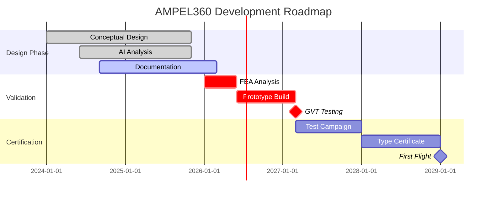
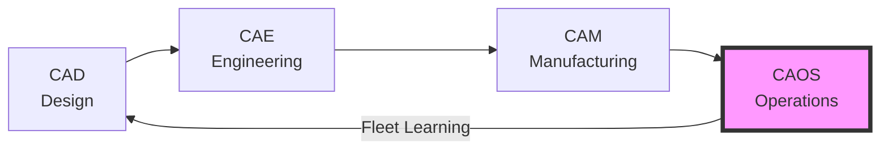

# AMPEL360 BWB H₂ Hy-E Q100 
## Next-Generation Zero-Emission Blended Wing Body Aircraft

[](docs)
[](docs/compliance)
[](docs/s1000d)
[](CAOS_MANIFESTO.md)
[](LICENSE)

<div align="center">

### 🚀 **World's First Carbon-Negative Commercial Aircraft**
**Blended Wing Body • Hydrogen Fuel Cells • CO₂ Capture • AI-Powered Operations**

[Overview](#overview) • [Features](#features) • [Documentation](#documentation) • [CAOS](#caos) • [Get Involved](#get-involved)

</div>

---

## 📑 Table of Contents

<details open>
<summary><b>Quick Navigation</b></summary>

### Main Sections
- [🎯 Mission](#-mission)
- [✨ Key Innovations](#-key-innovations)
- [📊 Project Status](#-project-status)
- [🏗️ OPT-IN Framework Architecture](#️-opt-in-framework-architecture)
- [🤖 CAOS: Computer Aided Operations & Services](#-caos-the-fourth-pillar-of-digital-engineering)

### Technical Documentation
- [📚 Documentation Structure](#-documentation-structure)
  - [O - ORGANIZATION](#o---organization)
  - [P - PROGRAM](#p---program)
  - [T - TECHNOLOGY](#t---technology-on-board-systems)
  - [I - INFRASTRUCTURES](#i---infrastructures)
  - [N - NEURAL NETWORKS](#n---neural-networks-users-traceability)

### Business & Development
- [🎯 Critical Technical Challenges](#-critical-technical-challenges)
- [💰 Investment Opportunity](#-investment-opportunity)
- [🤝 Get Involved](#-get-involved)
- [📈 Performance Metrics](#-performance-metrics)

### Resources & Links
- [🔗 Quick Links](#-quick-links)
- [📜 License & IP](#-license--ip)
- [🙏 Acknowledgments](#-acknowledgments)

</details>

---

## 🎯 Mission

> **To revolutionize aviation with a truly sustainable aircraft that doesn't just minimize emissions — it reverses them.**

The AMPEL360 combines breakthrough technologies in a Blended Wing Body configuration to achieve:
- **90% reduction** in operational emissions (H₂ fuel cells)
- **30% improvement** in aerodynamic efficiency (BWB design)
- **Carbon negative** operations through active CO₂ capture
- **25% reduction** in maintenance costs via CAOS AI system

[⬆ Back to Top](#ampel360-bwb-h₂-hy-e-q100-integra)

---

## ✨ Key Innovations

<table>
<tr>
<td width="33%" align="center">

### 🔋 Hydrogen Power
**PEM Fuel Cells**  
800kW primary power  
Zero local emissions  
3x energy density

</td>
<td width="33%" align="center">

### 🌍 CO₂ Capture
**Solid-State Battery**  
Active carbon removal  
Reversible storage  
Net negative flights

</td>
<td width="33%" align="center">

### 🧠 CAOS System
**AI Operations**  
Predictive maintenance  
Digital twin simulation  
Fleet learning

</td>
</tr>
</table>

[⬆ Back to Top](#ampel360-bwb-h₂-hy-e-q100-integra)

---

## 📊 Project Status



### Current Phase: **CONCEPTUAL DESIGN**
- ✅ Requirements defined (137 items)
- ✅ AI preliminary analysis complete
- ✅ **ATA 02-00-00 Operations Design Complete** (12 documents, 4 templates, assets)
- ⚠️ FEA validation required ($150k)
- ⚠️ Mode 1 resonance risk (25Hz)
- ❌ No physical prototype yet

[⬆ Back to Top](#ampel360-bwb-h₂-hy-e-q100-integra)

---

## 🏗️ OPT-IN Framework Architecture

Our revolutionary **14-Folder SKELETON** methodology ensures complete lifecycle documentation:

```
Every Component → 14 Standardized Folders:
├── 01_OVERVIEW              # Concept & scope
├── 02_SAFETY                # FMEA, FHA, hazards
├── 03_REQUIREMENTS          # Functional/performance
├── 04_DESIGN                # CAD, specifications
├── 05_INTERFACES            # Physical/logical/energy
├── 06_ENGINEERING           # Analysis, simulations
├── 07_V_AND_V              # Verification/validation
├── 08_PROTOTYPING          # Development hardware
├── 09_PRODUCTION_PLANNING  # Manufacturing prep
├── 10_CERTIFICATION        # Compliance evidence
├── 11_OPERATIONS_MAINTENANCE # CAOS integration
├── 12_ASSETS_MANAGEMENT    # Digital passports
├── 13_SUBSYSTEMS_COMPONENTS # Part breakdown
└── 14_META_GOVERNANCE      # Documentation control
```

### Framework Structure

| Axis | Domain | Focus | Quick Links |
|:---:|:---|:---|:---|
| **[O](#o---organization)** | Organization | Governance, airworthiness, maintenance policy | [ATA 00-05](OPT-IN_FRAMEWORK/O-ORGANIZATION) |
| **[P](#p---program)** | Program | Configuration, geometry, ground operations | [ATA 06-12](OPT-IN_FRAMEWORK/P-PROGRAM) |
| **[T](#t---technology-on-board-systems)** | Technology | All on-board systems (AMEDEOPELLICCIA taxonomy) | [ATA 20-80](OPT-IN_FRAMEWORK/T-TECHNOLOGY_AMEDEOPELLICCIA-ON_BOARD_SYSTEMS) |
| **[I](#i---infrastructures)** | Infrastructure | Airports, supply chains, support equipment | [ATA 02-116](OPT-IN_FRAMEWORK/I-INFRASTRUCTURES) |
| **[N](#n---neural-networks-users-traceability)** | Neural Networks | AI/ML, Digital Passport, CAOS operations | [ATA 95](OPT-IN_FRAMEWORK/N-NEURAL_NETWORKS_USERS_TRACEABILITY) |

[⬆ Back to Top](#ampel360-bwb-h₂-hy-e-q100-integra)

---

## 🤖 CAOS: The Fourth Pillar of Digital Engineering

**Computer Aided Operations & Services** — Beyond CAD, CAE, and CAM



### CAOS Capabilities
- **Predictive Maintenance**: ML-driven failure prediction
- **Digital Twin**: Real-time physics simulation
- **Energy Optimization**: H₂/battery management
- **Fleet Intelligence**: Cross-aircraft learning
- **Autonomous Operations**: Self-optimizing systems

📖 [Read the CAOS Manifesto](CAOS_MANIFESTO.md)

### CAOS Integration Points
- [Operations Framework](CAOS_OPERATIONS_FRAMEWORK.md)
- [Neural Networks Axis](OPT-IN_FRAMEWORK/N-NEURAL_NETWORKS_USERS_TRACEABILITY/)
- [Digital Twin Implementation](docs/digital_twin/)

[⬆ Back to Top](#ampel360-bwb-h₂-hy-e-q100-integra)

---

## 📚 Documentation Structure

<details>
<summary><b>Click to explore the complete ATA-organized structure</b></summary>

### O - ORGANIZATION
- [`ATA 00 - GENERAL`](OPT-IN_FRAMEWORK/O-ORGANIZATION/ATA_00-GENERAL/)
- [`ATA 01 - MAINTENANCE POLICY`](OPT-IN_FRAMEWORK/O-ORGANIZATION/ATA_01-MAINTENANCE_POLICY_INFORMATION/)
- [`ATA 04 - AIRWORTHINESS LIMITATIONS`](OPT-IN_FRAMEWORK/O-ORGANIZATION/ATA_04-AIRWORTHINESS_LIMITATIONS/)
- [`ATA 05 - TIME LIMITS`](OPT-IN_FRAMEWORK/O-ORGANIZATION/ATA_05-TIME_LIMITS_MAINTENANCE_CHECKS/)

### P - PROGRAM
- [`ATA 06 - DIMENSIONS AND AREAS`](OPT-IN_FRAMEWORK/P-PROGRAM/ATA_06-DIMENSIONS_AND_AREAS/)
- [`ATA 07 - LIFTING AND SHORING`](OPT-IN_FRAMEWORK/P-PROGRAM/ATA_07-LIFTING_AND_SHORING/)
- [`ATA 08 - LEVELING AND WEIGHING`](OPT-IN_FRAMEWORK/P-PROGRAM/ATA_08-LEVELING_AND_WEIGHING/)
- [`ATA 09 - TOWING AND TAXIING`](OPT-IN_FRAMEWORK/P-PROGRAM/ATA_09-TOWING_AND_TAXIING/)
- [`ATA 12 - SERVICING`](OPT-IN_FRAMEWORK/P-PROGRAM/ATA_12-SERVICING/)

### T - TECHNOLOGY (ON-BOARD SYSTEMS)

#### A - AIRFRAME
- [`ATA 20 - STANDARD PRACTICES`](OPT-IN_FRAMEWORK/T-TECHNOLOGY_AMEDEOPELLICCIA-ON_BOARD_SYSTEMS/A-AIRFRAME/ATA_20-STANDARD_PRACTICES-AIRFRAME/)
- [`ATA 50 - CARGO COMPARTMENTS`](OPT-IN_FRAMEWORK/T-TECHNOLOGY_AMEDEOPELLICCIA-ON_BOARD_SYSTEMS/A-AIRFRAME/ATA_50-CARGO_AND_ACCESSORY_COMPARTMENTS/)
- [`ATA 51 - STRUCTURES GENERAL`](OPT-IN_FRAMEWORK/T-TECHNOLOGY_AMEDEOPELLICCIA-ON_BOARD_SYSTEMS/A-AIRFRAME/ATA_51-STANDARD_PRACTICES_AND_STRUCTURES-GENERAL/)
- [`ATA 52 - DOORS`](OPT-IN_FRAMEWORK/T-TECHNOLOGY_AMEDEOPELLICCIA-ON_BOARD_SYSTEMS/A-AIRFRAME/ATA_52-DOORS/) ⭐ **FULLY DEVELOPED**
  - [`52-10 - Passenger Entry Doors`](OPT-IN_FRAMEWORK/T-TECHNOLOGY_AMEDEOPELLICCIA-ON_BOARD_SYSTEMS/A-AIRFRAME/ATA_52-DOORS/52-10_PASSENGER_ENTRY_DOORS/)
    - [`52-10-01 - Door L1 Forward`](OPT-IN_FRAMEWORK/T-TECHNOLOGY_AMEDEOPELLICCIA-ON_BOARD_SYSTEMS/A-AIRFRAME/ATA_52-DOORS/52-10_PASSENGER_ENTRY_DOORS/52-10-01_Door_L1_Forward/) 📋 **COMPLETE WITH 14 FOLDERS**
  - [`52-20 - Emergency Exits`](OPT-IN_FRAMEWORK/T-TECHNOLOGY_AMEDEOPELLICCIA-ON_BOARD_SYSTEMS/A-AIRFRAME/ATA_52-DOORS/52-20_EMERGENCY_EXITS/)
    - [`52-20-01 - Door L3 Aft`](OPT-IN_FRAMEWORK/T-TECHNOLOGY_AMEDEOPELLICCIA-ON_BOARD_SYSTEMS/A-AIRFRAME/ATA_52-DOORS/52-20_EMERGENCY_EXITS/52-20-01_Door_L3_Aft/) 🆕 **01_OVERVIEW + 03_REQUIREMENTS COMPLETE**
- [`ATA 53 - FUSELAGE`](OPT-IN_FRAMEWORK/T-TECHNOLOGY_AMEDEOPELLICCIA-ON_BOARD_SYSTEMS/A-AIRFRAME/ATA_53-FUSELAGE/)
- [`ATA 54 - NACELLES/PYLONS`](OPT-IN_FRAMEWORK/T-TECHNOLOGY_AMEDEOPELLICCIA-ON_BOARD_SYSTEMS/A-AIRFRAME/ATA_54-NACELLES_PYLONS/)
- [`ATA 55 - STABILIZERS`](OPT-IN_FRAMEWORK/T-TECHNOLOGY_AMEDEOPELLICCIA-ON_BOARD_SYSTEMS/A-AIRFRAME/ATA_55-STABILIZERS/)
- [`ATA 56 - WINDOWS`](OPT-IN_FRAMEWORK/T-TECHNOLOGY_AMEDEOPELLICCIA-ON_BOARD_SYSTEMS/A-AIRFRAME/ATA_56-WINDOWS/)
- [`ATA 57 - WINGS`](OPT-IN_FRAMEWORK/T-TECHNOLOGY_AMEDEOPELLICCIA-ON_BOARD_SYSTEMS/A-AIRFRAME/ATA_57-WINGS/)

#### M - MECHANICS
- [`ATA 27 - FLIGHT CONTROLS`](OPT-IN_FRAMEWORK/T-TECHNOLOGY_AMEDEOPELLICCIA-ON_BOARD_SYSTEMS/M-MECHANICS/ATA_27-FLIGHT_CONTROLS_ACTUATION_SYSTEMS/)
- [`ATA 29 - HYDRAULIC POWER`](OPT-IN_FRAMEWORK/T-TECHNOLOGY_AMEDEOPELLICCIA-ON_BOARD_SYSTEMS/M-MECHANICS/ATA_29-HYDRAULIC_POWER/)
- [`ATA 32 - LANDING GEAR`](OPT-IN_FRAMEWORK/T-TECHNOLOGY_AMEDEOPELLICCIA-ON_BOARD_SYSTEMS/M-MECHANICS/ATA_32-LANDING_GEAR/)
- [`ATA 36 - PNEUMATIC`](OPT-IN_FRAMEWORK/T-TECHNOLOGY_AMEDEOPELLICCIA-ON_BOARD_SYSTEMS/M-MECHANICS/ATA_36-PNEUMATIC/)
- [`ATA 37 - VACUUM/WASTE`](OPT-IN_FRAMEWORK/T-TECHNOLOGY_AMEDEOPELLICCIA-ON_BOARD_SYSTEMS/M-MECHANICS/ATA_37-VACUUM_WASTE_DISPOSAL/)
- [`ATA 41 - WATER BALLAST`](OPT-IN_FRAMEWORK/T-TECHNOLOGY_AMEDEOPELLICCIA-ON_BOARD_SYSTEMS/M-MECHANICS/ATA_41-WATER_BALLAST/)

#### E1 - ENVIRONMENT
- [`ATA 18 - VIBRATION/NOISE`](OPT-IN_FRAMEWORK/T-TECHNOLOGY_AMEDEOPELLICCIA-ON_BOARD_SYSTEMS/E1-ENVIRONMENT/ATA_18-VIBRATION_AND_NOISE_ANALYSIS/)
- [`ATA 21 - AIR CONDITIONING`](OPT-IN_FRAMEWORK/T-TECHNOLOGY_AMEDEOPELLICCIA-ON_BOARD_SYSTEMS/E1-ENVIRONMENT/ATA_21-AIR_CONDITIONING_AND_PRESSURIZATION/)
- [`ATA 26 - FIRE PROTECTION`](OPT-IN_FRAMEWORK/T-TECHNOLOGY_AMEDEOPELLICCIA-ON_BOARD_SYSTEMS/E1-ENVIRONMENT/ATA_26-FIRE_PROTECTION/)
- [`ATA 30 - ICE/RAIN PROTECTION`](OPT-IN_FRAMEWORK/T-TECHNOLOGY_AMEDEOPELLICCIA-ON_BOARD_SYSTEMS/E1-ENVIRONMENT/ATA_30-ICE_AND_RAIN_PROTECTION/)
- [`ATA 38 - WATER/WASTE`](OPT-IN_FRAMEWORK/T-TECHNOLOGY_AMEDEOPELLICCIA-ON_BOARD_SYSTEMS/E1-ENVIRONMENT/ATA_38-WATER_WASTE/)

#### D - DATA
- [`ATA 31 - RECORDING SYSTEMS`](OPT-IN_FRAMEWORK/T-TECHNOLOGY_AMEDEOPELLICCIA-ON_BOARD_SYSTEMS/D-DATA/ATA_31-INDICATING_RECORDING_SYSTEMS_RECORDING_FUNCTION/)

#### E2 - ENERGY
- [`ATA 24 - ELECTRICAL POWER`](OPT-IN_FRAMEWORK/T-TECHNOLOGY_AMEDEOPELLICCIA-ON_BOARD_SYSTEMS/E2-ENERGY/ATA_24-ELECTRICAL_POWER/) ⚡ **H₂ FUEL CELLS**
- [`ATA 47 - INERTING SYSTEM`](OPT-IN_FRAMEWORK/T-TECHNOLOGY_AMEDEOPELLICCIA-ON_BOARD_SYSTEMS/E2-ENERGY/ATA_47-INERTING_SYSTEM/)
- [`ATA 49 - AUXILIARY POWER`](OPT-IN_FRAMEWORK/T-TECHNOLOGY_AMEDEOPELLICCIA-ON_BOARD_SYSTEMS/E2-ENERGY/ATA_49-AIRBORNE_AUXILIARY_POWER/)
- [`ATA 80 - STARTING`](OPT-IN_FRAMEWORK/T-TECHNOLOGY_AMEDEOPELLICCIA-ON_BOARD_SYSTEMS/E2-ENERGY/ATA_80-STARTING/)

#### O - OPERATING SYSTEMS
- [`ATA 42 - IMA GOVERNANCE`](OPT-IN_FRAMEWORK/T-TECHNOLOGY_AMEDEOPELLICCIA-ON_BOARD_SYSTEMS/O-OPERATING_SYSTEMS/ATA_42-INTEGRATED_MODULAR_AVIONICS_ARCHITECTURAL_GOVERNANCE/)

#### P - PROPULSION
- [`ATA 60 - PROP STANDARDS`](OPT-IN_FRAMEWORK/T-TECHNOLOGY_AMEDEOPELLICCIA-ON_BOARD_SYSTEMS/P-PROPULSION/ATA_60-STANDARD_PRACTICES-PROP_ROTOR/)
- [`ATA 61 - PROPELLERS`](OPT-IN_FRAMEWORK/T-TECHNOLOGY_AMEDEOPELLICCIA-ON_BOARD_SYSTEMS/P-PROPULSION/ATA_61-PROPELLERS_PROPULSORS/)
- [`ATA 70 - ENGINE STANDARDS`](OPT-IN_FRAMEWORK/T-TECHNOLOGY_AMEDEOPELLICCIA-ON_BOARD_SYSTEMS/P-PROPULSION/ATA_70-STANDARD_PRACTICES-ENGINE/)
- [`ATA 71 - POWER PLANT`](OPT-IN_FRAMEWORK/T-TECHNOLOGY_AMEDEOPELLICCIA-ON_BOARD_SYSTEMS/P-PROPULSION/ATA_71-POWER_PLANT/)
- [`ATA 72 - ENGINE`](OPT-IN_FRAMEWORK/T-TECHNOLOGY_AMEDEOPELLICCIA-ON_BOARD_SYSTEMS/P-PROPULSION/ATA_72-ENGINE/)
- [`ATA 73 - FUEL CONTROL`](OPT-IN_FRAMEWORK/T-TECHNOLOGY_AMEDEOPELLICCIA-ON_BOARD_SYSTEMS/P-PROPULSION/ATA_73-ENGINE_FUEL_AND_CONTROL/)
- [`ATA 74 - IGNITION`](OPT-IN_FRAMEWORK/T-TECHNOLOGY_AMEDEOPELLICCIA-ON_BOARD_SYSTEMS/P-PROPULSION/ATA_74-IGNITION/)
- [`ATA 75 - AIR`](OPT-IN_FRAMEWORK/T-TECHNOLOGY_AMEDEOPELLICCIA-ON_BOARD_SYSTEMS/P-PROPULSION/ATA_75-AIR/)
- [`ATA 76 - ENGINE CONTROLS`](OPT-IN_FRAMEWORK/T-TECHNOLOGY_AMEDEOPELLICCIA-ON_BOARD_SYSTEMS/P-PROPULSION/ATA_76-ENGINE_CONTROLS/)
- [`ATA 78 - EXHAUST`](OPT-IN_FRAMEWORK/T-TECHNOLOGY_AMEDEOPELLICCIA-ON_BOARD_SYSTEMS/P-PROPULSION/ATA_78-EXHAUST/)
- [`ATA 79 - OIL`](OPT-IN_FRAMEWORK/T-TECHNOLOGY_AMEDEOPELLICCIA-ON_BOARD_SYSTEMS/P-PROPULSION/ATA_79-OIL/)

#### E3 - ELECTRONICS
- [`ATA 34 - NAVIGATION`](OPT-IN_FRAMEWORK/T-TECHNOLOGY_AMEDEOPELLICCIA-ON_BOARD_SYSTEMS/E3-ELECTRONICS/ATA_34-NAVIGATION/)
- [`ATA 39 - ELECTRICAL PANELS`](OPT-IN_FRAMEWORK/T-TECHNOLOGY_AMEDEOPELLICCIA-ON_BOARD_SYSTEMS/E3-ELECTRONICS/ATA_39-ELECTRICAL_ELECTRONIC_PANELS_AND_COMPONENTS/)
- [`ATA 42 - IMA HARDWARE`](OPT-IN_FRAMEWORK/T-TECHNOLOGY_AMEDEOPELLICCIA-ON_BOARD_SYSTEMS/E3-ELECTRONICS/ATA_42-INTEGRATED_MODULAR_AVIONICS_HARDWARE_MODULES/)

#### L1 - LOGICS
- [`ATA 22 - AUTOFLIGHT`](OPT-IN_FRAMEWORK/T-TECHNOLOGY_AMEDEOPELLICCIA-ON_BOARD_SYSTEMS/L1-LOGICS/ATA_22-AUTOFLIGHT/)
- [`ATA 27 - FLIGHT CONTROL SW`](OPT-IN_FRAMEWORK/T-TECHNOLOGY_AMEDEOPELLICCIA-ON_BOARD_SYSTEMS/L1-LOGICS/ATA_27-FLIGHT_CONTROLS_SOFTWARE/)
- [`ATA 42 - IMA APPLICATIONS`](OPT-IN_FRAMEWORK/T-TECHNOLOGY_AMEDEOPELLICCIA-ON_BOARD_SYSTEMS/L1-LOGICS/ATA_42-INTEGRATED_MODULAR_AVIONICS_HOSTED_APPLICATIONS/)

#### L2 - LINKS
- [`ATA 23 - COMMUNICATIONS`](OPT-IN_FRAMEWORK/T-TECHNOLOGY_AMEDEOPELLICCIA-ON_BOARD_SYSTEMS/L2-LINKS/ATA_23-COMMUNICATIONS/)
- [`ATA 42 - IMA NETWORK`](OPT-IN_FRAMEWORK/T-TECHNOLOGY_AMEDEOPELLICCIA-ON_BOARD_SYSTEMS/L2-LINKS/ATA_42-INTEGRATED_MODULAR_AVIONICS_NETWORK_FABRIC/)
- [`ATA 91 - CHARTS`](OPT-IN_FRAMEWORK/T-TECHNOLOGY_AMEDEOPELLICCIA-ON_BOARD_SYSTEMS/L2-LINKS/ATA_91-CHARTS_FLIGHT_OPERATIONS/)

#### I - INFORMATION, INTELLIGENCE, INTERFACES
- [`ATA 31 - INDICATING SYSTEMS`](OPT-IN_FRAMEWORK/T-TECHNOLOGY_AMEDEOPELLICCIA-ON_BOARD_SYSTEMS/I-INFORMATION_INTELLIGENCE_INTERFACES/ATA_31-INDICATING_RECORDING_SYSTEMS_INDICATING_FUNCTION/)
- [`ATA 42 - IMA CORE OS`](OPT-IN_FRAMEWORK/T-TECHNOLOGY_AMEDEOPELLICCIA-ON_BOARD_SYSTEMS/I-INFORMATION_INTELLIGENCE_INTERFACES/ATA_42-INTEGRATED_MODULAR_AVIONICS_CORE_OS_AND_SERVICES/)
- [`ATA 45 - MAINTENANCE SYSTEMS`](OPT-IN_FRAMEWORK/T-TECHNOLOGY_AMEDEOPELLICCIA-ON_BOARD_SYSTEMS/I-INFORMATION_INTELLIGENCE_INTERFACES/ATA_45-ONBOARD_MAINTENANCE_SYSTEMS/)
- [`ATA 46 - INFORMATION SYSTEMS`](OPT-IN_FRAMEWORK/T-TECHNOLOGY_AMEDEOPELLICCIA-ON_BOARD_SYSTEMS/I-INFORMATION_INTELLIGENCE_INTERFACES/ATA_46-INFORMATION_SYSTEMS/)
- [`ATA 77 - ENGINE INDICATING`](OPT-IN_FRAMEWORK/T-TECHNOLOGY_AMEDEOPELLICCIA-ON_BOARD_SYSTEMS/I-INFORMATION_INTELLIGENCE_INTERFACES/ATA_77-ENGINE_INDICATING/)
- [`ATA 93 - ONBOARD DATA LOAD`](OPT-IN_FRAMEWORK/T-TECHNOLOGY_AMEDEOPELLICCIA-ON_BOARD_SYSTEMS/I-INFORMATION_INTELLIGENCE_INTERFACES/ATA_93-ONBOARD_DATA_LOAD/)

#### C1 - COCKPIT, CABIN, CARGO
- [`ATA 11 - PLACARDS`](OPT-IN_FRAMEWORK/T-TECHNOLOGY_AMEDEOPELLICCIA-ON_BOARD_SYSTEMS/C1-COCKPIT_CABIN_CARGO/ATA_11-PLACARDS_AND_MARKINGS/)
- [`ATA 15 - AIRCREW INFO`](OPT-IN_FRAMEWORK/T-TECHNOLOGY_AMEDEOPELLICCIA-ON_BOARD_SYSTEMS/C1-COCKPIT_CABIN_CARGO/ATA_15-AIRCREW_INFORMATION/)
- [`ATA 16 - CHANGE OF ROLE`](OPT-IN_FRAMEWORK/T-TECHNOLOGY_AMEDEOPELLICCIA-ON_BOARD_SYSTEMS/C1-COCKPIT_CABIN_CARGO/ATA_16-CHANGE_OF_ROLE/)
- [`ATA 25 - EQUIPMENT`](OPT-IN_FRAMEWORK/T-TECHNOLOGY_AMEDEOPELLICCIA-ON_BOARD_SYSTEMS/C1-COCKPIT_CABIN_CARGO/ATA_25-EQUIPMENT_FURNISHINGS/)
- [`ATA 33 - LIGHTS`](OPT-IN_FRAMEWORK/T-TECHNOLOGY_AMEDEOPELLICCIA-ON_BOARD_SYSTEMS/C1-COCKPIT_CABIN_CARGO/ATA_33-LIGHTS/)
- [`ATA 35 - OXYGEN`](OPT-IN_FRAMEWORK/T-TECHNOLOGY_AMEDEOPELLICCIA-ON_BOARD_SYSTEMS/C1-COCKPIT_CABIN_CARGO/ATA_35-OXYGEN/)
- [`ATA 44 - CABIN SYSTEMS`](OPT-IN_FRAMEWORK/T-TECHNOLOGY_AMEDEOPELLICCIA-ON_BOARD_SYSTEMS/C1-COCKPIT_CABIN_CARGO/ATA_44-CABIN_SYSTEMS/)

#### C2 - CIRCULAR, CRYOGENIC SYSTEMS
- [`ATA 28 - FUEL (H₂/SAF)`](OPT-IN_FRAMEWORK/T-TECHNOLOGY_AMEDEOPELLICCIA-ON_BOARD_SYSTEMS/C2-CIRCULAR_CRYOGENIC_SYSTEMS/ATA_28-FUEL_SAF_AND_CRYOGENIC/) 🔥 **H₂ SYSTEM**
  - [`28-10 - H₂ Storage Tanks`](OPT-IN_FRAMEWORK/T-TECHNOLOGY_AMEDEOPELLICCIA-ON_BOARD_SYSTEMS/C2-CIRCULAR_CRYOGENIC_SYSTEMS/ATA_28-FUEL_SAF_AND_CRYOGENIC/28-10-00_H2_STORAGE_TANKS/)
  - [`28-20 - Fuel Feed`](OPT-IN_FRAMEWORK/T-TECHNOLOGY_AMEDEOPELLICCIA-ON_BOARD_SYSTEMS/C2-CIRCULAR_CRYOGENIC_SYSTEMS/ATA_28-FUEL_SAF_AND_CRYOGENIC/28-20-00_FUEL_FEED_AND_MANIFOLDS/)
  - [`28-30 - Pumps & Valves`](OPT-IN_FRAMEWORK/T-TECHNOLOGY_AMEDEOPELLICCIA-ON_BOARD_SYSTEMS/C2-CIRCULAR_CRYOGENIC_SYSTEMS/ATA_28-FUEL_SAF_AND_CRYOGENIC/28-30-00_FUEL_PUMPS_AND_VALVES/)
  - [`28-40 - SAF Interface`](OPT-IN_FRAMEWORK/T-TECHNOLOGY_AMEDEOPELLICCIA-ON_BOARD_SYSTEMS/C2-CIRCULAR_CRYOGENIC_SYSTEMS/ATA_28-FUEL_SAF_AND_CRYOGENIC/28-40-00_SAF_INTERFACE_SYSTEM/)
  - [`28-50 - CO₂ Battery`](OPT-IN_FRAMEWORK/T-TECHNOLOGY_AMEDEOPELLICCIA-ON_BOARD_SYSTEMS/C2-CIRCULAR_CRYOGENIC_SYSTEMS/ATA_28-FUEL_SAF_AND_CRYOGENIC/28-50-00_CO2_BATTERY_LOOP/)
- [`ATA 21-80 - CO₂ CAPTURE`](OPT-IN_FRAMEWORK/T-TECHNOLOGY_AMEDEOPELLICCIA-ON_BOARD_SYSTEMS/C2-CIRCULAR_CRYOGENIC_SYSTEMS/ATA_21-80-CO2_CAPTURE_AND_PROCESSING/) 🌍 **UNIQUE**

#### I2 - I+D (Research & Development)
- [`ATA 40 - AI INTEGRATION`](OPT-IN_FRAMEWORK/T-TECHNOLOGY_AMEDEOPELLICCIA-ON_BOARD_SYSTEMS/I2-ID/ATA_40-AI_INTEGRATION/)
- [`ATA 42-55 - POWERTRAIN`](OPT-IN_FRAMEWORK/T-TECHNOLOGY_AMEDEOPELLICCIA-ON_BOARD_SYSTEMS/I2-ID/ATA_42-55-POWERTRAIN_ENERGY_ORCHESTRATION/)
- [`ATA 42-60 - QUANTUM SCHEDULER`](OPT-IN_FRAMEWORK/T-TECHNOLOGY_AMEDEOPELLICCIA-ON_BOARD_SYSTEMS/I2-ID/ATA_42-60-QUANTUM_INSPIRED_SCHEDULER/)
- [`ATA 48 - IN-FLIGHT MAINTENANCE`](OPT-IN_FRAMEWORK/T-TECHNOLOGY_AMEDEOPELLICCIA-ON_BOARD_SYSTEMS/I2-ID/ATA_48-IN_FLIGHT_MAINTENANCE/)
- [`ATA 92 - MODEL BASED MAINT`](OPT-IN_FRAMEWORK/T-TECHNOLOGY_AMEDEOPELLICCIA-ON_BOARD_SYSTEMS/I2-ID/ATA_92-MODEL_BASED_MAINTENANCE/)

#### A2 - AERODYNAMICS
- [`ATA 27 - FLIGHT CONTROLS AERO`](OPT-IN_FRAMEWORK/T-TECHNOLOGY_AMEDEOPELLICCIA-ON_BOARD_SYSTEMS/A2-AERODYNAMICS/ATA_27-FLIGHT_CONTROLS_AERODYNAMIC_MANIPULATION/)

### I - INFRASTRUCTURES
- [`ATA 02 - OPERATIONS INFO`](OPT-IN_FRAMEWORK/I-INFRASTRUCTURES/ATA_02-OPERATIONS_INFORMATION/)
  - [`02-00-00 GENERAL / 04_DESIGN`](OPT-IN_FRAMEWORK/I-INFRASTRUCTURES/ATA_02-OPERATIONS_INFORMATION/02-00-00_GENERAL/04_DESIGN/) ⭐ **COMPLETE OPERATIONS DESIGN**
    - Operations Concept Design
    - Procedures Design Philosophy
    - Checklist Design Standards
    - Flight Deck Operations Design
    - Ground Operations Design (H₂ refueling)
    - Emergency Procedures Design
    - CAOS Integration Design
    - Human-Machine Interface Design
    - Crew Workload Analysis (NASA-TLX)
    - Documentation Design Standards (S1000D, ATA iSpec 2200)
    - Training Program Design
    - Safety By Design Operations
- [`ATA 03 - SUPPORT/GSE`](OPT-IN_FRAMEWORK/I-INFRASTRUCTURES/ATA_03-SUPPORT_INFORMATION_GSE/)
- [`ATA 10 - PARKING/STORAGE`](OPT-IN_FRAMEWORK/I-INFRASTRUCTURES/ATA_10-PARKING_MOORING_STORAGE_RTS/)
- [`ATA 13 - HARDWARE/TOOLS`](OPT-IN_FRAMEWORK/I-INFRASTRUCTURES/ATA_13-HARDWARE_AND_GENERAL_TOOLS/)
- [`ATA 85-90 - INTERFACE STANDARDS`](OPT-IN_FRAMEWORK/I-INFRASTRUCTURES/ATA_85-90-INFRASTRUCTURE_INTERFACE_STANDARDS/)
- [`ATA 115 - FLIGHT SIMULATOR`](OPT-IN_FRAMEWORK/I-INFRASTRUCTURES/ATA_115-FLIGHT_SIMULATOR_SYSTEMS/)
- [`ATA 116 - SIM CUING`](OPT-IN_FRAMEWORK/I-INFRASTRUCTURES/ATA_116-FLIGHT_SIMULATOR_CUING_SYSTEM/)

### N - NEURAL NETWORKS, USERS, TRACEABILITY
- [`N-AXIS OVERVIEW`](OPT-IN_FRAMEWORK/N-NEURAL_NETWORKS_USERS_TRACEABILITY/)
- [`ATA 95 - DIGITAL PRODUCT PASSPORT`](OPT-IN_FRAMEWORK/N-NEURAL_NETWORKS_USERS_TRACEABILITY/ATA_95-DIGITAL_PRODUCT_PASSPORT_AND_TRACEABILITY/) 📱 **DPP**
- [`ATA 40 - AI/CAOS COGNITIVE OPS`](OPT-IN_FRAMEWORK/N-NEURAL_NETWORKS_USERS_TRACEABILITY/ATA_40-AI_INTEGRATION/)
- [`ATA 92 - CAOS-ENABLED MAINTENANCE`](OPT-IN_FRAMEWORK/N-NEURAL_NETWORKS_USERS_TRACEABILITY/ATA_92-MODEL_BASED_MAINTENANCE/)

</details>

[⬆ Back to Top](#ampel360-bwb-h₂-hy-e-q100-integra)

---

## 🎯 Critical Technical Challenges

| Challenge | Impact | Mitigation Strategy | Status | Details |
|-----------|--------|-------------------|---------|---------|
| **Mode 1 Resonance** | 🔴 Critical | Early GVT, damping enhancement | 🔄 Analysis | [View Analysis](OPT-IN_FRAMEWORK/T-TECHNOLOGY_AMEDEOPELLICCIA-ON_BOARD_SYSTEMS/A-AIRFRAME/ATA_52-DOORS/52-10_PASSENGER_ENTRY_DOORS/52-10-01_Door_L1_Forward/06_ENGINEERING) |
| **H₂ Storage** | 🟡 High | Cryogenic tank optimization | ✅ Designed | [H₂ System](OPT-IN_FRAMEWORK/T-TECHNOLOGY_AMEDEOPELLICCIA-ON_BOARD_SYSTEMS/C2-CIRCULAR_CRYOGENIC_SYSTEMS/ATA_28-FUEL_SAF_AND_CRYOGENIC) |
| **CO₂ Capture Weight** | 🟡 High | Solid-state battery innovation | 🔄 Research | [CO₂ System](OPT-IN_FRAMEWORK/T-TECHNOLOGY_AMEDEOPELLICCIA-ON_BOARD_SYSTEMS/C2-CIRCULAR_CRYOGENIC_SYSTEMS/ATA_21-80-CO2_CAPTURE_AND_PROCESSING) |
| **BWB Certification** | 🟡 High | Early authority engagement | 📋 Planned | [Cert Plan](OPT-IN_FRAMEWORK/T-TECHNOLOGY_AMEDEOPELLICCIA-ON_BOARD_SYSTEMS/A-AIRFRAME/ATA_52-DOORS/52-10_PASSENGER_ENTRY_DOORS/52-10-01_Door_L1_Forward/10_CERTIFICATION) |

[⬆ Back to Top](#ampel360-bwb-h₂-hy-e-q100-integra)

---

## 💰 Investment Opportunity

### Immediate Needs (Phase 1)
- **$150k** - Professional FEA validation
- **$500k** - Prototype development
- **$350k** - GVT and initial testing
- **$1M** - Team building & facilities

**Total Phase 1: $2M** → Validated concept ready for Series A

### Value Proposition
- 📊 $450B SAM by 2040 (zero-emission aviation)
- 🌍 First-mover in carbon-negative flight
- 🤖 CAOS platform licensable separately
- 🏭 Manufacturing scalable to existing facilities

[⬆ Back to Top](#ampel360-bwb-h₂-hy-e-q100-integra)

---

## 🤝 Get Involved

### For Investors
- 📧 [Investment deck available](mailto:amedeo.pelliccia@example.com)
- 💼 Looking for strategic partners in H₂ infrastructure

### For Engineers
- 🔧 Seeking FEA/CFD specialists
- 🤖 ML/AI engineers for CAOS development
- ✈️ Aerospace systems engineers

### For Partners
- 🏭 Component suppliers (fuel cells, composites)
- 🔬 Research institutions (H₂, CO₂ capture)
- ✈️ Airlines for launch customer program

[⬆ Back to Top](#ampel360-bwb-h₂-hy-e-q100-integra)

---

## 📈 Performance Metrics

<table>
<tr>
<th>Metric</th><th>AMPEL360</th><th>Conventional</th><th>Improvement</th>
</tr>
<tr>
<td>Passengers</td><td>100</td><td>100</td><td>-</td>
</tr>
<tr>
<td>Range (km)</td><td>4,000</td><td>4,000</td><td>-</td>
</tr>
<tr>
<td>Cruise Speed</td><td>Mach 0.78</td><td>Mach 0.78</td><td>-</td>
</tr>
<tr>
<td>Fuel Consumption</td><td>0.8 kg H₂/pax/100km</td><td>2.5 kg/pax/100km</td><td><b>-68%</b></td>
</tr>
<tr>
<td>CO₂ Emissions</td><td><b>-5 kg/flight</b></td><td>+2,500 kg/flight</td><td><b>-100.2%</b></td>
</tr>
<tr>
<td>Noise</td><td>65 dB</td><td>85 dB</td><td><b>-75%</b></td>
</tr>
<tr>
<td>Operating Cost</td><td>$0.04/ASK</td><td>$0.06/ASK</td><td><b>-33%</b></td>
</tr>
</table>

[⬆ Back to Top](#ampel360-bwb-h₂-hy-e-q100-integra)

---

## 🔗 Quick Links

### Documentation Hub
- 📖 [Full Documentation](docs/)
- 🤖 [CAOS System](CAOS_MANIFESTO.md)
- 📊 [Digital Product Passport](OPT-IN_FRAMEWORK/N-NEURAL_NETWORKS_USERS_TRACEABILITY/ATA_95-DIGITAL_PRODUCT_PASSPORT_AND_TRACEABILITY/)
- 🔧 [S1000D Integration](docs/s1000d/)

### Key Components

#### Door Systems (ATA 52) - FULLY DEVELOPED
- 🚪 [Door L1 Forward - Complete](OPT-IN_FRAMEWORK/T-TECHNOLOGY_AMEDEOPELLICCIA-ON_BOARD_SYSTEMS/A-AIRFRAME/ATA_52-DOORS/52-10_PASSENGER_ENTRY_DOORS/52-10-01_Door_L1_Forward/)
  - [01_OVERVIEW](OPT-IN_FRAMEWORK/T-TECHNOLOGY_AMEDEOPELLICCIA-ON_BOARD_SYSTEMS/A-AIRFRAME/ATA_52-DOORS/52-10_PASSENGER_ENTRY_DOORS/52-10-01_Door_L1_Forward/01_OVERVIEW/)
  - [02_SAFETY](OPT-IN_FRAMEWORK/T-TECHNOLOGY_AMEDEOPELLICCIA-ON_BOARD_SYSTEMS/A-AIRFRAME/ATA_52-DOORS/52-10_PASSENGER_ENTRY_DOORS/52-10-01_Door_L1_Forward/02_SAFETY/)
  - [03_REQUIREMENTS](OPT-IN_FRAMEWORK/T-TECHNOLOGY_AMEDEOPELLICCIA-ON_BOARD_SYSTEMS/A-AIRFRAME/ATA_52-DOORS/52-10_PASSENGER_ENTRY_DOORS/52-10-01_Door_L1_Forward/03_REQUIREMENTS/)
  - [04_DESIGN](OPT-IN_FRAMEWORK/T-TECHNOLOGY_AMEDEOPELLICCIA-ON_BOARD_SYSTEMS/A-AIRFRAME/ATA_52-DOORS/52-10_PASSENGER_ENTRY_DOORS/52-10-01_Door_L1_Forward/04_DESIGN/)
  - [05_INTERFACES](OPT-IN_FRAMEWORK/T-TECHNOLOGY_AMEDEOPELLICCIA-ON_BOARD_SYSTEMS/A-AIRFRAME/ATA_52-DOORS/52-10_PASSENGER_ENTRY_DOORS/52-10-01_Door_L1_Forward/05_INTERFACES/)
  - [06_ENGINEERING](OPT-IN_FRAMEWORK/T-TECHNOLOGY_AMEDEOPELLICCIA-ON_BOARD_SYSTEMS/A-AIRFRAME/ATA_52-DOORS/52-10_PASSENGER_ENTRY_DOORS/52-10-01_Door_L1_Forward/06_ENGINEERING/)
  - [07_V_AND_V](OPT-IN_FRAMEWORK/T-TECHNOLOGY_AMEDEOPELLICCIA-ON_BOARD_SYSTEMS/A-AIRFRAME/ATA_52-DOORS/52-10_PASSENGER_ENTRY_DOORS/52-10-01_Door_L1_Forward/07_V_AND_V/)
  - [08_PROTOTYPING](OPT-IN_FRAMEWORK/T-TECHNOLOGY_AMEDEOPELLICCIA-ON_BOARD_SYSTEMS/A-AIRFRAME/ATA_52-DOORS/52-10_PASSENGER_ENTRY_DOORS/52-10-01_Door_L1_Forward/08_PROTOTYPING/)
  - [09_PRODUCTION_PLANNING](OPT-IN_FRAMEWORK/T-TECHNOLOGY_AMEDEOPELLICCIA-ON_BOARD_SYSTEMS/A-AIRFRAME/ATA_52-DOORS/52-10_PASSENGER_ENTRY_DOORS/52-10-01_Door_L1_Forward/09_PRODUCTION_PLANNING/)
  - [10_CERTIFICATION](OPT-IN_FRAMEWORK/T-TECHNOLOGY_AMEDEOPELLICCIA-ON_BOARD_SYSTEMS/A-AIRFRAME/ATA_52-DOORS/52-10_PASSENGER_ENTRY_DOORS/52-10-01_Door_L1_Forward/10_CERTIFICATION/)
  - [11_OPERATIONS_AND_MAINTENANCE](OPT-IN_FRAMEWORK/T-TECHNOLOGY_AMEDEOPELLICCIA-ON_BOARD_SYSTEMS/A-AIRFRAME/ATA_52-DOORS/52-10_PASSENGER_ENTRY_DOORS/52-10-01_Door_L1_Forward/11_OPERATIONS_AND_MAINTENANCE/)
  - [12_ASSETS_MANAGEMENT](OPT-IN_FRAMEWORK/T-TECHNOLOGY_AMEDEOPELLICCIA-ON_BOARD_SYSTEMS/A-AIRFRAME/ATA_52-DOORS/52-10_PASSENGER_ENTRY_DOORS/52-10-01_Door_L1_Forward/12_ASSETS_MANAGEMENT/)
  - [13_SUBSYSTEMS_AND_COMPONENTS](OPT-IN_FRAMEWORK/T-TECHNOLOGY_AMEDEOPELLICCIA-ON_BOARD_SYSTEMS/A-AIRFRAME/ATA_52-DOORS/52-10_PASSENGER_ENTRY_DOORS/52-10-01_Door_L1_Forward/13_SUBSYSTEMS_AND_COMPONENTS/)
  - [14_META_GOVERNANCE](OPT-IN_FRAMEWORK/T-TECHNOLOGY_AMEDEOPELLICCIA-ON_BOARD_SYSTEMS/A-AIRFRAME/ATA_52-DOORS/52-10_PASSENGER_ENTRY_DOORS/52-10-01_Door_L1_Forward/14_META_GOVERNANCE/)

- 🚨 [Door L3 Aft Emergency Exit](OPT-IN_FRAMEWORK/T-TECHNOLOGY_AMEDEOPELLICCIA-ON_BOARD_SYSTEMS/A-AIRFRAME/ATA_52-DOORS/52-20_EMERGENCY_EXITS/52-20-01_Door_L3_Aft/)
  - [01_OVERVIEW](OPT-IN_FRAMEWORK/T-TECHNOLOGY_AMEDEOPELLICCIA-ON_BOARD_SYSTEMS/A-AIRFRAME/ATA_52-DOORS/52-20_EMERGENCY_EXITS/52-20-01_Door_L3_Aft/01_OVERVIEW/) ✅ **COMPLETE**
  - [03_REQUIREMENTS](OPT-IN_FRAMEWORK/T-TECHNOLOGY_AMEDEOPELLICCIA-ON_BOARD_SYSTEMS/A-AIRFRAME/ATA_52-DOORS/52-20_EMERGENCY_EXITS/52-20-01_Door_L3_Aft/03_REQUIREMENTS/) ✅ **COMPLETE**

#### Door L3 Aft Emergency Exit - Performance Requirements

<details>
<summary><b>View Performance Requirements (RQ-52-20-01-050 to RQ-52-20-01-067)</b></summary>

| Requirement_ID | Description | Value | Units | Tolerance | Verification | Status |
|----------------|-------------|-------|-------|-----------|--------------|--------|
| RQ-52-20-01-050 | Door_Opening_Time_Powered | 3 | seconds | +1 | Test | Defined |
| RQ-52-20-01-051 | Door_Opening_Time_Manual | 8 | seconds | max | Test | Defined |
| RQ-52-20-01-052 | Slide_Deployment_Time | 6 | seconds | +2 | Test | Defined |
| RQ-52-20-01-053 | Evacuation_Flow_Rate | 70 | pax/min | min_55 | Demo | Defined |
| RQ-52-20-01-054 | Total_Evacuation_Time | 75 | seconds | max_90 | Demo | Defined |
| RQ-52-20-01-055 | Door_Closing_Time | 10 | seconds | +2 | Test | Defined |
| RQ-52-20-01-056 | Operating_Temperature_Range | -55_to_+70 | degC | none | Test | Defined |
| RQ-52-20-01-057 | Service_Life_Cycles | 20000 | cycles | min | Analysis | Defined |
| RQ-52-20-01-058 | Service_Life_Years | 20 | years | min | Analysis | Defined |
| RQ-52-20-01-059 | Manual_Opening_Force | 30 | lbf | max | Test | Defined |
| RQ-52-20-01-060 | Slide_Inflation_Pressure | 3.0 | psi | ±0.3 | Test | Defined |
| RQ-52-20-01-061 | Slide_Support_Capacity | 220 | persons | min | Test | Defined |
| RQ-52-20-01-062 | Door_Weight | 142 | kg | max | Weighing | Defined |
| RQ-52-20-01-063 | Reliability_MTBF | 50000 | flight_hours | min | Analysis | Defined |
| RQ-52-20-01-064 | Leak_Rate_Cabin_Pressure | 0.05 | lb/min | max | Test | Defined |
| RQ-52-20-01-065 | Latch_Engagement_Force | 50 | N | ±10 | Test | Defined |
| RQ-52-20-01-066 | Slide_Angle_Range | 35-48 | degrees | ±2 | Test | Defined |
| RQ-52-20-01-067 | Availability | 99.95 | percent | min | Analysis | Defined |

**Key Performance Highlights:**
- ⚡ **3-second powered opening** (8-second manual backup)
- 🛝 **6-second slide deployment** for rapid evacuation
- 👥 **70 passengers/minute** evacuation flow rate
- 🎯 **75-second total evacuation time** (max 90 seconds)
- 🔒 **99.95% availability** with 50,000 flight-hour MTBF
- ❄️ **-55°C to +70°C** operating temperature range
- 🔄 **20,000 cycles** / **20-year** service life

</details>

#### Fuel Systems (ATA 28)
- ⚡ [H₂ Storage Tanks](OPT-IN_FRAMEWORK/T-TECHNOLOGY_AMEDEOPELLICCIA-ON_BOARD_SYSTEMS/C2-CIRCULAR_CRYOGENIC_SYSTEMS/ATA_28-FUEL_SAF_AND_CRYOGENIC/28-10-00_H2_STORAGE_TANKS/)
- 🔄 [CO₂ Battery Loop](OPT-IN_FRAMEWORK/T-TECHNOLOGY_AMEDEOPELLICCIA-ON_BOARD_SYSTEMS/C2-CIRCULAR_CRYOGENIC_SYSTEMS/ATA_28-FUEL_SAF_AND_CRYOGENIC/28-50-00_CO2_BATTERY_LOOP/)
- 🛢️ [SAF Interface](OPT-IN_FRAMEWORK/T-TECHNOLOGY_AMEDEOPELLICCIA-ON_BOARD_SYSTEMS/C2-CIRCULAR_CRYOGENIC_SYSTEMS/ATA_28-FUEL_SAF_AND_CRYOGENIC/28-40-00_SAF_INTERFACE_SYSTEM/)

[⬆ Back to Top](#ampel360-bwb-h₂-hy-e-q100-integra)

---

## 📁 Complete Repository Structure

<details>
<summary><b>View full directory tree with actual paths</b></summary>

```
AMPEL360-BWB-H2-Hy-E/
├── README.md (this file)
├── LICENSE
├── CONTRIBUTING.md
├── CAOS_MANIFESTO.md
├── CAOS_OPERATIONS_FRAMEWORK.md
│
├── docs/
│   ├── requirements/
│   ├── analysis/
│   ├── testing/
│   ├── certification/
│   └── s1000d/
│
└── OPT-IN_FRAMEWORK/
    ├── O-ORGANIZATION/
    │   ├── ATA_00-GENERAL/
    │   ├── ATA_01-MAINTENANCE_POLICY_INFORMATION/
    │   ├── ATA_04-AIRWORTHINESS_LIMITATIONS/
    │   └── ATA_05-TIME_LIMITS_MAINTENANCE_CHECKS/
    │
    ├── P-PROGRAM/
    │   ├── ATA_06-DIMENSIONS_AND_AREAS/
    │   ├── ATA_07-LIFTING_AND_SHORING/
    │   ├── ATA_08-LEVELING_AND_WEIGHING/
    │   ├── ATA_09-TOWING_AND_TAXIING/
    │   └── ATA_12-SERVICING/
    │
    ├── T-TECHNOLOGY_AMEDEOPELLICCIA-ON_BOARD_SYSTEMS/
    │   ├── A-AIRFRAME/
    │   │   ├── ATA_52-DOORS/
    │   │   │   └── 52-10_PASSENGER_ENTRY_DOORS/
    │   │   │       └── 52-10-01_Door_L1_Forward/ ⭐ COMPLETE
    │   │   │           ├── 01_OVERVIEW/
    │   │   │           ├── 02_SAFETY/
    │   │   │           ├── 03_REQUIREMENTS/
    │   │   │           ├── 04_DESIGN/
    │   │   │           ├── 05_INTERFACES/
    │   │   │           ├── 06_ENGINEERING/
    │   │   │           ├── 07_V_AND_V/
    │   │   │           ├── 08_PROTOTYPING/
    │   │   │           ├── 09_PRODUCTION_PLANNING/
    │   │   │           ├── 10_CERTIFICATION/
    │   │   │           ├── 11_OPERATIONS_AND_MAINTENANCE/
    │   │   │           ├── 12_ASSETS_MANAGEMENT/
    │   │   │           ├── 13_SUBSYSTEMS_AND_COMPONENTS/
    │   │   │           └── 14_META_GOVERNANCE/
    │   │   └── [Other ATA chapters...]
    │   │
    │   └── [Other technology domains...]
    │
    ├── I-INFRASTRUCTURES/
    │   └── [Infrastructure ATA chapters...]
    │
    └── N-NEURAL_NETWORKS_USERS_TRACEABILITY/
        └── [Neural network components...]
```

</details>

[⬆ Back to Top](#ampel360-bwb-h₂-hy-e-q100-integra)

---

## 📜 License & IP

This project contains proprietary information and patentable innovations.
- Core framework: Open source potential
- CAOS system: Patent pending
- BWB-H₂ integration: Trade secret

See [LICENSE](LICENSE) for details.

[⬆ Back to Top](#ampel360-bwb-h₂-hy-e-q100-integra)

---

## 🙏 Acknowledgments

Special thanks to:
- The open-source aerospace community
- Early advisors and domain experts
- Future generations counting on us to fix aviation

[⬆ Back to Top](#ampel360-bwb-h₂-hy-e-q100-integra)

---

<div align="center">

### 🌍 **Building the Future of Sustainable Aviation**

**Together, we can make flight carbon-negative.**

[Website](https://ampel360.aero) • [LinkedIn](https://linkedin.com/company/ampel360) • [Twitter](https://twitter.com/ampel360) • [Contact](mailto:amedeo.pelliccia@example.com)

*"The best time to plant a tree was 20 years ago.  
The second best time is now."*

**[⬆ Back to Top](#ampel360-bwb-h₂-hy-e-q100-integra)**

</div>
```

