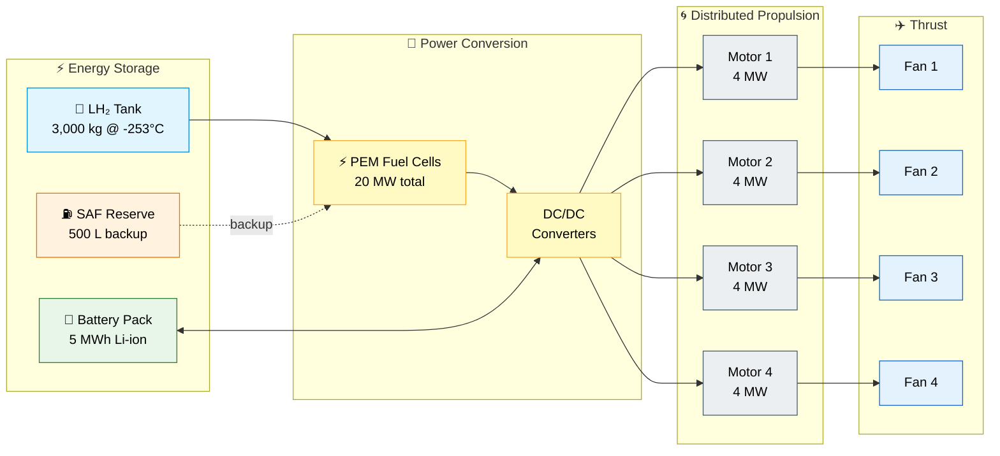
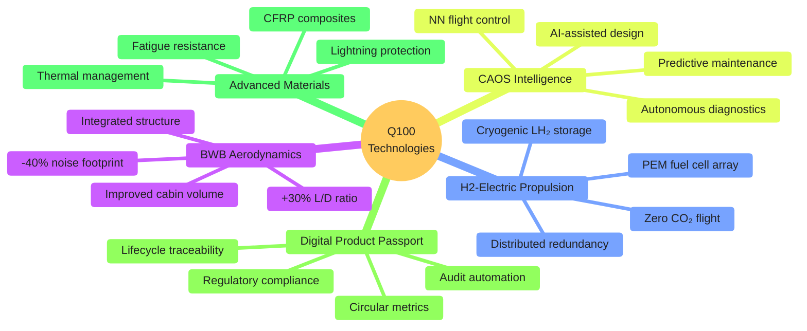

# AMPEL360 BWB-H₂-Hy-E Q100 (AIR-T)

### Revolutionary Blended-Wing-Body Hydrogen-Hybrid Electric Aircraft

  <pre style="line-height:1.2; font-family: monospace;">
█████╗ ███╗   ███╗██████╗ ███████╗██╗     ██████╗  ██████╗  ██████╗
██╔══██╗████╗ ████║██╔══██╗██╔════╝██║     ╚════██╗██╔════╝ ██╔═████╗
███████║██╔████╔██║██████╔╝█████╗  ██║      █████╔╝███████╗ ██║██╔██║
██╔══██║██║╚██╔╝██║██╔═══╝ ██╔══╝  ██║      ╚═══██╗██╔═══██╗████╔╝██║
██║  ██║██║ ╚═╝ ██║██║     ███████╗███████╗██████╔╝╚██████╔╝╚██████╔╝
╚═╝  ╚═╝╚═╝     ╚═╝╚═╝     ╚══════╝╚══════╝╚═════╝  ╚═════╝  ╚═════╝
  </pre>

  
  
  
  
  
  
  
  

  <a href="https://github.com/AmedeoPelliccia/AMPEL360-BWB-H2-Hy-E/wiki">📖 Wiki</a> •
  <a href="https://github. com/AmedeoPelliccia/AMPEL360-BWB-H2-Hy-E/issues">🐛 Issues</a> •
  <a href="https://github.com/AmedeoPelliccia/AMPEL360-BWB-H2-Hy-E/discussions">💬 Discussions</a> •
  <a href="https://v0-ampel-360-aircraft-specification.vercel.app">🌐 Live Docs</a>

---

## 🚀 Overview

**AMPEL360 Q100** is a 100-passenger blended-wing-body aircraft powered by hydrogen-electric propulsion, designed to transform regional aviation through near-zero-emission flight and intelligent decentralization of air traffic. 

### Strategic Mission

| Challenge | Q100 Solution |
|-----------|---------------|
| 🏢 Hub congestion | Point-to-point routes between secondary airports (pop.  100k–500k) |
| 🌍 Overtourism | Distribute connectivity beyond saturated destinations |
| 🌱 Carbon emissions | Zero in-flight CO₂ via hydrogen fuel cells (H₂ → H₂O) |
| 🔊 Noise pollution | −40% community noise through BWB acoustic shielding |

**Example routes:** Bilbao ↔ Lyon · Porto ↔ Bologna · Gdańsk ↔ Toulouse · Gothenburg ↔ Naples

---

## ✈️ Aircraft Specifications

### Performance

| Parameter | Value | Parameter | Value |
|-----------|-------|-----------|-------|
| 👥 Capacity | 100 pax (single) / 90 pax (dual) | 🛫 Range | 3,500 km (1,890 nm) |
| 🚀 Cruise speed | Mach 0. 78 | ⚖️ MTOW | 65,000 kg |
| 📏 Wingspan | 55.0 m | 📐 Length | 42.0 m |
| 🏋️ OEW | 35,000 kg | 📦 Max payload | 17,000 kg |
| 🧊 LH₂ capacity | 3,000 kg | 🔋 Battery | 5 MWh Li-ion |
| ⚡ Fuel cell power | 20 MW | 🌡️ LH₂ temp | −253°C |

### Propulsion Architecture

```mermaid
flowchart LR
    subgraph Storage["⚡ Energy Storage"]
        LH2["🧊 LH₂ Tank<br/>3,000 kg @ -253°C"]
        BAT["🔋 Battery Pack<br/>5 MWh Li-ion"]
        SAF["⛽ SAF Reserve<br/>500 L backup"]
    end

    subgraph Conversion["🔄 Power Conversion"]
        FC["⚡ PEM Fuel Cells<br/>20 MW total"]
        DC["DC/DC<br/>Converters"]
    end

    subgraph Propulsion["🌀 Distributed Propulsion"]
        M1["Motor 1<br/>4 MW"]
        M2["Motor 2<br/>4 MW"]
        M3["Motor 3<br/>4 MW"]
        M4["Motor 4<br/>4 MW"]
    end

    subgraph Output["✈️ Thrust"]
        F1["Fan 1"]
        F2["Fan 2"]
        F3["Fan 3"]
        F4["Fan 4"]
    end

    LH2 --> FC
    FC --> DC
    BAT <--> DC
    SAF -.->|backup| FC
    DC --> M1 & M2 & M3 & M4
    M1 --> F1
    M2 --> F2
    M3 --> F3
    M4 --> F4

    style LH2 fill:#e1f5fe,stroke:#0288d1,color:#000
    style BAT fill:#e8f5e9,stroke:#2e7d32,color:#000
    style SAF fill:#fff3e0,stroke:#ef6c00,color:#000
    style FC fill:#fff9c4,stroke:#f9a825,color:#000
    style DC fill:#fff9c4,stroke:#f9a825,color:#000
    style M1 fill:#eceff1,stroke:#455a64,color:#000
    style M2 fill:#eceff1,stroke:#455a64,color:#000
    style M3 fill:#eceff1,stroke:#455a64,color:#000
    style M4 fill:#eceff1,stroke:#455a64,color:#000
    style F1 fill:#e3f2fd,stroke:#1565c0,color:#000
    style F2 fill:#e3f2fd,stroke:#1565c0,color:#000
    style F3 fill:#e3f2fd,stroke:#1565c0,color:#000
    style F4 fill:#e3f2fd,stroke:#1565c0,color:#000
```

### Structure & Materials

| Component | Material | Benefit |
|-----------|----------|---------|
| **Primary structure** | CFRP (≈65% by weight) | Lightweight, high strength |
| **Configuration** | Blended-wing-body | +30% aerodynamic efficiency |
| **Cabin width** | Up to 22 m | Flexible interior layouts |
| **Fuel tanks** | Cryogenic composite | Safe LH₂ storage |

---

## 🔬 Key Technologies

```mermaid
%%{init: {
  "theme": "base",
  "themeVariables": {
    "primaryTextColor": "#222222",
    "fontFamily": "Inter, Segoe UI, Roboto, sans-serif"
  }
}}%%
mindmap
  root((Q100<br/>Technologies))
    BWB Aerodynamics
      +30% L/D ratio
      Integrated structure
      -40% noise footprint
      Improved cabin volume
    H2-Electric Propulsion
      Zero CO₂ flight
      Cryogenic LH₂ storage
      Distributed redundancy
      PEM fuel cell array
    CAOS Intelligence
      AI-assisted design
      Predictive maintenance
      NN flight control
      Autonomous diagnostics
    Digital Product Passport
      Lifecycle traceability
      Circular metrics
      Audit automation
      Regulatory compliance
    Advanced Materials
      CFRP composites
      Thermal management
      Lightning protection
      Fatigue resistance
```

---

  <i>Last AI update: Added S1000D DML breakdown for ATA 31-00-00 - 2026-01-10</i>

