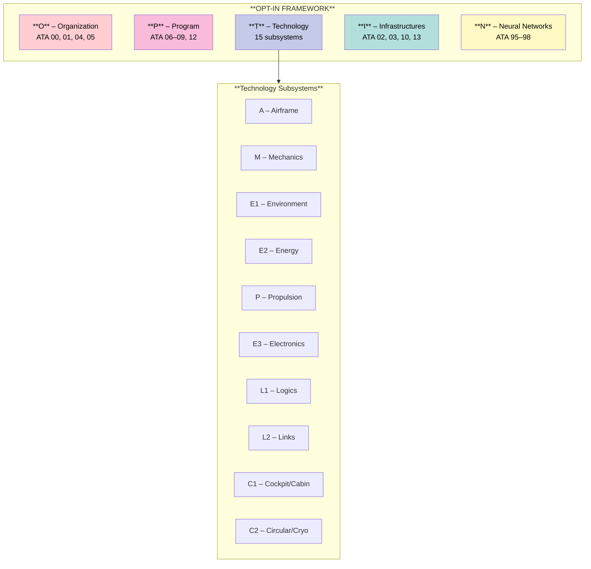
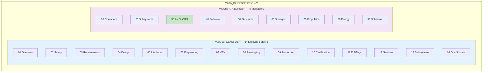
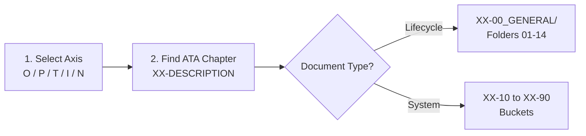
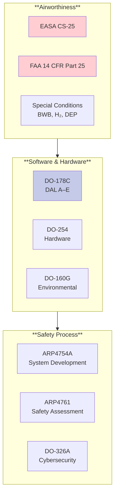

# AMPEL360 BWB-H₂-Hy-E Q100

**Revolutionary Blended-Wing-Body Hydrogen-Hybrid Electric Aircraft**

[](LICENSE)
[](OPT-IN_FRAMEWORK/)
[](#aircraft-specifications)
[](#certification)
[](#roadmap)

---

## Overview

**AMPEL360 Q100** is a 100-passenger blended-wing-body aircraft powered by hydrogen-electric propulsion, designed to transform regional aviation through near-zero-emission flight and intelligent decentralization of air traffic.

### Strategic Mission

| Challenge         | Q100 Solution                                                                 |
|-------------------|-------------------------------------------------------------------------------|
| Hub congestion    | Point-to-point routes between secondary airports (pop. 100k–500k)            |
| Overtourism       | Distribute connectivity beyond saturated destinations                        |
| Carbon emissions  | Zero in-flight CO₂ via hydrogen fuel cells (H₂ → H₂O)                        |

**Example routes:** Bilbao ↔ Lyon · Porto ↔ Bologna · Gdańsk ↔ Toulouse

---

## Aircraft Specifications

### Performance

| Parameter      | Value                         | Parameter      | Value         |
|----------------|-------------------------------|----------------|---------------|
| Capacity       | 100 pax (single) / 90 pax (dual) | Range       | 3,500 km (1,890 nm) |
| Cruise speed   | Mach 0.78                     | MTOW           | 65,000 kg     |
| Wingspan       | 55.0 m                        | Length         | 42.0 m        |
| OEW            | 35,000 kg                     | Max payload    | 17,000 kg     |

### Propulsion Architecture

```mermaid
flowchart LR
    subgraph Storage["**Energy Storage**"]
        LH2["🧊 LH₂ Tank<br/>3,000 kg @ -253°C"]
        BAT["🔋 Battery<br/>5 MWh Li-ion"]
        SAF["⛽ SAF Reserve<br/>500 L"]
    end

    subgraph Conversion["**Power Conversion**"]
        FC["⚡ PEM Fuel Cells<br/>20 MW"]
        DC["DC/DC<br/>Converters"]
    end

    subgraph Propulsion["**Distributed Propulsion**"]
        M1["Motor 1<br/>4 MW"]
        M2["Motor 2<br/>4 MW"]
        M3["Motor 3<br/>4 MW"]
        M4["Motor 4<br/>4 MW"]
    end

    LH2 --> FC
    FC --> DC
    BAT <--> DC
    SAF -.->|backup| FC
    DC --> M1 & M2 & M3 & M4

    style LH2 fill:#e1f5fe
    style FC fill:#fff9c4
    style BAT fill:#c8e6c9
````

### Structure

* **Primary material:** CFRP (≈65% by weight)
* **Configuration:** Blended-wing-body → ~+30% aerodynamic efficiency vs. conventional tube-and-wing
* **Cabin width:** Up to 22 m for flexible interior layouts (single / dual-class concepts)

---

## Key Technologies

```mermaid
%%{init: {
  "theme": "base",
  "themeVariables": {
    "primaryTextColor": "#222222",
    "fontFamily": "Inter,Segoe UI,Roboto,sans-serif"
  }
}}%%
mindmap
  root((Q100<br/>Technologies))
    BWB Aerodynamics
      +30% L/D ratio
      Integrated structure
      -40% noise footprint
    H2-Electric
      Zero CO2 flight
      Cryogenic LH2
      Distributed redundancy
    CAOS
      AI-assisted design
      Predictive maintenance
      NN flight control
    Digital Product Passport
      Lifecycle traceability
      Circular metrics
      Audit automation
```

---

## OPT-IN Framework

The repository implements **OPT-IN Framework v1.1**, a certification-grade documentation topology for AMPEL360.

### Framework Architecture


```mermaid
flowchart TB
    subgraph OPTIN["**OPT-IN FRAMEWORK**"]
        O["**O** – Organization<br/>ATA 00, 01, 04, 05"]
        P["**P** – Program<br/>ATA 06–09, 12"]
        T["**T** – Technology<br/>15 subsystems"]
        I["**I** – Infrastructures<br/>ATA 02, 03, 10, 13"]
        N["**N** – Neural Networks<br/>ATA 95–98"]
    end

    T --> T_SUB

    subgraph T_SUB["**Technology Subsystems**"]
        direction LR
        A["A – Airframe"]
        M["M – Mechanics"]
        E1["E1 – Environment"]
        E2["E2 – Energy"]
        PP["P – Propulsion"]
        E3["E3 – Electronics"]
        L1["L1 – Logics"]
        L2["L2 – Links"]
        C1["C1 – Cockpit/Cabin"]
        C2["C2 – Circular/Cryo"]
    end

    style O fill:#ffcdd2,color:#000
    style P fill:#f8bbd9,color:#000
    style T fill:#c5cae9,color:#000
    style I fill:#b2dfdb,color:#000
    style N fill:#fff9c4,color:#000
```

### ATA Chapter Structure

Every `ATA_XX-DESCRIPTION/` chapter follows a mandatory dual-layer architecture.


```mermaid
flowchart TB
    subgraph ATA["**ATA_XX-DESCRIPTION/**"]
        subgraph GEN["**XX-00_GENERAL** — 14 Lifecycle Folders"]
            G01["01 Overview"]
            G02["02 Safety"]
            G03["03 Requirements"]
            G04["04 Design"]
            G05["05 Interfaces"]
            G06["06 Engineering"]
            G07["07 V&V"]
            G08["08 Prototyping"]
            G09["09 Production"]
            G10["10 Certification"]
            G11["11 EIS/Tags"]
            G12["12 Services"]
            G13["13 Subsystems"]
            G14["14 Ops/Sustain"]
        end

        subgraph BUCKETS["**Cross-ATA Buckets** — 9 Mandatory"]
            B10["10 Operations"]
            B20["20 Subsystems"]
            B30["30 ANCHORS"]
            B40["40 Software"]
            B50["50 Structures"]
            B60["60 Storages"]
            B70["70 Propulsion"]
            B80["80 Energy"]
            B90["90 Schemas"]
        end
    end

    style GEN fill:#e3f2fd
    style BUCKETS fill:#f3e5f5
    style B30 fill:#c8e6c9
```

### Cross-ATA Bucket Definitions

| Bucket            | Purpose                                                         |
| ----------------- | --------------------------------------------------------------- |
| **00 General**    | Governance, standards, configuration & change management        |
| **10 Operations** | Turnaround, ground/flight ops procedures                        |
| **20 Subsystems** | Functional systems; main engineering artefacts                  |
| **30 ANCHORS**    | Sustainability, repairability, LCA, carbon accounting, DPP      |
| **40 Software**   | Embedded apps, controllers, diagnostics, ML/NN                  |
| **50 Structures** | Frames, housings, supports, structural routes                   |
| **60 Storages**   | Tanks, reservoirs, cryogenic vessels                            |
| **70 Propulsion** | Propulsive interface items / couplings                          |
| **80 Energy**     | Electrical/thermal conversion & distribution                    |
| **90 Schemas**    | Data schemas, catalogs, drawing indexes, SDS, training datasets |

---

## Getting Started

### Prerequisites

```bash
python --version  # Requires 3.9+
pip install -r requirements.txt
```

### Repository Navigation


```mermaid
flowchart LR
    A["1. Select Axis<br/>O / P / T / I / N"] --> B["2. Find ATA Chapter<br/>XX-DESCRIPTION"]
    B --> C{"Document Type?"}
    C -->|Lifecycle| D["XX-00_GENERAL/<br/>Folders 01-14"]
    C -->|System|E["XX-10 to XX-90<br/>Buckets"]
```

### Validation Commands

```bash
# Structure compliance (OPT-IN and ATA topology)
python tools/validators/structure_validator.py .

# Drawing naming (Q100 conventions)
python tools/validators/drawing_validator.py <file.svg>

# CI number format
python tools/validators/ci_validator.py <CI-XX-XXX-XXX-XXX>

# Documentation metadata
python tools/validate_documentation_structure.py
```

### Pre-commit Setup

```bash
bash .github/hooks/setup-hooks.sh
# Validates: Q100 model code · Forbidden extensions · DO-178C markers
```

---

## Certification

### Regulatory Framework


```mermaid
flowchart TB
    subgraph Primary["**Airworthiness**"]
        EASA["EASA CS-25"]
        FAA["FAA 14 CFR Part 25"]
        SC["Special Conditions<br/>BWB, H₂, DEP"]
    end

    subgraph SW["**Software & Hardware**"]
        DO178["DO-178C<br/>DAL A–E"]
        DO254["DO-254<br/>Hardware"]
        DO160["DO-160G<br/>Environmental"]
    end

    subgraph Safety["**Safety Process**"]
        ARP4754["ARP4754A<br/>System Development"]
        ARP4761["ARP4761<br/>Safety Assessment"]
        DO326["DO-326A<br/>Cybersecurity"]
    end

    Primary --> SW --> Safety

    style EASA fill:#ffcdd2
    style FAA fill:#ffcdd2
    style DO178 fill:#c5cae9
```

### Documentation Standards

* ATA iSpec 2200
* S1000D
* ISO 15926

---

## Sustainability

| Metric                   | Target                              |
| ------------------------ | ----------------------------------- |
| **Flight CO₂**           | Zero (H₂ fuel cells → H₂O)          |
| **Lifecycle emissions**  | −60% vs. conventional regional jets |
| **Community noise**      | −40% (BWB acoustic shielding)       |
| **End-of-life recovery** | ≥85% materials recyclable           |

Every chapter includes `XX-30_ANCHORS/` for LCA, carbon accounting and DPP integration.

---

## Repository Statistics

| Metric                      | Value  |
| --------------------------- | ------ |
| ATA chapters                | 83     |
| OPT-IN axes                 | 5      |
| Technology subsystems       | 15     |
| Lifecycle folders / chapter | 14     |
| Cross-ATA buckets / chapter | 9      |
| Total folders               | 1,162  |
| Documentation files         | 1,900+ |

---

## Key Documentation

| Document                                                                   | Description                            |
| -------------------------------------------------------------------------- | -------------------------------------- |
| [`OPT-IN_FRAMEWORK_STANDARD.md`](OPT-IN_FRAMEWORK_STANDARD.md)             | Mandatory structure & validation rules |
| [`AMPEL360_DOCUMENTATION_STANDARD.md`](AMPEL360_DOCUMENTATION_STANDARD.md) | Writing conventions                    |
| [`AI-ASI-TP.md`](AI-ASI-TP.md)                                             | AI integration strategy                |
| [`DIGITAL_TWIN_CONTROL_LOOP.md`](DIGITAL_TWIN_CONTROL_LOOP.md)             | Digital twin architecture              |
| [`CAOS/CAOS_OPERATIONS_FRAMEWORK.md`](CAOS/CAOS_OPERATIONS_FRAMEWORK.md)   | CAOS cognitive operations system       |
| [`.github/copilot.md`](.github/copilot.md)                                 | GitHub Copilot / Agent integration     |

---

## Tools

```text
tools/
├── validators/              # Structure, drawing, CI validation
├── ci/                      # CI/CD scripts
├── doc-meta-enforcer-mcp/   # Document control MCP server
├── cgrow/                   # C-GROWTH living doc lifecycle
├── genccc/                  # Cross-reference & doc generation
└── schemas/                 # JSON/YAML validation schemas
```

---

## Contributing

We welcome contributions from aerospace engineers, software developers and documentation specialists.

1. Read [`OPT-IN_FRAMEWORK_STANDARD.md`](OPT-IN_FRAMEWORK_STANDARD.md)
2. Follow the mandatory structure and naming conventions
3. Run validation tools before committing
4. Update traceability matrices when adding or modifying artefacts

**Areas:** Technical documentation · V&V evidence · Certification artefacts · Sustainability / LCA · Software / ML · Infrastructure

---

## License

```text
Copyright 2025 AMPEL360 Program
Concept and Direction: Amedeo Pelliccia

Licensed under the Apache License, Version 2.0.
You may not use this project except in compliance with the License.
```

See [LICENSE](LICENSE) for full terms.

---

## Links

| Resource    | URL                                                                                                                                                                                        |
| ----------- | ------------------------------------------------------------------------------------------------------------------------------------------------------------------------------------------ |
| Issues      | [https://github.com/AmedeoPelliccia/AMPEL360-BWB-H2-Hy-E/issues](https://github.com/AmedeoPelliccia/AMPEL360-BWB-H2-Hy-E/issues)                                                           |
| Discussions | [https://github.com/AmedeoPelliccia/AMPEL360-BWB-H2-Hy-E/discussions](https://github.com/AmedeoPelliccia/AMPEL360-BWB-H2-Hy-E/discussions)                                                 |
| Wiki        | [https://github.com/AmedeoPelliccia/AMPEL360-BWB-H2-Hy-E/wiki](https://github.com/AmedeoPelliccia/AMPEL360-BWB-H2-Hy-E/wiki)                                                               |
| EASA CS-25  | [https://www.easa.europa.eu/document-library/certification-specifications/cs-25-amendment-27](https://www.easa.europa.eu/document-library/certification-specifications/cs-25-amendment-27) |
| DO-178C     | [https://www.rtca.org/content/standards-guidance-documents](https://www.rtca.org/content/standards-guidance-documents)                                                                     |

---

**AMPEL360** — Aviation Model by Proactive Engineering Leaders

*Enabling hydrogen-electric, AI-orchestrated, carbon-negative commercial aviation.*

**Q100** — Quantum-scale leap in regional sustainable aviation.

---

*Document control: Version 2.0 · Status: ACTIVE · Last update: 2025-12-01*
*Generated with AI assistance, prompted by Amedeo Pelliccia.*

```


