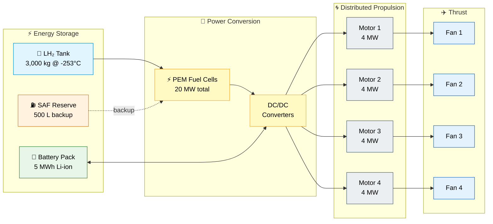
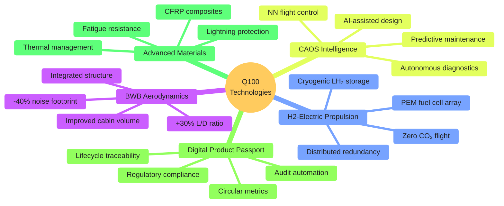
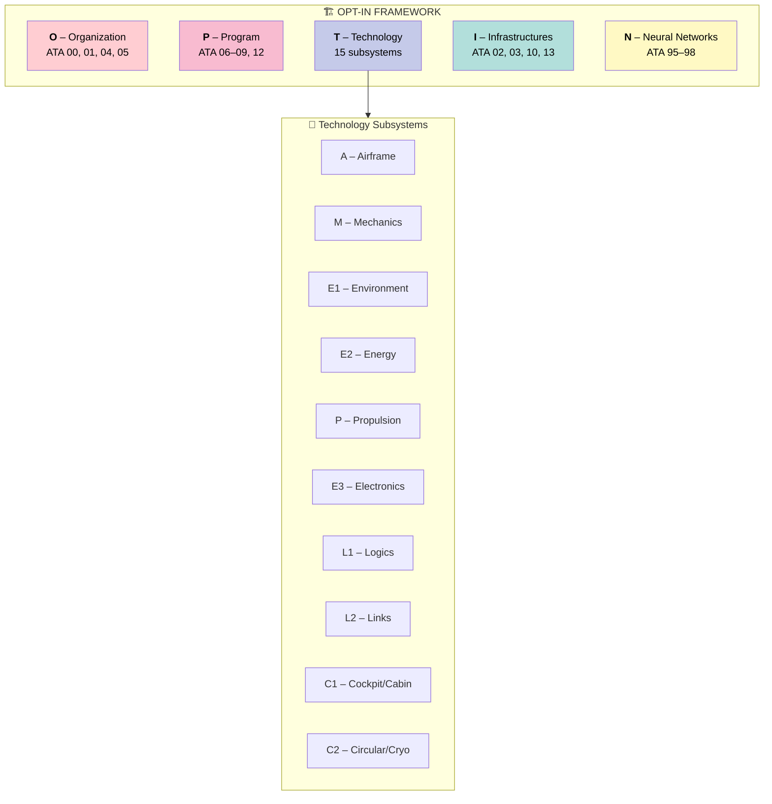
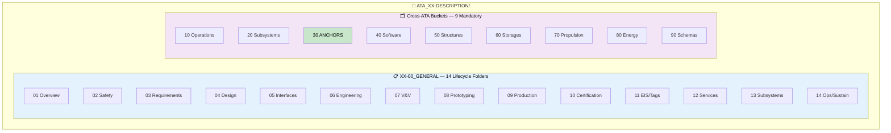
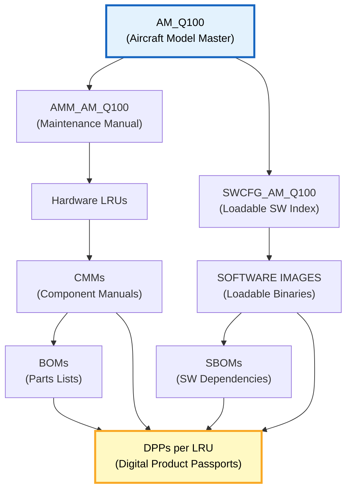
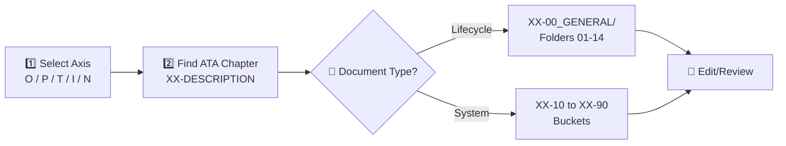
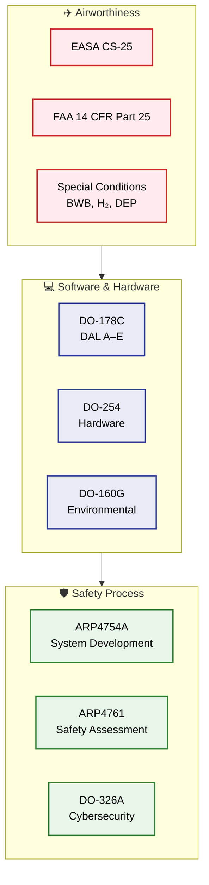
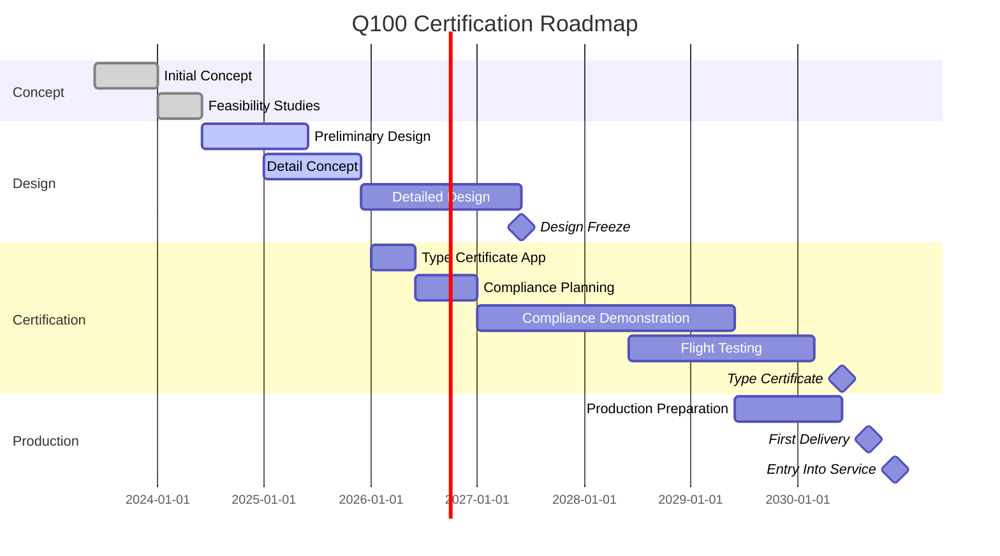
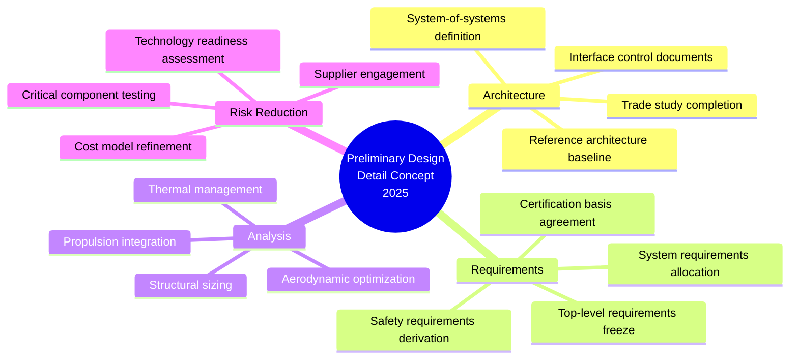
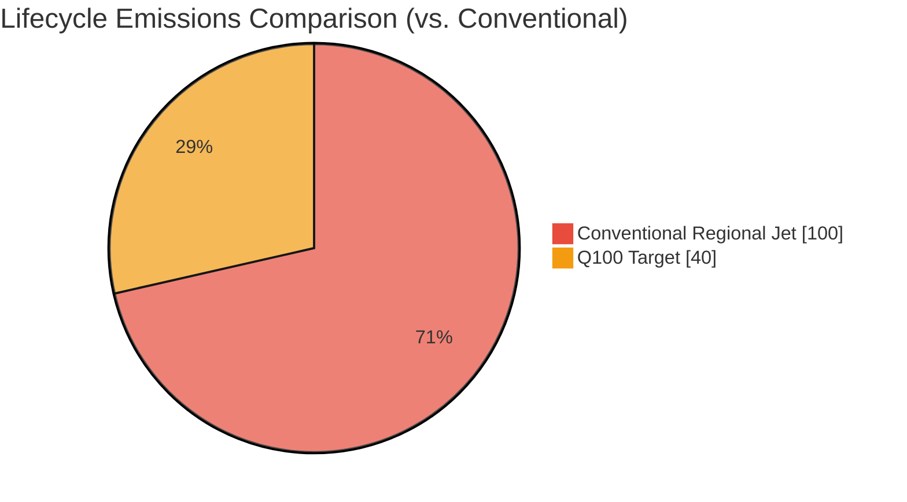

# AMPEL360 BWB-H₂-Hy-E Q100 (AIR-T)

### Revolutionary Blended-Wing-Body Hydrogen-Hybrid Electric Aircraft

<p align="center">
  <pre style="line-height:1.2; font-family: monospace;">
<span style="color:#2196F3">█████╗ </span><span style="color:#4CAF50">███╗   ███╗</span><span style="color:#FF9800">██████╗ </span><span style="color:#E91E63">███████╗</span><span style="color:#9C27B0">██╗     </span><span style="color:#00BCD4">██████╗  ██████╗  ██████╗</span>
<span style="color:#2196F3">██╔══██╗</span><span style="color:#4CAF50">████╗ ████║</span><span style="color:#FF9800">██╔══██╗</span><span style="color:#E91E63">██╔════╝</span><span style="color:#9C27B0">██║     </span><span style="color:#00BCD4">╚════██╗██╔════╝ ██╔═████╗</span>
<span style="color:#2196F3">███████║</span><span style="color:#4CAF50">██╔████╔██║</span><span style="color:#FF9800">██████╔╝</span><span style="color:#E91E63">█████╗  </span><span style="color:#9C27B0">██║      </span><span style="color:#00BCD4">█████╔╝███████╗ ██║██╔██║</span>
<span style="color:#2196F3">██╔══██║</span><span style="color:#4CAF50">██║╚██╔╝██║</span><span style="color:#FF9800">██╔═══╝ </span><span style="color:#E91E63">██╔══╝  </span><span style="color:#9C27B0">██║      </span><span style="color:#00BCD4">╚═══██╗██╔═══██╗████╔╝██║</span>
<span style="color:#2196F3">██║  ██║</span><span style="color:#4CAF50">██║ ╚═╝ ██║</span><span style="color:#FF9800">██║     </span><span style="color:#E91E63">███████╗</span><span style="color:#9C27B0">███████╗</span><span style="color:#00BCD4">██████╔╝╚██████╔╝╚██████╔╝</span>
<span style="color:#2196F3">╚═╝  ╚═╝</span><span style="color:#4CAF50">╚═╝     ╚═╝</span><span style="color:#FF9800">╚═╝     </span><span style="color:#E91E63">╚══════╝</span><span style="color:#9C27B0">╚══════╝</span><span style="color:#00BCD4">╚═════╝  ╚═════╝  ╚═════╝</span>
  </pre>
</p>

<p align="center">
  <a href="LICENSE"></a>
  <a href="OPT-IN_FRAMEWORK_STANDARD.md"></a>
  
  
  
  
  
  
</p>

<p align="center">
  <a href="https://github.com/AmedeoPelliccia/AMPEL360-BWB-H2-Hy-E/wiki">📖 Wiki</a> •
  <a href="https://github. com/AmedeoPelliccia/AMPEL360-BWB-H2-Hy-E/issues">🐛 Issues</a> •
  <a href="https://github.com/AmedeoPelliccia/AMPEL360-BWB-H2-Hy-E/discussions">💬 Discussions</a> •
  <a href="https://v0-ampel-360-aircraft-specification.vercel.app">🌐 Live Docs</a>
</p>

---

## 🚀 Overview

**AMPEL360 Q100** is a 100-passenger blended-wing-body aircraft powered by hydrogen-electric propulsion, designed to transform regional aviation through near-zero-emission flight and intelligent decentralization of air traffic. 

> 📍 **Current Phase:** Preliminary Design / Detail Concept (December 2025)

### Strategic Mission

| Challenge | Q100 Solution |
|-----------|---------------|
| 🏢 Hub congestion | Point-to-point routes between secondary airports (pop.  100k–500k) |
| 🌍 Overtourism | Distribute connectivity beyond saturated destinations |
| 🌱 Carbon emissions | Zero in-flight CO₂ via hydrogen fuel cells (H₂ → H₂O) |
| 🔊 Noise pollution | −40% community noise through BWB acoustic shielding |

**Example routes:** Bilbao ↔ Lyon · Porto ↔ Bologna · Gdańsk ↔ Toulouse · Gothenburg ↔ Naples

---

## ✈️ Aircraft Specifications

### Performance

| Parameter | Value | Parameter | Value |
|-----------|-------|-----------|-------|
| 👥 Capacity | 100 pax (single) / 90 pax (dual) | 🛫 Range | 3,500 km (1,890 nm) |
| 🚀 Cruise speed | Mach 0. 78 | ⚖️ MTOW | 65,000 kg |
| 📏 Wingspan | 55.0 m | 📐 Length | 42.0 m |
| 🏋️ OEW | 35,000 kg | 📦 Max payload | 17,000 kg |
| 🧊 LH₂ capacity | 3,000 kg | 🔋 Battery | 5 MWh Li-ion |
| ⚡ Fuel cell power | 20 MW | 🌡️ LH₂ temp | −253°C |

### Propulsion Architecture


```mermaid
flowchart LR
    subgraph Storage["⚡ Energy Storage"]
        LH2["🧊 LH₂ Tank<br/>3,000 kg @ -253°C"]
        BAT["🔋 Battery Pack<br/>5 MWh Li-ion"]
        SAF["⛽ SAF Reserve<br/>500 L backup"]
    end

    subgraph Conversion["🔄 Power Conversion"]
        FC["⚡ PEM Fuel Cells<br/>20 MW total"]
        DC["DC/DC<br/>Converters"]
    end

    subgraph Propulsion["🌀 Distributed Propulsion"]
        M1["Motor 1<br/>4 MW"]
        M2["Motor 2<br/>4 MW"]
        M3["Motor 3<br/>4 MW"]
        M4["Motor 4<br/>4 MW"]
    end

    subgraph Output["✈️ Thrust"]
        F1["Fan 1"]
        F2["Fan 2"]
        F3["Fan 3"]
        F4["Fan 4"]
    end

    LH2 --> FC
    FC --> DC
    BAT <--> DC
    SAF -.->|backup| FC
    DC --> M1 & M2 & M3 & M4
    M1 --> F1
    M2 --> F2
    M3 --> F3
    M4 --> F4

    style LH2 fill:#e1f5fe,stroke:#0288d1,color:#000
    style BAT fill:#e8f5e9,stroke:#2e7d32,color:#000
    style SAF fill:#fff3e0,stroke:#ef6c00,color:#000
    style FC fill:#fff9c4,stroke:#f9a825,color:#000
    style DC fill:#fff9c4,stroke:#f9a825,color:#000
    style M1 fill:#eceff1,stroke:#455a64,color:#000
    style M2 fill:#eceff1,stroke:#455a64,color:#000
    style M3 fill:#eceff1,stroke:#455a64,color:#000
    style M4 fill:#eceff1,stroke:#455a64,color:#000
    style F1 fill:#e3f2fd,stroke:#1565c0,color:#000
    style F2 fill:#e3f2fd,stroke:#1565c0,color:#000
    style F3 fill:#e3f2fd,stroke:#1565c0,color:#000
    style F4 fill:#e3f2fd,stroke:#1565c0,color:#000
```

### Structure & Materials

| Component | Material | Benefit |
|-----------|----------|---------|
| **Primary structure** | CFRP (≈65% by weight) | Lightweight, high strength |
| **Configuration** | Blended-wing-body | +30% aerodynamic efficiency |
| **Cabin width** | Up to 22 m | Flexible interior layouts |
| **Fuel tanks** | Cryogenic composite | Safe LH₂ storage |

---

## 🔬 Key Technologies


```mermaid
%%{init: {
  "theme": "base",
  "themeVariables": {
    "primaryTextColor": "#222222",
    "fontFamily": "Inter, Segoe UI, Roboto, sans-serif"
  }
}}%%
mindmap
  root((Q100<br/>Technologies))
    BWB Aerodynamics
      +30% L/D ratio
      Integrated structure
      -40% noise footprint
      Improved cabin volume
    H2-Electric Propulsion
      Zero CO₂ flight
      Cryogenic LH₂ storage
      Distributed redundancy
      PEM fuel cell array
    CAOS Intelligence
      AI-assisted design
      Predictive maintenance
      NN flight control
      Autonomous diagnostics
    Digital Product Passport
      Lifecycle traceability
      Circular metrics
      Audit automation
      Regulatory compliance
    Advanced Materials
      CFRP composites
      Thermal management
      Lightning protection
      Fatigue resistance
```

---

## 📚 OPT-IN Framework

The repository implements **OPT-IN Framework v1.1**, a certification-grade documentation topology for AMPEL360. 

### Framework Architecture


```mermaid
flowchart TB
    subgraph OPTIN["🏗️ OPT-IN FRAMEWORK"]
        O["<b>O</b> – Organization<br/>ATA 00, 01, 04, 05"]
        P["<b>P</b> – Program<br/>ATA 06–09, 12"]
        T["<b>T</b> – Technology<br/>15 subsystems"]
        I["<b>I</b> – Infrastructures<br/>ATA 02, 03, 10, 13"]
        N["<b>N</b> – Neural Networks<br/>ATA 95–98"]
    end

    T --> T_SUB

    subgraph T_SUB["🔧 Technology Subsystems"]
        direction LR
        A["A – Airframe"]
        M["M – Mechanics"]
        E1["E1 – Environment"]
        E2["E2 – Energy"]
        PP["P – Propulsion"]
        E3["E3 – Electronics"]
        L1["L1 – Logics"]
        L2["L2 – Links"]
        C1["C1 – Cockpit/Cabin"]
        C2["C2 – Circular/Cryo"]
    end

    style O fill:#ffcdd2,color:#000
    style P fill:#f8bbd0,color:#000
    style T fill:#c5cae9,color:#000
    style I fill:#b2dfdb,color:#000
    style N fill:#fff9c4,color:#000
```

### ATA Chapter Structure

Every `ATA_XX-DESCRIPTION/` chapter follows a mandatory dual-layer architecture:


```mermaid
flowchart TB
    subgraph ATA["📁 ATA_XX-DESCRIPTION/"]
        subgraph GEN["📋 XX-00_GENERAL — 14 Lifecycle Folders"]
            G01["01 Overview"]
            G02["02 Safety"]
            G03["03 Requirements"]
            G04["04 Design"]
            G05["05 Interfaces"]
            G06["06 Engineering"]
            G07["07 V&V"]
            G08["08 Prototyping"]
            G09["09 Production"]
            G10["10 Certification"]
            G11["11 EIS/Tags"]
            G12["12 Services"]
            G13["13 Subsystems"]
            G14["14 Ops/Sustain"]
        end

        subgraph BUCKETS["🗂️ Cross-ATA Buckets — 9 Mandatory"]
            B10["10 Operations"]
            B20["20 Subsystems"]
            B30["30 ANCHORS"]
            B40["40 Software"]
            B50["50 Structures"]
            B60["60 Storages"]
            B70["70 Propulsion"]
            B80["80 Energy"]
            B90["90 Schemas"]
        end
    end

    style GEN fill:#e3f2fd,color:#000
    style BUCKETS fill:#f3e5f5,color:#000
    style B30 fill:#c8e6c9,color:#000
```

### Cross-ATA Bucket Definitions

| Bucket | Purpose |
|--------|---------|
| **00 General** | Governance, standards, configuration & change management |
| **10 Operations** | Turnaround, ground/flight ops procedures |
| **20 Subsystems** | Functional systems; main engineering artefacts |
| **30 ANCHORS** | 🌱 Sustainability, repairability, LCA, carbon accounting, DPP |
| **40 Software** | Embedded apps, controllers, diagnostics, ML/NN |
| **50 Structures** | Frames, housings, supports, structural routes |
| **60 Storages** | Tanks, reservoirs, cryogenic vessels |
| **70 Propulsion** | Propulsive interface items / couplings |
| **80 Energy** | Electrical/thermal conversion & distribution |
| **90 Schemas** | Data schemas, catalogs, drawing indexes, SDS, training datasets |

---

## 🏷️ AM (Aircraft Model) - Top-Level Identity System

**AM** (Aircraft Model / Aircraft Master) is the canonical top-level technical identity for AMPEL360 aircraft. All documentation, software configuration, maintenance manuals, and Digital Product Passports reference **AM** as the root parent.

### Aircraft Model Hierarchy


```mermaid
flowchart TD
    AM["AM_Q100<br/>(Aircraft Model Master)"]
    
    AMM["AMM_AM_Q100<br/>(Maintenance Manual)"]
    SWCFG["SWCFG_AM_Q100<br/>(Loadable SW Index)"]
    
    HW["Hardware LRUs"]
    CMM["CMMs<br/>(Component Manuals)"]
    BOM["BOMs<br/>(Parts Lists)"]
    
    IMAGES["SOFTWARE IMAGES<br/>(Loadable Binaries)"]
    SBOM["SBOMs<br/>(SW Dependencies)"]
    
    DPP["DPPs per LRU<br/>(Digital Product Passports)"]
    
    AM --> AMM
    AM --> SWCFG
    
    AMM --> HW
    HW --> CMM
    CMM --> BOM
    
    SWCFG --> IMAGES
    IMAGES --> SBOM
    
    CMM --> DPP
    IMAGES --> DPP
    BOM --> DPP
    SBOM --> DPP
    
    style AM fill:#e3f2fd,stroke:#1565c0,stroke-width:3px,color:#000
    style DPP fill:#fff9c4,stroke:#f9a825,stroke-width:3px,color:#000
```

### Naming Conventions

| Artifact Type | Pattern | Example |
|---------------|---------|---------|
| **Aircraft Model** | `AM_{MODEL_ID}` | `AM_Q100`, `AM_Q80`, `AM_Q120` |
| **Aircraft Maintenance Manual** | `AMM_AM_{MODEL}_{REV}_{LANG}` | `AMM_AM_Q100_R01_EN.pdf` |
| **Software Config Index** | `SWCFG_AM_{MODEL}_Loadable_Software_Index_v{VER}` | `SWCFG_AM_Q100_Loadable_Software_Index_v1.0.json` |
| **Component Maintenance Manual** | `CMM_{ATA}_{LRU}_{PN}_{REV}` | `CMM_34-20_CAMCTL01_PN4567D_R02.pdf` |
| **Bill of Materials** | `BOM_{ATA}_{LRU}_{PN}_{REV}.csv` | `BOM_34-20_CAMCTL01_PN4567D_R02.csv` |
| **Software Image** | `IMAGE_{ATA}_{LRU}_{SWPN}_v{VER}` | `IMAGE_34-20_CAMCTL01_SWPN4455_v2.0.bin` |
| **Software BOM** | `SBOM_IMAGE_{ATA}_{LRU}_{SWPN}_v{VER}.spdx.json` | `SBOM_IMAGE_34-20_CAMCTL01_SWPN4455_v2.0.spdx.json` |
| **Digital Product Passport** | `DPP_{ATA}_{LRU}_{PN}_v{VER}` | `DPP_34-20_CAMCTL01_PN4567D_v1.0.json` |

### Aircraft Family Members

| AM ID | Description | Capacity | Range (km) | Status |
|-------|-------------|----------|-----------|---------|
| **AM_Q100** | Standard configuration | 100 pax | 3,500 | **Active development** |
| **AM_Q80** | Compact variant | 80 pax | 3,200 | Concept |
| **AM_Q120** | Extended capacity | 120 pax | 3,000 | Concept |

### Complete Example: Wingtip Camera Unit

A fully instantiated reference example is available in [`examples/am_aircraft_model/`](examples/am_aircraft_model/):

- **AM_Q100.json** - Aircraft master definition
- **AMM_AM_Q100_R01_manifest.json** - Maintenance manual manifest
- **SWCFG_AM_Q100_Loadable_Software_Index_v1.0.json** - Complete software index
- **CMM_34-20_CAMCTL01_PN4567D_R02_manifest.json** - Component manual
- **BOM_34-20_CAMCTL01_PN4567D_R02.csv** - Bill of materials (25 parts)
- **IMAGE_34-20_CAMCTL01_SWPN4455_v2.0_manifest.json** - Software image
- **SBOM_IMAGE_34-20_CAMCTL01_SWPN4455_v2.0.spdx.json** - SPDX 2.3 SBOM
- **DPP_34-20_CAMCTL01_PN4567D_v1.0.json** - Complete digital product passport

See the [AM Aircraft Model Examples README](examples/am_aircraft_model/README.md) for detailed documentation.

---

## 🏁 Getting Started

### Prerequisites

```bash
# Check Python version (requires 3.9+)
python --version

# Install dependencies
pip install -r requirements.txt

# Optional: Setup pre-commit hooks
bash . github/hooks/setup-hooks.sh
```

### Repository Navigation


```mermaid
flowchart LR
    A["1️⃣ Select Axis<br/>O / P / T / I / N"] --> B["2️⃣ Find ATA Chapter<br/>XX-DESCRIPTION"]
    B --> C{"📄 Document Type? "}
    C -->|Lifecycle| D["XX-00_GENERAL/<br/>Folders 01-14"]
    C -->|System| E["XX-10 to XX-90<br/>Buckets"]
    D --> F["📝 Edit/Review"]
    E --> F
```

### Quick Start Examples

```bash
# Navigate to fuel system design
cd ATA_28-FUEL/28-00_GENERAL/04_Design/

# Navigate to propulsion subsystems
cd ATA_70-PROPULSION/70-20_Subsystems/

# Navigate to sustainability anchors
cd ATA_28-FUEL/28-30_ANCHORS/
```

### Validation Commands

```bash
# Structure compliance (OPT-IN and ATA topology)
python tools/validators/structure_validator.py . 

# Drawing naming (Q100 conventions)
python tools/validators/drawing_validator.py <file.svg>

# CI number format
python tools/validators/ci_validator.py <CI-XX-XXX-XXX-XXX>

# Documentation metadata
python tools/validate_documentation_structure.py

# Full validation suite
python tools/validators/run_all. py --verbose
```

---

## 🏛️ Certification

### Regulatory Framework


```mermaid
flowchart TB
    subgraph Primary["✈️ Airworthiness"]
        EASA["EASA CS-25"]
        FAA["FAA 14 CFR Part 25"]
        SC["Special Conditions<br/>BWB, H₂, DEP"]
    end

    subgraph SW["💻 Software & Hardware"]
        DO178["DO-178C<br/>DAL A–E"]
        DO254["DO-254<br/>Hardware"]
        DO160["DO-160G<br/>Environmental"]
    end

    subgraph Safety["🛡️ Safety Process"]
        ARP4754["ARP4754A<br/>System Development"]
        ARP4761["ARP4761<br/>Safety Assessment"]
        DO326["DO-326A<br/>Cybersecurity"]
    end

    Primary --> SW --> Safety

    style EASA fill:#ffebee,stroke:#c62828,stroke-width:2px,color:#000
    style FAA fill:#ffebee,stroke:#c62828,stroke-width:2px,color:#000
    style SC fill:#ffebee,stroke:#c62828,stroke-width:2px,color:#000
    style DO178 fill:#e8eaf6,stroke:#283593,stroke-width:2px,color:#000
    style DO254 fill:#e8eaf6,stroke:#283593,stroke-width:2px,color:#000
    style DO160 fill:#e8eaf6,stroke:#283593,stroke-width:2px,color:#000
    style ARP4754 fill:#e8f5e9,stroke:#2e7d32,stroke-width:2px,color:#000
    style ARP4761 fill:#e8f5e9,stroke:#2e7d32,stroke-width:2px,color:#000
    style DO326 fill:#e8f5e9,stroke:#2e7d32,stroke-width:2px,color:#000
```

### Documentation Standards

| Standard | Application |
|----------|-------------|
| **ATA iSpec 2200** | Chapter structure and numbering |
| **S1000D** | Technical publications |
| **ISO 15926** | Industrial data exchange |
| **DO-178C** | Software development assurance |
| **ARP4754A** | System development process |

#### S1000D CSDB Structure

Technical publications follow **S1000D Issue 5.0** with a standardized **Common Source Database (CSDB)** structure:

```
PUB/
├── AMM/CSDB/           # Aircraft Maintenance Manual
│   ├── DM/             # Data Modules - Individual documentation units (procedures, descriptions, etc.)
│   ├── PM/             # Publication Modules - Define the structure of publications
│   ├── DML/            # Data Module Lists - Organize and reference groups of data modules
│   ├── ICN/            # Illustrations/Graphics - All graphical content (ICN = Illustration Control Number)
│   ├── BREX/           # Business Rules Exchange - Validation rules and constraints
│   ├── COMMON/         # Common Information Sets - Reusable content snippets
│   └── APPLICABILITY/  # Applicability Statements - Product variant and configuration applicability
│
└── IPC/CSDB/           # Illustrated Parts Catalog
    ├── DM/             # Data Modules - Individual documentation units (parts lists, descriptions, etc.)
    ├── PM/             # Publication Modules - Define the structure of publications
    ├── DML/            # Data Module Lists - Organize and reference groups of data modules
    ├── ICN/            # Illustrations/Graphics - All graphical content (ICN = Illustration Control Number)
    ├── BREX/           # Business Rules Exchange - Validation rules and constraints
    ├── COMMON/         # Common Information Sets - Reusable content snippets
    └── APPLICABILITY/  # Applicability Statements - Product variant and configuration applicability
```

**Example Path**: 
`OPT-IN_FRAMEWORK/T-TECHNOLOGY_AMEDEOPELLICCIA-ON_BOARD_SYSTEMS/L1-LOGICS/ATA_22-AUTOFLIGHT/ATA-22-auto-flight/22-00-auto-flight-general/22-00-00-auto-flight-general/PUB/AMM/CSDB/`

#### S1000D COMMON Directory — Reusable Content Primitives

The **COMMON/** directory within each CSDB contains **atomic, reusable information objects** that ensure consistency and avoid duplication across Data Modules (DMs). This is a complete, S1000D-compliant implementation for **ATA 31 – Indicating & Recording**.

**Location**: 
`OPT-IN_FRAMEWORK/T-TECHNOLOGY_AMEDEOPELLICCIA-ON_BOARD_SYSTEMS/D-DATA/ATA_31-INDICATING_RECORDING/ATA-31-indicating-recording/31-00-indicating-recording-general/31-00-00-general/PUB/AMM/CSDB/COMMON/`

##### COMMON Content Categories

The ATA 31-00-00 COMMON directory includes 13 S1000D-compliant XML files organized into 5 categories:

**1. Safety & Operational Statements** (3 files)
```
COM-AMPEL360AT-SAFETY-GENERAL-WARNINGS_EN-US_001-00.XML
COM-AMPEL360AT-SAFETY-ELECTRICAL-HAZARDS_EN-US_001-00.XML
COM-AMPEL360AT-SAFETY-DATA-INTEGRITY_EN-US_001-00.XML
```
- Critical safety warnings for flight instruments, FDR/CVR integrity, electrical hazards
- Referenced by: Maintenance tasks (520A/520B), fault isolation (730A), software config (940A)

**2. Standard Definitions & Terminology** (3 files)
```
COM-AMPEL360AT-DEFINITION-INDICATIONS_EN-US_001-00.XML
COM-AMPEL360AT-DEFINITION-RECORDING-LOGIC_EN-US_001-00.XML
COM-AMPEL360AT-DEFINITION-BIT-STATUS_EN-US_001-00.XML
```
- Single source of truth for cockpit indication language
- Definitions: Indication vs Alert vs Message, Warning vs Caution vs Advisory
- Recording terminology: FDR, CVR, QAR, snapshots, logging, data frames
- BIT definitions: CBIT, PBIT, IBIT, fault codes, NFF, latent faults

**3. HMI Conventions** (3 files) — *per SAE ARP4102, ARINC 661*
```
COM-AMPEL360AT-HMI-COLOR-CODING_EN-US_001-00.XML
COM-AMPEL360AT-HMI-SYMBOLS-LEGEND_EN-US_001-00.XML
COM-AMPEL360AT-HMI-PRIORITY-LEVELS_EN-US_001-00.XML
```
- Display color standards: RED=warning, AMBER=caution, GREEN=normal, CYAN=advisory
- Standard symbology and iconography for PFD, MFD, EICAS displays
- Alert priority classification, suppression logic, aural alert standards

**4. Standard Maintenance Practices** (2 files)
```
COM-AMPEL360AT-MAINT-POWER-ON-OFF_EN-US_001-00.XML
COM-AMPEL360AT-MAINT-DATA-BUS-CONNECTION_EN-US_001-00.XML
```
- Aircraft power-up/power-down procedures for maintenance
- Data bus connector inspection, ARINC 429/664 (AFDX) testing, troubleshooting

**5. Software & Data Handling** (2 files) — *per DO-178C, DO-326A*
```
COM-AMPEL360AT-SW-DATA-HANDLING-GENERAL_EN-US_001-00.XML
COM-AMPEL360AT-SW-CONFIGURATION-CONTROL_EN-US_001-00.XML
```
- Software loading security, data download/handling, integrity validation
- Configuration management, change control, CCB procedures, traceability

##### Usage Pattern

Data Modules reference COMMON files via `<commonInfoRef>`:

```xml
<commonInfoRef>
  <infoEntityIdent>
    <infoEntityCode>COM-AMPEL360AT-SAFETY-GENERAL-WARNINGS_EN-US_001-00</infoEntityCode>
  </infoEntityIdent>
</commonInfoRef>
```

This ensures:
- ✅ No content duplication across DMs
- ✅ Single source of truth for warnings, definitions, procedures
- ✅ Consistent terminology across all technical publications
- ✅ Simplified maintenance (update once, applies everywhere)

##### Cross-ATA Reuse

COMMON files are designed for reuse across multiple ATA chapters:

| ATA Chapter | Reuses From ATA 31 COMMON |
|-------------|---------------------------|
| **ATA 22** (Auto Flight) | HMI conventions, BIT definitions |
| **ATA 23** (Communications) | Data bus procedures, electrical hazards |
| **ATA 34** (Navigation) | Software configuration control, HMI standards |

##### Governance & BREX Compliance

COMMON modules comply with Business Rules Exchange (BREX) constraints:

- ✅ Must be language-scoped (EN-US, FR-FR, etc.)
- ✅ Must be referenced, never embedded
- ✅ Must include S1000D metadata and document control
- ❌ Must NOT contain ATA-specific task sequences
- ❌ Must NOT include procedural steps with task logic
- 📝 Must include `<reasonForUpdate>` on every change

For complete documentation, see: [`COMMON/README.md`](OPT-IN_FRAMEWORK/T-TECHNOLOGY_AMEDEOPELLICCIA-ON_BOARD_SYSTEMS/D-DATA/ATA_31-INDICATING_RECORDING/ATA-31-indicating-recording/31-00-indicating-recording-general/31-00-00-general/PUB/AMM/CSDB/COMMON/README.md)

### Certification Timeline

> 📍 **Current Phase:** Preliminary Design / Detail Concept (December 2025)


```mermaid
gantt
    title Q100 Certification Roadmap
    dateFormat  YYYY-MM
    todayMarker stroke-width:3px,stroke:#ff0000
    section Concept
    Initial Concept           :done, 2023-06, 2024-01
    Feasibility Studies       :done, 2024-01, 2024-06
    section Design
    Preliminary Design        :active, 2024-06, 2025-06
    Detail Concept            :active, 2025-01, 2025-12
    Detailed Design           :2025-12, 2027-06
    Design Freeze             :milestone, 2027-06, 0d
    section Certification
    Type Certificate App      :2026-01, 2026-06
    Compliance Planning       :2026-06, 2027-01
    Compliance Demonstration  :2027-01, 2029-06
    Flight Testing            :2028-06, 2030-03
    Type Certificate          :milestone, 2030-06, 0d
    section Production
    Production Preparation    :2029-06, 2030-06
    First Delivery            :milestone, 2030-09, 0d
    Entry Into Service        :milestone, 2030-12, 0d
```

### Current Phase Summary

| Phase | Status | Timeline | Key Deliverables |
|-------|--------|----------|------------------|
| ✅ Initial Concept | Complete | 2023-H2 | Mission definition, market analysis |
| ✅ Feasibility Studies | Complete | 2024-H1 | Technical feasibility, business case |
| 🔄 Preliminary Design | **Active** | 2024-H2 → 2025-H1 | Reference architecture, trade studies |
| 🔄 Detail Concept | **Active** | 2025 | System specifications, interface definitions |
| ⏳ Detailed Design | Planned | 2026-2027 | Full design package, certification basis |
| ⏳ Type Certification | Planned | 2026-2030 | TC application, compliance, flight test |
| ⏳ Entry Into Service | Planned | 2030-Q4 | First commercial flight |

### Current Phase Objectives


```mermaid
mindmap
  root((Preliminary Design<br/>Detail Concept<br/>2025))
    Architecture
      Reference architecture baseline
      System-of-systems definition
      Interface control documents
      Trade study completion
    Requirements
      Top-level requirements freeze
      System requirements allocation
      Safety requirements derivation
      Certification basis agreement
    Analysis
      Aerodynamic optimization
      Structural sizing
      Propulsion integration
      Thermal management
    Risk Reduction
      Technology readiness assessment
      Critical component testing
      Supplier engagement
      Cost model refinement
```

---

## 🌱 Sustainability

| Metric | Target | Status |
|--------|--------|--------|
| **Flight CO₂** | Zero (H₂ fuel cells → H₂O) | 🎯 Design target |
| **Lifecycle emissions** | −60% vs. conventional regional jets | 📊 Under analysis |
| **Community noise** | −40% (BWB acoustic shielding) | ✅ Preliminary validated |
| **End-of-life recovery** | ≥85% materials recyclable | 🎯 Design target |
| **Water recovery** | Potable water from fuel cell exhaust | 🔬 In development |

Every chapter includes `XX-30_ANCHORS/` for:
- ♻️ Life Cycle Assessment (LCA)
- 📊 Carbon accounting
- 🏷️ Digital Product Passport (DPP) integration
- 🔄 Circular economy metrics

### Environmental Impact Comparison


```mermaid
%%{init: {'theme': 'base', 'themeVariables': { 'pie1': '#e74c3c', 'pie2': '#f39c12', 'pie3': '#27ae60', 'pie4': '#3498db'}}}%%
pie showData
    title Lifecycle Emissions Comparison (vs. Conventional)
    "Conventional Regional Jet" : 100
    "Q100 Target" : 40
```

---

## 📊 Repository Statistics

| Metric | Value |
|--------|-------|
| 📁 ATA chapters | 83 |
| 🏗️ OPT-IN axes | 5 |
| 🔧 Technology subsystems | 15 |
| 📋 Lifecycle folders / chapter | 14 |
| 🗂️ Cross-ATA buckets / chapter | 9 |
| 📄 Total documentation pages | 1,200+ |
| 🔗 Traceability links | 5,000+ |

---

## 📖 Key Documentation

| Document | Description |
|----------|-------------|
| [`OPT-IN_FRAMEWORK_STANDARD.md`](OPT-IN_FRAMEWORK_STANDARD.md) | Mandatory structure & validation rules |
| [`AMPEL360_DOCUMENTATION_STANDARD.md`](AMPEL360_DOCUMENTATION_STANDARD. md) | Writing conventions |
| [`AI-ASI-TP. md`](AI-ASI-TP.md) | AI integration strategy |
| [`DIGITAL_TWIN_CONTROL_LOOP.md`](DIGITAL_TWIN_CONTROL_LOOP.md) | Digital twin architecture |
| [`CAOS/CAOS_OPERATIONS_FRAMEWORK.md`](CAOS/CAOS_OPERATIONS_FRAMEWORK.md) | CAOS cognitive operations system |
| [`. github/copilot. md`](.github/copilot.md) | GitHub Copilot / Agent integration |

### Wiki Resources

| Page | Description |
|------|-------------|
| [Wiki Home](https://github. com/AmedeoPelliccia/AMPEL360-BWB-H2-Hy-E/wiki) | Main wiki landing page |
| [IDLE_Standard_Channels](https://github. com/AmedeoPelliccia/AMPEL360-BWB-H2-Hy-E/wiki/IDLE_Standard_Channels) | Integrated Digital Living Ecosystems framework |
| [LC-01 to LC-09](https://github. com/AmedeoPelliccia/AMPEL360-BWB-H2-Hy-E/wiki) | Life-Cycle channel documentation |

---

## 🛠️ Tools

```
tools/
├── validators/              # Structure, drawing, CI validation
│   ├── structure_validator.py
│   ├── drawing_validator.py
│   ├── ci_validator.py
│   └── run_all.py
├── ci/                      # CI/CD scripts
├── doc-meta-enforcer-mcp/   # Document control MCP server
├── cgrow/                   # C-GROWTH living doc lifecycle
├── genccc/                  # Cross-reference & doc generation
└── schemas/                 # JSON/YAML validation schemas
    ├── ata-chapter.schema.json
    ├── drawing.schema.json
    └── dpp.schema.json
```

---

## 🤝 Contributing

We welcome contributions from aerospace engineers, software developers, and documentation specialists. 

### Getting Started

1. 📖 Read [`OPT-IN_FRAMEWORK_STANDARD.md`](OPT-IN_FRAMEWORK_STANDARD.md)
2. 🏗️ Follow the mandatory structure and naming conventions
3. ✅ Run validation tools before committing
4. 🔗 Update traceability matrices when adding or modifying artefacts
5. 📝 Document all changes in accordance with AMPEL360 standards

### Contribution Areas

| Area | Description | Priority |
|------|-------------|----------|
| 📄 Technical documentation | System descriptions, procedures, specifications | 🔴 High |
| ✅ V&V evidence | Test plans, reports, compliance matrices | 🔴 High |
| 🏛️ Certification artefacts | Means of compliance, safety assessments | 🟠 Medium |
| 🌱 Sustainability / LCA | Environmental impact, circular metrics | 🟠 Medium |
| 💻 Software / ML | Embedded systems, neural networks, analytics | 🟡 Ongoing |
| 🏗️ Infrastructure | Tools, CI/CD, validation scripts | 🟡 Ongoing |

### Code of Conduct

Please read our [Code of Conduct](CODE_OF_CONDUCT.md) before contributing.

---

## 📜 License

```
Copyright 2025 AMPEL360 Program
Concept and Direction: Amedeo Pelliccia

Licensed under the Apache License, Version 2.0. 
You may not use this project except in compliance with the License.
```

See [LICENSE](LICENSE) for full terms. 

---

## 🔗 Links

| Resource | URL |
|----------|-----|
| 📖 Wiki | [github.com/AmedeoPelliccia/AMPEL360-BWB-H2-Hy-E/wiki](https://github.com/AmedeoPelliccia/AMPEL360-BWB-H2-Hy-E/wiki) |
| 🐛 Issues | [github.com/AmedeoPelliccia/AMPEL360-BWB-H2-Hy-E/issues](https://github.com/AmedeoPelliccia/AMPEL360-BWB-H2-Hy-E/issues) |
| 💬 Discussions | [github.com/AmedeoPelliccia/AMPEL360-BWB-H2-Hy-E/discussions](https://github.com/AmedeoPelliccia/AMPEL360-BWB-H2-Hy-E/discussions) |
| 🌐 Live Documentation | [v0-ampel-360-aircraft-specification.vercel.app](https://v0-ampel-360-aircraft-specification.vercel.app) |
| 🏛️ EASA CS-25 | [easa.europa. eu/cs-25-amendment-27](https://www.easa.europa.eu/document-library/certification-specifications/cs-25-amendment-27) |
| 📋 DO-178C | [rtca.org/standards-guidance-documents](https://www. rtca.org/content/standards-guidance-documents) |

---

<div align="center">

## **AMPEL360**

### Aviation Model by Proactive Engineering Leaders

*Enabling hydrogen-electric, AI-orchestrated, carbon-negative commercial aviation.*

---

### **Q100**

#### Quantum-scale leap in regional sustainable aviation. 

<br/>

[](https://github.com/AmedeoPelliccia)
[](https://github.com/AmedeoPelliccia/AMPEL360-BWB-H2-Hy-E)
[](https://github.com/AmedeoPelliccia/AMPEL360-BWB-H2-Hy-E)
[](https://github.com/AmedeoPelliccia/AMPEL360-BWB-H2-Hy-E)

</div>

---

<p align="center">
  <i>Document control: Version 2.1 · Status: ACTIVE · Last update: 2025-12-04</i><br/>
  <i>Current Phase: Preliminary Design / Detail Concept</i><br/>
  <i>Generated with AI assistance, prompted by Amedeo Pelliccia. </i>
</p>


<p align="center">
  <i>Document control: Version 2.2 · Status: ACTIVE · Last update: 2025-12-10</i><br/>
  <i>Current Phase: Preliminary Design / Detail Concept</i><br/>
  <i>Generated with AI assistance (GitHub Copilot), prompted by Amedeo Pelliccia.</i><br/>
  <i>Last AI update: Hyperlink additions - 2025-12-10</i>
</p>


