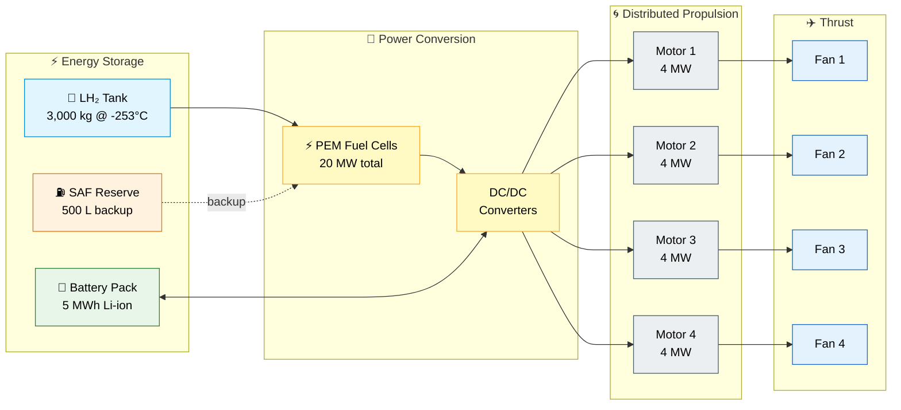
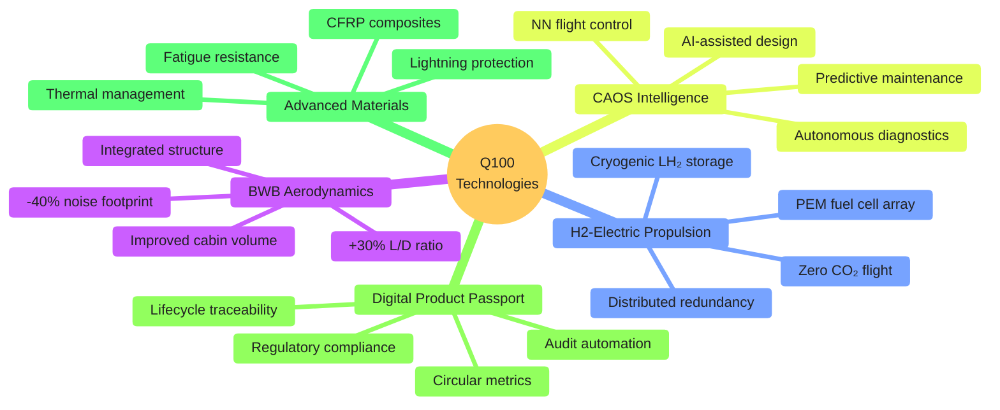
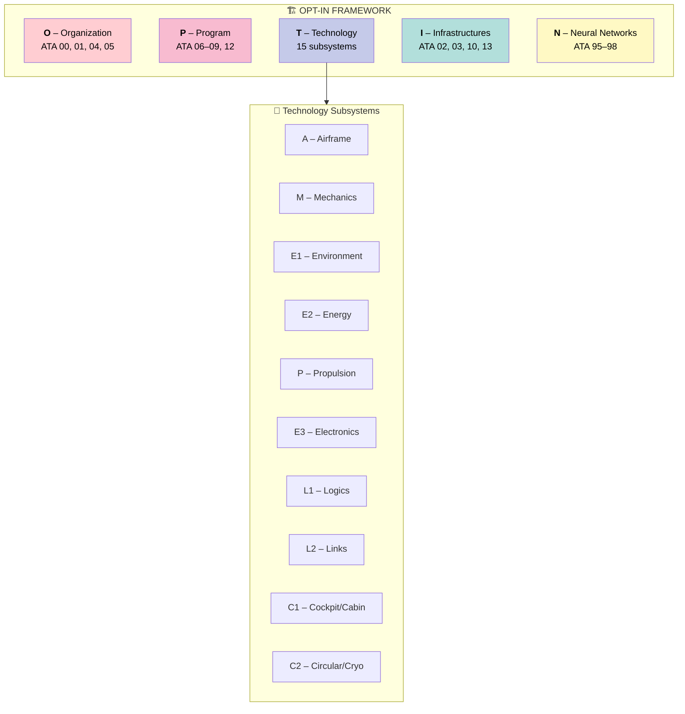
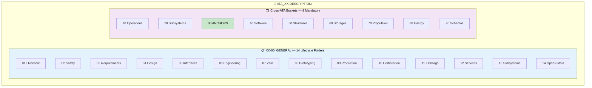
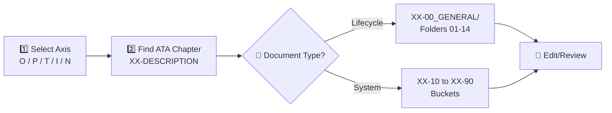
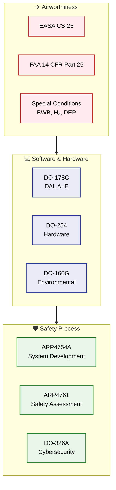
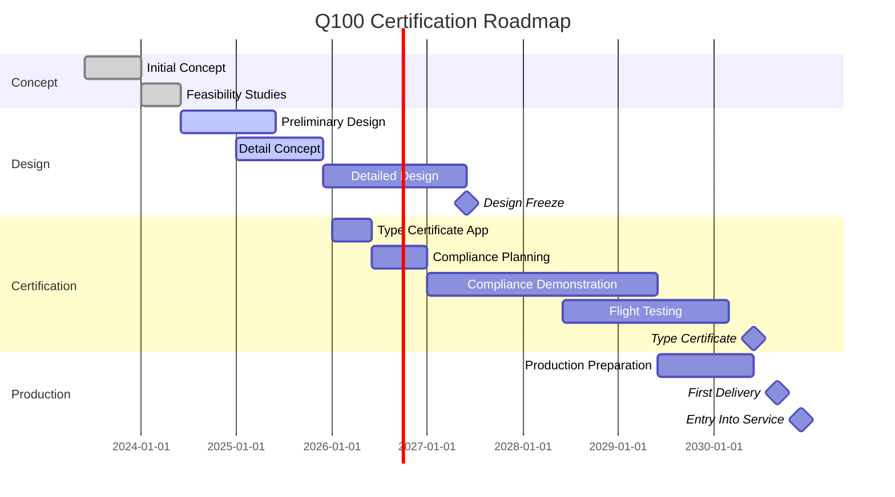
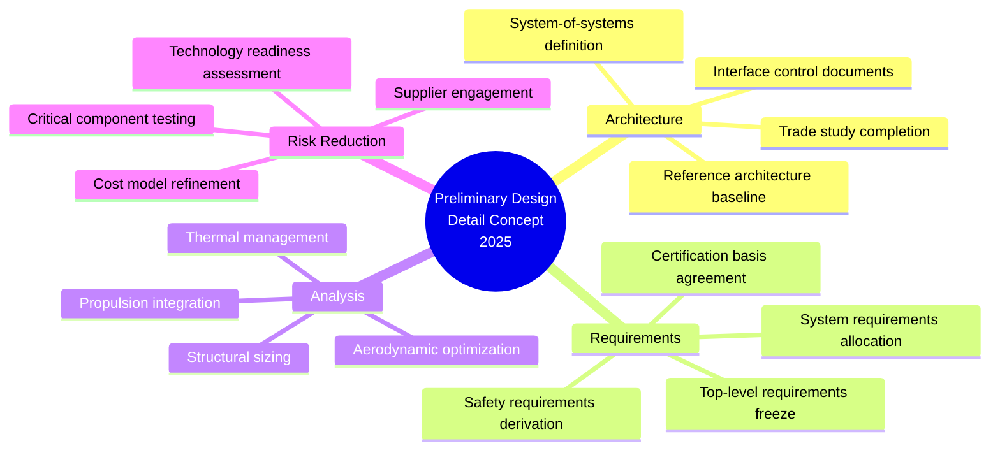
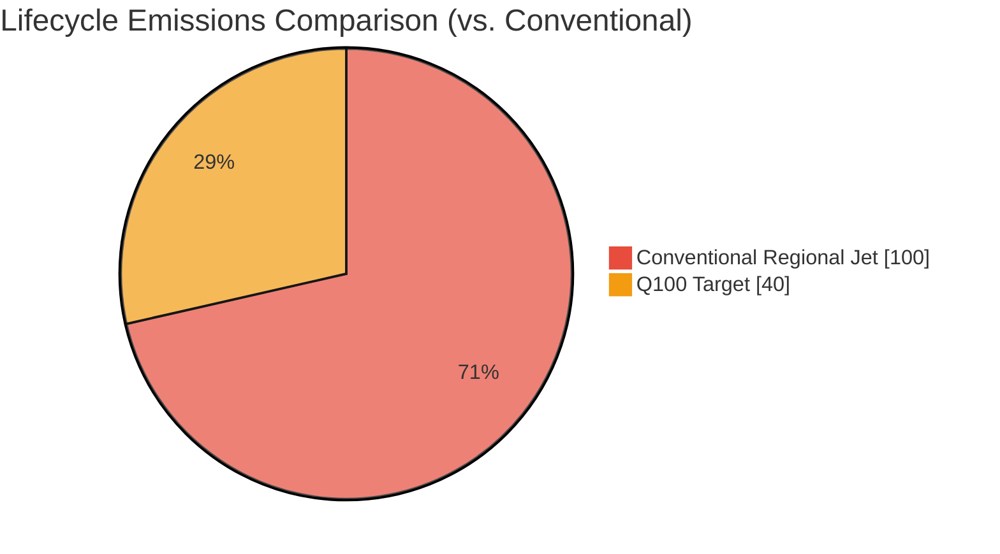

# AMPEL360 BWB-H₂-Hy-E Q100

### Revolutionary Blended-Wing-Body Hydrogen-Hybrid Electric Aircraft

<p align="center">
  <pre style="line-height:1.2; font-family: monospace;">
<span style="color:#2196F3">█████╗ </span><span style="color:#4CAF50">███╗   ███╗</span><span style="color:#FF9800">██████╗ </span><span style="color:#E91E63">███████╗</span><span style="color:#9C27B0">██╗     </span><span style="color:#00BCD4">██████╗  ██████╗  ██████╗</span>
<span style="color:#2196F3">██╔══██╗</span><span style="color:#4CAF50">████╗ ████║</span><span style="color:#FF9800">██╔══██╗</span><span style="color:#E91E63">██╔════╝</span><span style="color:#9C27B0">██║     </span><span style="color:#00BCD4">╚════██╗██╔════╝ ██╔═████╗</span>
<span style="color:#2196F3">███████║</span><span style="color:#4CAF50">██╔████╔██║</span><span style="color:#FF9800">██████╔╝</span><span style="color:#E91E63">█████╗  </span><span style="color:#9C27B0">██║      </span><span style="color:#00BCD4">█████╔╝███████╗ ██║██╔██║</span>
<span style="color:#2196F3">██╔══██║</span><span style="color:#4CAF50">██║╚██╔╝██║</span><span style="color:#FF9800">██╔═══╝ </span><span style="color:#E91E63">██╔══╝  </span><span style="color:#9C27B0">██║      </span><span style="color:#00BCD4">╚═══██╗██╔═══██╗████╔╝██║</span>
<span style="color:#2196F3">██║  ██║</span><span style="color:#4CAF50">██║ ╚═╝ ██║</span><span style="color:#FF9800">██║     </span><span style="color:#E91E63">███████╗</span><span style="color:#9C27B0">███████╗</span><span style="color:#00BCD4">██████╔╝╚██████╔╝╚██████╔╝</span>
<span style="color:#2196F3">╚═╝  ╚═╝</span><span style="color:#4CAF50">╚═╝     ╚═╝</span><span style="color:#FF9800">╚═╝     </span><span style="color:#E91E63">╚══════╝</span><span style="color:#9C27B0">╚══════╝</span><span style="color:#00BCD4">╚═════╝  ╚═════╝  ╚═════╝</span>
  </pre>
</p>

<p align="center">
  <a href="LICENSE"></a>
  <a href="OPT-IN_FRAMEWORK_STANDARD.md"></a>
  
  
  
  
  
  
</p>

<p align="center">
  <a href="https://github.com/AmedeoPelliccia/AMPEL360-BWB-H2-Hy-E/wiki">📖 Wiki</a> •
  <a href="https://github.com/AmedeoPelliccia/AMPEL360-BWB-H2-Hy-E/issues">🐛 Issues</a> •
  <a href="https://github.com/AmedeoPelliccia/AMPEL360-BWB-H2-Hy-E/discussions">💬 Discussions</a> •
  <a href="https://v0-ampel-360-aircraft-specification.vercel.app">🌐 Live Docs</a>
</p>

---

## 🚀 Overview

**AMPEL360 Q100** is a 100-passenger blended-wing-body aircraft powered by hydrogen-electric propulsion, designed to transform regional aviation through near-zero-emission flight and intelligent decentralization of air traffic. 

> 📍 **Current Phase:** Preliminary Design / Detail Concept (December 2025)

### Strategic Mission

| Challenge | Q100 Solution |
|-----------|---------------|
| 🏢 Hub congestion | Point-to-point routes between secondary airports (pop.  100k–500k) |
| 🌍 Overtourism | Distribute connectivity beyond saturated destinations |
| 🌱 Carbon emissions | Zero in-flight CO₂ via hydrogen fuel cells (H₂ → H₂O) |
| 🔊 Noise pollution | −40% community noise through [BWB](https://en.wikipedia.org/wiki/Blended_wing_body) acoustic shielding |

**Example routes:** Bilbao ↔ Lyon · Porto ↔ Bologna · Gdańsk ↔ Toulouse · Gothenburg ↔ Naples

---

## ✈️ Aircraft Specifications

### Performance

| Parameter | Value | Parameter | Value |
|-----------|-------|-----------|-------|
| 👥 Capacity | 100 pax (single) / 90 pax (dual) | 🛫 Range | 3,500 km (1,890 nm) |
| 🚀 Cruise speed | Mach 0. 78 | ⚖️ MTOW | 65,000 kg |
| 📏 Wingspan | 55.0 m | 📐 Length | 42.0 m |
| 🏋️ OEW | 35,000 kg | 📦 Max payload | 17,000 kg |
| 🧊 LH₂ capacity | 3,000 kg | 🔋 Battery | 5 MWh Li-ion |
| ⚡ Fuel cell power | 20 MW | 🌡️ LH₂ temp | −253°C |

### Propulsion Architecture


```mermaid
flowchart LR
    subgraph Storage["⚡ Energy Storage"]
        LH2["🧊 LH₂ Tank<br/>3,000 kg @ -253°C"]
        BAT["🔋 Battery Pack<br/>5 MWh Li-ion"]
        SAF["⛽ SAF Reserve<br/>500 L backup"]
    end

    subgraph Conversion["🔄 Power Conversion"]
        FC["⚡ PEM Fuel Cells<br/>20 MW total"]
        DC["DC/DC<br/>Converters"]
    end

    subgraph Propulsion["🌀 Distributed Propulsion"]
        M1["Motor 1<br/>4 MW"]
        M2["Motor 2<br/>4 MW"]
        M3["Motor 3<br/>4 MW"]
        M4["Motor 4<br/>4 MW"]
    end

    subgraph Output["✈️ Thrust"]
        F1["Fan 1"]
        F2["Fan 2"]
        F3["Fan 3"]
        F4["Fan 4"]
    end

    LH2 --> FC
    FC --> DC
    BAT <--> DC
    SAF -.->|backup| FC
    DC --> M1 & M2 & M3 & M4
    M1 --> F1
    M2 --> F2
    M3 --> F3
    M4 --> F4

    style LH2 fill:#e1f5fe,stroke:#0288d1,color:#000
    style BAT fill:#e8f5e9,stroke:#2e7d32,color:#000
    style SAF fill:#fff3e0,stroke:#ef6c00,color:#000
    style FC fill:#fff9c4,stroke:#f9a825,color:#000
    style DC fill:#fff9c4,stroke:#f9a825,color:#000
    style M1 fill:#eceff1,stroke:#455a64,color:#000
    style M2 fill:#eceff1,stroke:#455a64,color:#000
    style M3 fill:#eceff1,stroke:#455a64,color:#000
    style M4 fill:#eceff1,stroke:#455a64,color:#000
    style F1 fill:#e3f2fd,stroke:#1565c0,color:#000
    style F2 fill:#e3f2fd,stroke:#1565c0,color:#000
    style F3 fill:#e3f2fd,stroke:#1565c0,color:#000
    style F4 fill:#e3f2fd,stroke:#1565c0,color:#000
```

### Structure & Materials

| Component | Material | Benefit |
|-----------|----------|---------|
| **Primary structure** | CFRP (≈65% by weight) | Lightweight, high strength |
| **Configuration** | Blended-wing-body | +30% aerodynamic efficiency |
| **Cabin width** | Up to 22 m | Flexible interior layouts |
| **Fuel tanks** | Cryogenic composite | Safe LH₂ storage |

---

## 🔬 Key Technologies


```mermaid
%%{init: {
  "theme": "base",
  "themeVariables": {
    "primaryTextColor": "#222222",
    "fontFamily": "Inter, Segoe UI, Roboto, sans-serif"
  }
}}%%
mindmap
  root((Q100<br/>Technologies))
    BWB Aerodynamics
      +30% L/D ratio
      Integrated structure
      -40% noise footprint
      Improved cabin volume
    H2-Electric Propulsion
      Zero CO₂ flight
      Cryogenic LH₂ storage
      Distributed redundancy
      PEM fuel cell array
    CAOS Intelligence
      AI-assisted design
      Predictive maintenance
      NN flight control
      Autonomous diagnostics
    Digital Product Passport
      Lifecycle traceability
      Circular metrics
      Audit automation
      Regulatory compliance
    Advanced Materials
      CFRP composites
      Thermal management
      Lightning protection
      Fatigue resistance
```

---

## 📚 OPT-IN Framework

The repository implements **OPT-IN Framework v1.1**, a certification-grade documentation topology for AMPEL360. 

### Framework Architecture


```mermaid
flowchart TB
    subgraph OPTIN["🏗️ OPT-IN FRAMEWORK"]
        O["<b>O</b> – Organization<br/>ATA 00, 01, 04, 05"]
        P["<b>P</b> – Program<br/>ATA 06–09, 12"]
        T["<b>T</b> – Technology<br/>15 subsystems"]
        I["<b>I</b> – Infrastructures<br/>ATA 02, 03, 10, 13"]
        N["<b>N</b> – Neural Networks<br/>ATA 95–98"]
    end

    T --> T_SUB

    subgraph T_SUB["🔧 Technology Subsystems"]
        direction LR
        A["A – Airframe"]
        M["M – Mechanics"]
        E1["E1 – Environment"]
        E2["E2 – Energy"]
        PP["P – Propulsion"]
        E3["E3 – Electronics"]
        L1["L1 – Logics"]
        L2["L2 – Links"]
        C1["C1 – Cockpit/Cabin"]
        C2["C2 – Circular/Cryo"]
    end

    style O fill:#ffcdd2,color:#000
    style P fill:#f8bbd0,color:#000
    style T fill:#c5cae9,color:#000
    style I fill:#b2dfdb,color:#000
    style N fill:#fff9c4,color:#000
```

### ATA Chapter Structure

Every `ATA_XX-DESCRIPTION/` chapter follows a mandatory dual-layer architecture:


```mermaid
flowchart TB
    subgraph ATA["📁 ATA_XX-DESCRIPTION/"]
        subgraph GEN["📋 XX-00_GENERAL — 14 Lifecycle Folders"]
            G01["01 Overview"]
            G02["02 Safety"]
            G03["03 Requirements"]
            G04["04 Design"]
            G05["05 Interfaces"]
            G06["06 Engineering"]
            G07["07 V&V"]
            G08["08 Prototyping"]
            G09["09 Production"]
            G10["10 Certification"]
            G11["11 EIS/Tags"]
            G12["12 Services"]
            G13["13 Subsystems"]
            G14["14 Ops/Sustain"]
        end

        subgraph BUCKETS["🗂️ Cross-ATA Buckets — 9 Mandatory"]
            B10["10 Operations"]
            B20["20 Subsystems"]
            B30["30 ANCHORS"]
            B40["40 Software"]
            B50["50 Structures"]
            B60["60 Storages"]
            B70["70 Propulsion"]
            B80["80 Energy"]
            B90["90 Schemas"]
        end
    end

    style GEN fill:#e3f2fd,color:#000
    style BUCKETS fill:#f3e5f5,color:#000
    style B30 fill:#c8e6c9,color:#000
```

### Cross-ATA Bucket Definitions

| Bucket | Purpose |
|--------|---------|
| **00 General** | Governance, standards, configuration & change management |
| **10 Operations** | Turnaround, ground/flight ops procedures |
| **20 Subsystems** | Functional systems; main engineering artefacts |
| **30 ANCHORS** | 🌱 Sustainability, repairability, LCA, carbon accounting, DPP |
| **40 Software** | Embedded apps, controllers, diagnostics, ML/NN |
| **50 Structures** | Frames, housings, supports, structural routes |
| **60 Storages** | Tanks, reservoirs, cryogenic vessels |
| **70 Propulsion** | Propulsive interface items / couplings |
| **80 Energy** | Electrical/thermal conversion & distribution |
| **90 Schemas** | Data schemas, catalogs, drawing indexes, SDS, training datasets |

---

## 🛡️ Safety Framework — ATA 10-00-02

### 10-00-02 Safety — Directory Structure

**Path:** `OPT-IN_FRAMEWORK/I-INFRASTRUCTURES/ATA_10-PARKING_MOORING_STORAGE_RTS/10-00_GENERAL/10-00-02_Safety/`

```
10-00-02_Safety/
│
├── 10-00-02-001_Safety_Overview.md
├── 10-00-02-002_Hazard_Identification.md
├── 10-00-02-003_Risk_Assessment.md
├── 10-00-02-004_Mitigation_Measures.md
│
├── 10-00-02-005_H2_Specific_Safety/
│   ├── 10-00-02-005-A_LH2_Properties_Hazards.md
│   ├── 10-00-02-005-B_Leak_Detection_Response.md
│   ├── 10-00-02-005-C_Venting_Procedures.md
│   ├── 10-00-02-005-D_Exclusion_Zones.md
│   └── 10-00-02-005-E_H2_Emergency_Protocols.md
│
├── 10-00-02-006_High_Voltage_Safety/
│   ├── 10-00-02-006-A_HV_System_Overview.md
│   ├── 10-00-02-006-B_Isolation_Procedures.md
│   ├── 10-00-02-006-C_Lockout_Tagout_LOTO.md
│   ├── 10-00-02-006-D_Arc_Flash_Protection.md
│   └── 10-00-02-006-E_HV_PPE_Requirements.md
│
├── 10-00-02-007_Cryogenic_Safety/
│   ├── 10-00-02-007-A_Cryogenic_Hazards.md
│   ├── 10-00-02-007-B_Cold_Burn_Prevention.md
│   ├── 10-00-02-007-C_Material_Embrittlement.md
│   ├── 10-00-02-007-D_Oxygen_Displacement.md
│   └── 10-00-02-007-E_Cryogenic_PPE.md
│
├── 10-00-02-008_Fire_Protection/
│   ├── 10-00-02-008-A_Fire_Risk_Assessment.md
│   ├── 10-00-02-008-B_Detection_Systems.md
│   ├── 10-00-02-008-C_Suppression_Systems.md
│   ├── 10-00-02-008-D_H2_Fire_Response.md
│   └── 10-00-02-008-E_Electrical_Fire_Response.md
│
├── 10-00-02-009_Emergency_Procedures/
│   ├── 10-00-02-009-A_Emergency_Overview.md
│   ├── 10-00-02-009-B_Evacuation_Procedures.md
│   ├── 10-00-02-009-C_H2_Leak_Emergency.md
│   ├── 10-00-02-009-D_HV_Emergency.md
│   ├── 10-00-02-009-E_Fire_Emergency.md
│   ├── 10-00-02-009-F_Medical_Emergency.md
│   ├── 10-00-02-009-G_Spill_Response.md
│   └── 10-00-02-009-H_Emergency_Contacts.md
│
├── 10-00-02-010_PPE_Requirements/
│   ├── 10-00-02-010-A_PPE_Matrix.md
│   ├── 10-00-02-010-B_Standard_PPE.md
│   ├── 10-00-02-010-C_H2_Operations_PPE.md
│   ├── 10-00-02-010-D_HV_Operations_PPE.md
│   ├── 10-00-02-010-E_Cryogenic_PPE.md
│   └── 10-00-02-010-F_PPE_Inspection_Maintenance.md
│
├── 10-00-02-011_Safety_Zones/
│   ├── 10-00-02-011-A_Zone_Definitions.md
│   ├── 10-00-02-011-B_Zone_Diagrams.md
│   ├── 10-00-02-011-C_Access_Control.md
│   ├── 10-00-02-011-D_H2_Exclusion_Zones.md
│   └── 10-00-02-011-E_HV_Restricted_Areas.md
│
├── 10-00-02-012_Safety_Signage/
│   ├── 10-00-02-012-A_Signage_Standards.md
│   ├── 10-00-02-012-B_Warning_Signs.md
│   ├── 10-00-02-012-C_Mandatory_Signs.md
│   ├── 10-00-02-012-D_Prohibition_Signs.md
│   ├── 10-00-02-012-E_Emergency_Signs.md
│   └── 10-00-02-012-F_Signage_Placement_Diagrams.md
│
├── 10-00-02-013_Incident_Reporting/
│   ├── 10-00-02-013-A_Reporting_Requirements.md
│   ├── 10-00-02-013-B_Incident_Classification.md
│   ├── 10-00-02-013-C_Report_Templates.md
│   ├── 10-00-02-013-D_Investigation_Process.md
│   ├── 10-00-02-013-E_Corrective_Actions.md
│   └── 10-00-02-013-F_Lessons_Learned.md
│
├── 10-00-02-014_Safety_Training/
│   ├── 10-00-02-014-A_Training_Requirements.md
│   ├── 10-00-02-014-B_Competency_Matrix.md
│   ├── 10-00-02-014-C_H2_Safety_Training.md
│   ├── 10-00-02-014-D_HV_Safety_Training.md
│   ├── 10-00-02-014-E_Cryogenic_Training.md
│   ├── 10-00-02-014-F_Emergency_Response_Training.md
│   └── 10-00-02-014-G_Recurrency_Requirements.md
│
├── 10-00-02-015_Safety_Checklists/
│   ├── 10-00-02-015-A_Pre_Parking_Checklist.md
│   ├── 10-00-02-015-B_Mooring_Safety_Checklist.md
│   ├── 10-00-02-015-C_Storage_Entry_Checklist.md
│   ├── 10-00-02-015-D_RTS_Safety_Checklist.md
│   ├── 10-00-02-015-E_H2_Operations_Checklist.md
│   └── 10-00-02-015-F_Daily_Safety_Inspection.md
│
├── 10-00-02-016_Safety_Equipment/
│   ├── 10-00-02-016-A_Equipment_Inventory.md
│   ├── 10-00-02-016-B_H2_Detection_Equipment.md
│   ├── 10-00-02-016-C_Fire_Fighting_Equipment.md
│   ├── 10-00-02-016-D_First_Aid_Equipment.md
│   ├── 10-00-02-016-E_Rescue_Equipment.md
│   └── 10-00-02-016-F_Equipment_Inspection_Schedule.md
│
├── 10-00-02-090_Schemas/
│   ├── hazard-register.schema.json
│   ├── risk-assessment.schema.json
│   ├── incident-report.schema.json
│   ├── safety-checklist.schema.json
│   └── training-record.schema.json
│
└── 10-00-02-099_Index/
    ├── 10-00-02-099-A_Document_Index.md
    ├── 10-00-02-099-B_Hazard_Register.md
    ├── 10-00-02-099-C_Risk_Register.md
    └── 10-00-02-099-D_Cross_References.md
```

### Document Summary

| Category | Count | Description |
|----------|-------|-------------|
| 📄 Top-level documents | 4 | Overview, hazards, risk, mitigations |
| 📁 Subdirectories | 12 | Detailed safety topic areas |
| 📋 Subdirectory documents | 66 | Specialized safety documentation |
| 🗂️ Schemas | 5 | JSON validation schemas |
| 📇 Index files | 4 | Cross-reference and registers |
| **Total files** | **79** | **Complete safety framework** |

### Category Breakdown

#### Core Safety Documents

| Document ID | Title | Purpose |
|-------------|-------|---------|
| 10-00-02-001 | Safety Overview | Introduction to chapter safety philosophy |
| 10-00-02-002 | Hazard Identification | Systematic hazard identification (FHA/PHA) |
| 10-00-02-003 | Risk Assessment | Risk evaluation and classification |
| 10-00-02-004 | Mitigation Measures | Controls and safeguards |

#### H₂-Specific Safety (005)

| Document ID | Title | Q100 Relevance |
|-------------|-------|----------------|
| 005-A | LH₂ Properties & Hazards | Cryogenic hydrogen characteristics |
| 005-B | Leak Detection & Response | Sensor systems, alarm protocols |
| 005-C | Venting Procedures | Controlled release during storage |
| 005-D | Exclusion Zones | Safety perimeters for H₂ operations |
| 005-E | H₂ Emergency Protocols | Hydrogen-specific emergencies |

#### High Voltage Safety (006)

| Document ID | Title | Q100 Relevance |
|-------------|-------|----------------|
| 006-A | HV System Overview | 800V+ architecture hazards |
| 006-B | Isolation Procedures | Safe de-energization |
| 006-C | Lockout/Tagout (LOTO) | Maintenance isolation |
| 006-D | Arc Flash Protection | Electrical arc hazards |
| 006-E | HV PPE Requirements | Specialized protective equipment |

#### Cryogenic Safety (007)

| Document ID | Title | Q100 Relevance |
|-------------|-------|----------------|
| 007-A | Cryogenic Hazards | −253°C exposure risks |
| 007-B | Cold Burn Prevention | Personnel protection |
| 007-C | Material Embrittlement | Equipment/structure risks |
| 007-D | Oxygen Displacement | Asphyxiation hazards |
| 007-E | Cryogenic PPE | Specialized protective gear |

#### Fire Protection (008)

| Document ID | Title | Q100 Relevance |
|-------------|-------|----------------|
| 008-A | Fire Risk Assessment | H₂ + HV fire risks |
| 008-B | Detection Systems | Flame, heat, gas detection |
| 008-C | Suppression Systems | H₂-compatible suppression |
| 008-D | H₂ Fire Response | Invisible flame protocols |
| 008-E | Electrical Fire Response | Battery/HV fire protocols |

#### Emergency Procedures (009)

| Document ID | Title | Purpose |
|-------------|-------|---------|
| 009-A | Emergency Overview | Emergency response philosophy |
| 009-B | Evacuation Procedures | Personnel evacuation |
| 009-C | H₂ Leak Emergency | Hydrogen release response |
| 009-D | HV Emergency | Electrical emergency response |
| 009-E | Fire Emergency | Fire response procedures |
| 009-F | Medical Emergency | Injury/illness response |
| 009-G | Spill Response | Fluid/material spills |
| 009-H | Emergency Contacts | Contact directory |

### Cross-References

#### Related ATA Chapters

| ATA | Chapter | Relationship |
|-----|---------|--------------|
| [12](OPT-IN_FRAMEWORK/I-INFRASTRUCTURES/ATA_12-SERVICING/) | Servicing | Fuel/fluid handling safety |
| [24](OPT-IN_FRAMEWORK/T-TECHNOLOGIES/ATA_24-ELECTRICAL_POWER/) | Electrical Power | HV system safety integration |
| [28](OPT-IN_FRAMEWORK/T-TECHNOLOGIES/ATA_28-FUEL/) | Fuel | LH₂ storage and handling |
| [73](OPT-IN_FRAMEWORK/T-TECHNOLOGIES/ATA_73-ENGINE_FUEL_AND_CONTROL/) | Fuel System | Fuel cell system safety |
| [80](OPT-IN_FRAMEWORK/T-TECHNOLOGIES/ATA_80-STARTING/) | Starting | System activation safety |

#### Related IDLE Channels

- **IDLE02_Testing_Certification_and_Authorities** — Safety certification evidence
- **IDLE03_Operations_Maintenance_and_Customer_Care** — Operational safety procedures
- **IDLE08_Qualified_Workforce_Health_and_Wellbeing** — Safety training, health & wellbeing

#### Related LC Channels

- **LC-02_Certification_Home** — Safety certification requirements
- **LC-03_Operations_MRO_Home** — Operational safety integration
- **LC-08_Crew_Medical_Home** — Personnel safety and medical

### Regulatory Alignment

| Regulation | Applicability |
|------------|---------------|
| **[EASA CS-25](https://www.easa.europa.eu/en/document-library/certification-specifications/cs-25-large-aeroplanes)** | Airworthiness safety requirements |
| **[FAA 14 CFR Part 25](https://www.ecfr.gov/current/title-14/chapter-I/subchapter-C/part-25)** | US certification safety |
| **[ISO 19880](https://www.iso.org/standard/71940.html)** | Hydrogen fueling safety |
| **[IEC 60079](https://webstore.iec.ch/publication/421)** | Explosive atmospheres |
| **[NFPA 2](https://www.nfpa.org/codes-and-standards/2/hydrogen-technologies-code)** | Hydrogen technologies code |
| **[OSHA 29 CFR 1910](https://www.osha.gov/laws-regs/regulations/standardnumber/1910)** | Occupational safety |
| **[EN 60204](https://www.en-standard.eu/csn-en-60204-1-safety-of-machinery-electrical-equipment-of-machines-part-1-general-requirements/)** | Electrical equipment safety |

---

## 🏁 Getting Started

### Prerequisites

```bash
# Check Python version (requires 3.9+)
python --version

# Install dependencies
pip install -r requirements.txt

# Optional: Setup pre-commit hooks
bash .github/hooks/setup-hooks.sh
```

### Repository Navigation


```mermaid
flowchart LR
    A["1️⃣ Select Axis<br/>O / P / T / I / N"] --> B["2️⃣ Find ATA Chapter<br/>XX-DESCRIPTION"]
    B --> C{"📄 Document Type? "}
    C -->|Lifecycle| D["XX-00_GENERAL/<br/>Folders 01-14"]
    C -->|System| E["XX-10 to XX-90<br/>Buckets"]
    D --> F["📝 Edit/Review"]
    E --> F
```

### Quick Start Examples

```bash
# Navigate to fuel system design
cd OPT-IN_FRAMEWORK/T-TECHNOLOGIES/ATA_28-FUEL/28-00_GENERAL/04_Design/

# Navigate to propulsion subsystems
cd OPT-IN_FRAMEWORK/T-TECHNOLOGIES/ATA_70-PROPULSION/70-20_Subsystems/

# Navigate to sustainability anchors
cd OPT-IN_FRAMEWORK/T-TECHNOLOGIES/ATA_28-FUEL/28-30_ANCHORS/
```

### Validation Commands

```bash
# Structure compliance (OPT-IN and ATA topology)
python tools/validators/structure_validator.py .

# Drawing naming (Q100 conventions)
python tools/validators/drawing_validator.py <file.svg>

# CI number format
python tools/validators/ci_validator.py <CI-XX-XXX-XXX-XXX>

# Documentation metadata
python tools/validate_documentation_structure.py

# Full validation suite
python tools/validators/run_all.py --verbose
```

---

## 🏛️ Certification

### Regulatory Framework


```mermaid
flowchart TB
    subgraph Primary["✈️ Airworthiness"]
        EASA["EASA CS-25"]
        FAA["FAA 14 CFR Part 25"]
        SC["Special Conditions<br/>BWB, H₂, DEP"]
    end

    subgraph SW["💻 Software & Hardware"]
        DO178["DO-178C<br/>DAL A–E"]
        DO254["DO-254<br/>Hardware"]
        DO160["DO-160G<br/>Environmental"]
    end

    subgraph Safety["🛡️ Safety Process"]
        ARP4754["ARP4754A<br/>System Development"]
        ARP4761["ARP4761<br/>Safety Assessment"]
        DO326["DO-326A<br/>Cybersecurity"]
    end

    Primary --> SW --> Safety

    style EASA fill:#ffebee,stroke:#c62828,stroke-width:2px,color:#000
    style FAA fill:#ffebee,stroke:#c62828,stroke-width:2px,color:#000
    style SC fill:#ffebee,stroke:#c62828,stroke-width:2px,color:#000
    style DO178 fill:#e8eaf6,stroke:#283593,stroke-width:2px,color:#000
    style DO254 fill:#e8eaf6,stroke:#283593,stroke-width:2px,color:#000
    style DO160 fill:#e8eaf6,stroke:#283593,stroke-width:2px,color:#000
    style ARP4754 fill:#e8f5e9,stroke:#2e7d32,stroke-width:2px,color:#000
    style ARP4761 fill:#e8f5e9,stroke:#2e7d32,stroke-width:2px,color:#000
    style DO326 fill:#e8f5e9,stroke:#2e7d32,stroke-width:2px,color:#000
```

### Referenced Standards (with links)

| Category | Standard | Link |
|----------|----------|------|
| **Airworthiness** | EASA CS-25 | [EASA Certification Specifications](https://www.easa.europa.eu/en/document-library/certification-specifications/cs-25-large-aeroplanes) |
| **Airworthiness** | FAA 14 CFR Part 25 | [Federal Aviation Regulations](https://www.ecfr.gov/current/title-14/chapter-I/subchapter-C/part-25) |
| **Software** | DO-178C | [RTCA Standards](https://www.rtca.org/content/standards-guidance-documents) |
| **Hardware** | DO-254 | [RTCA Standards](https://www.rtca.org/content/standards-guidance-documents) |
| **Environmental** | DO-160G | [RTCA Standards](https://www.rtca.org/content/standards-guidance-documents) |
| **System Development** | ARP4754A | [SAE Standards](https://www.sae.org/standards/content/arp4754a/) |
| **Safety Assessment** | ARP4761 | [SAE Standards](https://www.sae.org/standards/content/arp4761/) |
| **Cybersecurity** | DO-326A | [RTCA Standards](https://www.rtca.org/content/standards-guidance-documents) |

### Documentation Standards

| Standard | Application |
|----------|-------------|
| **[ATA iSpec 2200](https://www.ataebiz.org/)** | Chapter structure and numbering |
| **[S1000D](http://www.s1000d.org/)** | Technical publications |
| **[ISO 15926](https://www.iso.org/standard/29557.html)** | Industrial data exchange |
| **[DO-178C](https://www.rtca.org/content/standards-guidance-documents)** | Software development assurance |
| **[ARP4754A](https://www.sae.org/standards/content/arp4754a/)** | System development process |

### Certification Timeline

> 📍 **Current Phase:** Preliminary Design / Detail Concept (December 2025)


```mermaid
gantt
    title Q100 Certification Roadmap
    dateFormat  YYYY-MM
    todayMarker stroke-width:3px,stroke:#ff0000
    section Concept
    Initial Concept           :done, 2023-06, 2024-01
    Feasibility Studies       :done, 2024-01, 2024-06
    section Design
    Preliminary Design        :active, 2024-06, 2025-06
    Detail Concept            :active, 2025-01, 2025-12
    Detailed Design           :2025-12, 2027-06
    Design Freeze             :milestone, 2027-06, 0d
    section Certification
    Type Certificate App      :2026-01, 2026-06
    Compliance Planning       :2026-06, 2027-01
    Compliance Demonstration  :2027-01, 2029-06
    Flight Testing            :2028-06, 2030-03
    Type Certificate          :milestone, 2030-06, 0d
    section Production
    Production Preparation    :2029-06, 2030-06
    First Delivery            :milestone, 2030-09, 0d
    Entry Into Service        :milestone, 2030-12, 0d
```

### Current Phase Summary

| Phase | Status | Timeline | Key Deliverables |
|-------|--------|----------|------------------|
| ✅ Initial Concept | Complete | 2023-H2 | Mission definition, market analysis |
| ✅ Feasibility Studies | Complete | 2024-H1 | Technical feasibility, business case |
| 🔄 Preliminary Design | **Active** | 2024-H2 → 2025-H1 | Reference architecture, trade studies |
| 🔄 Detail Concept | **Active** | 2025 | System specifications, interface definitions |
| ⏳ Detailed Design | Planned | 2026-2027 | Full design package, certification basis |
| ⏳ Type Certification | Planned | 2026-2030 | TC application, compliance, flight test |
| ⏳ Entry Into Service | Planned | 2030-Q4 | First commercial flight |

### Current Phase Objectives


```mermaid
mindmap
  root((Preliminary Design<br/>Detail Concept<br/>2025))
    Architecture
      Reference architecture baseline
      System-of-systems definition
      Interface control documents
      Trade study completion
    Requirements
      Top-level requirements freeze
      System requirements allocation
      Safety requirements derivation
      Certification basis agreement
    Analysis
      Aerodynamic optimization
      Structural sizing
      Propulsion integration
      Thermal management
    Risk Reduction
      Technology readiness assessment
      Critical component testing
      Supplier engagement
      Cost model refinement
```

---

## 🌱 Sustainability

| Metric | Target | Status |
|--------|--------|--------|
| **Flight CO₂** | Zero (H₂ fuel cells → H₂O) | 🎯 Design target |
| **Lifecycle emissions** | −60% vs. conventional regional jets | 📊 Under analysis |
| **Community noise** | −40% (BWB acoustic shielding) | ✅ Preliminary validated |
| **End-of-life recovery** | ≥85% materials recyclable | 🎯 Design target |
| **Water recovery** | Potable water from fuel cell exhaust | 🔬 In development |

Every chapter includes `XX-30_ANCHORS/` for:
- ♻️ Life Cycle Assessment (LCA)
- 📊 Carbon accounting
- 🏷️ Digital Product Passport (DPP) integration
- 🔄 Circular economy metrics

### Environmental Impact Comparison


```mermaid
%%{init: {'theme': 'base', 'themeVariables': { 'pie1': '#e74c3c', 'pie2': '#f39c12', 'pie3': '#27ae60', 'pie4': '#3498db'}}}%%
pie showData
    title Lifecycle Emissions Comparison (vs. Conventional)
    "Conventional Regional Jet" : 100
    "Q100 Target" : 40
```

---

## 📊 Repository Statistics

| Metric | Value |
|--------|-------|
| 📁 ATA chapters | 83 |
| 🏗️ OPT-IN axes | 5 |
| 🔧 Technology subsystems | 15 |
| 📋 Lifecycle folders / chapter | 14 |
| 🗂️ Cross-ATA buckets / chapter | 9 |
| 📄 Total documentation pages | 1,200+ |
| 🔗 Traceability links | 5,000+ |

---

## 📖 Key Documentation

| Document | Description |
|----------|-------------|
| [`OPT-IN_FRAMEWORK_STANDARD.md`](OPT-IN_FRAMEWORK_STANDARD.md) | Mandatory structure & validation rules |
| [`AMPEL360_DOCUMENTATION_STANDARD.md`](AMPEL360_DOCUMENTATION_STANDARD.md) | Writing conventions |
| [`AI-ASI-TP.md`](AI-ASI-TP.md) | AI integration strategy |
| [`DIGITAL_TWIN_CONTROL_LOOP.md`](DIGITAL_TWIN_CONTROL_LOOP.md) | Digital twin architecture |
| [`CAOS/CAOS_OPERATIONS_FRAMEWORK.md`](CAOS/CAOS_OPERATIONS_FRAMEWORK.md) | CAOS cognitive operations system |
| [`.github/copilot.md`](.github/copilot.md) | GitHub Copilot / Agent integration |

### Wiki Resources

| Page | Description |
|------|-------------|
| [Wiki Home](https://github.com/AmedeoPelliccia/AMPEL360-BWB-H2-Hy-E/wiki) | Main wiki landing page |
| [IDLE_Standard_Channels](https://github.com/AmedeoPelliccia/AMPEL360-BWB-H2-Hy-E/wiki/IDLE_Standard_Channels) | Integrated Digital Living Ecosystems framework |
| [LC-01 to LC-09](https://github.com/AmedeoPelliccia/AMPEL360-BWB-H2-Hy-E/wiki) | Life-Cycle channel documentation |

---

## 🛠️ Tools

```
tools/
├── validators/              # Structure, drawing, CI validation
│   ├── structure_validator.py
│   ├── drawing_validator.py
│   ├── ci_validator.py
│   └── run_all.py
├── ci/                      # CI/CD scripts
├── doc-meta-enforcer-mcp/   # Document control MCP server
├── cgrow/                   # C-GROWTH living doc lifecycle
├── genccc/                  # Cross-reference & doc generation
└── schemas/                 # JSON/YAML validation schemas
    ├── ata-chapter.schema.json
    ├── drawing.schema.json
    └── dpp.schema.json
```

---

## 🤝 Contributing

We welcome contributions from aerospace engineers, software developers, and documentation specialists. 

### Getting Started

1. 📖 Read [`OPT-IN_FRAMEWORK_STANDARD.md`](OPT-IN_FRAMEWORK_STANDARD.md)
2. 🏗️ Follow the mandatory structure and naming conventions
3. ✅ Run validation tools before committing
4. 🔗 Update traceability matrices when adding or modifying artefacts
5. 📝 Document all changes in accordance with AMPEL360 standards

### Contribution Areas

| Area | Description | Priority |
|------|-------------|----------|
| 📄 Technical documentation | System descriptions, procedures, specifications | 🔴 High |
| ✅ V&V evidence | Test plans, reports, compliance matrices | 🔴 High |
| 🏛️ Certification artefacts | Means of compliance, safety assessments | 🟠 Medium |
| 🌱 Sustainability / LCA | Environmental impact, circular metrics | 🟠 Medium |
| 💻 Software / ML | Embedded systems, neural networks, analytics | 🟡 Ongoing |
| 🏗️ Infrastructure | Tools, CI/CD, validation scripts | 🟡 Ongoing |

### Code of Conduct

Please read our Code of Conduct before contributing.
<!-- TODO: Create CODE_OF_CONDUCT.md and update this link -->

---

## 📜 License

```
Copyright 2025 AMPEL360 Program
Concept and Direction: Amedeo Pelliccia

Licensed under the Apache License, Version 2.0. 
You may not use this project except in compliance with the License.
```

See [LICENSE](LICENSE) for full terms. 

---

## 🔗 Links

| Resource | URL |
|----------|-----|
| 📖 Wiki | [github.com/AmedeoPelliccia/AMPEL360-BWB-H2-Hy-E/wiki](https://github.com/AmedeoPelliccia/AMPEL360-BWB-H2-Hy-E/wiki) |
| 🐛 Issues | [github.com/AmedeoPelliccia/AMPEL360-BWB-H2-Hy-E/issues](https://github.com/AmedeoPelliccia/AMPEL360-BWB-H2-Hy-E/issues) |
| 💬 Discussions | [github.com/AmedeoPelliccia/AMPEL360-BWB-H2-Hy-E/discussions](https://github.com/AmedeoPelliccia/AMPEL360-BWB-H2-Hy-E/discussions) |
| 🌐 Live Documentation | [v0-ampel-360-aircraft-specification.vercel.app](https://v0-ampel-360-aircraft-specification.vercel.app) |
| 🏛️ EASA CS-25 | [www.easa.europa.eu/en/document-library/certification-specifications/cs-25-large-aeroplanes](https://www.easa.europa.eu/en/document-library/certification-specifications/cs-25-large-aeroplanes) |
| 📋 DO-178C | [www.rtca.org/content/standards-guidance-documents](https://www.rtca.org/content/standards-guidance-documents) |

---

<div align="center">

## **AMPEL360**

### Aviation Model by Proactive Engineering Leaders

*Enabling hydrogen-electric, AI-orchestrated, carbon-negative commercial aviation.*

---

### **Q100**

#### Quantum-scale leap in regional sustainable aviation. 

<br/>

[](https://github.com/AmedeoPelliccia)
[](https://github.com/AmedeoPelliccia/AMPEL360-BWB-H2-Hy-E)
[](https://github.com/AmedeoPelliccia/AMPEL360-BWB-H2-Hy-E)
[](https://github.com/AmedeoPelliccia/AMPEL360-BWB-H2-Hy-E)

</div>

---

<p align="center">
  <i>Document control: Version 2.2 · Status: ACTIVE · Last update: 2025-12-10</i><br/>
  <i>Current Phase: Preliminary Design / Detail Concept</i><br/>
  <i>Generated with AI assistance (GitHub Copilot), prompted by Amedeo Pelliccia.</i><br/>
  <i>Last AI update: Hyperlink additions - 2025-12-10</i>
</p>


