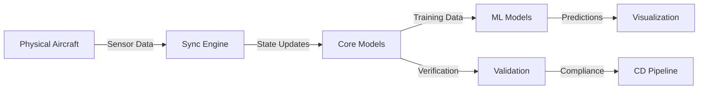

# AMPEL360 Digital Twin Extended Capabilities

This directory contains the extended capabilities for the **AMPEL360 BWB H₂ Hy-E Q100 INTEGRA** aircraft digital twin system, enabling real-time synchronization, predictive analytics, and comprehensive validation across the aircraft lifecycle.

## Overview

The Digital Twin Extended Capabilities framework provides:

1. **Core Models** - Physics-based and data-driven models of aircraft systems
2. **ML Models** - Machine learning models for predictive maintenance and optimization
3. **Connectors** - Data integration with external systems (PLM, ERP, simulation tools)
4. **Sync Engine** - Real-time synchronization between physical aircraft and digital representation
5. **Visualization** - Dashboards and 3D visualization components
6. **Validation** - Verification and validation tools for model accuracy

## Directory Structure

```text
digital_twin/
├── README.md                    # This file
├── models/                      # Core digital twin models
│   ├── __init__.py
│   ├── base_model.py           # Base model interfaces
│   ├── airframe_model.py       # Airframe structural model (ATA 51-57)
│   ├── propulsion_model.py     # Propulsion system model (ATA 70-80)
│   ├── systems_model.py        # Aircraft systems model (ATA 21-49)
│   └── README.md
├── ml_models/                   # Machine learning models
│   ├── __init__.py
│   ├── predictive_maintenance.py   # Predictive maintenance models
│   ├── anomaly_detection.py        # Anomaly detection for sensor data
│   ├── performance_optimizer.py    # Performance optimization models
│   └── README.md
├── connectors/                  # Data connectors
│   ├── __init__.py
│   ├── base_connector.py       # Base connector interface
│   ├── plm_connector.py        # PLM system integration
│   ├── erp_connector.py        # ERP system integration
│   ├── simulation_connector.py # Simulation tool integration
│   └── README.md
├── sync_engine/                 # Real-time synchronization
│   ├── __init__.py
│   ├── sync_manager.py         # Synchronization manager
│   ├── state_tracker.py        # State tracking and delta detection
│   ├── conflict_resolver.py    # Conflict resolution strategies
│   └── README.md
├── visualization/               # Visualization components
│   ├── __init__.py
│   ├── dashboard.py            # Dashboard components
│   ├── renderer_3d.py          # 3D visualization renderer
│   ├── metrics_display.py      # Metrics and KPI displays
│   └── README.md
└── validation/                  # Validation tools
    ├── __init__.py
    ├── model_validator.py      # Model accuracy validation
    ├── data_validator.py       # Data integrity validation
    ├── compliance_checker.py   # Regulatory compliance validation
    └── README.md
```

## Integration with AMPEL360 Architecture

### Control Loop Integration

This module integrates with the AMPEL360 CGen + CI + CD control loop as described in [DIGITAL_TWIN_CONTROL_LOOP.md](../DIGITAL_TWIN_CONTROL_LOOP.md):



### OPT-IN Framework Alignment

The digital twin components map to OPT-IN Framework areas:

| Component | OPT-IN Area | ATA Chapters |
|-----------|-------------|--------------|
| Core Models | T-TECHNOLOGY | ATA 51-57 (Airframe), ATA 70-80 (Propulsion) |
| ML Models | N-NEURAL_NETWORKS | ATA 95 (Digital Product Passport) |
| Connectors | I-INFRASTRUCTURES | ATA 02 (Operations Information) |
| Sync Engine | I-INFRASTRUCTURES | ATA 85 (Infrastructure Standards) |
| Visualization | I-INFRASTRUCTURES | ATA 02 (Operations Information) |
| Validation | P-PROGRAM | ATA 02 (V&V procedures) |

## Quick Start

### Installation

```bash
# From repository root
pip install -r requirements.txt

# Or install digital_twin package in development mode
pip install -e digital_twin/
```

### Basic Usage

```python
from digital_twin.models import AirframeModel, PropulsionModel
from digital_twin.sync_engine import SyncManager
from digital_twin.validation import ModelValidator

# Initialize models
airframe = AirframeModel(config_path="config/airframe.json")
propulsion = PropulsionModel(config_path="config/propulsion.json")

# Start sync engine
sync = SyncManager()
sync.register_model("airframe", airframe)
sync.register_model("propulsion", propulsion)
sync.start()

# Validate model accuracy
validator = ModelValidator()
results = validator.validate(airframe, reference_data="baseline.json")
print(f"Model accuracy: {results.accuracy}%")
```

## Configuration

Configuration files are stored in JSON format and follow the AMPEL360 schema conventions:

```json
{
  "model_id": "DT-Q100-AIRFRAME-001",
  "version": "1.0.0",
  "aircraft_model": "AM_Q100",
  "ata_chapters": ["51", "52", "53", "54", "55", "56", "57"],
  "parameters": {
    "update_interval_ms": 1000,
    "tolerance_threshold": 0.001
  }
}
```

## Standards Compliance

This implementation follows:

- **ATA iSpec 2200**: Chapter numbering and data exchange
- **DO-178C**: Software development assurance (where applicable)
- **ISO 23247**: Digital Twin Framework for Manufacturing
- **ISO 15926**: Industrial Data Exchange
- **EASA CS-25**: Certification Specifications
- **EU AI Act**: AI system transparency requirements

## Related Documentation

- [Digital Twin Control Loop](../DIGITAL_TWIN_CONTROL_LOOP.md)
- [OPT-IN Framework Structure](../OPT-IN_FRAMEWORK_STANDARD.md)
- [AMPEL360 Documentation Standard](../AMPEL360_DOCUMENTATION_STANDARD.md)
- [02-70-10 Digital Twin Integration](../OPT-IN_FRAMEWORK/I-INFRASTRUCTURES/ATA_02-OPERATIONS_INFORMATION/02-70_Propulsion/02-70-10_Digital_Twin_Integration/README.md)

---

## Document Control

- Generated with the assistance of AI (GitHub Copilot), prompted by **Amedeo Pelliccia**.
- Status: **DRAFT** – Subject to human review and approval.
- Human approver: _[to be completed]_.
- Repository: `AMPEL360-AIR-T`
- Last AI update: 2026-01-29.

---
