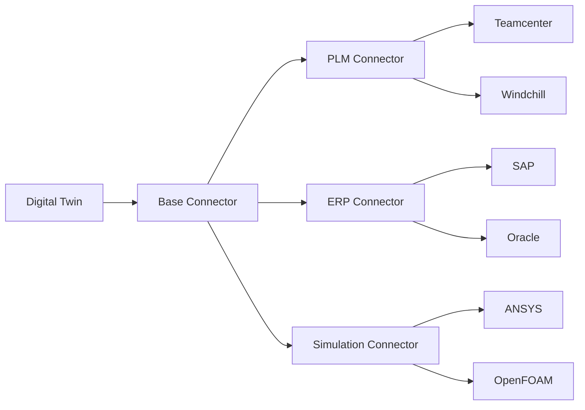

# Data Connectors

This directory contains data connectors for integrating the AMPEL360 digital twin with external systems.

## Overview

Connectors enable bidirectional data exchange between the digital twin and:
- **PLM Systems**: Product Lifecycle Management data
- **ERP Systems**: Enterprise Resource Planning data
- **Simulation Tools**: CFD, FEA, and other analysis tools

## Files

| File | Description | Integration |
|------|-------------|-------------|
| `base_connector.py` | Base connector interface | All systems |
| `plm_connector.py` | PLM system integration | Siemens Teamcenter, PTC Windchill |
| `erp_connector.py` | ERP system integration | SAP, Oracle |
| `simulation_connector.py` | Simulation tool integration | ANSYS, OpenFOAM |

## Architecture



## Usage

```python
from digital_twin.connectors import PLMConnector, SimulationConnector

# Connect to PLM system
plm = PLMConnector(
    endpoint="https://plm.example.com/api",
    auth_token="your-token"
)

# Fetch component data
component = plm.get_component("CAMCTL01")

# Push updates
plm.update_component("CAMCTL01", {"status": "validated"})

# Connect to simulation
sim = SimulationConnector(solver="openfoam")
results = sim.run_analysis(mesh_file="wing.msh", config="cruise.yaml")
```

## Security

All connectors implement:
- OAuth 2.0 / API key authentication
- TLS encryption for data in transit
- Audit logging for compliance

---

## Document Control

- Generated with the assistance of AI (GitHub Copilot), prompted by **Amedeo Pelliccia**.
- Status: **DRAFT** – Subject to human review and approval.
- Human approver: _[to be completed]_.
- Repository: `AMPEL360-AIR-T`
- Last AI update: 2026-01-29.

---
