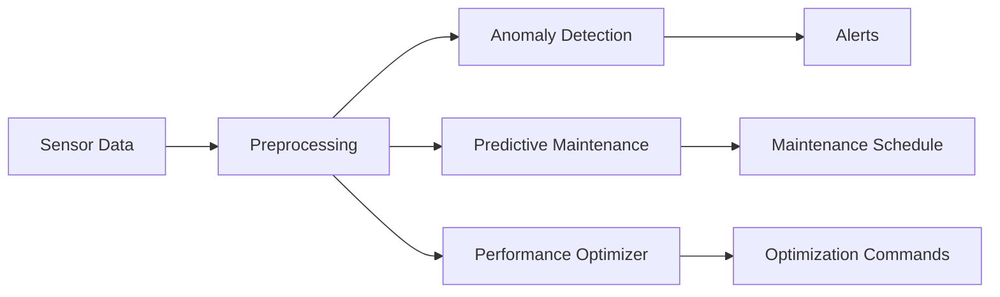

# Machine Learning Models

This directory contains machine learning models for predictive analytics and optimization in the AMPEL360 digital twin system.

## Overview

The ML models provide intelligent capabilities for:
- **Predictive Maintenance**: Predicting component failures before they occur
- **Anomaly Detection**: Identifying unusual patterns in sensor data
- **Performance Optimization**: Optimizing aircraft performance parameters

## Files

| File | Description | Use Case |
|------|-------------|----------|
| `predictive_maintenance.py` | Predictive maintenance models | Component failure prediction |
| `anomaly_detection.py` | Anomaly detection models | Sensor data monitoring |
| `performance_optimizer.py` | Performance optimization | Flight efficiency |

## Model Architecture



## Integration with ATA 95

These ML models align with ATA 95 Digital Product Passport requirements for:
- Data lineage tracking
- Model versioning and traceability
- Explainability and transparency
- EU AI Act compliance

## Usage

```python
from digital_twin.ml_models import PredictiveMaintenance, AnomalyDetector

# Initialize predictive maintenance model
pm_model = PredictiveMaintenance(
    component_type="propulsion",
    model_version="1.0.0"
)

# Train on historical data
pm_model.train(training_data, labels)

# Make predictions
predictions = pm_model.predict(current_sensor_data)
print(f"Failure probability: {predictions['failure_probability']}")

# Anomaly detection
detector = AnomalyDetector()
anomalies = detector.detect(sensor_stream)
```

## Model Registry

| Model ID | Type | Version | Status |
|----------|------|---------|--------|
| ML-PM-PROP-001 | Predictive Maintenance | 1.0.0 | Development |
| ML-AD-SENS-001 | Anomaly Detection | 1.0.0 | Development |
| ML-OPT-PERF-001 | Performance Optimizer | 1.0.0 | Development |

---

## Document Control

- Generated with the assistance of AI (GitHub Copilot), prompted by **Amedeo Pelliccia**.
- Status: **DRAFT** – Subject to human review and approval.
- Human approver: _[to be completed]_.
- Repository: `AMPEL360-AIR-T`
- Last AI update: 2026-01-29.

---
