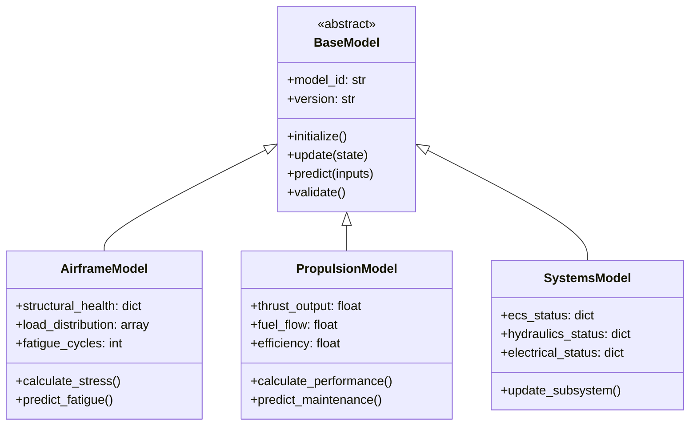

# Core Digital Twin Models

This directory contains the core physics-based and data-driven models for the AMPEL360 aircraft digital twin.

## Overview

The core models provide mathematical representations of aircraft systems that can be updated in real-time with sensor data and validated against physical measurements.

## Files

| File | Description | ATA Coverage |
|------|-------------|--------------|
| `base_model.py` | Base model interfaces and abstract classes | N/A |
| `airframe_model.py` | Airframe structural model | ATA 51-57 |
| `propulsion_model.py` | Propulsion system model | ATA 70-80 |
| `systems_model.py` | Aircraft systems model | ATA 21-49 |

## Model Architecture



## Usage

```python
from digital_twin.models import AirframeModel

# Initialize model with configuration
model = AirframeModel(
    config_path="config/airframe.json",
    aircraft_id="AM_Q100"
)

# Update with sensor data
model.update({
    "strain_gauges": [...],
    "accelerometers": [...],
    "temperature_sensors": [...]
})

# Get predictions
fatigue_prediction = model.predict_fatigue(flight_hours=1000)
```

## Integration Points

- **Sync Engine**: Models receive real-time state updates
- **ML Models**: Core model outputs feed ML training pipelines
- **Validation**: Models are validated against baseline data
- **Visualization**: Model states are rendered in dashboards

---

## Document Control

- Generated with the assistance of AI (GitHub Copilot), prompted by **Amedeo Pelliccia**.
- Status: **DRAFT** – Subject to human review and approval.
- Human approver: _[to be completed]_.
- Repository: `AMPEL360-AIR-T`
- Last AI update: 2026-01-29.

---
