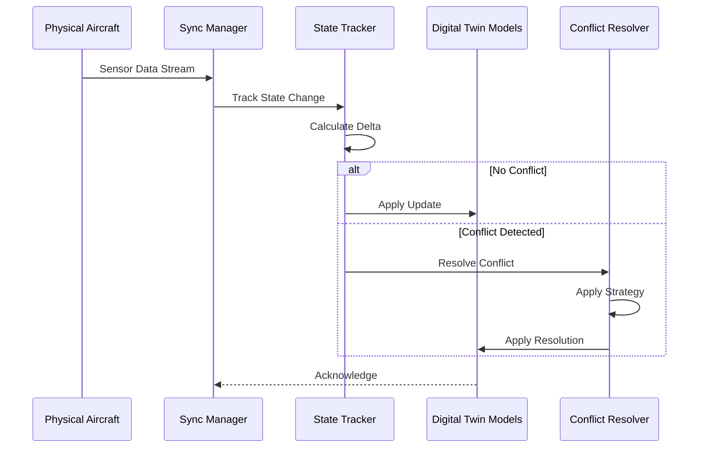

# Sync Engine

This directory contains the real-time synchronization engine for the AMPEL360 digital twin.

## Overview

The sync engine provides:
- **State Synchronization**: Real-time sync between physical aircraft and digital twin
- **State Tracking**: Track changes and deltas across time
- **Conflict Resolution**: Handle concurrent updates gracefully

## Files

| File | Description |
|------|-------------|
| `sync_manager.py` | Main synchronization manager |
| `state_tracker.py` | State tracking and delta detection |
| `conflict_resolver.py` | Conflict resolution strategies |

## Architecture



## Usage

```python
from digital_twin.sync_engine import SyncManager
from digital_twin.models import AirframeModel, PropulsionModel

# Initialize sync manager
sync = SyncManager(
    update_interval_ms=1000,
    conflict_strategy="last_write_wins"
)

# Register models
airframe = AirframeModel()
propulsion = PropulsionModel()

sync.register_model("airframe", airframe)
sync.register_model("propulsion", propulsion)

# Start synchronization
sync.start()

# Push updates
sync.push_state("airframe", {
    "strain_gauges": [...],
    "temperature_sensors": [...]
})

# Stop synchronization
sync.stop()
```

## Conflict Resolution Strategies

| Strategy | Description | Use Case |
|----------|-------------|----------|
| `last_write_wins` | Latest update takes precedence | Real-time telemetry |
| `merge` | Combine non-conflicting fields | Concurrent updates |
| `manual` | Flag for human review | Safety-critical data |

---

## Document Control

- Generated with the assistance of AI (GitHub Copilot), prompted by **Amedeo Pelliccia**.
- Status: **DRAFT** – Subject to human review and approval.
- Human approver: _[to be completed]_.
- Repository: `AMPEL360-AIR-T`
- Last AI update: 2026-01-29.

---
