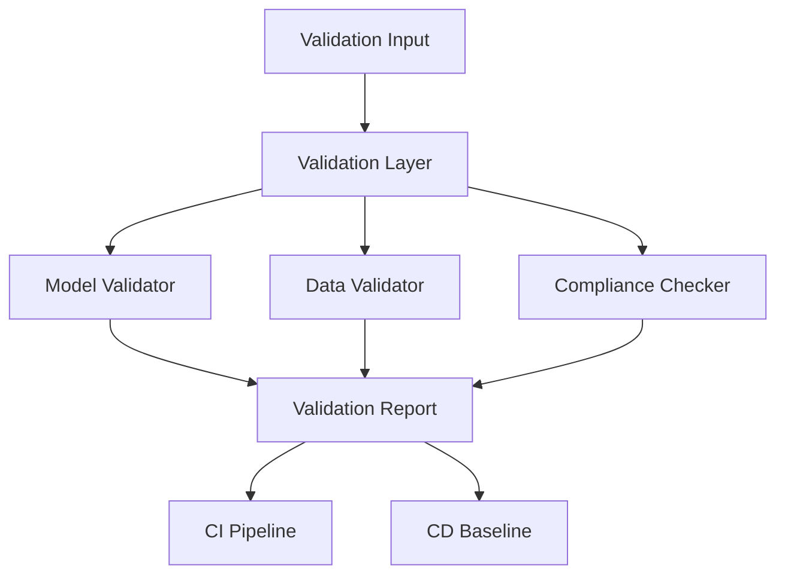

# Validation Tools

This directory contains validation and verification tools for the AMPEL360 digital twin.

## Overview

The validation module provides:
- **Model Validation**: Verify digital twin model accuracy against physical measurements
- **Data Validation**: Ensure data integrity and consistency
- **Compliance Checking**: Validate against regulatory requirements

## Files

| File | Description | Standards |
|------|-------------|-----------|
| `model_validator.py` | Model accuracy validation | ISO 23247 |
| `data_validator.py` | Data integrity validation | ISO 8000 |
| `compliance_checker.py` | Regulatory compliance | CS-25, DO-178C |

## Architecture



## Usage

```python
from digital_twin.validation import ModelValidator, DataValidator, ComplianceChecker

# Model validation
model_val = ModelValidator()
result = model_val.validate(
    model=airframe_model,
    reference_data=baseline_dimensions
)
print(f"Model accuracy: {result.accuracy}%")

# Data validation
data_val = DataValidator()
data_val.add_rule("temperature", {"min": -50, "max": 100})
data_result = data_val.validate(sensor_data)

# Compliance check
compliance = ComplianceChecker()
compliance.load_requirements("DO-178C")
comp_result = compliance.check(software_module)
```

## Integration with CI/CD

The validation tools integrate with the AMPEL360 CI/CD pipeline:

1. **CI**: Automated validation on every commit
2. **CD**: Validation reports packaged in releases

---

## Document Control

- Generated with the assistance of AI (GitHub Copilot), prompted by **Amedeo Pelliccia**.
- Status: **DRAFT** – Subject to human review and approval.
- Human approver: _[to be completed]_.
- Repository: `AMPEL360-AIR-T`
- Last AI update: 2026-01-29.

---
