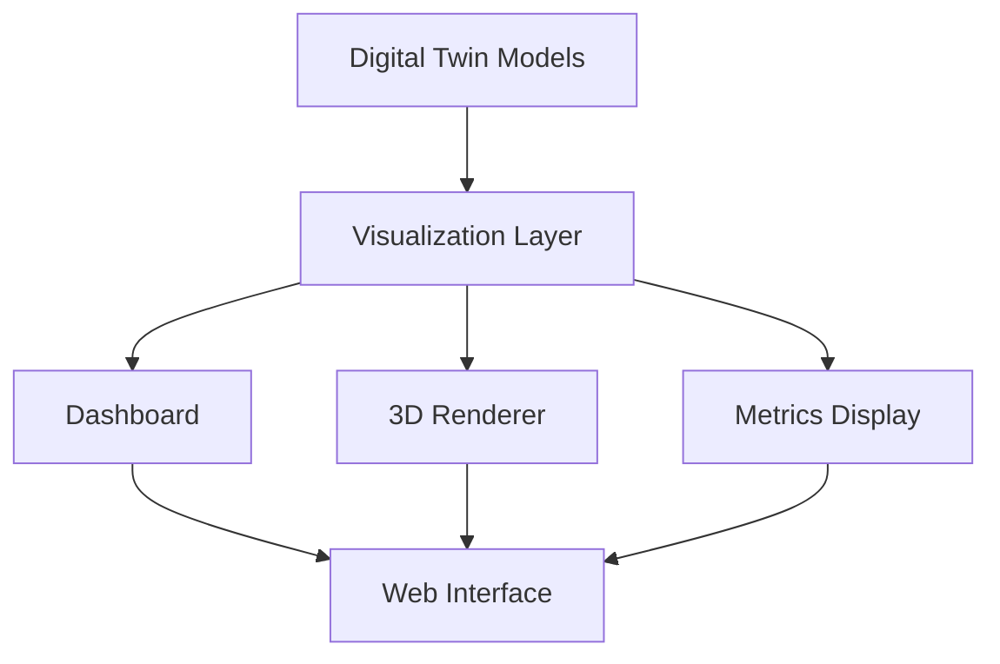

# Visualization Components

This directory contains visualization components for the AMPEL360 digital twin.

## Overview

The visualization module provides:
- **Dashboards**: Real-time monitoring dashboards
- **3D Rendering**: Aircraft model visualization
- **Metrics Display**: KPI and performance metrics

## Files

| File | Description |
|------|-------------|
| `dashboard.py` | Dashboard components and layouts |
| `renderer_3d.py` | 3D visualization renderer |
| `metrics_display.py` | Metrics and KPI displays |

## Architecture



## Usage

```python
from digital_twin.visualization import Dashboard, Renderer3D, MetricsDisplay

# Create dashboard
dashboard = Dashboard(title="AMPEL360 Digital Twin")

# Add metrics display
metrics = MetricsDisplay()
metrics.add_metric("Altitude", "ft", {"min": 0, "max": 45000})
metrics.add_metric("Speed", "kts", {"min": 0, "max": 500})

dashboard.add_panel("metrics", metrics)

# Add 3D renderer
renderer = Renderer3D(model_path="models/aircraft.gltf")
dashboard.add_panel("3d_view", renderer)

# Update with live data
dashboard.update({
    "altitude": 35000,
    "speed": 450,
    "position": {"lat": 48.8566, "lon": 2.3522}
})
```

## Supported Outputs

| Format | Description | Use Case |
|--------|-------------|----------|
| HTML | Web-based dashboard | Real-time monitoring |
| PNG/SVG | Static images | Reports |
| JSON | Data export | API integration |

---

## Document Control

- Generated with the assistance of AI (GitHub Copilot), prompted by **Amedeo Pelliccia**.
- Status: **DRAFT** – Subject to human review and approval.
- Human approver: _[to be completed]_.
- Repository: `AMPEL360-AIR-T`
- Last AI update: 2026-01-29.

---
