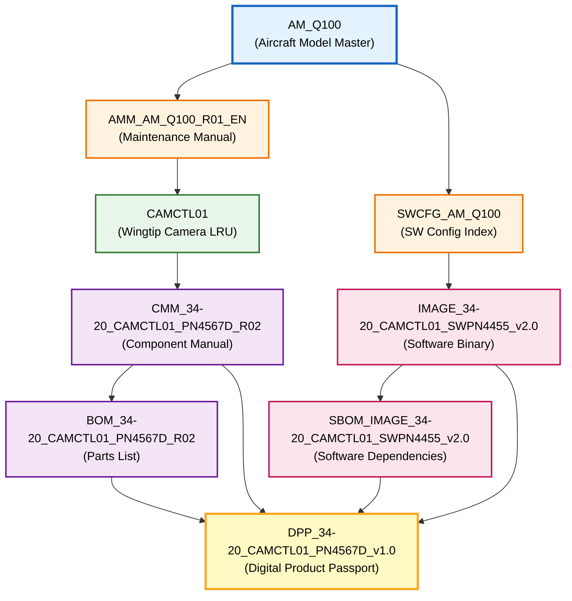

# AM (Aircraft Model) Examples - AMPEL360 Q100

This directory contains complete reference examples of the **AM (Aircraft Model / Aircraft Master)** nomenclature system for AMPEL360 Q100.

## Overview

**AM** is the canonical top-level technical identity for the aircraft. Everything else (AMM, SWCFG, CMM, DPP, etc.) references **AM_Q100** as the parent.

```
AM_Q100 (Aircraft Model Q100)
 ├── AMM (Aircraft Maintenance Manual for AM_Q100)
 ├── SWCFG (Loadable Software Index for AM_Q100)
 ├── Fleet-level DPP views
 └── Fleet-level configuration baselines
```

## Files in this Directory

### 1. Aircraft Master Definition

**`AM_Q100.json`**
- Master record for the AM_Q100 aircraft model
- Contains specifications, certification basis, program milestones, variants
- The root reference for all aircraft-level documentation

### 2. Aircraft Maintenance Manual (AMM)

**`AMM_AM_Q100_R01_manifest.json`**
- Manifest for the Aircraft Maintenance Manual
- Explicitly linked to **AM_Q100**
- Naming pattern: `AMM_AM_{AIRCRAFT_ID}_{REVISION}_{LANGUAGE}`
- Example: `AMM_AM_Q100_R01_EN.pdf` (actual PDF not included, this is the manifest)

### 3. Software Configuration Index (SWCFG)

**`SWCFG_AM_Q100_Loadable_Software_Index_v1.0.json`**
- Complete index of all loadable software for AM_Q100
- Lists all LRUs, their software images, and cross-references
- Naming pattern: `SWCFG_AM_{AIRCRAFT_ID}_Loadable_Software_Index_v{VERSION}`

### 4. Component Maintenance Manual (CMM)

**`CMM_34-20_CAMCTL01_PN4567D_R02_manifest.json`**
- Manifest for a specific LRU's Component Maintenance Manual
- Naming pattern: `CMM_{ATA-CHAPTER}_{LRU_ID}_{PART_NUMBER}_{REVISION}`
- Example: `CMM_34-20_CAMCTL01_PN4567D_R02.pdf`
- Contains `am_applicability` field linking back to AM_Q100

### 5. Bill of Materials (BOM)

**`BOM_34-20_CAMCTL01_PN4567D_R02.csv`**
- Complete parts list for the Wingtip Camera Control Unit
- Naming pattern: `BOM_{ATA-CHAPTER}_{LRU_ID}_{PART_NUMBER}_{REVISION}.csv`
- CSV format for easy integration with PLM/ERP systems

### 6. Software Image (IMAGE)

**`IMAGE_34-20_CAMCTL01_SWPN4455_v2.0_manifest.json`**
- Manifest for the loadable software image
- Naming pattern: `IMAGE_{ATA-CHAPTER}_{LRU_ID}_{SW_PART_NUMBER}_v{VERSION}`
- Example: `IMAGE_34-20_CAMCTL01_SWPN4455_v2.0.bin`
- Contains `am_applicability` field

### 7. Software Bill of Materials (SBOM)

**`SBOM_IMAGE_34-20_CAMCTL01_SWPN4455_v2.0.spdx.json`**
- SPDX 2.3 format SBOM for the software image
- Naming pattern: `SBOM_IMAGE_{ATA-CHAPTER}_{LRU_ID}_{SW_PART_NUMBER}_v{VERSION}.spdx.json`
- Lists all software dependencies, licenses, and relationships

### 8. Digital Product Passport (DPP)

**`DPP_34-20_CAMCTL01_PN4567D_v1.0.json`**
- Complete DPP for a specific LRU instance
- Combines physical (CMM, BOM) and digital (IMAGE, SBOM) product data
- References back to AM_Q100 and all related documentation
- Naming pattern: `DPP_{ATA-CHAPTER}_{LRU_ID}_{PART_NUMBER}_v{VERSION}`

## Complete Examples

This directory provides **two fully instantiated examples** demonstrating the AM nomenclature system:

### Example 1: Wingtip Camera Control Unit (CAMCTL01) - ATA 34-20

Non-safety-critical visual navigation system (DAL-D).

| Artifact Type | File | Description |
|---------------|------|-------------|
| Aircraft Master | `AM_Q100.json` | Root aircraft definition |
| AMM | `AMM_AM_Q100_R01_manifest.json` | Aircraft maintenance manual manifest |
| SWCFG | `SWCFG_AM_Q100_Loadable_Software_Index_v1.0.json` | Software configuration index |
| CMM | `CMM_34-20_CAMCTL01_PN4567D_R02_manifest.json` | Component maintenance manual |
| BOM | `BOM_34-20_CAMCTL01_PN4567D_R02.csv` | Bill of materials (25 parts) |
| IMAGE | `IMAGE_34-20_CAMCTL01_SWPN4455_v2.0_manifest.json` | Software image manifest |
| SBOM | `SBOM_IMAGE_34-20_CAMCTL01_SWPN4455_v2.0.spdx.json` | Software dependencies (7 components) |
| DPP | `DPP_34-20_CAMCTL01_PN4567D_v1.0.json` | Complete digital product passport |

### Example 2: Hydrogen Energy Control Unit (H2ECU01) - ATA 28-40

Safety-critical hydrogen fuel cell control system (DAL-A).

| Artifact Type | File | Description |
|---------------|------|-------------|
| Aircraft Master | `AM_Q100.json` | Root aircraft definition (shared) |
| AMM | `AMM_AM_Q100_R01_manifest.json` | Aircraft maintenance manual manifest (shared) |
| SWCFG | `SWCFG_AM_Q100_Loadable_Software_Index_v1.0.json` | Software configuration index (shared) |
| CMM | `CMM_28-40_H2ECU01_PN7890F_R01_manifest.json` | Component maintenance manual |
| BOM | `BOM_28-40_H2ECU01_PN7890F_R01.csv` | Bill of materials (36 parts) |
| IMAGE | `IMAGE_28-40_H2ECU01_SWPN6789_v1.2_manifest.json` | Software image manifest |
| SBOM | `SBOM_IMAGE_28-40_H2ECU01_SWPN6789_v1.2.spdx.json` | Software dependencies (9 components) |
| DPP | `DPP_28-40_H2ECU01_PN7890F_v1.0.json` | Complete digital product passport |

### Key Differences Between Examples

| Aspect | Wingtip Camera (CAMCTL01) | Hydrogen ECU (H2ECU01) |
|--------|---------------------------|------------------------|
| **ATA Chapter** | 34-20 (Navigation) | 28-40 (Fuel) |
| **Safety Level** | DAL-D (Non-essential) | DAL-A (Safety-critical) |
| **Complexity** | Moderate | High |
| **BOM Parts** | 25 parts, 3.2 kg | 36 parts, 8.5 kg |
| **Software Size** | 16 MB | 67 MB (triple-redundant) |
| **Dependencies** | 7 SW components | 9 SW components (5 safety-certified) |
| **Certification** | DO-178C Level D | DO-178C Level A, IEC 61508 SIL 4 |
| **Special Requirements** | Basic avionics | Hydrogen safety, cryogenic handling |
| **Code Coverage** | 92.5% | 100% (MC/DC required) |

## Naming Convention Summary

### Top Level: Aircraft Model

```
AM_{AIRCRAFT_ID}
  └─ AM_Q100, AM_Q80, AM_Q120
```

### Aircraft Documentation

```
AMM_AM_{AIRCRAFT_ID}_{REVISION}_{LANGUAGE}
  └─ AMM_AM_Q100_R01_EN.pdf

SWCFG_AM_{AIRCRAFT_ID}_Loadable_Software_Index_v{VERSION}
  └─ SWCFG_AM_Q100_Loadable_Software_Index_v1.0.json
```

### Component Level (LRU)

```
CMM_{ATA}_{LRU_ID}_{PART_NUMBER}_{REVISION}
  └─ CMM_34-20_CAMCTL01_PN4567D_R02.pdf

BOM_{ATA}_{LRU_ID}_{PART_NUMBER}_{REVISION}.csv
  └─ BOM_34-20_CAMCTL01_PN4567D_R02.csv

IMAGE_{ATA}_{LRU_ID}_{SW_PART_NUMBER}_v{VERSION}
  └─ IMAGE_34-20_CAMCTL01_SWPN4455_v2.0.bin

SBOM_IMAGE_{ATA}_{LRU_ID}_{SW_PART_NUMBER}_v{VERSION}.spdx.json
  └─ SBOM_IMAGE_34-20_CAMCTL01_SWPN4455_v2.0.spdx.json

DPP_{ATA}_{LRU_ID}_{PART_NUMBER}_v{VERSION}
  └─ DPP_34-20_CAMCTL01_PN4567D_v1.0.json
```

## Traceability Through AM

All artifacts include explicit links back to **AM_Q100**:

```json
{
  "am_id": "AM_Q100",
  "am_applicability": ["AM_Q100", "AM_Q80"],
  "aircraft_docs": {
    "amm": "AMM_AM_Q100_R01_EN.pdf",
    "sw_config_index": "SWCFG_AM_Q100_Loadable_Software_Index_v1.0.json"
  }
}
```

## Document Hierarchy Diagram



## Usage in OPT-IN Framework

These examples align with the AMPEL360 OPT-IN Framework structure:

- **AM_Q100**: Root identity, repository-wide reference
- **ATA Chapters**: Component documentation follows ATA iSpec 2200
- **Digital Product Passport (ATA 95)**: Integrates physical and digital assets
- **Certification Data**: All artifacts support EASA CS-25 / FAA Part 25 compliance

## Integration Points

### Configuration Management
- All artifacts reference `AM_Q100` as the baseline anchor
- Version control through explicit revision numbers
- Traceability through cross-references

### Software Configuration
- SWCFG provides master index of all loadable software
- Each IMAGE has corresponding SBOM
- DAL levels tracked from requirements through delivery

### Maintenance
- AMM provides aircraft-level procedures
- CMMs provide component-level procedures
- BOMs enable spare parts management
- DPPs track component lifecycle

### Sustainability
- DPPs include carbon footprint data
- Recyclability metrics for circular economy
- Supply chain traceability
- Conflict minerals compliance

## Next Steps

To extend this pattern to other LRUs:

1. **Choose the LRU** (e.g., Hydrogen ECU, Flight Control Computer)
2. **Define the ATA chapter** (e.g., 28-40, 27-60)
3. **Create the CMM manifest** with `am_applicability`
4. **Generate the BOM** as CSV
5. **Define the IMAGE** if software-based
6. **Generate the SBOM** using SPDX 2.3 format
7. **Create the DPP** linking all artifacts

## Standards Compliance

- **ATA iSpec 2200**: Chapter numbering and structure
- **SPDX 2.3**: Software bill of materials format
- **DO-178C**: Software development assurance levels
- **DO-160G**: Environmental qualification
- **ISO 15926**: Industrial data exchange
- **EASA Part 21**: Design organization approval
- **EU AI Act**: Digital product passport requirements

---

**Document Control**

- **Version**: 1.0
- **Status**: ACTIVE
- **Created**: 2025-12-13
- **Author**: AMPEL360 Configuration Management
- **Repository**: AMPEL360-BWB-H2-Hy-E
- **Generated with AI assistance (GitHub Copilot), prompted by Amedeo Pelliccia**
