# MMIP Architecture Diagrams (Annex D)
## Mermaid Edition

| Field               | Value                                                      |
|---------------------|------------------------------------------------------------|
| **Document ID**     | MMIP-ANNEX-D-DIAGRAMS-001                                  |
| **Version**         | 1.1                                                        |
| **Date**            | 2025-11-28                                                 |
| **Status**          | DRAFT                                                      |
| **Format**          | Mermaid                                                    |

---

## Diagram 1: MMIP Layered Architecture

The MMIP architecture is composed of five abstraction layers as defined in Section 3 of the specification.

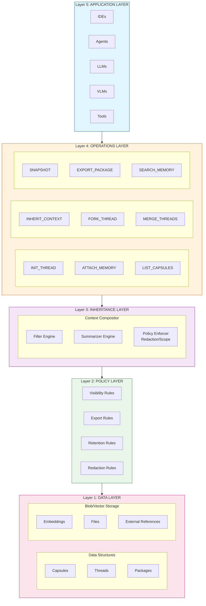

---

## Diagram 2: INHERIT_CONTEXT Flow

This diagram illustrates the `INHERIT_CONTEXT` operation as defined in Section 6.

```mermaid
flowchart TB
    subgraph REQUEST["1. REQUEST"]
        REQ_DATA["thread_id<br/>filters<br/>max_tokens<br/>policies"]
    end

    subgraph RETRIEVAL["2. RETRIEVAL"]
        ENGINE["MMIP Engine pulls Thread<br/>from Data Layer"]
        subgraph THREAD["Thread: thr_12345"]
            CAP1[cap1] --> CAP2[cap2] --> CAP3[cap3]
        end
    end

    subgraph POLICY_CHECK["3. POLICY CHECK"]
        CHECK1["✓ Check visibility scopes"]
        CHECK2["✓ Check export permissions"]
        CHECK3["✓ Enforce retention rules"]
        ACCESS["User A ✓ → cap1, cap2<br/>User B ✗ → no access"]
    end

    subgraph TRANSFORM["4. TRANSFORMATION"]
        T1["• Apply redaction rules"]
        T2["• Summarize if over limit"]
        T3["• Mark derived capsules"]
        TOKENS["tokens: 5000 → 2000<br/>(summarized older caps)"]
    end

    subgraph OUTPUT["5. OUTPUT"]
        subgraph ENVELOPE["Signed Memory Envelope"]
            ENV_DATA["mmip_version: '0.1'<br/>context_id: 'ctx_9876'<br/>capsules: [...]<br/>integrity: {hash: ...}"]
        end
    end

    AGENT_IN[/"Agent / LLM"/] --> REQUEST
    REQUEST --> RETRIEVAL
    RETRIEVAL --> POLICY_CHECK
    POLICY_CHECK --> TRANSFORM
    TRANSFORM --> OUTPUT
    OUTPUT --> AGENT_OUT[/"Agent / LLM"/]

    style REQUEST fill:#e3f2fd,stroke:#1565c0
    style RETRIEVAL fill:#fff8e1,stroke:#f57f17
    style POLICY_CHECK fill:#e8f5e9,stroke:#2e7d32
    style TRANSFORM fill:#fce4ec,stroke:#c2185b
    style OUTPUT fill:#f3e5f5,stroke:#7b1fa2
    style ENVELOPE fill:#ede7f6,stroke:#512da8
```

---

## Diagram 3: Multi-Model Context Flow

This diagram shows how MMIP enables context continuity across model switches.

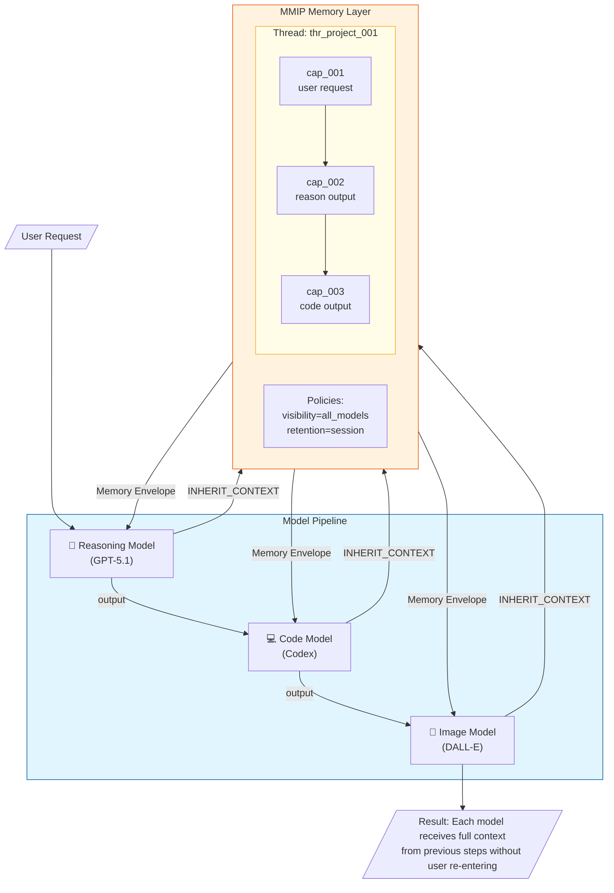

---

## Diagram 4: MMIP Data Model (Entity Relationship)

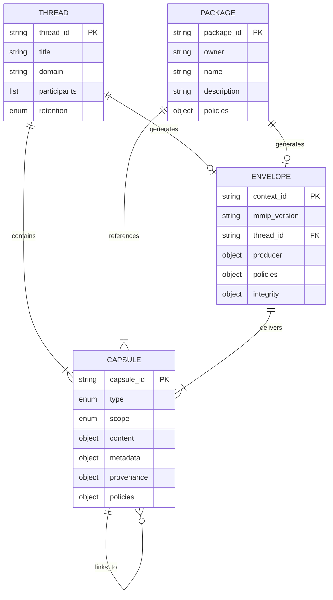

---

## Diagram 5: Policy Decision Matrix

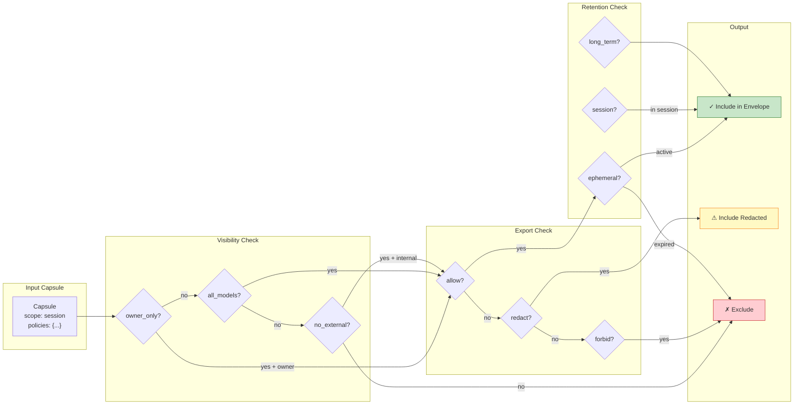

---

## Diagram 6: Thread Fork/Merge Operations

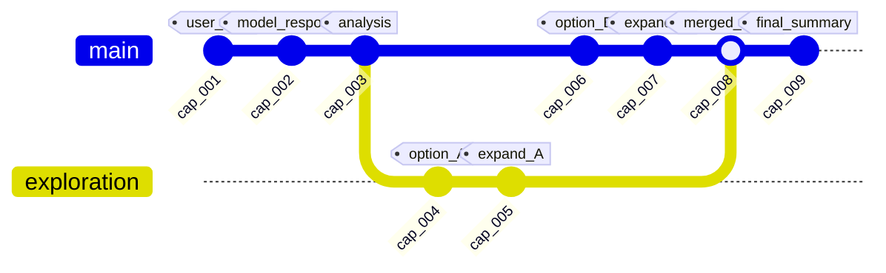

---

## Diagram 7: Capsule Lifecycle State Machine

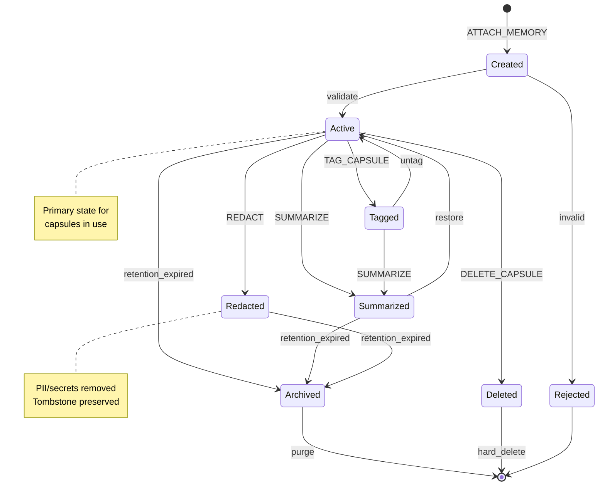

---

## Diagram 8: MMIP Operations Sequence

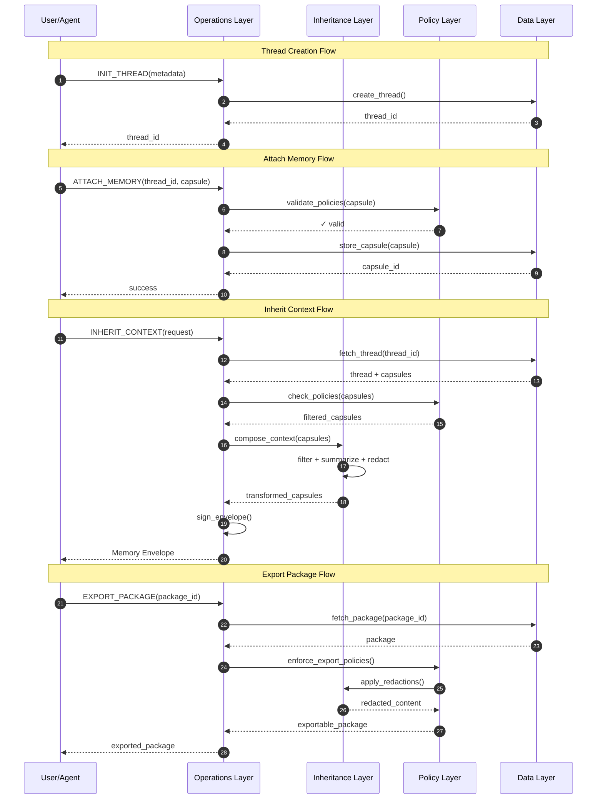

---

## Diagram 9: MMIP Compliance Levels

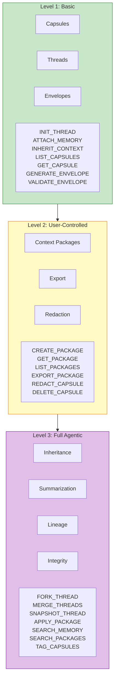

---

## Diagram 10: MMIP ↔ AMPEL360 Integration

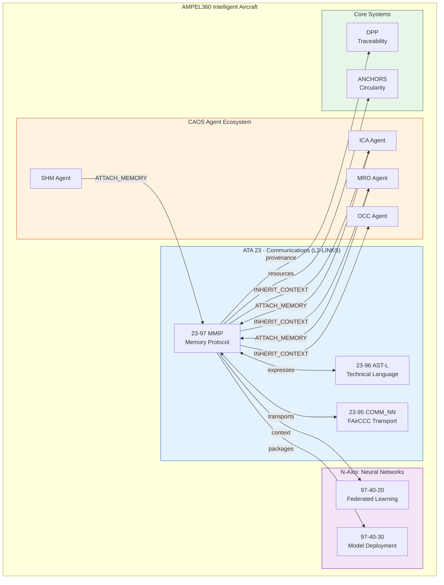

---

## Diagram 11: CAOS Agent Pipeline with MMIP

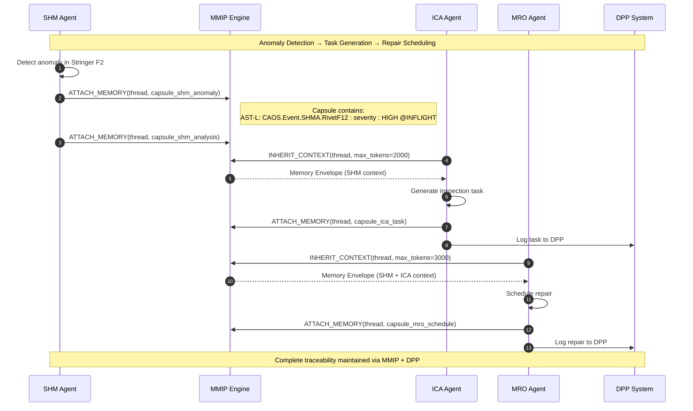

---

## Diagram 12: MMIP Capsule ↔ AST-L Statement Mapping

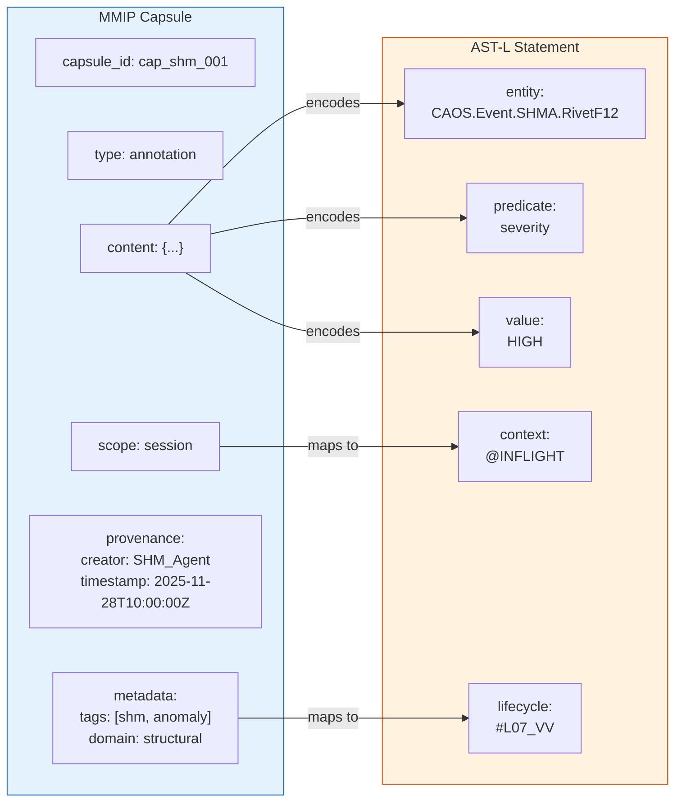

---

## Diagram 13: Memory Package ↔ CUC Bundle Mapping

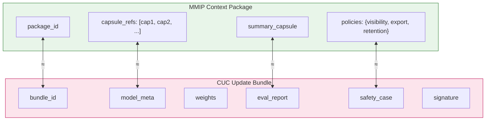

---

## Diagram 14: Complete ATA 23 Communications Stack

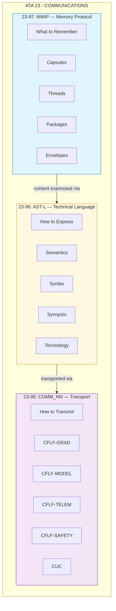

---

## Document Control

| Field | Value |
|-------|-------|
| **Document ID** | MMIP-ANNEX-D-DIAGRAMS-001 |
| **Version** | 1.1 |
| **Date** | 2025-11-28 |
| **Status** | DRAFT |

### AI Disclosure

- **Generated with assistance of:** AI (Claude, Anthropic)
- **Prompted by:** Amedeo Pelliccia
- **Status:** DRAFT — Subject to human review
- **Last AI update:** 2025-11-28

---

*END OF DOCUMENT*
