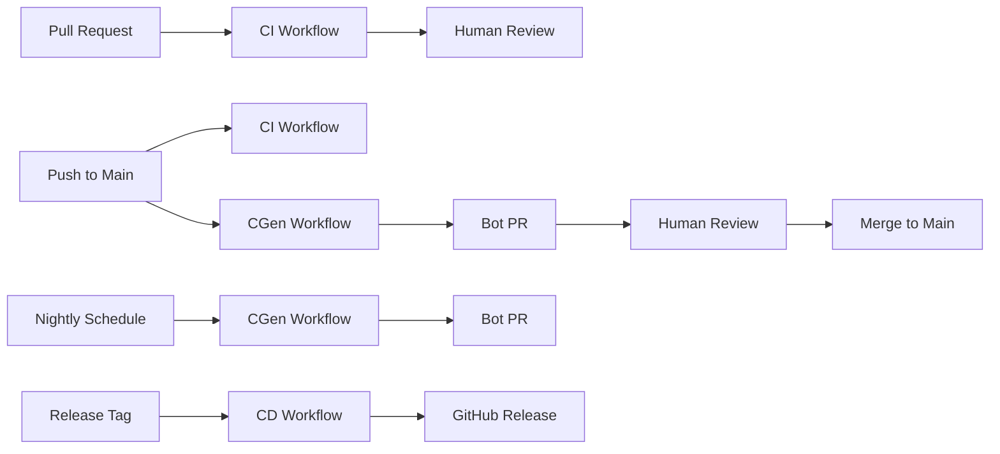

# CGen + CI + CD Architecture

**Version**: 1.0  
**Last Updated**: 2025-11-21  
**Repository**: AMPEL360-BWB-H2-Hy-E

---

## Overview

This document describes the **CGen + CI + CD** architecture - a three-lane pipeline system that makes continuous generation, integration, and delivery first-class architecture elements in the AMPEL360 repository.

## Conceptual Model

Think of the pipeline as **three parallel but coordinated lanes**:

### 1. CGen – Continuous Generation

**Responsibility**: AI/automation that **reads** repo state and generates/updates content.

**What it does**:
- Generates/updates documentation, diagrams, indexes
- Builds traceability artifacts (GenCCC reports, cross-ref maps)
- Proposes new assets (placeholder docs, skeletons, requirement templates)
- Refreshes summary tables and dashboards

**How it works**:
- Runs on `push` to `main` and nightly schedule
- All changes proposed as **bot PRs** (branch: `cgen/update-YYYYMMDD-HHMMSS`)
- Never makes silent commits
- Humans review and approve all changes

**Key Principle**: CGen **PROPOSES**

**Workflow**: `.github/workflows/cgen.yml`

### 2. CI – Continuous Integration

**Responsibility**: Classical testing/linting/validation of code and CGen output.

**What it does**:
- Verifies code, scripts, schemas, configs
- Verifies **CGen output quality** (valid markdown, valid links, no missing references)
- Fails fast on broken invariants (doc-meta-enforcer, geometry watchdog)
- Runs GenCCC in **read-only mode** on PRs (reports only, no mutations)

**How it works**:
- Runs on all `pull_request` events
- Runs on `push` to `main`
- Read-only operations - never modifies repository
- Produces reports and artifacts for review

**Key Principle**: CI **JUDGES**

**Workflow**: `.github/workflows/ci.yml`

### 3. CD – Continuous Delivery

**Responsibility**: Controlled packaging and publishing of validated artifacts.

**What it does**:
- Packages documentation bundles (ATA chapters, OPT-IN folders)
- Creates PDF sets, static site docs, release archives
- Publishes to GitHub Releases
- Only runs on **trusted refs** (`main`, tags, `release/*`)

**How it works**:
- Triggers on version tags (`v*.*.*`)
- Triggers on `release/*` branches
- Manual workflow dispatch for custom releases
- Creates GitHub Releases with artifacts

**Key Principle**: CD **PUBLISHES**

**Workflow**: `.github/workflows/cd.yml`

---

## Event Model - Who Runs When?

### Pull Request (feature/fix branches)

**Triggered on**: `pull_request`

**CI Lane**:
- ✅ Lint, tests, type checks
- ✅ Static validation of YAML/JSON/SQL schemas
- ✅ GenCCC cross-reference report (read-only, artifact only)
- ✅ Doc-meta-enforcer in check mode

**CGen Lane**: Does not run

**CD Lane**: Does not run

### Push to Main

**Triggered on**: `push` to `main`

**CI Lane**:
- ✅ Full test suite
- ✅ Doc-meta-enforcer in strict mode
- ✅ GenCCC in enforcing mode

**CGen Lane**:
- ✅ Generate documentation updates
- ✅ Create bot PR with changes for review
- ✅ Outputs: `cgen/update-YYYYMMDD` branch + PR

**CD Lane**: Does not run (unless on release branch)

### Scheduled (Nightly)

**Triggered on**: `schedule` (3 AM UTC)

**CI Lane**: Does not run

**CGen Lane**:
- ✅ Housekeeping generation
- ✅ Rebuild indexes (drawing index, table schemas, DPP links)
- ✅ Refresh cross-ATA dashboards
- ✅ Regenerate summary tables
- ✅ Create bot PR if changes detected

**CD Lane**: Does not run

### Release Tags

**Triggered on**: `push` with tag `v*.*.*`

**CI Lane**: Does not run (assumes main is validated)

**CGen Lane**: Does not run

**CD Lane**:
- ✅ Build release bundles
- ✅ Package geometry data
- ✅ Create documentation archives
- ✅ Publish GitHub Release with artifacts

---

## Repository Layout

```
.github/
  workflows/
    ci.yml                # CI: Tests, lint, static checks
    cgen.yml              # CGen: Continuous Generation pipeline
    cd.yml                # CD: Packaging / releases
    # Legacy workflows (being phased out or integrated):
    cgrow.yml             # Can be deprecated in favor of cgen.yml
    genccc.yml            # Integrated into ci.yml and cgen.yml
    doc-meta.yml          # Integrated into ci.yml

tools/
  ci/
    check_dimensions.py
    check_mass_properties.py
    doc_meta_enforcer.py
    optin_structure_validator.py
    genccc/
      CGEN_ARCHITECTURE.md  # This file
  
  genccc/                 # GenCCC tools (referenced by workflows)
    report.py             # GenCCC analysis & report generator
    validate.py           # Requirements validation
    traceability.py       # Traceability matrix generation
    baseline.py           # Baseline management
    generate.py           # Content generation
    apply.py              # Auto-fix application
    agent.py              # Agent-driven resolution
    req.py                # Requirements processing

  create_release_bundle.py
  generate_summary_tables.py
  package_geometry_data.py
  validate_documentation_structure.py

cd/
  reports/                # Generated audit / traceability reports
  publications/           # Release bundles, doc packages
  baselines/              # Requirements baselines
```

---

## Integration with AMPEL360 Architecture

### CGen as CAOS 4th Pillar

CGen effectively implements the **"CAOS + 4th pillar"** for:

**Generating**:
- `*_Overview.md` files for ATA chapters
- Requirements skeletons (ATA 85, ATA 02, ATA 95, etc.)
- Traceability tables and matrices
- Drawing indexes, DPP links
- Carbon metrics dashboards

**Ensuring**:
- Every path under `OPT-IN_FRAMEWORK/` has minimal documentation skeletons
- Every requirement has VERIF/TRACE/EVIDENCE links
- Cross-references are maintained
- Document Control sections are present

### CI as Quality Gate

CI enforces that:
- Generated content respects **naming, structure, hyperlinks**
- ATA/OPT-IN schema is not violated
- No broken cross-references (GenCCC as enforcement)
- All documentation has proper metadata
- Geometry and mass properties are within bounds

### CD as Certification Package Builder

CD wraps everything into:
- **Certification-ready "publication packages"**
- Clear versioned milestones: `v02.20.15`, `v02.80.00`, etc.
- Auditable release artifacts
- Complete documentation bundles

---

## Security Constraints

All three lanes follow strict security patterns:

1. **No untrusted code execution**: Workflows never run code from PRs directly
2. **Trusted scripts only**: Scripts are checked out from base/main branch
3. **Bot PRs for changes**: CGen creates PRs, not direct commits
4. **Permission scoping**: Each workflow has minimal required permissions
5. **Artifact isolation**: Generated content stored in `cd/` directory

---

## Workflow Dependencies



---

## Usage Examples

### Triggering CGen Manually

```bash
# Via GitHub Actions UI:
# 1. Go to Actions tab
# 2. Select "CGen - Continuous Generation"
# 3. Click "Run workflow"
# 4. Choose mode: full, docs-only, or indexes-only
```

### Creating a Release

```bash
# Tag a release
git tag -a v02.20.15 -m "Release v02.20.15"
git push origin v02.20.15

# CD workflow automatically creates GitHub Release
```

### Manual Release via Workflow Dispatch

```bash
# Via GitHub Actions UI:
# 1. Go to Actions tab
# 2. Select "CD - Continuous Delivery"
# 3. Click "Run workflow"
# 4. Enter version (e.g., v02.20.15)
# 5. Check "prerelease" if needed
```

---

## Monitoring and Observability

### CI Status
- Check GitHub Actions tab for CI workflow results
- Review SARIF uploads in Security tab
- Download artifacts for detailed reports

### CGen Status
- Monitor bot PRs with label `cgen`
- Review `cd/reports/` artifacts in workflow runs
- Check branch `cgen/update-*` for proposed changes

### CD Status
- Check GitHub Releases page for published artifacts
- Download release bundles from releases
- Review release notes for change summaries

---

## Migration Notes

### From Existing Workflows

The new architecture consolidates and clarifies existing workflows:

- **cgrow.yml**: Being replaced by `cgen.yml` (clearer separation of concerns)
- **genccc.yml**: Integrated into `ci.yml` (PR reports) and `cgen.yml` (generation)
- **doc-meta.yml**: Integrated into `ci.yml` (unified validation)

Existing workflows can coexist during transition period but will eventually be deprecated.

### Backward Compatibility

- Existing tools in `tools/genccc/` continue to work
- Existing scripts maintain their current interfaces
- Directory structure is additive (no deletions)
- Environment variables preserved for script compatibility

---

## Future Enhancements

### Planned Features

1. **MCP Server Integration**: Call MCP servers for advanced AI operations
2. **Static Site Publishing**: Automatic docs.ampel360.dev deployment
3. **PDF Generation**: Automated PDF bundles per ATA chapter
4. **Certification Workflow**: Integration with certification management
5. **Metrics Dashboard**: Real-time GenCCC and quality metrics

### Enhancement Requests

Submit enhancement requests via GitHub Issues with label `cgen-enhancement`.

---

## Document Control

- Generated with the assistance of AI (GitHub Copilot), prompted by **Amedeo Pelliccia**
- Status: **APPROVED** – Architecture documentation
- Human approver: *[to be completed]*
- Repository: `AMPEL360-BWB-H2-Hy-E`
- Last AI update: 2025-11-21

---

## References

- [AMPEL360 Documentation Standard](../../../AMPEL360_DOCUMENTATION_STANDARD.md)
- [OPT-IN Framework Standard](../../../OPT-IN_FRAMEWORK_STANDARD.md)
- [GenCCC README](../../genccc/README.md)
- [CAOS Operations Framework](../../../CAOS/README.md)

---

**Key Principle**: CGen proposes; CI judges; CD publishes.
